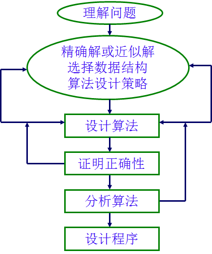

# 算法概述

## 1 基本概念

### 定义
算法是一系列解决问题的清晰指令，对于符合一定规范的输入，算法能够在有限时间内获得所要求的输出。算法是解决问题的一种方法或过程，它是由若干条指令组成的有穷序列。

### 特征
输入：有零或多个外部量作为算法的输入。
输出：算法产生至少一个量作为输出。
确定性：组成算法的每条指令清晰、无歧义。
有效性：算法中执行的任何计算步骤都是可以被分解为基本的可执行的操作步。
有限性：算法中每条指令的执行次数有限，执行每条指令的时间也有限。

### 算法的描述
* 算法的描述方式：自然语言、流程图、伪代码
* 算法的正确性证明方式：归纳法
* 算法分析：正确性分析、效率分析、复杂度分析

## 2 求解流程

### 求解步骤

## 3 算法分类

### 面向算法范式
> 这一个主要是我们算法课程中学习到的算法。用来解决基本具体的问题。
* 蛮力法（暴力破解、枚举、穷举）
* 递归与分治法
* 动态规划
* 贪心算法
* 回溯法
* 分支限界法
* 随机化算法

### 面向数据结构
> 在数据结构部分处理，数据结构本身就是算法的一部分，用于处理特殊数据结构的额算法。
* 堆栈算法
* 树算法
* 图算法

### 面向问题类型
> 这些都是常见的问题类型。
* 搜索
  * 广度优先搜索
  * 深度优先搜索
* 排序
  * 选择排序
  * 冒泡排序
  * 快速排序
  * 桶排序
* 查找
  * 顺序查找
  * 二分查找
  * 插值查找
  * 菲波那切查找
  * 树表查找
  * 分块查找
  * 哈希查找
* 字符串处理
* 排列组合
  * 任务分配
  * 背包问题
* 集合问题
* 数值问题

### 智能算法
> 更高级的算法。
  * 蚁群算法
  * 模拟退火算法
  * 遗传算法

