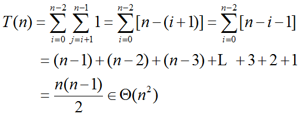

# 蛮力法
## 1 蛮力法概述
蛮力法是一种简单直接地解决问题的方法，常常直接 基于问题的描述和所涉及的概念定义。

## 2 排序问题
（主要描述解决问题的步骤）
### 理解问题
* 问题：给定一个可排序的n个元素序列（数字、字符或字符串），对它们按照非降序方式重新排列。

### 选择策略
思想：首先扫描整个序列，找到其中一个最小元素，然后和第一个元素交换，将最小元素归位。然后从第二个元素开始扫描序列，找到后n-1个元素中的一个最小元素，然后和第二个元素交换，将第二小元素归位。进行n-1遍扫描之后，排序完成。
### 算法设计

算法 selectSort(A[n])
```
//用选择法对给定数组排序
//输入：一个可排序数组A[0..n-1]
//输出：升序排序的数组A[0..n-1]
for i←0 to n-2 do
    min←i
    for j=i+1 to n-1 do
        if A[j] < A[min]  min←j
    swap A[i] and A[min]
```	
### 正确性证明

### 算法分析
* 输入规模：序列元素个数n
* 基本操作：比较次数A[j] < A[min]
* 影响操作执行的其他因素：n
* 构建基本操作的求和表达式：
利用求和公式分析算法的时间复杂度：


### 程序设计

## 3 顺序查找问题
（主要是分析解决问题的步骤）
### 理解问题
思想：查找键与表中元素从头至尾逐个比较。
结果：找到 或 失败
限位器：把查找键添加到列表末尾—— 一定成功，避免每次循环时对检查是否越界（边界检查）
选择策略

### 算法设计


### 正确性证明

### 算法分析
* 最佳效率：Tbest (n)  = 1
* 最差效率：Tworst(n) = n + 1
* 问：为何定义 A 数组为 n+1 维？答：有一个位置放限位器
* 问：若输入有序，算法可改进？答：遇到 ≤ 或 ≥ 查找键元素，立即停止查找。

### 程序设计


## 4 字符串匹配问题
### 理解问题
问题：给定一个n个字符组成的串，称为文本，一个m（m≤n）个字符组成的串称为模式，从文本中寻找匹配模式的子串。
### 选择策略
思想：将模式对准文本的前m个字符，然后从左到右匹配每一对相应的字符，若遇到一对不匹配字符，模式向右移一位，重新开始匹配；若m对字符全部匹配，算法可以停止。注意，在文本中，最后一轮子串匹配的起始位置是n-m（假设文本的下标从0到n-1）
### 算法设计
算法 bruteForceStringMatch(T[0..n-1],P[0..m-1])
```
//蛮力字符串匹配算法实现
//输入1：一个n个字符的数组T[0..n-1]代表一段文本
//输入2：一个m个字符的数组P[0..m-1]代表一个模式
//输出：若查找成功，返回文本第一个匹配子串中的第一个字符的位置，否则返回-1
for i←0 to n-m do
    j←0
    while j<m and P[j]=T[i+j]
         j←j+1
    if j=m return i
return -1
```

## 5 最近对问题
### 理解问题
找出一个包含n个点的集合中距离最近的两个点。
### 选择策略
分别计算每一点对之间的距离，然后从中找出距离最小的那一对。为了避免同一点对计算两次，可以只考虑i<j的点对(Pi, Pj)
### 算法设计
算法 bruteForceClosesPoints(P)
```
//蛮力法求解平面中距离最近的两点
//输入：一个n(n≥2)个点的列表P，P1=(x1, y1)，…，Pn=(xn, yn)
//输出：两个最近点的下标
dmin←∞
for i←0 to n-2 do
  for j←i+1 to n-1 do
    d←(xi-xj)2+(yi-yj)2
    if d<dmin
        dmin←d; index1←i; index2←j;
return index1,index2
```
### 正确性证明
### 算法分析
O(n2)
### 程序设计
