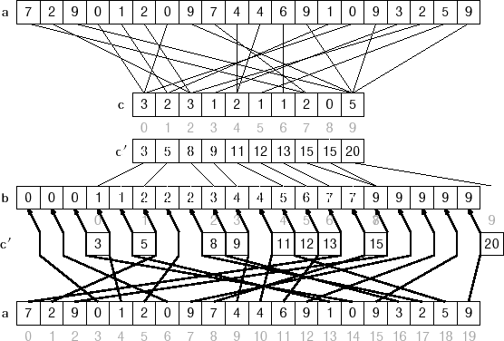

# 线性时间排序算法
## 0 线性时间排序算法列表
<table style="border: 1px solid #000000; background-color: #ffffff;" border="1" align="center">
<tbody>
<tr style="background-color: #f8f8f8;" align="left" valign="middle">
<td style="text-align: center;" scope="col" colspan="6" align="left" valign="middle">
<p><span style="font-size: 16px;"><strong>线性时间排序</strong></span></p>
</td>
</tr>
<tr style="background-color: #f8f8f8;" align="left" valign="middle">
<td style="text-align: center;" scope="col" align="left" valign="middle"><span style="font-size: medium;"><strong>Name</strong></span></td>
<td style="text-align: center;"><strong><span style="font-size: 16px;">Average</span></strong></td>
<td style="text-align: center;"><strong><span style="font-size: 16px;">Worst</span></strong></td>
<td style="text-align: center;"><strong><span style="font-size: 16px;">Memory</span></strong></td>
<td style="text-align: center;"><strong><span style="font-size: 16px;">Stable</span></strong></td>
<td style="text-align: center;">
<p><strong><span style="font-size: 16px;"><span style="font-size: medium;">Description</span></span></strong></p>
</td>
</tr>
<tr align="left" valign="middle">
<td scope="col" align="left" valign="middle">
<p><span style="font-size: 16px;"><strong>&nbsp;<a href="#counting_sort">计数排序</a></strong></span></p>
<p><span style="font-size: 12px;"><strong><a href="#counting_sort">（Counting Sort）</a></strong></span></p>
</td>
<td style="text-align: center;">
<p><span style="font-size: 16px;">n + k</span></p>
</td>
<td style="text-align: center;">
<p><span style="font-size: 16px;">n + k</span></p>
</td>
<td style="text-align: center;">
<p><span style="font-size: 16px;">n + k</span></p>
</td>
<td style="text-align: center;">
<p><span style="font-size: 16px;">Stable</span></p>
</td>
<td>
<p><span style="font-size: 16px;">&nbsp;Indexes using key values.</span></p>
</td>
</tr>
<tr align="left" valign="middle">
<td scope="col" align="left" valign="middle">
<p><span style="font-size: 16px;"><strong>&nbsp;<a href="#radix_sort">基数排序</a></strong></span></p>
<p><a href="#radix_sort"><span style="font-size: 12px;"><strong>（Radix Sort）</strong></span></a></p>
</td>
<td style="text-align: center;">
<p><span style="font-size: 16px;">n * k</span></p>
</td>
<td style="text-align: center;"><span style="font-size: 16px;">&nbsp;n * k</span></td>
<td style="text-align: center;"><span style="font-size: 16px;">n + k</span></td>
<td style="text-align: center;"><span style="font-size: 16px;">Stable</span></td>
<td>
<p><span style="font-size: 16px;">&nbsp;Examines individual bits of keys.</span></p>
</td>
</tr>
<tr align="left" valign="middle">
<td scope="col" align="left" valign="middle">
<p><a href="#bucket_sort"><span style="font-size: 16px;"><strong>&nbsp;桶排序</strong></span></a></p>
<p><a href="#bucket_sort"><span style="font-size: 12px;"><strong>（Bucket Sort）</strong></span></a></p>
</td>
<td style="text-align: center;">
<p><span style="font-size: 16px;">n + k</span></p>
</td>
<td style="text-align: center;">
<p><span style="font-size: 16px;">n<sup>2</sup></span></p>
</td>
<td style="text-align: center;">
<p><span style="font-size: 16px;">n * k</span></p>
</td>
<td style="text-align: center;">
<p><span style="font-size: 16px;">Stable</span></p>
</td>
<td>
<p><span style="font-size: 16px;">&nbsp;Examine bits of keys.</span></p>
</td>
</tr>
</tbody>
</table>

### 特点

给定含 n 个元素的输入序列，任何比较排序在最坏情况下都需要 Ω(n log n) 次比较来进行排序。合并排序和堆排序在最坏情况下达到上界 O(n log n)，它们都是渐进最优的排序算法，快速排序在平均情况下达到上界 O(n log n)。

本文介绍的三种以线性时间运行的算法：计数排序、基数排序和桶排序，都用非比较的一些操作来确定排序顺序。因此，下界 Ω(n log n) 对它们是不适用的。

## 1 计数排序（Counting Sort）
### 算法原理
计数排序（Counting Sort）假设 n 个输入元素中的每一个都是介于 0 到 k 之间的整数，此处 k 为某个整数。
计数排序的基本思想就是对每一个输入元素 x，确定出小于 x 的元素个数。有了这一信息，就可以把 x 直接放到它在最终输出数组中的位置上。


例如：有 10 个年龄不同的人，统计出有 8 个人的年龄比 A 小，那 A 的年龄就排在第 9 位，用这个方法可以得到其他每个人的位置，也就排好了序。当然，年龄有重复时需要特殊处理（保证稳定性），这就是为什么最后要反向填充目标数组，以及将每个数字的统计减去 1 的原因。

### 算法描述
算法的步骤如下：
1. 找出待排序的数组中最大和最小的元素；
2. 统计数组中每个值为 i 的元素出现的次数，存入数组 C 的第 i 项；
3. 对所有的计数累加（从 C 中的第一个元素开始，每一项和前一项相加）；
4. 反向填充目标数组，将每个元素 i 放在新数组的第 C(i) 项，每放一个元素就将 C(i) 减去 1；


### 算法复杂度
* 最差时间复杂度 O(n + k)
* 平均时间复杂度 O(n + k)
* 最差空间复杂度 O(n + k)

计数排序不是比较排序，排序的速度快于任何比较排序算法。
计数排序的一个重要性质就是它是稳定的：具有相同值的元素在输出数组中的相对次序与它们在输入数组中的次序相同。
之所以说计数排序的稳定性非常重要，还有一个原因是因为计数排序经常用作基数排序算法的一个子过程，其稳定性对于基数排序的正确性来说非常关键。

### 代码示例
```
 1   class Program
 2   {
 3     static void Main(string[] args)
 4     {
 5       int[] unsorted = 
 6         { 
 7           5, 9, 3, 9, 10, 9, 2, 4, 13, 10
 8         };
 9 
10       OptimizedCountingSort(unsorted);
11 
12       foreach (var key in unsorted)
13       {
14         Console.Write("{0} ", key);
15       }
16 
17       Console.Read();
18     }
19 
20     static int[] CountingSort(int[] unsorted)
21     {
22       // find min and max value
23       int min = unsorted[0], max = unsorted[0];
24       for (int i = 1; i < unsorted.Length; i++)
25       {
26         if (unsorted[i] < min) min = unsorted[i];
27         else if (unsorted[i] > max) max = unsorted[i];
28       }
29 
30       // creates k buckets
31       int k = max - min + 1;
32       int[] C = new int[k];
33 
34       // calculate the histogram of key frequencies
35       for (int i = 0; i < unsorted.Length; i++)
36       {
37         C[unsorted[i] - min]++;
38       }
39 
40       // recalculate
41       C[0]--;
42       for (int i = 1; i < C.Length; i++)
43       {
44         C[i] = C[i] + C[i - 1];
45       }
46 
47       // sort the array
48       int[] B = new int[unsorted.Length];
49       for (int i = unsorted.Length - 1; i >= 0; i--)
50       {
51         // keep stable
52         B[C[unsorted[i] - min]--] = unsorted[i];
53       }
54 
55       return B;
56     }
57 
58     static void OptimizedCountingSort(int[] unsorted)
59     {
60       // find min and max value
61       int min = unsorted[0], max = unsorted[0];
62       for (int i = 1; i < unsorted.Length; i++)
63       {
64         if (unsorted[i] < min) min = unsorted[i];
65         else if (unsorted[i] > max) max = unsorted[i];
66       }
67 
68       // creates k buckets
69       int k = max - min + 1;
70       int[] C = new int[k];
71 
72       // calculate the histogram of key frequencies
73       for (int i = 0; i < unsorted.Length; i++)
74       {
75         C[unsorted[i] - min]++;
76       }
77 
78       // copy to output array,
79       // preserving order of inputs with equal keys
80       int increment = 0;
81       for (int i = min; i <= max; i++)
82       {
83         for (int j = 0; j < C[i - min]; j++)
84         {
85           // in place, may not stable if you care
86           unsorted[increment++] = i;
87         }
88       }
89     }
90   }
```

## 基数排序（Radix Sort）
### 算法原理

基数排序（Radix Sort）是一种非比较型整数排序算法，其原理是将整数值按相同的有效位进行分组，然后在有效位区间内进行排序。

### 算法描述
每个元素值首先被放入一个该值的最右位所对应的桶中，桶内会保持被放入元素值最初的顺序。这使得桶的数量和值的数量能够根据其最右位建立一对一的关系。然后，通过相同的方式重复处理下一位，直到所有的位都已被处理。
1. 获得值的最右侧的最小的位。
2. 根据该位的值将数组内的元素值进行分组，但仍然保持元素的顺序。(以此来保持算法稳定性)
3. 重复上述分组过程，直到所有的位都已被处理。

上述第 2 步中通常可以使用桶排序（Bucket Sort）或计数排序（Counting Sort）算法，因为它们在元素较少时拥有更好的效率。


基数排序中可以选择采用最低有效位基数排序（LSD Radix Sort：Least Significant Digit Radix Sort）或最高有效位基数排序（MSD Radix Sort：Most Significant Digit Radix Sort）。LSD 的排序方式由值的最低位也就是最右边开始，而 MSD 则相反，由值的最高位也就是最左边开始。


例如，如下这个无序的数列需要排序：
```
　　170, 45, 75, 90, 802, 2, 24, 66
```
使用 LSD 方式从最低位开始（个位）排序的结果是：
```
　　170, 90, 802, 2, 24, 45, 75, 66
```
再继续从下一位（十位）继续排序的结果是：
```
　　802, 2, 24, 45, 66, 170, 75, 90
```
再继续从下一位（百位）继续排序的结果是：
```
　　2, 24, 45, 66, 75, 90, 170, 802
```
### 算法复杂度
* 最差时间复杂度 O(k*n)
* 最差空间复杂度 O(k*n)

### 代码示例
```
 1   class Program
 2   {
 3     static void Main(string[] args)
 4     {
 5       int[] unsorted = 
 6         { 
 7           15, 19, 13, 19, 10, 33, 12, 14, 13, 10,
 8         };
 9 
10       RadixSort(unsorted);
11 
12       foreach (var key in unsorted)
13       {
14         Console.Write("{0} ", key);
15       }
16 
17       Console.Read();
18     }
19 
20     static void RadixSort(int[] unsorted)
21     {
22       // our helper array 
23       int[] t = new int[unsorted.Length];
24 
25       // number of bits our group will be long 
26       // try to set this also to 2, 8 or 16 to see if it is quicker or not
27       int r = 4;
28 
29       // number of bits of a C# int 
30       int b = 32;
31 
32       // counting and prefix arrays
33       // (note dimensions 2^r which is the number of 
34       // all possible values of a r-bit number) 
35       int[] count = new int[1 << r];
36       int[] pref = new int[1 << r];
37 
38       // number of groups 
39       int groups = (int)Math.Ceiling((double)b / (double)r);
40 
41       // the mask to identify groups 
42       int mask = (1 << r) - 1;
43 
44       // the algorithm: 
45       for (int c = 0, shift = 0; c < groups; c++, shift += r)
46       {
47         // reset count array 
48         for (int j = 0; j < count.Length; j++)
49           count[j] = 0;
50 
51         // counting elements of the c-th group 
52         for (int i = 0; i < unsorted.Length; i++)
53           count[(unsorted[i] >> shift) & mask]++;
54 
55         // calculating prefixes 
56         pref[0] = 0;
57         for (int i = 1; i < count.Length; i++)
58           pref[i] = pref[i - 1] + count[i - 1];
59 
60         // from a[] to t[] elements ordered by c-th group 
61         for (int i = 0; i < unsorted.Length; i++)
62           t[pref[(unsorted[i] >> shift) & mask]++] = unsorted[i];
63 
64         // a[]=t[] and start again until the last group 
65         t.CopyTo(unsorted, 0);
66       }
67       // a is sorted 
68     }
69   }
```

## 3 桶排序（Bucket Sort）
### 算法原理


桶排序（Bucket Sort）的工作原理是将数组分解到有限数量的桶里，每个桶再分别进行排序。桶内排序有可能使用其他排序算法或是以递归的方式继续使用桶排序。

### 算法描述
桶排序的步骤：
1. 在数组中查找数值的最大值和最小值；
2. 初始化一个数组当作空桶，长度为 (MaxValue - MinValue + 1)。
3. 遍历被排序数组，并把数值逐个放入对应的桶中。
4. 对每个不是空的桶进行排序。
5. 从不是空的桶里把数值再放回原来的数组中。


### 算法复杂度
* 最差时间复杂度 O(n2)
* 平均时间复杂度 O(n+k)
* 最差空间复杂度 O(n*k)

当要被排序的数组中的数值是均匀分布时，桶排序的运行时间为线性时间 Θ(n)。桶排序不是比较排序，它不受 Ω(n log n) 下界的影响。
### 代码示例
```
 1   class Program
 2   {
 3     static void Main(string[] args)
 4     {
 5       int[] unsorted = 
 6         { 
 7           15, 19, 13, 19, 10, 33, 12, 14, 13, 10,
 8         };
 9 
10       BucketSort(unsorted);
11 
12       foreach (var key in unsorted)
13       {
14         Console.Write("{0} ", key);
15       }
16 
17       Console.Read();
18     }
19 
20     static void BucketSort(int[] unsorted)
21     {
22       // find the maximum and minimum values in the array
23       int max = unsorted[0]; //start with first element
24       int min = unsorted[0];
25 
26       // start from index 1
27       for (int i = 1; i < unsorted.Length; i++)
28       {
29         if (unsorted[i] < min) min = unsorted[i];
30         else if (unsorted[i] > max) max = unsorted[i];
31       }
32 
33       // create a temporary "buckets" to store the values in order
34       // each value will be stored in its corresponding index
35       // scooting everything over to the left as much as possible
36       // e.g. 34 => index at 34 - minValue
37       List<int>[] buckets = new List<int>[max - min + 1];
38 
39       // initialize the buckets
40       for (int i = 0; i < buckets.Length; i++)
41       {
42         buckets[i] = new List<int>();
43       }
44 
45       // move items to bucket
46       for (int i = 0; i < unsorted.Length; i++)
47       {
48         buckets[unsorted[i] - min].Add(unsorted[i]);
49       }
50 
51       // move items in the bucket back to the original array in order
52       int k = 0; //index for original array
53       for (int i = 0; i < buckets.Length; i++)
54       {
55         if (buckets[i].Count > 0)
56         {
57           for (int j = 0; j < buckets[i].Count; j++)
58           {
59             unsorted[k] = buckets[i][j];
60             k++;
61           }
62         }
63       }
64     }
65   }
```