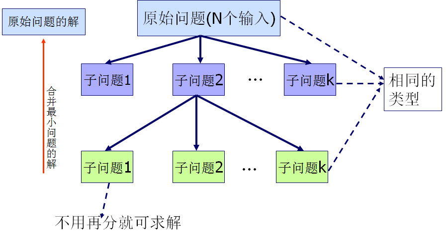
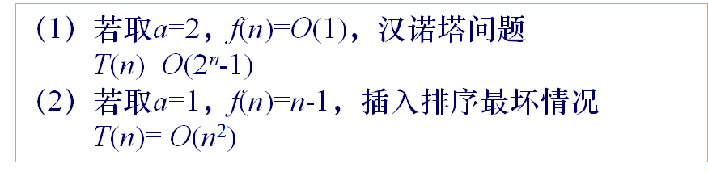
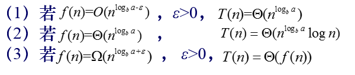

# 分治法

## 0 分治法概述
### 基本思想

* 求解问题算法的复杂性一般都与问题规模相关，问题规模越小越容易处理。
* 分治法的基本思想是，将一个难以直接解决的大问题，分解为规模较小的相同子问题，直至这些子问题容易直接求解，并且可以利用这些子问题的解求出原问题的解。各个击破，分而治之。
* 分治法产生的子问题一般是原问题的较小模式，这就为使用递归技术提供了方便。递归是分治法中最常用的技术。




### 分治法解决问题的先决条件
* 该问题的规模缩小到一定的程度就可以容易地解决；
* 该问题可以分解为若干个规模较小的相同问题，即该问题具有最优子结构性质；
* 利用该问题分解出的子问题的解可以合并为该问题的解；
* 该问题所分解出的各个子问题是相互独立的，即子问题之间不包含公共的子问题。

### 分治法的步骤
一般来说，分治法的求解过程由以下三个阶段组成：
1. 划分：既然是分治，当然需要把规模为n的原问题划分为k个规模较小的子问题，并尽量使这k个子问题的规模大致相同。
2. 求解子问题：各子问题的解法与原问题的解法通常是相同的，可以用递归的方法求解各个子问题，有时递归处理也可以用循环来实现。
3. 合并：把各个子问题的解合并起来，合并的代价因情况不同有很大差异，分治算法的有效性很大程度上依赖于合并的实现。

在用分治法设计算法时，最好使子问题的规模大致相同。即将一个问题分成大小相等的k个子问题的处理方法是行之有效的。这种使子问题规模大致相等的做法是出自一种平衡(balancing)子问题的思想，它几乎总是比子问题规模不等的做法要好。

```
divide-and-conquer(P){
    if ( | P | <= n0) adhoc(P);   //解决小规模的问题
    divide P into smaller subinstances P1,P2,...,Pk；//分解问题
    for (i=1; i<=k; i++)
        yi=divide-and-conquer(Pi);  //递归的解各子问题
    return merge(y1,...,yk);  //将各子问题的解合并为原问题的解
  }

```
### 分治法的复杂性

即递归法的时间复杂性。递归求解各个子问题。递归是实现分治算法的手段。

可以通过过计算递归法的时间复杂度，计算分治法的时间复杂度。


## 0 递归法概述

### 基本思想
直接或间接的调用自身的算法称为递归算法。用函数自身给出定义的函数称为递归函数。

### 线性收缩递归算法
* 递推关系式

$$
T(n)=\begin{cases}  
    o(1) & n=1 \\
    \sum_{i=1}^k a_iT(n-i)+f(n) & n>1
\end{cases} 
$$

* 求解递推关系式
$$
T(n)=a^{n-1}T(1)+\sum_{i=2}^na^{n-i}f(i)
$$
* 关系式说明


### 等比收缩递归算法

* 递推关系式
$$
T(n)=\begin{cases}
    O(1)&n=1 \\
    aT(\frac{n}{b})+f(n) & n>1
\end{cases}
$$
* 求解递推关系式
$$
T(n)=n^{\log_ba} +\sum_{i=2}^{\log_bn-1}a^jf(n/b^j)
$$
* 关系式说明



## 1 分治法应用

### 排列问题
### 整数划分问题

### 二分搜索问题

### 大数乘法

### 矩阵乘法

### 快速排序

### 合并排序

### 线性时间选择

### 最近点对问题

### 棋盘覆盖问题