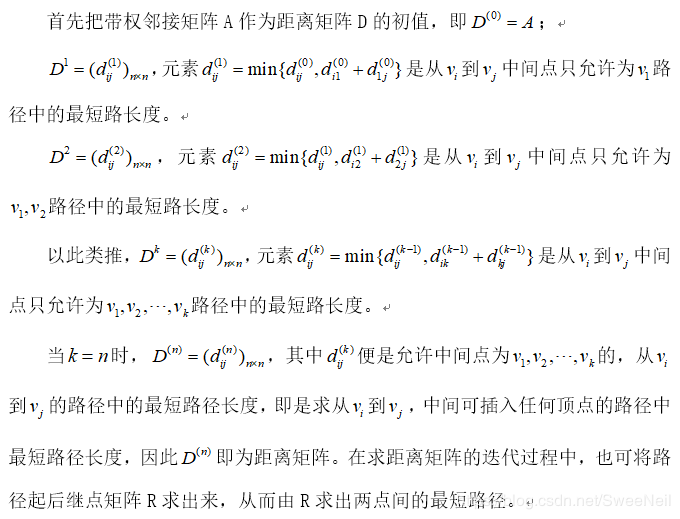

# 图算法-Floyd算法

> 目录
>* 图算法-Dijkstra算法
>* 图算法-Floyd算法
>* 图算法-Bellman-Ford算法
>* 图算法-Prim算法
>* 图算法-Kruskal算法

> 参考文献
> [https://www.jianshu.com/p/f73c7a6f5a53](https://www.jianshu.com/p/f73c7a6f5a53)
## 1 问题分析

Floyd算法是一个经典的**动态规划算法**，它又被称为插点法。该算法名称以创始人之一、1978年图灵奖获得者、斯坦福大学计算机科学系教授罗伯特·弗洛伊德命名。Floyd算法是一种利用动态规划的思想寻找给定的加权图中多源点之间最短路径的算法,算法目标是寻找从点i到点j的最短路径。

## 2 算法原理

Floyd算法的基本思想：
可以将问题分解:
第一、先找出最短的距离
第二、然后在考虑如何找出对应的行进路线。

> 以后再整理一下文字内容


如何找出最短路径呢，这里还是用到动态规划的知识，对于任何一个城市而言，i到j的最短距离不外乎存在经过i与j之间经过k和不经过k两种可能，所以可以令k=1，2，3，...，n(n是城市的数目)，在检查d(ij)与d(ik)+d(kj)的值；在此d(ik)与d(kj)分别是目前为止所知道的i到k与k到j的最短距离，因此d(ik)+d(kj)就是i到j经过k的最短距离。所以，若有d(ij)>d(ik)+d(kj)，就表示从i出发经过k再到j的距离要比原来的i到j距离短，自然把i到j的d(ij)重写为d(ik)+d(kj)，每当一个k查完了，d(ij)就是目前的i到j的最短距离。重复这一过程，最后当查完所有的k时，d(ij)里面存放的就是i到j之间的最短距离了。

接下来就要看一看如何找出最短路径所行经的城市了，这里要用到另一个矩阵P，它的定义是这样的：p(ij)的值如果为p，就表示i到j的最短行经为i->...->p->j，也就是说p是i到j的最短行径中的j之前的最后一个城市。P矩阵的初值为p(ij)=i。有了这个矩阵之后，要找最短路径就轻而易举了。对于i到j而言找出p(ij)，令为p，就知道了路径i->...->p->j；再去找p(ip)，如果值为q，i到p的最短路径为i->...->q->p；再去找p(iq)，如果值为r，i到q的最短路径为i->...->r->q；所以一再反复，到了某个p(it)的值为i时，就表示i到t的最短路径为i->t，就会的到答案了，i到j的最短行径为i->t->...->q->p->j。因为上述的算法是从终点到起点的顺序找出来的，所以输出的时候要把它倒过来。

但是，如何动态的回填P矩阵的值呢？回想一下，当d(ij)>d(ik)+d(kj)时，就要让i到j的最短路径改为走i->...->k->...->j这一条路，但是d(kj)的值是已知的，换句话说，就是k->...->j这条路是已知的，所以k->...->j这条路上j的上一个城市(即p(kj))也是已知的，当然，因为要改走i->...->k->...->j这一条路，j的上一个城市正好是p(kj)。所以一旦发现d(ij)>d(ik)+d(kj)，就把p(kj)存入p(ij)。

## 3 算法过程



1. 定义n×n的方阵序列D-1, D0 , … Dn－1,

2. 初始化： D-1＝C  
    D-1[i][j]＝边<i,j>的长度，表示初始的从i到j的最短路径长度，即它是从i到j的中间不经过其他中间点的最短路径。

3. 迭代：设Dk-1已求出，如何得到Dk（0≤k≤n-1）？

    * Dk-1[i][j]表示从i到j的中间点不大于k-1的最短路径p：i…j，
    * 考虑将顶点k加入路径p得到顶点序列q：i…k…j，
    * 若q不是路径，则当前的最短路径仍是上一步结果：Dk[i][j]= Dk－1[i][j]；
    * 否则若q的长度小于p的长度，则用q取代p作为从i到j的最短路径

4. 因为q的两条子路径i…k和k…j皆是中间点不大于k－1的最短路径，所以从i到j中间点不大于k的最短路径长度为：
$$
Dk[i][j]＝min\{ Dk-1[i][j], Dk-1[i][k] +Dk-1[k][j]\}
$$

## 4 算法效率

时间复杂度为$O(n^3)$

## 5 算法实现

```
#include<iostream>
#include<string.h>
using namespace std;

#define len 100
#define INF 999999

class Graph{
    // 内部类
    private:
        // 邻接表中表对应的链表的顶点
        class ENode{
            public:
                int vex;         // 顶点
                int weight;      // 权重 
                ENode *nextEdge; // 指向下一条弧
        };

        // 邻接表中表的顶点
        class VNode{
            public:
                char data; // 顶点信息
                ENode *firstEdge; // 指向第一条依付该顶点的弧
        };

    // 私有成员
    private:
        int n;              // 节点个数 
        int e;              // 边的个数
        VNode mVexs[len];
    
    public:
        Graph(){
            ENode *node1, *node2;
            n = 7; 
            e = 12;

            // 设置节点为默认数值
            string nodes = "ABCDEFG";
            // 输入节点
            for(int i=0; i < n; i++){
                mVexs[i].data = nodes[i];
                mVexs[i].firstEdge = NULL;
            }

            // 设置边为默认值
            char edges[][2] = {
                {'A', 'B'}, 
                {'A', 'F'}, 
                {'A', 'G'}, 
                {'B', 'C'}, 
                {'B', 'F'}, 
                {'C', 'D'}, 
                {'C', 'E'},
                {'C', 'F'}, 
                {'D', 'E'},
                {'E', 'F'}, 
                {'E', 'G'},
                {'F', 'G'}
            };
            
            // 边的权重
            int weights[len] = {12, 16, 14, 10, 7, 3, 5, 6, 4, 2, 8, 9};
            
            //　初始化邻接表的边
            for(int i=0; i < e; i++){
                int start = get_Node_Index(edges[i][0]);
                int end = get_Node_Index(edges[i][1]);

                // 初始化 node1
                node1 = new ENode();
                node1->vex = end;
                node1->weight = weights[i];
                node1->nextEdge = NULL;
                // 将 node 添加到 start 所在链表的末尾
                if(mVexs[start].firstEdge == NULL){
                    mVexs[start].firstEdge = node1;
                }
                else{
                    linkLast(mVexs[start].firstEdge, node1);
                }

                // 初始化 node2
                node2 = new ENode();
                node2->vex = start;
                node2->weight = weights[i];
                node2->nextEdge = NULL;
                // 将 node 添加到 end 所在链表的末尾
                if(mVexs[end].firstEdge == NULL){
                    mVexs[end].firstEdge = node2;
                }
                else{
                    linkLast(mVexs[end].firstEdge, node2);
                }
            }
        }

        // 相邻节点链接子函数
        void linkLast(ENode*p1, ENode*p2){
            ENode*p = p1;
            while(p->nextEdge){
                p = p->nextEdge;
            }
            p->nextEdge = p2;
        }
        
        // 返回顶点下标
        int get_Node_Index(char number){
            for(int i=0; i < n; i++){
                if(number == mVexs[i].data){
                    return i;
                }
            }
            return -1; //这句话永远不会执行的
        }

        // 输出邻接表
        void print(){
            for(int i=0; i < n; i ++){
                cout<<mVexs[i].data;
                ENode *temp = mVexs[i].firstEdge;
                while(temp){
                    cout<<" -> "<<temp->vex;
                    temp = temp->nextEdge;
                }
                cout<<endl;
            }
            cout<<endl;
        }

        // 得到两个节点之间的权重
        int getWeight(int m, int n){
            ENode *enode = mVexs[m].firstEdge;
            while(enode){
                if(enode->vex == n){
                    return enode->weight;
                }
                enode = enode->nextEdge;
            }
            return INF;
        }

        // 弗洛伊德算法
        void floyd(){
            int dist[n][n]; // 距离矩阵
            int path[7][7]; // 路径矩阵, 7为节点数目
            int i, j, k;
            int temp;

            // 初始化权重
            for(i = 0; i < n; i++){
                for(j = 0; j < n; j++){
                    if(i == j){
                        dist[i][j] = 0;
                    }
                    else{
                        dist[i][j] = getWeight(i, j);
                    }
                    path[i][j] = i;
                }
            }
            
            // floyd 算法开始
            for(k = 0; k < n; k++){
                for(i = 0; i < n; i++){
                    for(j = 0; j < n; j++){
                        temp = (dist[i][k] == INF || dist[k][j] == INF)? INF : (dist[i][k] + dist[k][j]);
                        if(temp < dist[i][j]){
                            dist[i][j] = temp;
                            path[i][j] = path[k][j];
                        }
                    }
                }
            }

            // 打印出两点之间最短距离 + 路径
            for(i = 0; i < n-1; i++){
                for(j = i+1; j < n; j++){
                    if(dist[i][j] < 10){
                        cout<<mVexs[i].data<<" -> "<<mVexs[j].data<<": "<<dist[i][j]<<"  , 路径为: ";
                    }
                    else{
                        cout<<mVexs[i].data<<" -> "<<mVexs[j].data<<": "<<dist[i][j]<<" , 路径为: ";
                    }
                    getPath(i, j, path);
                    cout<<endl;
                }
                cout<<endl;
            }
            
            // 输出路径矩阵观察, 可用此矩阵自己用笔演算一下路径查找过程
            // for(i = 0; i < n; i++){
            //     for(j = 0; j < n; j++){
            //         cout<<path[i][j]<<" ";
            //     }
            //     cout<<endl;
            // }
        }

        // 递归实现得到节点之间最短路径
        void getPath(int start, int end, int path[][7]){
            if(path[start][end] == start){
                cout<<mVexs[start].data<<" "<<mVexs[end].data<<" ";
            }
            else{
                getPath(start, path[start][end], path);
                cout<<mVexs[end].data<<" ";
            }
        }
};

int main(){
    Graph g;
    // 输出邻接表
    // g.print();

    // 弗洛伊德算法
    g.floyd();
    return 0;
}
```