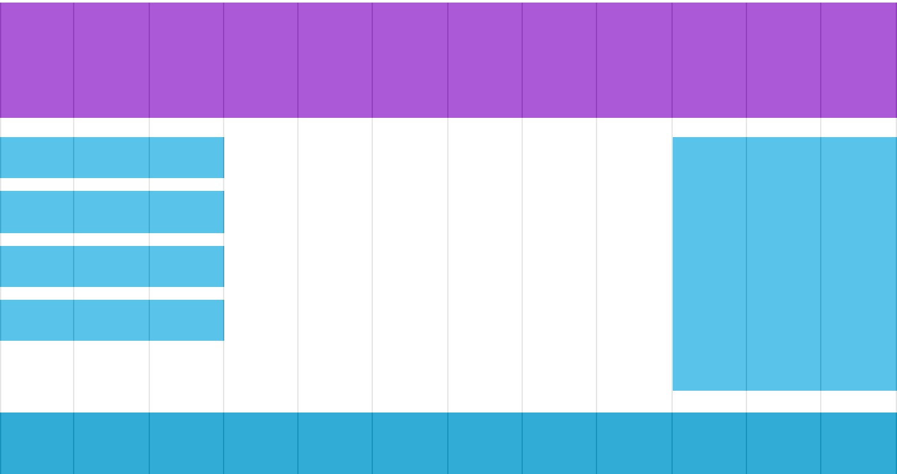

## 响应式页面概述

### 1. 什么是响应式页面

响应式网页（RWD，Responsive Web Design），2010年5月由Ethan Marcotte提出。简而言之，就是一个网站能够针对多个终端提供不同的显示样式，而不是针对每个终端制作一个特定的版本。

由于智能手机和平板电脑的兴起，网站页面的制作不仅要满足PC端浏览器的显示，还要满足智能手机浏览器的显示或者平板电脑浏览器的显示。（**PC端、智能手机或平板电脑的浏览器之间的区别，主要集中在分辨率的不同。**）

### 2. 为什么需要响应式页面

想要同时满足PC端、智能手机和平板电脑浏览器的正常显示，实际上有以下两种实现方式：

a. 分别针对PC端、智能手机和平板电脑的浏览器制作特定的页面。例如 [https://www.tmall.com/](https://www.tmall.com/)

* 优点：用户体验好，适合复杂页面。
* 缺点：工作量大，不够灵活。

b. 制作一个页面同时满足PC端、智能手机和平板电脑的浏览器显示。例如 [http://www.intel.cn/](http://www.intel.cn/)

* 优点：比较灵活，一个页面适应不同终端。
* 缺点：页面加载时间长，效率降低。

如果PC端显示的页面与智能手机或平板电脑显示的页面不同时，建议选择 *a* 方案。比如智能手机端的可以利用 GPS 定位当前位置等不同于PC端的功能。但大多数网站的页面，无论是PC端还是智能手机或平板电脑显示的内容基本相同，建议选择 *b* 方案。

### 3. 响应式页面的构成

目前实现响应式页面可以通过以下两种方式：

a. 使用框架实现，例如 [Bootstrap](https://getbootstrap.com) 等。这种方式开发响应式页面更快速、简单，但由于CSS样式是集成式的，导致页面样式相似，没有特点。

b. 手写方式实现。这种方式开发响应式页面速度比较慢、代码多，但可以根据网站特点定制CSS样式。

手写方式需要使用到以下几种技术：

* 流式网格布局
* CSS3 的媒体查询
* 相对单位替换绝对单位

## 测试响应式页面

### 1. 如何测试响应式页面

测试响应式页面可以通过以下三种方式：

* 通过真实设备进行测试。这种方式进行测试效果最好，但也是最复杂，并且需要不同分辨率的设备，成本较高。
* 通过第三方模拟器进行测试。这种方式一般都是针对智能手机终端研发工具自带，需要在电脑安装不同开发工具，比较麻烦，并且性能较差。或者通过在线测试网站进行测试，测试周期较长。
* 通过浏览器自带的设备模拟器进行测试。这种方式是最方便的，主流浏览器都自带了设备模拟器，并且测试效果较好。

### 2. 使用浏览器测试

> 以 Chrome 浏览器为例。

打开 Chrome 浏览器，点击右上角的菜单，选择“更多工具”中的“开发者工具”。（**Windows操作系统版本的 Chrome 浏览器可以通过 F12 快捷键直接打开。**）

**值得注意的是：**

* 每次更换测试设备时，需要重新刷新页面显示。
* 有些功能无法正常测试，例如电话薄、摄像头等。

### 3. 使用第三方工具测试

### 4. 使用真实设备测试

## 编写响应式页面

### 1. viewport元元素

#### 1）什么是 viewport ？

viewport 被翻译为“视区”，表示页面的可视区域。通过 HTML 页面的 meta 元元素进行设置，是响应式页面设计的必备内容。

移动端浏览器在一个通常比屏幕更宽的虚拟“窗口”（视口）中渲染页面，从而无序将所有页面都压缩进小屏幕里（那样会把很多没有针对移动端进行优化的站点打乱）。用户可以通过平移和缩放来浏览页面的不同区域。

通过设置 viewport 元元素可以允许开发者控制显示的尺寸及比例。如今大部分移动端浏览器都支持 viewport 元元素，尽管它**不是 web 标准的一部分**。

#### 2）设置 viewport

一个典型的针对移动端优化的站点包含类似下面的内容：

```html
<meta name="viewport" content="width=device-width, initial-scale=1, maximum-scale=1">
```

viewport 元元素的属性如下表：

| 属性名称 | 说明 | 可选值 |
| ------- | --- | ----- |
| width | 设置窗口的宽度 | 像素值或device-width（表示100%时屏幕宽度的像素值） |
| height | 设置窗口的高度 | 一般不指定 |
| initial-scale | 设置初始时的缩放倍率 |
| minimum-scale | 设置允许的最小缩放倍率 |
| maximum-scale | 设置允许的最大缩放倍率 |
| user-scalable | 是否允许用户手动缩放 | 1或yes表示允许；0或no表示不允许 |

> meta 元元素建议设定在 head 元素中的最前面。

### 2. 使用相对单位

#### 1）使用相对宽度值

通过学习 CSS 知道设置宽度可以使用 px 像素值和百分值。使用像素值设置宽度是固定值，不能随着屏幕大小变化而变化。实现响应式页面的宽度只能使用百分值或者auto。

##### 如何从固定布局修改为百分比布局

在《无懈可击的 Web 设计》一书中，提供了一个简易可行的公式：

	目标元素宽度 / 上下文元素宽度 = 百分比宽度

以下代码是使用像素值设置 HTML 页面元素：

```css
div {
	width : 500px;
	height : auto;
	border : 1px solid black;
}
p {
	width : 480px;
	padding-left: 10px;
}
```

将上述像素值修改为百分比：

```css
div {
	width : 60%;
	height : auto;
	border : 1px solid black;
	}
p {
	width : 96%;  /* 480/500=96% */
	padding-left: 2%; /* 10/500=2% */
}
```

#### 2）用 em 替换 px

之前使用 em 替代 px 设置字体，主要是为了解决老版本的 IE 浏览器无法缩放以像素值为单位的文字。

目前使用 em 替代 px 设置字体，主要的目的具有以下两个：

* 实现老版本 IE 浏览器可以缩放文字。
* 更好地实现响应式页面，使页面效果更好。

em 的实际大小事相对于上下文的字体大小而言的，例如 1em 表示与上下文字体相同大小。em 单位设置字体同样可以通过以下公式进行计算：

	目标元素尺寸 / 上下文元素尺寸 = 百分比尺寸

> **值得注意的是：**浏览器显示默认文字大小都是 16 像素。

### 3. 流式布局

#### 1）什么是流式布局

所谓流式布局，就是页面元素的宽度按照屏幕进行适配调整。简单来说，就是 HTML 页面中的元素会根据分辨率的不同而变化大小，但位置并不会有任何变化。

这种布局的主要问题就是，如果屏幕尺度跨度太大，那么在相对其原始设计而言过小或过大的屏幕上不能正常显示。



#### 2）创建流式布局

流式布局通常被分为 12 列。将 HTML 页面的宽度设置为 100%，这样 HTML 页面会根据浏览器窗口大小的变化而自动伸缩。

* 计算每列所占的百分比：`100% / 12 列 = 8.33%`

  根据以上的计算结果，设置 CSS 的 class：

```css
.col-1 {width: 8.33%;}
.col-2 {width: 16.66%;}
.col-3 {width: 25%;}
.col-4 {width: 33.33%;}
.col-5 {width: 41.66%;}
.col-6 {width: 50%;}
.col-7 {width: 58.33%;}
.col-8 {width: 66.66%;}
.col-9 {width: 75%;}
.col-10 {width: 83.33%;}
.col-11 {width: 91.66%;}
.col-12 {width: 100%;}
```

* 将所有列设置为浮动（一般为左浮动）

```css
[class*="col-"] {
    float: left;
}
```

* 将 HTML 页面中所有的元素 box-sizing 设置为 border-box。

  * 当 box-sizing 的值为 content-box（默认值），标准盒模型。

      尺寸计算公式：`width = 内容的宽度，height = 内容的高度。`

      > 宽度和高度都不包含内容的边框（border）和内边距（padding）。

      ```css
      div {
            width : 300px;
            height : 200px;
            border : 10px solid black;
            background : deepskyblue;
      }
      ```

  * 当 box-sizing 的值为 border-box，IE 怪异模式（Quirks mode）使用的 盒模型 。

     尺寸计算公式：`width = border + padding + 内容的宽度，height = border + padding + 内容的高度。`

     > **注意：**外边距和边框将会包括在盒子中。

     ```css
     div {
            box-sizing: border-box;
            width : 300px;
            height : 200px;
            border : 10px solid black;
            background : deepskyblue;
     }
     ```

根据上述流式布局的内容，实现以下案例：

```html
<!DOCTYPE html>
<html>
<head>
    <meta name="viewport" content="width=device-width, initial-scale=1.0">
    <style>
        * {
            box-sizing: border-box;
        }

        [class*="col-"] {
            float: left;
            padding: 15px;
        }

        .col-1 {
            width: 8.33%;
        }

        .col-2 {
            width: 16.66%;
        }

        .col-3 {
            width: 25%;
        }

        .col-4 {
            width: 33.33%;
        }

        .col-5 {
            width: 41.66%;
        }

        .col-6 {
            width: 50%;
        }

        .col-7 {
            width: 58.33%;
        }

        .col-8 {
            width: 66.66%;
        }

        .col-9 {
            width: 75%;
        }

        .col-10 {
            width: 83.33%;
        }

        .col-11 {
            width: 91.66%;
        }

        .col-12 {
            width: 100%;
        }

        html {
            font-family: "Lucida Sans", sans-serif;
        }

        header {
            background-color: #9933cc;
            color: #ffffff;
            padding: 15px;
        }

        aside ul {
            list-style-type: none;
            margin: 0;
            padding: 0;
        }

        aside li {
            padding: 8px;
            margin-bottom: 7px;
            background-color: #33b5e5;
            color: #ffffff;
            box-shadow: 0 1px 3px rgba(0, 0, 0, 0.12), 0 1px 2px rgba(0, 0, 0, 0.24);
        }

        aside li:hover {
            background-color: #0099cc;
        }
    </style>
</head>
<body>
<header>
    <h1>Chania</h1>
</header>

<aside class="col-3">
    <ul>
        <li>The Flight</li>
        <li>The City</li>
        <li>The Island</li>
        <li>The Food</li>
    </ul>
</aside>

<article class="col-9">
    <h2>The City</h2>
    <p>Chania is the capital of the Chania region on the island of Crete. The city can be divided in two parts, the old
        town and the modern city.</p>
    <p>Resize the browser window to see how the content respond to the resizing.</p>
</article>
</body>
</html>
```

### 4. 响应式图片

实现图片的显示根据浏览器窗口大小的变化而变化，相对比较简单。只需要将图片的 width 设置为 100% 即可。

```css
img {
    width: 100%;
    height: auto;
}
```

**但这样设置后，图片的显示可能会比实际大小更大。解决这个问题可以利用 max-width 替代 width 属性即可。**

```css
img {
    max-width: 100%;
    height: auto;
}
```

> 这样设置后，图片的显示永远不会比实际大小更大了。

### 5. CSS媒体查询

想要满足更复杂的情况，需要使用 CSS3 中提供的媒体查询进行解决。

媒体查询 包含了一个媒体类型和至少一个使用如宽度、高度和颜色等媒体属性来限制样式表范围的表达式。CSS3加入的媒体查询使得无需修改内容便可以使样式应用于某些特定的设备范围。

#### 媒体查询语法

媒体查询 包含 一个媒体类型、逻辑操作符和一个或多个媒体属性。如果媒体查询中的媒体类型与文档要展示的设备相符则查询结果为真，并且媒体查询中的所有表达式为真。

媒体查询具体的写法有以下两种方式：

* link 元素中的 CSS 媒体查询。

```html
<link rel="stylesheet" media="mediatype and|not|only (media feature)" href="mystylesheet.css">
```

> 这种方式需要针对不同设备编写不同的 CSS 样式表。

* 样式表中的 CSS 媒体查询。

```css
@media mediatype and|not|only (media feature) {
    CSS-Code;
}
```

> 这种方式只需要编写一个 CSS 样式表，在样式表中根据不同的设备设置不同的样式。（**更常用**）

#### 媒体类型

| 值 | 描述 |
| --- | --- |
| all | 用于所有设备 |
| print | 用于打印机和打印预览 |
| screen | 用于电脑屏幕，平板电脑，智能手机等 |
| speech | 用于屏幕阅读器等发声设备 |

> 媒体类型更常用的值为 screen。

#### 逻辑操作符

| 值 | 描述 |
| --- | --- |
| and | 用于把多个 媒体属性 组合起来，合并到同一条媒体查询中。只有当每个属性都为真时，这条查询的结果才为真. |
| not | 用于对一条媒体查询的结果进行取反。 |
| only | 表示仅在媒体查询匹配成功的情况下应用指定样式。可以通过它让选中的样式在老式浏览器中不被应用。|

> 也可以将多个媒体查询以逗号分隔放在一起；只要其中任何一个为真，整个媒体语句就返回真。相当于 or 操作符。

| 值 | 描述 |
| --- | --- |
| width | 定义输出设备中的页面可见区域宽度 |
| max-width | 定义输出设备中的页面最大可见区域宽度 |
| max-device-width | 定义输出设备的屏幕最大可见宽度 |
| min-width | 定义输出设备中的页面最小可见区域宽度 |
| min-device-width | 定义输出设备的屏幕最小可见宽度 |

#### 媒体查询示例

##### link 元素中的 CSS 媒体查询

* HTML 代码

```html
<!DOCTYPE html>
<html lang="en">
<head>
    <meta charset="UTF-8">
    <title>LINK元素方式的媒体查询</title>
    <meta name="viewport" content="width=device-width,initial-scale=1"/>
    <link rel="stylesheet" href="css/main.css">
    <link rel="stylesheet" media="screen and (min-width:768px)" href="css/pc.css">
    <link rel="stylesheet" media="screen and (max-width:768px)" href="css/phone.css">
</head>
<body>
<header>
    <h1>Chania</h1>
</header>

<aside class="col-3">
    <ul>
        <li>The Flight</li>
        <li>The City</li>
        <li>The Island</li>
        <li>The Food</li>
    </ul>
</aside>

<article class="col-9">
    <h2>The City</h2>
    <p>Chania is the capital of the Chania region on the island of Crete. The city can be divided in two parts, the old
        town and the modern city.</p>
    <p>Resize the browser window to see how the content respond to the resizing.</p>
</article>
</body>
</html>
```

* 针对分辨率的宽度在 768px 之上的样式表

```css
.col-1 {
    width: 8.33%;
}

.col-2 {
    width: 16.66%;
}

.col-3 {
    width: 25%;
}

.col-4 {
    width: 33.33%;
}

.col-5 {
    width: 41.66%;
}

.col-6 {
    width: 50%;
}

.col-7 {
    width: 58.33%;
}

.col-8 {
    width: 66.66%;
}

.col-9 {
    width: 75%;
}

.col-10 {
    width: 83.33%;
}

.col-11 {
    width: 91.66%;
}

.col-12 {
    width: 100%;
}

[class*="col-"] {
    float: left;
    padding: 15px;
}
```

* 针对分辨率的宽度在 768px 之下的样式表

```css
[class*="col-"] {
    width: 100%;
    padding: 15px;
}
```

##### 样式表中的 CSS 媒体查询

* HTML 代码

```html
<!DOCTYPE html>
<html lang="en">
<head>
    <meta charset="UTF-8">
    <title>CSS样式表中的媒体查询</title>
    <meta name="viewport" content="width=device-width,initial-scale=1"/>
    <link rel="stylesheet" href="css/main.css">
    <link rel="stylesheet" href="css/media.css">
</head>
<body>
<header>
    <h1>Chania</h1>
</header>

<aside class="col-3">
    <ul>
        <li>The Flight</li>
        <li>The City</li>
        <li>The Island</li>
        <li>The Food</li>
    </ul>
</aside>

<article class="col-9">
    <h2>The City</h2>
    <p>Chania is the capital of the Chania region on the island of Crete. The city can be divided in two parts, the old
        town and the modern city.</p>
    <p>Resize the browser window to see how the content respond to the resizing.</p>
</article>
</body>
</html>
```

* CSS 代码

```css
/* For desktop: */
.col-1 {
    width: 8.33%;
}

.col-2 {
    width: 16.66%;
}

.col-3 {
    width: 25%;
}

.col-4 {
    width: 33.33%;
}

.col-5 {
    width: 41.66%;
}

.col-6 {
    width: 50%;
}

.col-7 {
    width: 58.33%;
}

.col-8 {
    width: 66.66%;
}

.col-9 {
    width: 75%;
}

.col-10 {
    width: 83.33%;
}

.col-11 {
    width: 91.66%;
}

.col-12 {
    width: 100%;
}

[class*="col-"] {
    float: left;
    padding: 15px;
}

@media only screen and (max-width: 768px) {
    /* For mobile phones: */
    [class*="col-"] {
        width: 100%;
    }
}
```