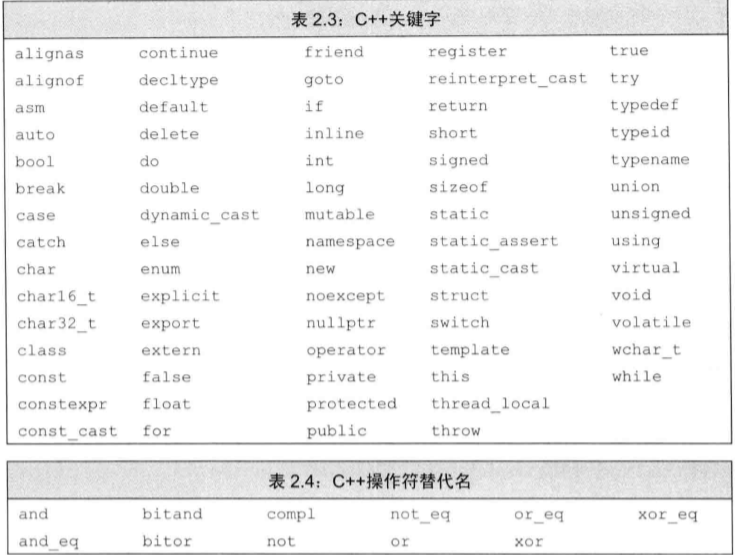
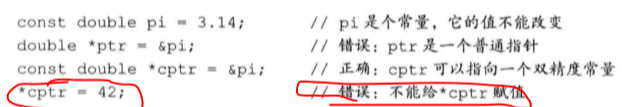

# 变量和基本类型

## 0 类型树

- 简单类型
  - 算术类型
    - 整型 int、long、bool、char
    - 浮点型 float、double
- 复合类型
  - 引用&a
  - 指针\*pointer
  - 数组 a[]
  - 字符串"hello world"
- 类类型
  - string
  - vector

## 1 基本内置类型

> 数据类型主要包含内置数据类型（算数类型（整型，浮点型），指针类型），自定义数据类型（vector=C 数组类型，string=C 字符串类型）

### 算术类型

- 布尔型
  bool 1

- 字符型  
  char 1  
  wchar_t 2  
  char16_t  
  char32_t

- 整型  
  short 2  
  int 4  
  long 4  
  long long 8

- 浮点型  
  float 4  
  double 8  
  long double 16

### 类型修饰符-signed 与 unsigned

> 常见的类型修饰符：signed、unsigned、long、short、const、static、extern、auto、register、mutable、thread_local、volatile、restrict

- signed 有符号
- unsigned 无符号

### 类型转换

- 强制类型转换  
  可能会丢失精度。
- 隐式类型转换  
  默认情况下会向上转换，即向位数更多的位置转换。
- 避免无符号和有符号的混用。带符号的数会自动转换成无符号的数。

### 字面值常量

- 整型字面常量
  不同进制指的是字面格式，其转化为存储格式时，都会变成二进制存储。不必担心十进制与二进制之间的运算。字面常量只是一种数字的表示方法。24，,024，,0x24。会自动选用尺寸最小的整型进行存储；负号是对字面值取相反数，不是字面值的一部分。
- 浮点型字面值常量
  默认情况下使用 double 存储。3.14,3.14E0,10e4
- 字符和字符串的字面常量
  'a'"adbd"字符串的字面值是由字符数组构成的。编译器会在每个字符串常量的末尾添加一个'\0'
- 转义序列
  \n\t\a\v\\\b\"\?\'\r\f  
  \7\0\12\115
- 可以指定字面值常量的类型。字面值会有默认的常量类型。
  常见前缀 u（Unicode 16）U（unicode32） L（宽字符） u8（utf-8）
  常见后缀 u/U（unsigned）,l/L（long）,ll/LL（longlong）,f/F（float）,

- bool 字面值：false，true
- 指针字面值：nullptr

## 2 变量

> 关于 C++中常见的描述总结：对象 object，存储数据并具有某种类型的内存空间。已经命名的对象叫变量。变量和对象通常通用。值表示只读的数据。变量和对象是可变的数据。

### 变量定义

- 类型说明符+名称+初始化。
- 初始值：可以直接初始化、复制初始化。不等同于赋值。
- 直接初始化：使用=进行初始化。
- 列表初始化：使用{}进行初始化。
- 默认初始化：变量没有被显示初始化。

### 初始化和赋值

- 初始化和赋值是两个不同点操作。使用等号能够表示赋值，也能够实现初始化。

```
    int d = 1;//直接初始化
    int e = {2};//直接初始化
    int f{3};//花括号列表初始化
    int g(4);//括号列表，列表初始化
```

### 变量的声明(extern)

- 分离式编译机制：声明和定义可以分离。声明使得程序可以被程序所知道，定义负责创建与名字关联的实体（变量空间）。多个文件可以独立编译。声明并没有申请对象空间（变量空间）。
- extern 可以声明，而不进行定义。变量可以被声明很多次，但只能被定义一次。不能再函数体中对 extern 声明的变量进行修改，extern 声明的变量只能是外部变量。
- 多次声明必须兼容，类型一致。

```
extern int i;//声明，但没有申请对象空间。
int j;//声明并定义了，申请了兑现该控件
```

### 静态类型语言

- 编译阶段，进行类型检查。

### 标识符与关键字。



### 作用域

- 名字在所有花括号之外，则成为全局作用域。
- 名字在其他作用与内，则成为块作用域。
- 内层作用域，外层作用域。

## 3 复合类型

### 引用
- 由基本类型组合而来。不能单独存在。
- int &ref=a.表示对 a 的引用。引用本身并非对象，只是已经存在的对象的别名
- 引用必须在定义的时候被初始化。
- 引用是变量的别名，具有同一个变量地址（变量空间）。
- 允许多个连续的引用
  int &r=i,r2=i2.表示 r 是 i 的引用，但 r2 是 int
- 连续定义必须都加引用符号。
  int &r=i,&r2=i2;
  > 编译过程解释：一般初始化的时候（变量定义），编译器会将一个值拷贝到新建的变量空间中，然后与变量绑定。引用变量在初始化的时候，不进行拷贝，而是将原来的变量空间与新的对象绑定在一起。

### 指针

- 实现了间接访问。本身是一个对象。与引用不同，指针有自己的变量空间。
- 允许对指针进行复制和 copy。
- int\* dp,dp1.其中 dp 是 int 指针，dp1 是 int 类型。
- 不能定义指向引用的指针，因为引用不是对象，没有内存空间。
- 连续定义，必须都加\*号

### 指针值的四种状态

- 指向一个对象；
- 指向紧邻对象所占空间的下一个位置；
- 空指针意味着指针没有指向任何对象；
- 无效指针，指针指向的位置被释放。

### 指针访问

- 利用指针运算符访问指针指向的对象（\*p）
- 空指针的生成方法

```
int *p1 = nullptr;
```

### void\*

- 可以存放任意对象的地址。

### 复合类型的声明

int \*p1,p2;
p1 是指向 int 的指针，p2 是 int 类型的。

### 指向指针的指针

int i=0;
int \*p1=&i;
int \*\*p2 = &p1

## 4 const 限定符

### 特点

- 它的值不能被改变。
- 仅在文件内有效。多个文件出现了同名的 const 变量时，等同于在不同文件中分别定义了独立变量。

### 使用

- const 的值是常量表达式，则直接在头文件中定义`const a = 3*5`，include 这个头文件就能使用 const a 的值。
- const 的初始值通过函数计算得出，不是常量表达式；const 变量需要在不同的文件间共享，需要在头文件中 extern 声明，在 cpp 文件中进行定义。
  

### const 引用

- const 引用，可以引用一个常量、变量，生成一个只读的变量。

```
int i =1;
const int &r2 =i;
```

### const 与指针

- “指向常量的指针”
  > 指针指向的值不能修改。

```
const double * cptr = &pi;
```



- 指向非常量的“指向常量的指针”

```
double a = 3;
const double *b = &a
```

- 指针常量。
  > 指针本身的地址不能被修改。

```
int n = 0;
int *const nptr = &n;
```

- 顶层 const 表示指针本身是个常量。
- 底层 const 表示指针所指向的对象是一个常量。

### 常量表达式

- 常量表达式值不会改变，并且在编译过程中就能得到计算结果的表达式。
- 字面值是常量表达式
- 用常量表达式初始化 const 变量也是常量表达式。

```
const int max = 20;//是
const int limt = max +1;//是
int a =27//不是，左值不是常量表达式
const int sz = get_size();//不是，右值不是常量表达式
```

## 5 处理类型

### 类型别名——typedef

- typedef 使用最后一个名词作为名字

```
typedef double hello;
typedef double* p;
typedef int h[81];
typedef　struct　tag
{
int　iNum;
long　lLength;
}MyStruct;//定义了结构体；typedef struct tag MyStruct
```

### 类型别名——using

- 类型别名和类型等价

```
using SI = Sales_item;
```

### auto 类型说明符

- 编译器自动分析类型

```
auto item = val1 +val2
```

## 6 自定义数据结构

### 定义一个类型。

```
struct data{
  std::string bookNo;
  unsigned sold = 0;
  double revenue = 0.0;
};
```

### 类成员

- 数据成员
- 成员函数

### 定义类的对象

```
data a,b;
```

### 访问类对象

```
a.sold =1;
```
## 7 常用限定符说明

### 存储类别
* auto 默认存储类别，自动变量int i = 3;
* static 静态存储类别的变量，静态变量static int m = 5;
* register 寄存器变量register n = 6;
* extern 声明外部链接属性
### 类型限定
* const限定：制度变量、常变量 const int i = 6;必须直接初始化，避免对重要手进行错误修改。
* volatile限定：隐式存取变量。