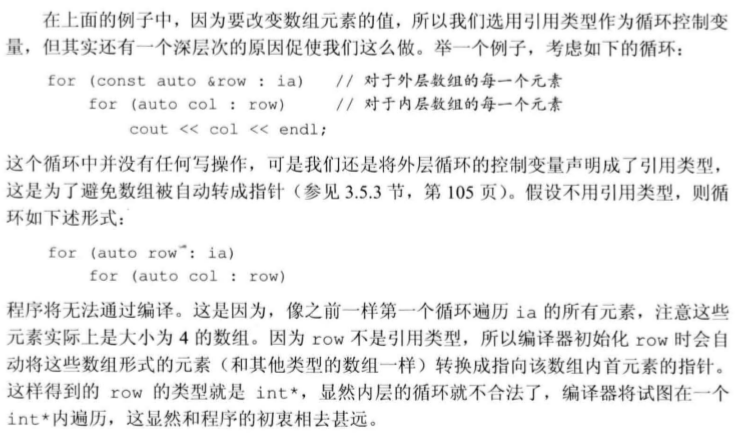

# 复合类型

## 1 引用
- 由基本类型组合而来。不能单独存在。
- int &ref=a.表示对 a 的引用。引用本身并非对象，只是已经存在的对象的别名
- 引用必须在定义的时候被初始化。
- 引用是变量的别名，具有同一个变量地址（变量空间）。
- 允许多个连续的引用
  int &r=i,r2=i2.表示 r 是 i 的引用，但 r2 是 int
- 连续定义必须都加引用符号。
  int &r=i,&r2=i2;
  > 编译过程解释：一般初始化的时候（变量定义），编译器会将一个值拷贝到新建的变量空间中，然后与变量绑定。引用变量在初始化的时候，不进行拷贝，而是将原来的变量空间与新的对象绑定在一起。

## 2 指针

### 指针的定义
- 实现了间接访问。本身是一个对象。与引用不同，指针有自己的变量空间。
- 允许对指针进行复制和 copy。
- int\* dp,dp1.其中 dp 是 int 指针，dp1 是 int 类型。
- 不能定义指向引用的指针，因为引用不是对象，没有内存空间。
- 连续定义，必须都加\*号

### 指针值的四种状态

- 指向一个对象；
- 指向紧邻对象所占空间的下一个位置；
- 空指针意味着指针没有指向任何对象；
- 无效指针，指针指向的位置被释放。

### 指针访问

- 利用指针运算符访问指针指向的对象（\*p）
- 空指针的生成方法

```
int *p1 = nullptr;
```

### `void*`

- 可以存放任意对象的地址。

### 复合类型的声明
```
int *p1,p2;
```
* p1 是指向 int 的指针，p2 是 int 类型的。

### 指向指针的指针
```
int i=0;
int *p1=&i;
int **p2 = &p1
```


## 3 数组

### 定义和初始化内置数组

```
int arr[10];//含有10个整型的数组
int *arr[20];//含有20个整形指针的数组。指针数组
int (*ptr)[10];指向含有是个整数的数组的指针。数组的指针（常量的指针和指针类型的常量类似）

string arr[10];//含有10个string对象的数组C++11允许数组为对象类型。
```

### 数组的初始化（仅有两种方法）

```
int arr[3]={1,2,3};
int arr[]={1,2,3,4};
char a3[]="c++"//自动添加表示字符串结束的空字符
```

### 数组的遍历

- C++11 数组也可以使用容器遍历（集合遍历）

```
//下标遍历
    int m[5]={1,2,3,4,5};
   for(int i=0;i<5;i++){
        cout<<m[i]<<endl;
    }
//容器遍历
    int k[] = {1,2,3};
    for (auto l:k){
        cout<<l<<endl;
    }

//迭代器遍历
    int m[5]={1,2,3,4,5};
    int* beg =begin(m);
    int* last = end(m);
    while(beg!=last){
        cout<<*beg<<endl;
        beg++;
    }
```

### 指针和数组

- 数组变量是指向数组第一个元素的指针。

```
string nums[]={"a","b","c"};
string *p2 = &num[0];
string *p3 = num;//相互等价
```

- 数组指针本身也是迭代器。可以使用 begin 函数和 end 函数，实现迭代器遍历。

```
int ia[]={1,2,3};
int *beg = begin(ia);
int *last = end(ia);
```

- 下标访问和指针运算等价

```
int ia[]={1,2,3};
ia[2];
*(ia+2);//相互等价
```


### 多维数组定义和初始化

* 列表初始化支持只初始化局部元素
```
int ia[2][3]={
    {1,2,3},
    {4,5,6}
};//等价
int ib[2][3]={1,2,3,4,5,6}//等价
```
### 多维数组的引用


```
ia[2][3]
```
### 多维数组的遍历
* 两层for循环处理多维数组
```
int ia[row_cnt][col_cnt]
for(int i=0;i<row_cnt;i++){
    for(int j=0;j<col_cnt;j++){
        ia[i][j];
    }
}
```

* 两层容器遍历，遍历多维数组。

```
    int ia[2][3] = {1, 2, 3, 4, 5, 6};
    //这里使用引用的原因是，数组在传递时候不能直接赋值！！！！
    //如果不加引用将会出现以下情况
    //auto row = ia[0]。但是数组没办法赋值。所以生成数组的一个引用
    //auto &row =ia[0]。相当于生成ia[0]指针的一个别名。
    //书上这么说，外层引用添加的原因，是防止第二层数组被当做指针使用。
    for (auto &row : ia)
    {
        for (auto col : row)
        {
            cout << col << endl;
        }
    }
```



## 字符串


### C 风格的字符串

> 尽量不要使用 C 风格的字符串.C++风格的字符串可以完全替代 C 风格的字符串，并且可以使用字符数组代替 C 风格的字符串。