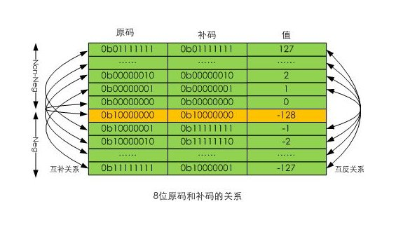

## 1 进位计数
### 数制
* 2进制----字面量0b
* 8进制----字面量0
* 10进制---无
* 16进制0x-字面量0x

### 数制转化
* r进制数转化成十进制
$$
I = a_{n-1}\times r^{n-1} + \cdots + a_0 \times r^0
$$
* 十进制整数转化r进制数——除r取余法
$$
\frac Ir=\frac{a_{n-1}\times r^{n-1}+ \cdots + a_0 \times r^0}{r} + \frac {a_0 \times r^0}{r}
$$
* 十进制小数转化r进制数——乘r取整法
$$
f = a_{-1} \times r^{-1} + a_{-(m-1)} \times r^{-(m-1)} + a_{-m} \times r^{-(m-1)}
$$

> 为什么十进制相对其他进制来说特殊，因为我们在计算的时候，加减乘除，全部都使用十进制的法则，所以十进制计算表达起来更简单。

## 2 数值编码

* $2^{n-1}$表示最高位是1
* $2^n$表示最高位的溢出位为1
### 原码
$$
(X)_y= 
\left\{
    \begin{array}{lr}
    X & 0 \leq X < 2^{n-1}\\
    2^{n-1} + |X| & -2^{n-1} < X \leq 0
    \end{array}
\right.
$$

* **关系说明：** 原码就是符号位加上真值的绝对值, 即用第一位表示符号, 其余位表示值. 

### 反码
$$
(X)_f= 
\left\{
    \begin{array}{lr}
    X & 0 \leq X < 2^{n-1}\\
    2^{n}-1 - |X| & -2^{n-1} < X \leq 0
    \end{array}
\right.
$$
* **关系说明：** 对于正数，反码等于补码；对于负数，反码数值位等于原码数值位按位取反。
### 补码
$$
(X)_b= 
\left\{
    \begin{array}{lr}
    X & 0 \leq X < 2^{n-1}\\
    2^{n} - |X| & -2^{n-1} < X \leq 0
    \end{array}
\right.
$$
* **关系说明：** 为了满足数值计算，使得正数负数能够在同一的编码下进行加减计算。正数的机器数，原码，反码，补码，都是在固定字长下讨论的负数的补码是在其原码的基础上, 符号位不变, 其余各位取反, 最后+1。机器中只有加法而没有减法。

### 说明
* 使用补码的原因：在二进制层面负数与整数可以直接相加
* 如果使用反码。正负数数值部分是绝对值的相加，负数加一个整数反而会变更小。数值部分增大，符号位不变，是一个更小的负数。
* 为了使负数数值位的大小与负数的大小一致，进行了反向映射，即取反操作。这样负数和正数就能直接进行数值位的加减法了。
* 如果使用原码，存在一个问题，会包含两个0.+0和-0。为了避免重复，在补码中，-0，数值位最少，表示最小的负数。
* 可以从形式上理解。补码的正数和负数的数值位。都是小的小，大的大。为了遵循数值位的加法操作。

### 浮点数

规格化数：
$$
eq = (-1)^s \times 2^E \times 1.f
$$
s-1位符号位，E-8位指数位，f-23位小数位。提供了24位的小数（二进制）小数的精度，-126~127的指数次（二进制）范围。

## 3 字符编码

### 西文字符
ASCII 使用7位而金子编码，0~127等128个字符

### 汉字字符
包括输入码、字形码、国标码、机内码
> 汉字机内码 = 汉字国标码 + 8080H = 区位码 + A0A0H
