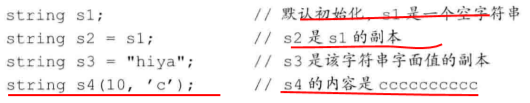
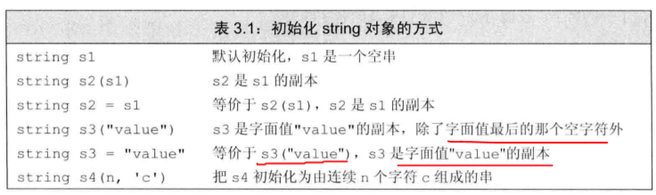
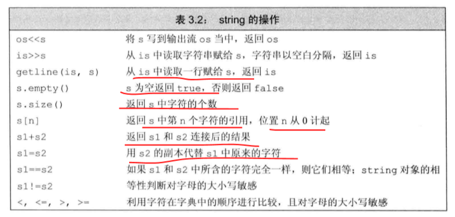
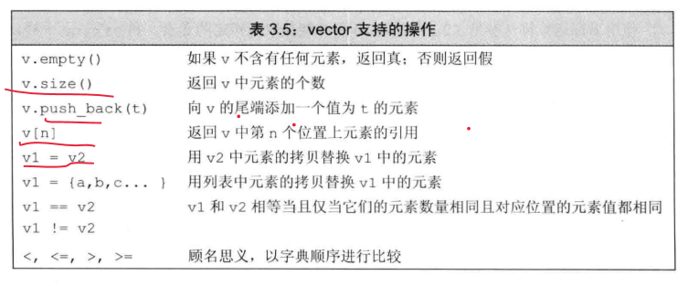

# 字符串、向量和数组

> 这里讲的是 C++中的处理，置于 C 中的字符串向量和数组，可以自己去复习。

## 1 命名空间的 using 声明

### 基本使用

```
//独立使用名字
using namespace::name;
//声明空间
using namespace
```

### 使用规则

头文件中不应包含 using 声明。因为会破坏包含该文件的源文件的命名空间。

## 2 标准库类型 string

### 定义和初始化 string 对象





- 默认初始化
- 直接初始化
- 复制初始化
- 函数初始化

### string 对象上的操作



### 处理 string 对象中的字符

- C++11 新特性的 for 容器遍历。

```C++
    string str("hello world!");
    for(auto c :str){
        cout<<c<<endl;
    }
```

- 使用下标遍历

```
    string s("helo");
    for(int index =0;index != s.size();++index){
        cout<<s[index];
        s[index]=toupper(s[index]);
    }
    cout<<s<<endl;
```

> 三种循环方式：while 条件循环；for 条件循环；for 容器循环。

## 3 标准库类型 vector

### 定义和初始化 vector 对象


- 直接初始化。不适用等号，而是使用{}
- 复制初始化。使用等号，进行初始化
- 函数初始化。使用小括号（），进行初始化，小括号内为参数。
- 列表初始化。使用中括号进行列表初始化。

### 向 vector 对象中添加元素

- 与 C 中初始化数组的方式一样，通过循环对 vector 进行初始化

```
    vector<int> p;
    for(int i=0;i!=100;i++){
        p.push_back(i);
    }
```

### 其他 vector 操作



- 使用下表访问 vector 元素的索引
- 不能使用下标形式向 vector 中添加元素

## 4 标准库迭代器 Iterator

### 迭代器的使用

```
    vector<int> v{1,2,3,4,5,6,7};
    auto b =v.begin(),e=v.end();

    while(b != e){
        cout<<*b<<endl;
        b++;
    }
```


- 使用特定的函数返回容器对象（集合对象）的迭代器
- 使用解引用操作返回迭代器指针指向的元素

### 迭代器运算


- 两个迭代器相减的结果使他们两个之间的距离，是一个整型常数，返回值不是一个迭代器。所以需要使用 beg+(end-beg)/2 来表示中间 mid 迭代器。end-beg 是一个整数。

```
    // 二分查找实例
    int aim =3;
    vector<int> text ={1,2,3,4,5,6};
    auto beg = text.begin(),end=text.end();
    auto mid = text.begin()+(end-beg)/2;
    while(mid != end && *mid != aim){
        if(aim<*mid){
            end=mid;
        }else{
            beg=mid+1;
        }
        mid =beg+(end-beg)/2;
    }
    cout<<mid-text.begin()<<endl;
```

