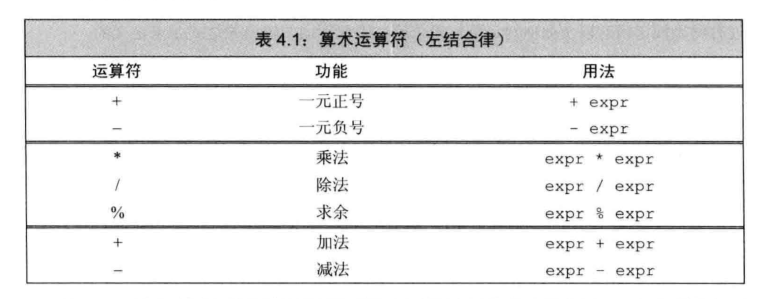
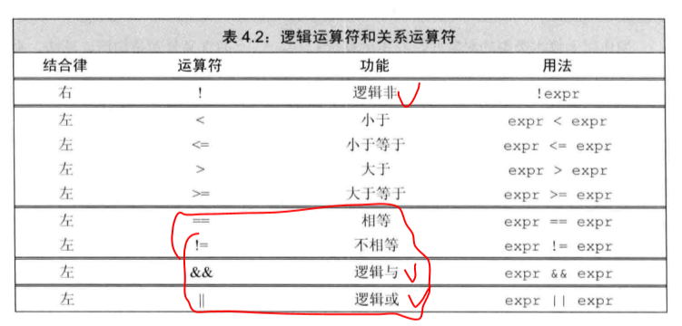
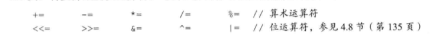
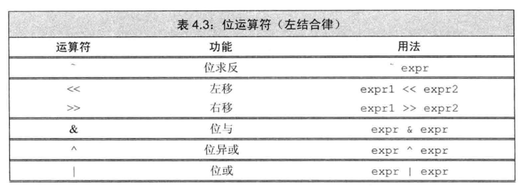
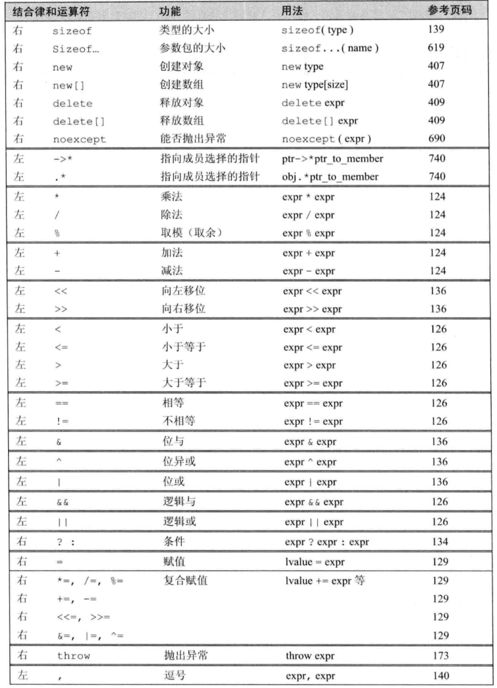

# 表达式

## 1 基础

### 组合运算

- 优先级
- 结合律

### 类型转换

### 运算符重载

### 左值和右值

## 2 算数运算符



## 3 逻辑和关系运算法



### 短路求值

- 逻辑与，当第一个判定为否的时候，不再执行第二个判定，可以用来屏蔽第二步的计算，代替条件判断！！！！！！！
- 逻辑或，当第一个判定为是的时候，不再执行第二个判定，可以用来屏蔽第二步的计算，代替条件判断！！！！！！！

当且晋档左侧的运算对象无法确定表达式的结果是，才会计算右侧运算对象的值！

## 4 赋值运算法



## 5 递增递减运算符

- 尽量使用前置版本的自增自减运算符。
- 后置递增运算符的优先级高于解引用的运算符。

```
*pb++ //等价于*(pb++)
```

## 6 成员访问运算符

- 点运算符。对象成员访问运算符。
- 箭头运算符。指针成员访问运算符。
- 解引用运算符的优先级抵御点运算符。所以解引用运算符的优先级很低。

```
*p.size();//相互等价*(p.size())
```

## 7 条件运算符

- ?:

## 8 位运算符

- 位运算符作用域证书类型的运算对象，并把运算对象看成二进制位的集合。



## 9 sizeof 运算符

## 10 逗号运算符

## 11 类型转换

### 隐式类型转换——算数转换

- 整形提升

### 其他隐式类型转换

- 数组转换成指针
- 转换成个布尔类型
- 转换成常量

### 显式转换——强制类型转换。

- static_cast 没有类型检查的强制类型转换。可以将 void\*转换为目标类型，更多的应用于指针的强制类型转换。

```
double d =10;
void * p = &d;
double *dp = static_cast<double *>(p)//然后正常使用dp。也可以转换为其他类型，取前一个字节或者四个字节。
```

- const_cast 去掉底层的 const
- reinterpret_cast 为运算对象的位模式提供较低层次上的重新解释。

### C 强制类型转换

```
type(expr);
(type)expr;
```

## 12 优先级



