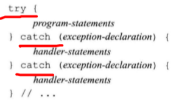

# 语句

### 分类
* 表达式语句
* 复合语句
* 选择语句
* 循环语句
* 跳转语句
* 声明语句
* try语句


## 1 简单语句

### 分类
* 表达式语句
* 空语句
* 分号
* 复合语句，用花括号括起来——也被称作块。一个块就是一个作用域。

## 2 语句作用域

## 3 条件语句

### if-else语句

### 嵌套if-else语句

### 悬垂else
else与离他最近的if匹配。从而消除程序的二义性。

### 使用花括号控制执行路径

### switch语句

### default标签


## 4 循环语句

### while语句
```
while(condition)
    statement
```
### dowhile语句
```
do 
    statement
while(condition)
```
### 传统for循环
```
for(init-statement;condition;expression)
    statement
```
### 范围for循环
```
for(delaration:expression)
    statement
```

### for_each循环

```
for_each(iterator begin,iterator end,func);
//使用lambda函数完成循环过程中的元素修改和处理
vector<int> vec;
for_each(vec.begin(),vec.end(),[](int& a){
    a=a+1;
    cout<<a<<endl;
    return;
})
```

## 5 跳转语句
```
break;
goto;
break;
continue;
```
## 6 try语句块

### 概述

异常处理机制主要包括以下内容

* throw表达式，引发raise抛出异常
* try-catch语句块try用来捕获异常，catch用来处理异常。
* 异常类。用于在throw表达式和catch子句之间传递具体的信息。

### throw 表达式

throw runtime_error("data must refer to ISBN")//抛出一个异常类。

### try语句块



* 只允许最多有一个catch捕获。捕获之后跳转到catch之后执行。


### 标准异常


