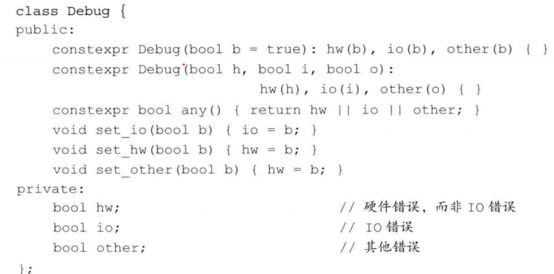

# 类

> 类的基本特性
>
> - 数据抽象和封装
> - 继承
> - 多态

## 1 定义抽象数据类型（抽象）

### 概念

- 数据抽象是一种依赖于接口和实现的分离的编程技术。
- 类的接口包括用户所能执行的操作；类的实现包括类的数据成员、负责接口实现的函数体以及定义类所需要的的各种私有函数。
- 封装实现了类的接口和实现的分离。

### 设计类

- 定义包含数据成员和成员函数
- 定义在类内部的函数是隐式的 inline 函数！

### this 指针

- this 指针。用来指明当前绑定的对象。只在依赖对象的函数中添加 this 指针。

### 常量成员函数

- 常量成员函数。const 关键字放在成员函数的参数列表之后。常量函数的 this 指针指向常量对象。不能对常量对象内数据进行修改。

```
class A{
    const int getM(){//表示返回值是const类型的

    }

    int getN() const{//表示函数是const类型的

    }
}
```

- 当一个函数被 const 说明后，其函数中出现的对外部数据的任何写入或修改都将被系统检查为出错。如果把函数 writeme()说明为：

```
void writeme(int i) const { me = i; } //系统将会检查出错误。
```

- 作用:当函数体较大且复杂时，如果我们希望系统帮助避免对对象内容进行修改，那么我们就会将这个函数定义为常量型函数，这就是使用它的主要目的。

### 构造函数

- 控制对象的初始化过程。只要类对象被创建就会执行构造函数。
- 构造函数没有返回类型。构造函数不能被声明成 const
- 默认构造函数没有任何实参。
- **合成的默认构造函数**。编译器隐式地创建的默认构造函数。合成默认构造函数初始化过程：
  - 如果类内存在初始值，使用它来初始化成员
  - 否则，默认初始化该成员。

```
hello{
    hello()=default;//要求编译器生成默认的构造函数。
}
```

### 构造函数的初始值列表

```
hello{
    heelo(int aa,int bb):a(aa),b(bb),c(0){

    };//列表初始化。
}
```

## 2 访问控制与封装（封装）

### 访问说明符

- public，对外部函数可见。
- private，被类成员访问，但不能被外部访问。private 部分封装了类的实现细节。

### 定义类

- class 和 struct 都能定义类。
- class 的默认访问控制是 private
- struct 的默认访问控制是 public

### 友元

- 类的接口可以不是类的成员。下图中，print、add、read 是类的接口但是不是类的成员。被称作非成员接口函数。


- 非成员接口函数无法访问类的私有变量。可以声明友元，访问私有变量。友元的声明智能出现在类定义的内部。友元是突破访问控制符的方法。


- 友元也为多种形式的接口提供了方法。比如可以重载上述的 read 函数，让它成为多个不同的类友元。可以实现一个接口在多种不同情况下的使用。

## 3 类的其他特性

- 类内的函数可以被声明为内联函数
- 成员函数可以被重载。
- （日了狗了，真 TM 特例也太多了吧，有必要吗）可变成员函数，mutable 声明的变量，是可变数据成员。即是是 const 对象的成员，它也是可变数据成员，依然能够改变。

### 类类型

- 类通过类名来标识。如果两个类的内容完全一致，但是类名不一样，也无法相互赋值。
- 两种创建对象的方法

```
Hello h;
class Hello h;//包含关键字class创建对象。两者等价。
```

- 类可以进行前向声明，而不进行定义。他是一个不完全的类型。

```
class Hello;
```

- 在创建类的对象之前,类必须被定义。所以如果要引用其他头文件中的类，类必须在该头文件就被定义，否则没办法创建对象进行连接。

- 其他类、类成员都可以声明为类的友元。


## 4 类的作用域

- 在类的作用域外，通过对象、引用、指针，使用成员访问运算符访问。
- 在类外定义函数，需要指明类作用域，使用作用域运算符::实现类内的函数。函数体内可以直接使用类作用域内的内容。函数体外的返回值通过作用域运算符使用类作用域内的内容。

### 名字查找与类的作用域

名字查找的步骤
* 作用域内查找使用之前的声明。
* 查找外层作用域的声明
* 如果没找到报错。

类内名字查找比较特殊。
* 首先编译成员声明。
* 然后编译函数体。
* 所以即使类的成员声明在类的末尾，对之前的函数来说也是可见的。

成员定义中普通块作用域的名字查找

* 首先在成员函数内查找声明。
* 类内查找。所有的类成员都被考虑。
* 在成员函数定义之前的作用域内查找。

## 5 构造函数与初始化

* 当成员是常量或引用的时候，初始化是必不可少的。
* 成员初始化的书序与他们在类定义中的出现顺序一致。而非初始化列表中传入参数的顺序。

### 委托构造函数
* 委托构造函数使用类的其他构造函数执行自己的初始化过程。


初始化执行的顺序

1. 初始化列表
2. 委托构造函数
3. 初始化函数体
4. 值初始化。（在成员变量定义的时候给出的值）
5. 默认初始化（以上情况都没有的时候）

### 默认构造函数的作用


默认初始化在一下情况发生：
* 块作用域内不适用任何初始值定义一个非静态变量
* 一个类本身含有类类型的成员其而是用合成的默认构造函数时。（包含关系的外部合成默认构造函数会自动调用内部的默认构造函数。）如果有自定义的默认构造函数，需要自己手动初始化内部默认构造函数。
* 类类型的成员没有在构造函数的初值列表中显式的初始化。

值初始化在一下情况发生
* 数组初始化过程中，提供的初始值很少。
* 不适用初始值顶一个局部静态变量。
* 使用T()表达式，显式的请求值初始化。

### 抑制构造函数定义的隐式转换。

* 使用explicit关键字。将函数声明为explicit。

```
class Hello{
public
    Hello()=default;
    explic Hello(const string s){}
}
```
* explicit构造函数只能用于直接初始化。
* 可以使用显式的强制类型转换。

### 聚合类

* 用户可以直接访问其成员。具有特殊的初始化语法形式。
  * 所有成员都是public
  * 没有定义任何构造函数
  * 没有类内初始值
  * 没有基类。

* 使用花括号括起来的成员初始值列表。并用它初始化聚合类的数据成员。


### 字面值常量类
* 数据成员都是字面值类型的聚合类。是字面值常量类。
  * 数据成员必须都是字面值类型。
  * 类必须至少有一个constexpr构造函数。
  * 内置类型成员初始值必须是常量表达式。
  * 类必须使用关系够函数的默认定义。




## 6 类的静态成员

与类本身直接相关，而不是与类的各个对象保持关联。

### 声明静态成员


### 使用静态成员


* 使用作用域运算符访问静态成员

```
double r = Account::rate();
```
* 使用对象、引用、指针访问静态成员

```
Account a,*b=&a;
a.rate();
b->rate;
```
* 成员函数可以直接访问静态成员。

### 定义静态成员

* 不能再类的内部初始化惊天成员。必须在类的外部定义和初始化静态成员。静态数据成员智能被定义依稀。