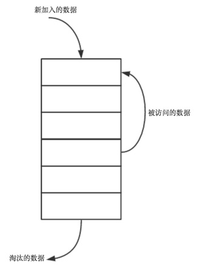

## lru最近最少使用算法

对于web开发而言，缓存必不可少，也是提高性能最常用的方式。无论是浏览器缓存，还是服务端的缓存(通过memcached或者redis等内存数据库)。缓存不仅可以加速用户的访问，同时也可以降低服务器的负载和压力。那么，了解常见的缓存淘汰算法的策略和原理就显得特别重要。

### 常见的缓存算法
* LRU (Least recently used) 最近最少使用，如果数据最近被访问过，那么将来被访问的几率也更高。
* LFU (Least frequently used) 最不经常使用，如果一个数据在最近一段时间内使用次数很少，那么在将来一段时间内被使用的可能性也很小。
* FIFO (Fist in first out) 先进先出， 如果一个数据最先进入缓存中，则应该最早淘汰掉。

### LRU缓存
像浏览器的缓存策略、memcached的缓存策略、Redis缓存策略都是使用LRU这个算法，LRU算法会将近期最不会访问的数据淘汰掉。LRU如此流行的原因是实现比较简单，而且对于实际问题也很实用，良好的运行时性能，命中率较高。下面谈谈如何实现LRU缓存：



1. 新数据插入到链表头部
2. 每当缓存命中（即缓存数据被访问），则将数据移到链表头部
3. 当链表满的时候，将链表尾部的数据丢弃

### LRU Cache具备的操作：

* set(key,value)：如果key在hashmap中存在，则先重置对应的value值，然后获取对应的节点cur，将cur节点从链表删除，并移动到链表的头部；若果key在hashmap不存在，则新建一个节点，并将节点放到链表的头部。当Cache存满的时候，将链表最后一个节点删除即可。
* get(key)：如果key在hashmap中存在，则把对应的节点放到链表头部，并返回对应的value值；如果不存在，则返回-1。

### LRU的c++实现
LRU实现采用双向链表 + Map 来进行实现。这里采用双向链表的原因是：如果采用普通的单链表，则删除节点的时候需要从表头开始遍历查找，效率为O(n)，采用双向链表可以直接改变节点的前驱的指针指向进行删除达到O(1)的效率。使用Map来保存节点的key、value值便于能在O(logN)的时间查找元素,对应get操作。


* 使用std::list<>双向链表存储value，主要是符合LRU的业务场景：1首/尾进行插入、删除；2中间位置的删除。其中第②点很重要。
* 使用std::unordered_map<>是为了优化查找。此数据结构查找效率O(1)。
* 注意对链表std::list<>的earse操作，特别是迭代器失效的问题。

```C++
// 最近最少缓存算法（key,value）
class LRUCache
{
private:
    // 1、list双向链表
    std::list<std::pair< int, int> > _list;

    // 2、使用unordered_map
    // 由于需要快速定位链表的结点，故在map中使用value字段来存储链表的结点，这里是使用了迭代器。
    std::unordered_map< int, std::list<std::pair<int, int>>::iterator > _map;
    unsigned int _capacity; 
public:
    LRUCache(unsigned int capacity):_capacity(capacity)
    {
    }
    // 获取
    int get(int key);
    // 设置
    void set(int key, int value);
};


// 设置
void LRUCache::set(int key, int value)
{
    // 1、查询是否在缓存中
    auto iteramap = _map.find(key);
    if(iteramap != _map.end()){
        // 2、在缓存中，需要在链表中擦除。
        _list.erase(iteramap->second);
        // 3、把数据放到链表头
        _list.push_front(std::pair<int, int>(key, value));
        _map[key] = _list.begin();
    }else{
        if(_map.size() >= _capacity){
            // 4、缓存已经满了
            // 4.1 hash处要删除
            _map.erase(_list.back().first);
            // 4.2 链表也要删除尾巴部分
            _list.pop_back(); 
        }
        // 5、双向链表首结点插入
        _list.push_front(std::pair<int, int>(key, value));
        // 6、在hash中增加
        _map[key] = _list.begin();
    }   
}


// 获取:根据key，获取缓存的value
int LRUCache::get(int key)
{
    // 1、先从hash中查找
    auto iteramap = _map.find(key);
    if(iteramap == _map.end()){
        // 没找到,TODO
        return -1;
    }
    // 2、如果在缓存中，需要把数据放到链表头部。
    _list.push_front(std::pair<int, int>(key,  iteramap->second->second));
    _list.erase(iteramap->second);
    
    // 3、hash原来存储的失效，需要重新设置
    _map[key] = _list.begin();
    
    // 4、返回value值
    return iteramap->second->second;
}
```


