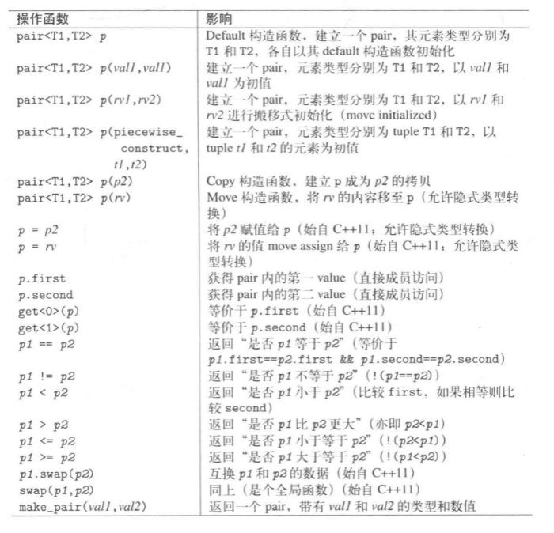
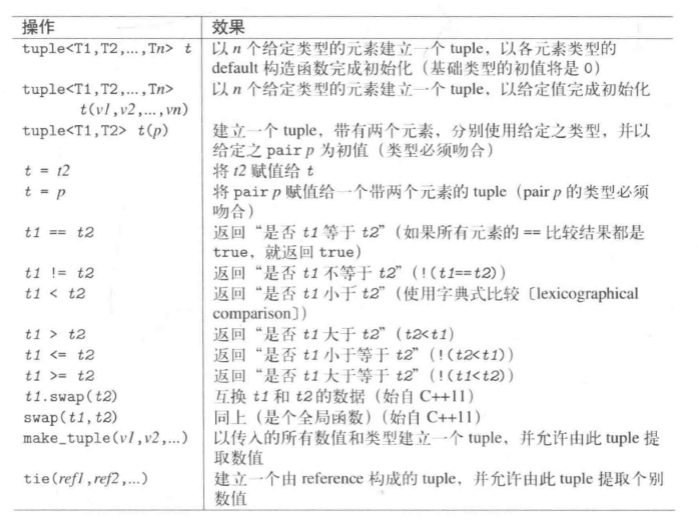
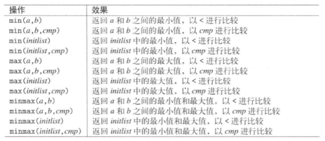
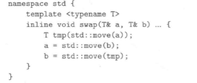
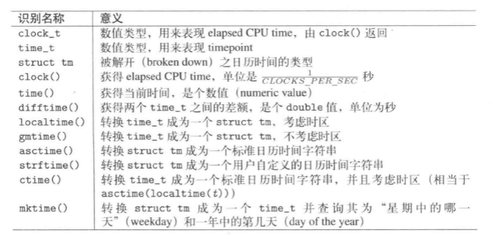
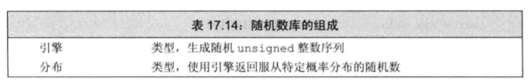
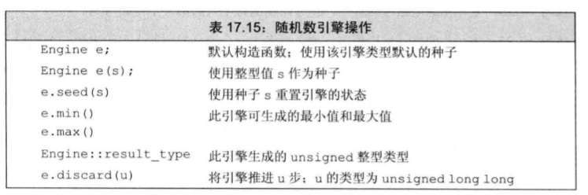

# 通用工具

> 目录
> * pair和tuple
> * 智能指针
> * 数值极值
> * type trait 和type utility
> * 辅助函数
> * clock和timer
> * bitset
> * 随机数


## 1 pair和Tuple

## 1.1 pair
### 头文件
```
#include<utility>
```
### pair定义


### pair操作



## 1.2 tuple
### 头文件
```
#include<tuple>
```
### 定义
* 扩展pair的概念，拥有任意数量的元素。是一个异质的元素序列。


### 操作


```
tuple<int,float,string> t1{2,3.4,"yin"};
get<1>(t1);//获取t1的第一个元素
make_tuple(22,44,"helo");//元素类型自动推导
```


## 2 smart pointer 智能指针

> 动态内存分配中有。

### 头文件

```
#include<memory>
```

## 2.1 shared_ptr
## 2.2 weak_ptr
## 2.3 unique_ptr

## 3 极值

### 头文件
```
#include<limits>
```


### 使用

```
#include<limits>

using namespace std;

int main(){
    cout<<numeric_limits<short>::max()<<endl;//输出short类型最大值
}
```

## 4 type trait和type utility

## 5 辅助函数

### 最大最小值
```
#include<algorithm>
```


### 交换
```
#include<utility>
```


## 6 class ratio编译期分数

## 7 Clock和Timer

## 7.1 Chrono概览
> 相关术语：duration,timepoint,tick,epoch,lock,timer,date,time。chrono目标处理timer和clock在不同系统中更可能不同的问题。强化实践的精准度。

### 头文件

```
#include<chrono>//额外的是艰苦
```

### 术语
* duration时间段，某个时间单位上，tick数。
* timepoint时间点，duration和epoch（起始点）的组合。
* clock时钟，每个时钟都有自己的epoch（起始点——）

## 7.2 Duration时间段

### duration定义的时间单位

```
//自定义时间单位
std::chrono::duration<double,std::ratio<60>>

//定义好的时间单位
nanoseconds;
microseconds;
milliseconds;
seconds;
minutes;
hours;
```


## 7.4 C、POSIX

### 头文件
```
#include<ctime>
```

### 常用操作



## 8 bitset类型

### 头文件

```
#include<bitset>
```

### 定义和初始化
```
bitset<32> bitvec(1U);
```
* 编号从0开始的二进制位被称为低位。编号31结束的二进制位被称为高位。


### bitset操作
* bitset支持位运算


## 9 随机数

### 头文件

```
#include<random>
```
### 随机数库的组成



### 随机数引擎的操作


* 编译器会自动选择一个随机数引擎作为default_random_engine的类型的引擎。
```
    default_random_engine e;
    cout<<e()<<endl;
```

### 随机数分布的操作

* 需要给默认的随机数引擎选择一个分布序列。
```
uniform_int_distribution<unsigned> u<0,9>;
default_random_engine e(323);//指定初始化的种子
e.seed(323);
```


* 常见的随机分布类型
```
uniform_real_distribution<>
```