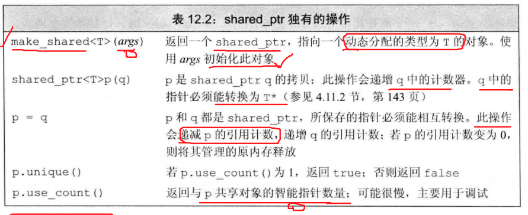
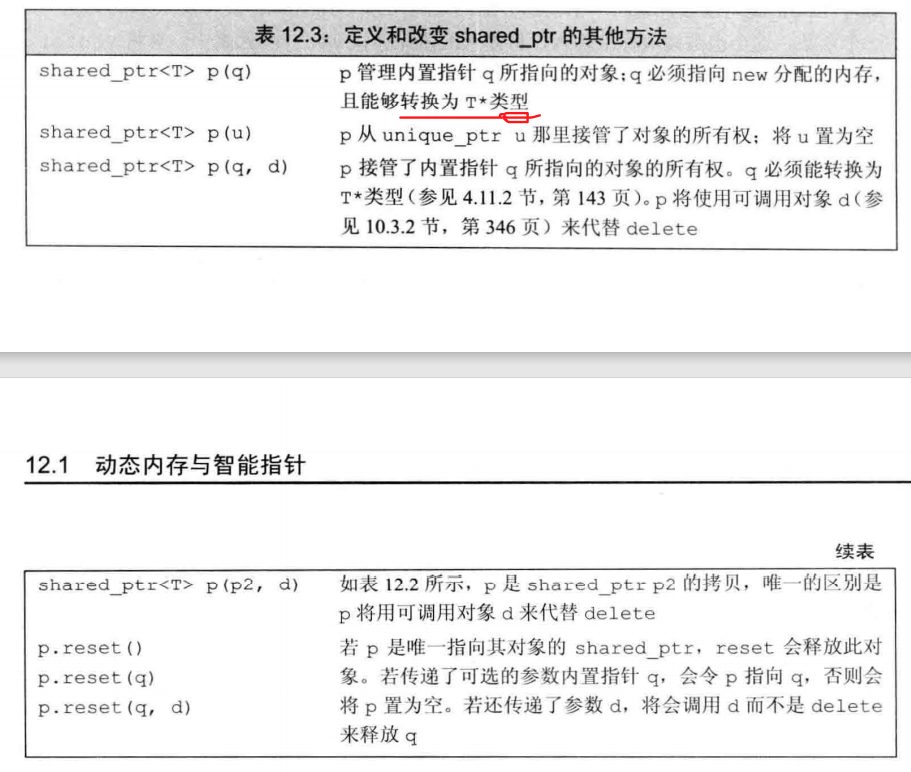
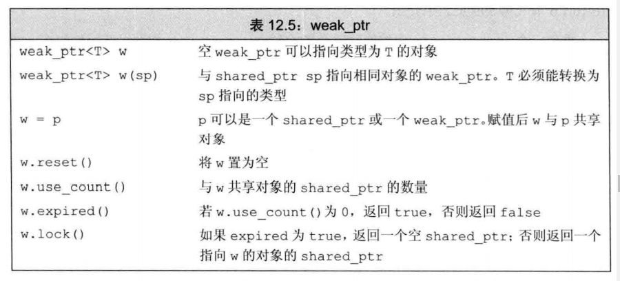

# 动态内存

> 存在的问题：栈空间和堆空间的分配也是运行时内存分配，即动态内存分配。文字常量区、全局变量和静态变量区是在编译时内存分配，即静态内存分配。
> 
> 栈空间的动态内存分配由操作系统管理。堆空间的动态内存分配由用户自身管理。二者可以交叉使用。
> 
> 例如：使用栈空间无法返回局部对象，只能返回局部对象的复制（重写复制构造函数），比较麻烦，可以返回堆空间申请一个对象，并返回指向该对象的指针。
> 
> 例如：使用堆空间，对象的释放需要自己管理，可以在栈空间创建一个局部对象，在其内部封装申请和释放堆空间的方法。当栈空间的局部对象被销毁时，调用析构函数，清除堆空间的对象。这也是allocator和智能指针的实现方案。（allocator一般使用栈对象的析构函数，销毁堆对象的空间。智能指针一般通过引用计数的方法销毁堆对象。）
> 
> 关于汇编语言程序有两种方法进行动态分配：
> 方法一：通过系统调用从操作系统获得内存块。（linux/windows操作系统提供了alloc方法和heap方法。在当前的进程中，后者用来申请新的私有堆，前者用来在已有的堆空间上申请内存。）
> 方法二：实现自己的堆管理器来服务更小的对象提出的请求。

## 0 C++直接管理内存

### 概念

* C++使用new分配内存，使用delete释放new分配的内存。
* 动态对象的声明周期从创建到被释放时为止。


### 使用动态内存的原因
> 既然这么多风险为什么要使用动态内存
1. 程序不知道自己需要使用给多少对象。动态循环创建多个对象。（容器，包括字符串string，都是使用动态内存管理自身的存储。）
2. 程序不知道所需对象的准确类型。运行过程中创建对象。
3. 程序需要在多个对象间共享数据。多个对象共享相同的状态。


### 申请内存

* new无法围棋分配的对象命名，而是返回一个指向该对象的指针。
```
int * p = new int;
```
* 动态分配的对象执行默认初始化操作。内置类型和组合类型的对象是未定义的。类类型的对象使用默认构造函数进行初始化。

* 可以动态分配const对象
```
const int * pci = new const int(1024);
```
* 内存耗尽后，new表达式会失败。抛出bad_alloc异常。

### 释放内存
* 使用delete来释放内存。将动态内存归还给系统。
* delete指针必须指向动态分配的内存，或一个空指针。
* 释放一块非new分配的内存，或者将相同的指针释放多次，行为是未定义。产生错误。
* delete对象之后，指针指向的地址被释放了，指针无效。但是指针依旧保存着原先的地址。编程**悬空指针**。

> 所有可变长度的容器，都有自己的allcator实现动态内存管理，不需要自己手动申请和释放内存。


### new和delete的工作机理
* 当我们使用new表达式分配内存时，实际上执行了三个步骤。
  1. 是调用名为operator new（或者 operator new[]）的标准库函数。该函数分配一块原始的足够大的未构造内存
  2. 编译器运行构造函数构造对象
  3. 返回一个指向该对象的指针
* 同样的，delete则执行两个步骤:
  1. 倒序执行对象的析构函数
  2. 调用 operator delete或(operator delete[])标准库函数释放内存空间

## 1 动态内存与智能指针
> 所以智能指针使用过来做动态内存管理的。普通的局部变量及其指针，不需要智能指针。智能指针是辅助new delete来管理动态内存的。智能指针就是为了解决一下问题。


### 两个问题
指针直接管理内存存在两个问题：

1. 没有释放内存，导致内存泄露。
2. 访问已经释放的内存，引起引用非法内存的指针。

### 智能指针

* share_ptr 允许多个指针指向同一对象
* unique_ptr 独占所指向的对象

* weak_ptr伴随类。弱引用。指向shared_ptr所管理的对象。

### 头文件
```
#include<memory>
```
### 智能指针的基础操作


### 智能指针陷阱

> 智能指针本质上不是个指针，是对动态分配的内存的指针的管理，可以通过get函数得到指向动态内存的普通指针。

* 不能使用相同的内置指针初始化多个智能指针
* 不能delete get()返回的普通指针
* 不能用get()返回的指针初始化或reset另一个智能指针。
* 如果使用智能指针管理的资源**不是new分配的内存**，传递给他一个删除器。（new分配的动态内存对应的删除器是delete）
* 当两个智能指针指向的对象相互使用一个shared_ptr成员变量指向对方，会造成循环引用，使引用计数失效，从而导致内存泄漏。例如他们同时超出作用域，但是因为相互之间还保留一次引用计数，而没有办法销毁任何一个。
### 智能指针概述

* 智能指针主要用于管理在堆上分配的内存，它将普通的指针封装为一个栈对象。当栈对象的生存周期结束后，会在析构函数中释放掉申请的内存，从而防止内存泄漏。
* C++ 11中最常用的智能指针类型为shared_ptr,它采用引用计数的方法，记录当前内存资源被多少个智能指针引用。**该引用计数的内存在堆上分配**。当新增一个时引用计数加1，当过期时引用计数减一。只有引用计数为0时，智能指针才会自动释放引用的内存资源。对shared_ptr进行初始化时不能将一个普通指针直接赋值给智能指针，因为一个是指针，一个是类。可以通过make_shared函数或者通过构造函数传入普通指针。并可以通过get函数获得普通指针。

## 2 动态内存管理shared_ptr
### shared_ptr的操作




### make_shared申请内存

* 最安全的使用动态内存的方法，调用make_shared标准库函数。在动态内存中分配一个对象，并初始化。返回shared_ptr.
```
    shared_ptr<int> pn = make_shared<int>(42);
    auto pn = make_shared<int>(42);
```

### shared_ptr拷贝和引用计数

* shared_ptr 都有一个关联的计数器。引用计数。每次copy一个shared_ptr，计数器都会递增。例如将它作为参数传递给一个函数，或者作为函数的返回值。
* 一旦一个shared_ptr的计数器变为0.它就会自动释放自己所管理的内存。使用析构函数，销毁自身。
* 所以当它为局部变量，并且退出局部作用域后，所有的指针变量自动销毁，其所对应的动态分配的内存对象的引用计数就回变为零，此时动态内存会自动销毁。


### shared_ptr和new申请内存
* shared_ptr可以使用make_shared创建对象。也可以使用new返回的指针来初始化智能指针。此时不需要delete来释放。

```
shared_ptr<int> p2(new int(42));
shared_ptr<int> p3 = new int{42};
```
### shared_ptr的其他方法
* shared_ptr的赋值、权限转移和清空。

* 不能试用get初始化另外一个智能指针，也不能用get为智能指针赋值。

* 我们智能使用reset将智能指针指向其他的对象，不能将一个新的对象直接赋值给已经初始化的智能指针。reset函数会更新对象的引用计数，使其指向新的动态内存。

```
shared_ptr<int> = new int;
p = new int(23);//错误，不能直接赋值。
p.reset(new int(1024));//p指向一个新的对象。
```

### 智能指针和异常
* 当触发异常后，局部变量在销毁的时候也会正常出发智能指针的销毁。

## 3 动态内存管理 unique_ptr


* unique_ptr。某个时刻只能有一个unique_ptr只有一个给定的对象。当unique_ptr被销毁时，它所指向的对象也被销毁。
* unique_ptr需要绑定到一个new返回的指针上。直接将指针置为空，指针指向的对象就会被释放。可以使用delete释放unique_ptr
* unique_ptr不支持普通的拷贝和赋值操作。但是可以拷贝或赋值一个将要被销毁的unique_ptr.例如return unique_ptr。实现控制权转移
```
unique_ptr<int> clone(int p){
    return unique_ptr<int>(new int(p));
}//返回了一个动态内存的unique_ptr
```
* 可以release放弃控制权，把控制权移交给新的智能指针。实现动态内存的控制权转移。
```
unique_ptr<int> m=new int;
unique_ptr<int> n = m.release();//m放弃所有权转移给n
```
## 4 动态内存管理weak_ptr
* 不控制所指向对象生存期的智能指针。它指向一个由shared_ptr管理的对象。
* 将weak_ptr绑定到shared_ptr上不会改变shared_ptr的引用计数。当shared_ptr被销毁，对象就回被释放。



* 使用shared_ptr初始化weak_ptr

```
shared_ptr<int> p = make_shared<int>(42);
weak_ptr<int>wp(p);
```
* 由于weak_ptr指向的对象可能不存在，使用lock检查weak_ptr指向的对象是否存在。

```
if(shared_ptr<int>np = wp.lock()){

}
```

### 总结
> 智能指针的操作包括：初始化、解引用、赋值,reset，get。其中赋值操作是一个特例，其他操作都一致：
> * shared_ptr能在两个智能指针之间赋值。reset可以将智能指针指向新的动态内存对象。不能直接将新的动态内存对象赋值给智能指针。
> * unique_ptr不能再两个智能指针之间赋值，但可以在即将销毁的智能指针之间赋值。不能直接将新的动态内存对象赋值给智能指针。reset可以将智能指针指向新的动态内存对象。
> * weak_ptr能将shared_ptr和weak_ptr赋值给weak_ptr;不能将新的动态内存对象赋值给智能指针。reset会将指针置为空。


## 5 动态数组

### 初始化动态内存数组
```
int * pia = new int[10];//默认初始化
int * pia2= new int[10]();//值初始化
int * pia3 = new int[10]{1,2,3,4,54,6,7,8,6,5};
```
* 申请一个大小为0的动态数组是合法的。直接定义一个大小为0的数组是不合法的。

### 释放动态数组

delete [] pa;

### 智能指针和动态数组

* unique_ptr动态数组版本

```
unique_ptr<int[]> up(new int[10]);
up.release();
```


## 5 allocator动态内存

### 简介
* new将动态内存分配和对象构造组合在了一起。也就是说，分配动态内存的时候，必须确定这块内存上的对象。
* allocator能够将内存分配和对象构造分离。
* 在头文件`<memory>`中

### 操作
* 主要操作如下


```
allcator<string> alloc;
auto const p = alloc.allocate(n);//分配n个未初始化的string
auto q = p;
alloc.construct(q++);//*q为空字符串
alloc.construct(q++,10,'c');//*q为cccc
alloc.deallocate(p,n)
```
### allocator算法
* 标准库为allocator定义了两个伴随算法。


### allocator 原理

* STL的分配器用于封装STL容器在内存管理上的底层细节。在C++中，其内存配置和释放如下：

* new运算分两个阶段：
  1. 调用::operator new配置内存;
  2. 调用对象构造函数构造对象内容

* delete运算分两个阶段：
  1. 调用对象希构函数；
  2. 调用::operator delete释放内存

* 为了精密分工，STL allocator将两个阶段操作区分开来：内存配置有alloc::allocate()负责，内存释放由alloc::deallocate()负责；对象构造由::construct()负责，对象析构由::destroy()负责。

* 同时为了提升内存管理的效率，减少申请小内存造成的内存碎片问题，SGI STL采用了两级配置器，当分配的空间大小超过128B时，会使用第一级空间配置器；当分配的空间大小小于128B时，将使用第二级空间配置器。第一级空间配置器直接使用malloc()、realloc()、free()函数进行内存空间的分配和释放，而第二级空间配置器采用了内存池技术，通过空闲链表来管理内存。


## 6 实例——allocator的简单实现

```C++
#ifndef __JJALLOC__
#define __JJALLOC__
#include<new> // for placement new
#include<iostream> //for cerr
#include<cstddef>  //for ptrdiff_t
#include<cstdlib> // for exit()
#include<climits> // for UINT_MAX
namespace JJ{
    template<class T>
    inline T* _allocate(ptrdiff_t size, T*){
        //set_new_handler(0);
        T* tmp = (T*)(::operator new)((size_t)(size * sizeof(T)));
        if (tmp == 0){
            std::cerr << "out of memory" << std::endl;
        }
        return tmp;
    }
    template<class T>
    inline void _destory(T* ptr){
        ptr->~T();
    }


    template<class T>
    inline void _deallocate(T* buffer){
        ::operator delete(buffer);
    }

    template<class T1,class T2>
    inline void _construct(T1 *p, const T2 &value){
        new(p)T1(value);
    }
    template <class T>
    class allocate{
    public:
        typedef T value_type;
        typedef T* pointer;
        typedef const T* const_pointer;
        typedef T& reference;
        typedef const T& const_reference;
        typedef size_t size_type;
        typedef ptrdiff_t diference_type;

        template<class U>
        struct rebind{
            typedef allocator<U> other;
        };

        pointer allocate(size_type n, const void * hint = 0){
            return _allocate((difference_type)n, (pointer)0);
        }
        void deallocate(pointer p, size_type n){
            _deallocate(p);
        }

        void construct(pointer p, const_reference value){
            return _construct(p, value);
        }

        void destroy(pointer p){
            _destroy(p);
        }
        pointer address(reference x){
            return (pointer)&x;
        }
        pointer const_address(const_reference x){
            return (const_pointer)&x;
        }

        size_type max_size()const{
            return (size_type)(UINT_MAX / sizeof(T));
        }
    };
}
```
## 7 实例——shared_ptr的简单实现

```C++
template <typename T>
class SmartPtr
{
private:
    T *ptr; //底层真实的指针

    int *use_count; //保存当前对象被多少指针引用计数

public:
    SmartPtr(T *p); //SmartPtr<int>p(new int(2));

    SmartPtr(const SmartPtr<T> &orig); //SmartPtr<int>q(p);

    SmartPtr<T> &operator=(const SmartPtr<T> &rhs); //q=p

    ~SmartPtr();

    T operator*(); //为了能把智能指针当成普通指针操作定义解引用操作

    T *operator->(); //定义取成员操作

    T *operator+(int i); //定义指针加一个常数

    int operator-(SmartPtr<T> &t1, SmartPtr<T> &t2); //定义两个指针相减

    void getcount() { return *use_count }
};

// int SmartPtr<T>::operator-(SmartPtr<T> &t1, SmartPtr<T> &t2) { 
//     return t1.ptr - t2.ptr; 
// }

template <typename T>
SmartPtr<T>::SmartPtr(T *p)
{
    ptr = p;
    try
    {
        use_count = new int(1);
    }
    catch (...)
    {
        delete ptr; //申请失败释放真实指针和引用计数的内存

        ptr = nullptr;
        delete use_count;
        use_count = nullptr;
    }
}
template <typename T>
SmartPtr<T>::SmartPtr(const SmartPtr<T> &orig) //复制构造函数

{

    use_count = orig.use_count; //引用计数保存在一块内存，所有的SmarPtr对象的引用计数都指向这里

    this->ptr = orig.ptr;

    ++(*use_count); //当前对象的引用计数加1
}
template <typename T>
SmartPtr<T> &SmartPtr<T>::operator=(const SmartPtr<T> &rhs)
{
    //重载=运算符，例如SmartPtr<int>p,q; p=q;这个语句中，首先给q指向的对象的引用计数加1，因为p重新指向了q所指的对象，所以p需要先给原来的对象的引用计数减1，如果减一后为0，先释放掉p原来指向的内存，然后讲q指向的对象的引用计数加1后赋值给p

    ++*(rhs.use_count);
    if ((--*(use_count)) == 0)
    {
        delete ptr;
        ptr = nullptr;
        delete use_count;
        use_count = nullptr;
    }
    ptr = rhs.ptr;
    *use_count = *(rhs.use_count);
    return *this;
}
template <typename T>
SmartPtr<T>::~SmartPtr()
{
    getcount();
    if (--(*use_count) == 0) //SmartPtr的对象会在其生命周期结束的时候调用其析构函数，在析构函数中检测当前对象的引用计数是不是只有正在结束生命周期的这个SmartPtr引用，如果是，就释放掉，如果不是，就还有其他的SmartPtr引用当前对象，就等待其他的SmartPtr对象在其生命周期结束的时候调用析构函数释放掉

    {
        getcount();
        delete ptr;
        ptr = nullptr;
        delete use_count;
        use_count = nullptr;
    }
}
template <typename T>
T SmartPtr<T>::operator*()
{
    return *ptr;
}
template <typename T>
T *SmartPtr<T>::operator->()
{
    return ptr;
}
template <typename T>
T *SmartPtr<T>::operator+(int i)
{
    T *temp = ptr + i;
    return temp;
}
```