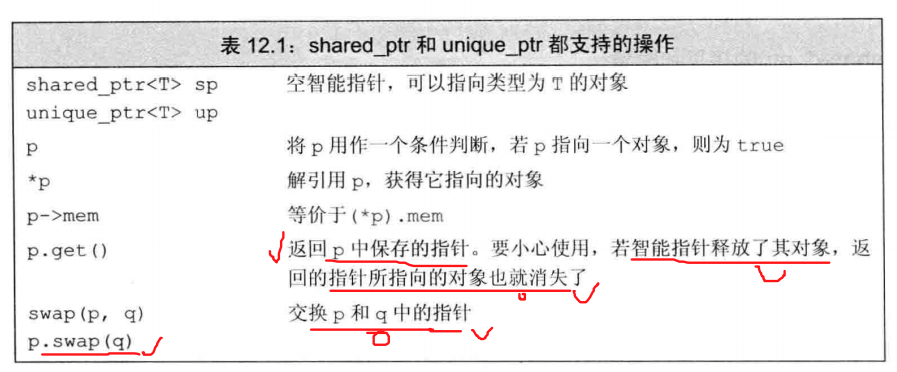
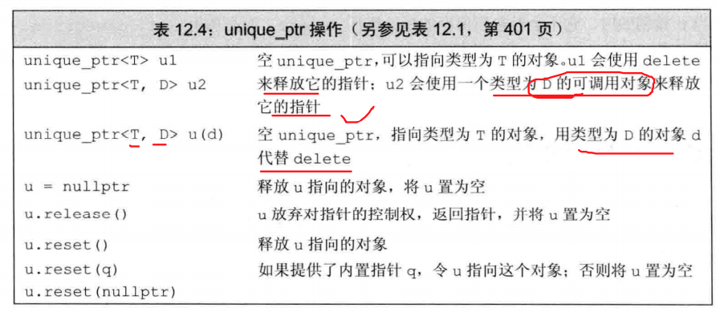

# 动态内存


## 0 C++直接管理内存

### 概念

* C++使用new分配内存，使用delete释放new分配的内存。
* 动态对象的声明周期从创建到被释放时为止。


### 使用动态内存的原因
> 既然这么多风险为什么要使用动态内存
1. 程序不知道自己需要使用给多少对象。动态循环创建多个对象。（容器，包括字符串string，都是使用动态内存管理自身的存储。）
2. 程序不知道所需对象的准确类型。运行过程中创建对象。
3. 程序需要在多个对象间共享数据。多个对象共享相同的状态。


### 申请内存

* new无法围棋分配的对象命名，而是返回一个指向该对象的指针。
```
int * p = new int;
```
* 动态分配的对象执行默认初始化操作。内置类型和组合类型的对象是未定义的。类类型的对象使用默认构造函数进行初始化。

* 可以动态分配const对象
```
const int * pci = new const int(1024);
```
* 内存耗尽后，new表达式会失败。抛出bad_alloc异常。

### 释放内存
* 使用delete来释放内存。将动态内存归还给系统。
* delete指针必须指向动态分配的内存，或一个空指针。
* 释放一块非new分配的内存，或者将相同的指针释放多次，行为是未定义。产生错误。
* delete对象之后，指针指向的地址被释放了，指针无效。但是指针依旧保存着原先的地址。编程**悬空指针**。


## 1 动态内存与智能指针
> 所以智能指针使用过来做动态内存管理的。普通的局部变量及其指针，不需要智能指针。智能指针是辅助new delete来管理动态内存的。智能指针就是为了解决一下问题。


### 两个问题
指针直接管理内存存在两个问题：

1. 没有释放内存，导致内存泄露。
2. 访问已经释放的内存，引起引用非法内存的指针。

### 智能指针

* share_ptr 允许多个指针指向同一对象
* unique_ptr 独占所指向的对象

* weak_ptr伴随类。弱引用。指向shared_ptr所管理的对象。

### 头文件
```
#include<memory>
```
### 智能指针的基础操作



## 2 动态内存管理shared_ptr

### shared_ptr的操作


### make_shared申请内存

* 最安全的使用动态内存的方法，调用make_shared标准库函数。在动态内存中分配一个对象，并初始化。返回shared_ptr.
```
    shared_ptr<int> pn = make_shared<int>(42);
    auto = make_shared<int>(42);
```

### shared_ptr拷贝和引用计数

* shared_ptr 都有一个关联的计数器。引用计数。每次copy一个shared_ptr，计数器都会递增。例如将它作为参数传递给一个函数，或者作为函数的返回值。
* 一旦一个shared_ptr的计数器变为0.它就会自动释放自己所管理的内存。使用析构函数，销毁自身。
* 所以当它为局部变量，并且退出局部作用域后，所有的指针变量自动销毁，其所对应的动态分配的内存对象的引用计数就回变为零，此时动态内存会自动销毁。


### shared_ptr和new申请内存
* shared_ptr可以使用make_shared创建对象。也可以使用new返回的指针来初始化智能指针。此时不需要delete来释放。

```
share_ptr<int> p2(new int(42));
```
### shared_ptr的其他方法


## 3 动态内存管理 unique_ptr


* unique_ptr是弱化的shared_ptr。某个时刻只能有一个unique_ptr直线跟一个给定的对象。当unique_ptr被销毁时，它所指向的对象也被销毁。
* unique_ptr需要绑定到一个new返回的指针上。直接将指针置为空，指针指向的对象就会被释放。可以使用delete释放unique_ptr
* unique_ptr不支持普通的拷贝和赋值操作。但是可以考别或赋值一个将要被销毁的unique_ptr.例如return unique_ptr。实现控制权转移
```
unique_ptr<int> clone(int p){
    return unique_ptr<int>(new int(p));
}//返回了一个动态内存的unique_ptr
```
* 可以release放弃控制权，把控制权移交给新的智能指针。实现动态内存的控制权转移。
```
unique_ptr<int> m=new int;
unique_ptr<int> n = m.release();//m放弃所有权转移给n
```
## 4 动态内存管理weak_ptr
* 不控制所指向对象生存期的智能指针。它指向一个由shared_ptr管理的对象。
* 将weak_ptr绑定到shared_ptr上不会改变shared_ptr的引用计数。当shared_ptr被销毁，对象就回被释放。


* 使用shared_ptr初始化weak_ptr

```
shared_ptr<int> p = make_shared<int>(42);
weak_ptr<int>wp(p);
```
* 由于weak_ptr指向的对象可能不存在，使用lock检查weak_ptr指向的对象是否存在。

```
if(shared_ptr<int>np = wp.lock()){

}
```

## 4 动态数组

## 5 文本查询程序