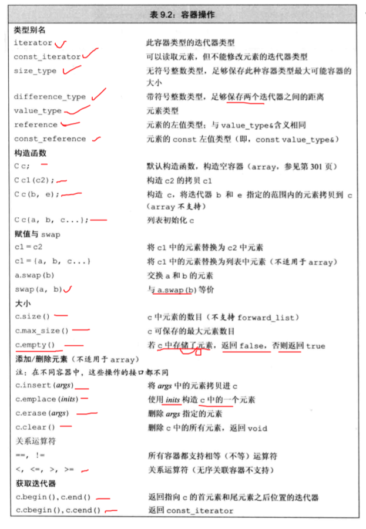
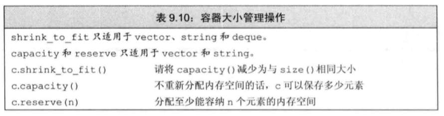

# 容器

## 1 简介
> 新标准库的容器壁使用原始的数组实现的数据结构要快很多。经过了精心的优化。

### 确定使用哪种容器

1. 除非有明确的理由，否则使用vector
2. 随机元素访问vector或deque
3. 容器中间插入或者插入元素list、forward_list
4. 头尾插入元素，使用deque
5. 可以在输入阶段随机插入的时候使用list，然后将复制好的放到vector中加速访问。

### C++ STL容器的实现

### C++ STL容器概览

## 2 容器通用操作
### 2.0 容器统一的操作

<!--  -->
<!--  -->

主要包括六类
1. 构造函数(默认初始化、复制初始化、迭代器初始化、列表初始化)
2. 赋值交换（c1=c2,c1={},assign,swap）
3. 容器大小（size,max_size,empty）
4. 插入删除（insert,emplace,erase，clear）
5. 关系运算（六种关系）
6. 迭代器（八个迭代器begin,end,cbegin,cend,rbegin,rend,crbegin,crend）

### 2.1 构造函数

* 共5+3=8种容器的初始化方法。

方法|说明
|----|----|
container c| 默认初始化。默认构造函数。
container c()|值初始化。默认构造函数。
container c(c1)| 直接初始化。普通构造函数。
container c=c2 | 拷贝初始化。拷贝构造函数。
container c{a,b,c,}  container c={a,b,c,}|列表地初始化。使用元素类型，初始化元素类型。对于没有初始化的元素，调用值初始化。
container c(iterator begin,iterator end)| 迭代器初始化。使用迭代器指向的范围内的元素进行初始化。
seq_container seq(n)| 顺序容器特有的初始化。创建包含n个元素的顺序容器，每个元素进行值初始化。
seq_container seq(n,t)| 顺序容器特有的初始化。创建包含n个t元素的顺序容器。每个元素都是t的copy。

<!--  -->

### 2.2 赋值交换

* 总共六个赋值交换函数。其中赋值为copy赋值。而不是引用copy。容器键的元素不会相互影响。

方法|说明
|-----|-----|
c1=c2 | 将c1中的元素替换为c2的copy。
c={a,b,c,} | 将c1中的元素替换为列表中元素的copy
swap(c1,c2) | 交换c1，c2容器中所有的元素。
c1.swap(c2) | 交换c1，c2容器中的所有元素。
seq.assign({a,b,c,})| 将seq中的元素替换为储值列表中的元素。
seq.assign(iterator begin,iterator end) | 将seq中的元素替换为迭代器指向的范围内的元素。
seq.assign(n,t) | 将seq中的元素替换为n个值为t的元素

<!--  -->

### 2.3 容器大小

方法|说明
|----|---|
int size() | 返回容器中元素的数目
bool empty()|当size为0是返回true
int maxsize()|返回容器所能容纳的最大元素数的值。

### 2.4 插入删除

方法 | 说明
|---|---|
insert()|插入对象
emplace()|元素初始化插入
erase()|删除指定元素
clear()|清空

### 2.5 关系运算

* 容器支持相等和不等的运算。==  !=
* 除了无序关联容器，都支持关系运算(> < >= <=)
* 必须是相同各类型的容器，且元素类型相同才能比较。

### 2.6 迭代器
方法|说明
|----|---|
begin(),end()|一组迭代器。用来从前到后遍历元素。可以修改元素。
cbegin(),cend()|一组迭代器。用来从前到后遍历元素。不可以修改元素。
rbegin(),rend()|尾后迭代器。用来从后到前遍历元素。可以修改元素。
crbegin(),crend()|尾后迭代器。用来从后到前遍历元素。不可以修改元素。

## 3 容器的容量问题

### vector的存储

* vector将元素连续存储
* 容器会申请多余的内存空间以应对可能的元素增长。防止每次添加元素后，需要重新分配内存空间。性能会很慢。

### 管理容量的成员函数

