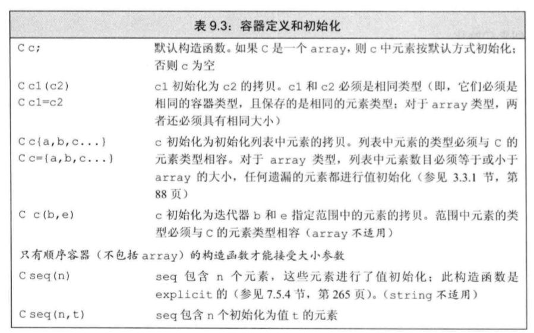
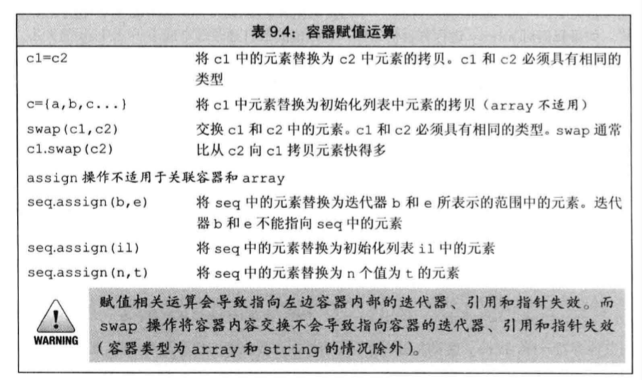

# 容器

## 1 简介
> 新标准库的容器壁使用原始的数组实现的数据结构要快很多。经过了精心的优化。

### 确定使用哪种容器

1. 除非有明确的理由，否则使用vector
2. 随机元素访问vector或deque
3. 容器中间插入或者插入元素list、forward_list
4. 头尾插入元素，使用deque
5. 可以在输入阶段随机插入的时候使用list，然后将复制好的放到vector中加速访问。

## 2 容器的基础操作
### 容器统一的操作

### 容器的定义和初始化

### 容器的赋值和交换

### 容器大小的操作

* size():返回容器中元素的数目
* empty():当size为0是返回true
* maxsize():返回容器所能容纳的最大元素数的值。

### 关系运算符

* 容器支持相等和不等的运算。==  !=
* 除了无序关联容器，都支持关系运算(> < >= <=)
* 必须是相同各类型的容器，且元素类型相同才能比较。

## 3 顺序容器的操作

### 向顺序容器中添加元素

* 在尾部添加元素push_back()
* 在头部添加元素push_front()
* 在中间添加元素insert()

### 在顺序容器中访问元素

* 也可以使用迭代器访问元素。
* at会进行安全检查抛出异常。[]不会进行检查。

### 在顺序容器中删除元素

> 操作记忆
> * back、front、push_back、push_front、pop_back、pop_front。是一组首尾相关的操作。
> * insert、at、erase。是一组随机的操作。

### foward_list的特殊操作

### 改变容器的大小

## 4 容器的容量问题

### vector的存储

* vector将元素连续存储
* 容器会申请多余的内存空间以应对可能的元素增长。防止每次添加元素后，需要重新分配内存空间。性能会很慢。

### 管理容量的成员函数

