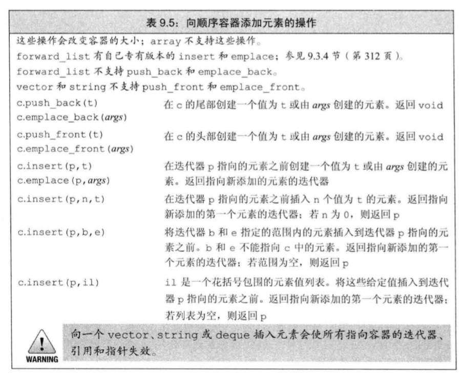
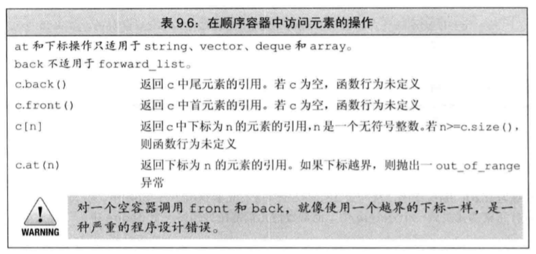
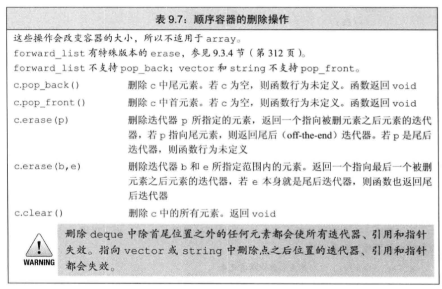
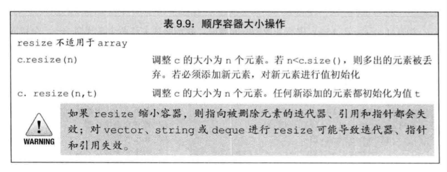

# 顺序容器

> 目录
> * array
> * vector
> * deque
> * list
> * forward_list
> * string//专门用于字符串访问的容器

## 0 顺序容器的基础操作

### 向顺序容器中添加元素

* 在尾部添加元素push_back()
* 在头部添加元素push_front()
* 在中间添加元素insert()

### 在顺序容器中访问元素

* 也可以使用迭代器访问元素。
* at会进行安全检查抛出异常。[]不会进行检查。

### 在顺序容器中删除元素

> 操作记忆
> * back、front、push_back、push_front、pop_back、pop_front、emplace_front、emplace_back。是一组首尾相关的插入操作。
> * insert、at、erase。是一组随机的操作。

### foward_list的特殊操作

### 改变容器的大小

## 1 array
> 与数组完全一致，只是定义方式不同。
> 数组不能copy赋值，但是array可以copy赋值。

## 2 vector

## 3 deque

## 4 foward_list

## 5 list
