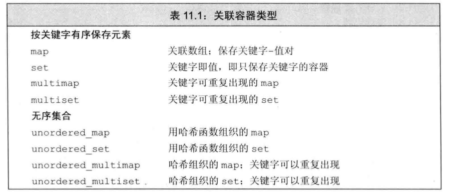
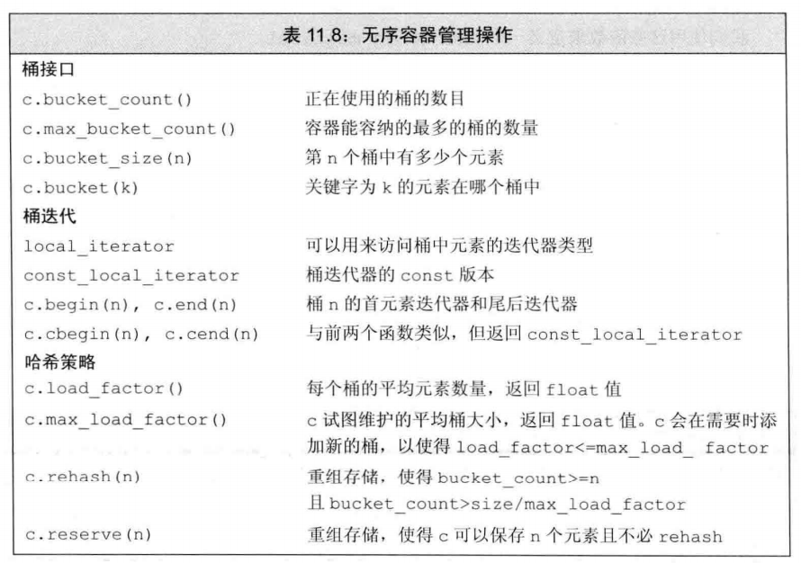

# 关联容器


## 0 关联容器概述

### 关联容器与顺序容器的区别

* 关联容器和顺序容器有着根本不同。关联容器中的元素是按关键字来把偶才能和访问的。书序容器中的元素是按他们在容器中的位置来顺序保存和访问的。

### 两个基础类型

* map:键值对key-value。关键字是索引，值表示与索引相关的数据。
* set:每个元素只包含一个关键字。支持高校的关键字查询操作。


### 关联容器之间的区别
* 是一个set或者map
* 要求不重复的关键字，允许重复的关键字。
* 按顺序保存元素。无序保存。



### 关联容器的头文件

* `<map>`:map,multimap
* `<set>`:set,multiset
* `<unorder_map>`:unorder_map,unorder_multimap
* `<unorder_set>`:unorder_set,unorder_multiset


### 有序关联容器的原理
* 有序关联容器的底层一般使用红黑树实现。
* 泛型算法通常不对关联容器使用

### 无序关联容器的原理
* 一般使用hash表实现存储。

## 1 关联容器的通用操作

### 1.1 初始化
* 与容器部分的初始化一致。支持六种基本的初始化方法。默认初始化、值初始化、直接初始化、赋值初始化、列表初始化、迭代器初始化。**不支持**constructor(n)和constructor(n,t)的初始化。
* map、set的定义和初始化
```C++
map<string,int> word_count;//空容器
set<string> ex{"the","to"};//初始化set
map<string,int> wc{
    {"jo",10},
    {"yin",13},
    {"kang",53},
    {"long",3}
};//初始化map
```
* multimap、multiset的定义和初始化。允许关键字的重复。

```C++
//可以使用顺序容器初始化关联容器multiset初始化
vector<int> vec{1,2,3,4,5,5,4,3,2,1};
set<int> iset(vec.begin(),vec.end());
multiset<int> mset(vec.begin(),vec.end());
cout<<iset.size()<<endl;
cout<<mset.size()<<endl;
```

## 2.1 有序关联容器-map
### 存储内容
```
pair<key,value>
```
### 访问元素

方法|说明
|---|---|
[key]|map的下标访问运算符。返回pair的值。如果没有该键。则会创建该键。
at(key)|map的键访问运算符。返回pair值。如果没有该键。会抛出异常。
iterator find(key)|找到某个键。返回指向该键的迭代器。
int count(key)|计算某个键的数量。返回该键出现的数量。

<!--  -->

### 添加元素

* 关联容器的插入操作。通常不需要指定位置。
* 对于map和set而言。只有当关键字不在容器当中时才会进行插入。如果存在该元素则插入失败。


方法| 说明
|----|----|
`pair<iterator,bool>` emplace(args)|使用args初始化一个值。插入到关联容器中。iterator指向插入的元素。bool指示是否插入成功。
`pair<iterator,bool>`insert(val)|插入值为val的元素。
`pair<iterator,bool>`insert(iterator begin,iterator end)|插入指定范围的元素。
`pair<iterator,bool>`insert({a,b,c,})|插入初值列表中的元素。
insert(p,v) |迭代器只起到提示作用。返回值为迭代器，指向给定关键字的元素
emplace(p,args)|迭代器起到提示作用。插入元素。返回值为迭代器。指向给定关键字的元素。

<!--  -->

### 删除元素

方法|说明
|----|----|
int erase(key)|删除关键字为k的元素。返回删除的元素的数量。
iterattor erase(iterator p)|删除迭代器p指向的元素。返回指向下一个元素的迭代器。这种东西都是遍历删除的时候用的。
erase(iterator begin(),iterator end())|删除范围内的元素。返回结尾e指向的元素。

<!--  -->

## 2.2 有序管理容器-set
### 存储内容
```
key
```
### 访问操作
* 不支持[]和at()访问元素。支持find和count
### 添加操作
* 与map一样。只不过操作类型不是pair，而是单个的key
### 删除操作
* 与map一样。只不过操作类型不是pair，而是单个的key


## 3 无序关联容器

### 说明

* 不适用比较运算符来组织元素，使用哈希函数和关键字类型的==运算符。
* 使用无序容器通常更简单，具有更好的效果。
* 底层是通过哈希函数实现的。所以有很多关于哈希函数的处理操作。

### 基础操作

* 与有序关联容器一样

### 管理桶
* 无序关联容器相对于普通关联容器的特殊操作。



