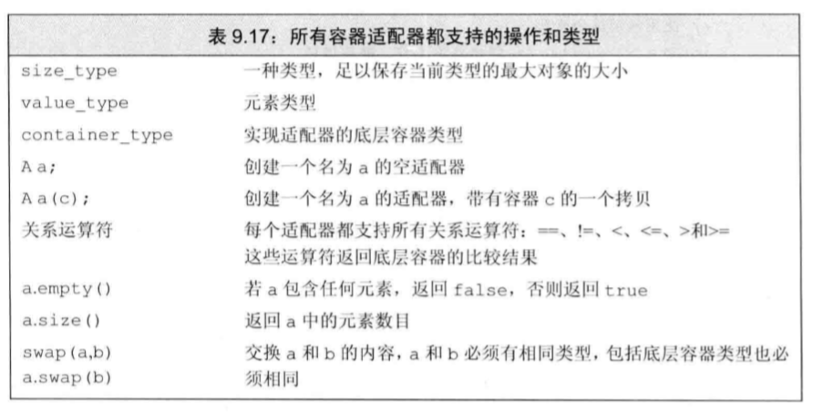

# 容器适配器

> 目录
> * stack
> * queue
> * priority_queue

> 参考文献
> * [优先队列](https://blog.csdn.net/weixin_36888577/article/details/79937886)


## 0 简介

### 概念
* 适配器 (adaptor) 是标准库巾的一个通用概念。容器、类和函数都有适配器。 本质上， 一个适配器是一种机制， 能使某种事物的行为看起来像另外一种事物一样。。一个容器适配器接受一种己有的容器类型， 使其行为看起来像一利1不同的类型。 
* 添加额外操作，实现某种特殊的数据结构。

### 容器适配器的操作


* 可以用顺序容器初始化适配器。使用的是顺序容器的拷贝。


## 1 stack
* 默认基于deque实现，也可以基于list/vector
### 概念

### 特有操作


## 2 queue

### 概念
* queue是基于deque实现的,也可以用vector或list
* priority_queue是基于vector实现的。也可以用deque实现

### 特有操作


## 3 priority_queue


### 初始化

* Type 就是数据类型，Container 就是容器类型（Container必须是用数组实现的容器，比如vector,deque等等，但不能用 list。STL里面默认用的是vector），Functional 就是比较的方式，当需要用自定义的数据类型时才需要传入这三个参数，使用基本数据类型时，只需要传入数据类型，**默认是大顶堆**
```
//构造函数
priority_queue<Type, Container, Functional>

//升序队列
priority_queue <int,vector<int>,greater<int> > q;
//降序队列
priority_queue <int,vector<int>,less<int> >q;
```

### 基本操作

> 和队列基本操作相同:
> * top 访问队头元素
> * empty 队列是否为空
> * size 返回队列内元素个数
> * push 插入元素到队尾 (并排序)
> * emplace 原地构造一个元素并插入队列
> * pop 弹出队头元素
> * swap 交换内容
```C++
#include<iostream>
#include <queue>
using namespace std;
int main() 
{
    //对于基础类型 默认是大顶堆
    priority_queue<int> a; 
    //等同于 priority_queue<int, vector<int>, less<int> > a;
    
    //             这里一定要有空格，不然成了右移运算符↓
    priority_queue<int, vector<int>, greater<int> > c;  //这样就是小顶堆
    priority_queue<string> b;

    for (int i = 0; i < 5; i++) 
    {
        a.push(i);
        c.push(i);
    }
    while (!a.empty()) 
    {
        cout << a.top() << ' ';
        a.pop();
    } 
    cout << endl;

    while (!c.empty()) 
    {
        cout << c.top() << ' ';
        c.pop();
    }
    cout << endl;

    b.push("abc");
    b.push("abcd");
    b.push("cbd");
    while (!b.empty()) 
    {
        cout << b.top() << ' ';
        b.pop();
    } 
    cout << endl;
    return 0;
}
```

### pair优先队列

* 默认的比较顺序是：pari的比较，先比较第一个元素，第一个相等比较第二个
```C++
#include <iostream>
#include <queue>
#include <vector>
using namespace std;
int main() 
{
    priority_queue<pair<int, int> > a;
    pair<int, int> b(1, 2);
    pair<int, int> c(1, 3);
    pair<int, int> d(2, 5);
    a.push(d);
    a.push(c);
    a.push(b);
    while (!a.empty()) 
    {
        cout << a.top().first << ' ' << a.top().second << '\n';
        a.pop();
    }
}
```

### 自定义类型的优先队列
* 自定义重载比较运算符><的类和结构体。
* 自定义重载函数调用运算符()的类或者结构体。需要接受两个参数
* 或者使用自定义的函数指针。需要接受两个参数
* 或者使用lambda比较函数。需要接受两个参数。
```C++
#include <iostream>
#include <queue>
using namespace std;

//方法1
struct tmp1 //运算符重载<
{
    int x;
    tmp1(int a) {x = a;}
    bool operator<(const tmp1& a) const
    {
        return x < a.x; //大顶堆
    }
};

//方法2
struct tmp2 //重写仿函数
{
    bool operator() (tmp1 a, tmp1 b) 
    {
        return a.x < b.x; //大顶堆
    }
};

int main() 
{
    tmp1 a(1);
    tmp1 b(2);
    tmp1 c(3);
    priority_queue<tmp1> d;
    d.push(b);
    d.push(c);
    d.push(a);
    while (!d.empty()) 
    {
        cout << d.top().x << '\n';
        d.pop();
    }
    cout << endl;

    priority_queue<tmp1, vector<tmp1>, tmp2> f;
    f.push(c);
    f.push(b);
    f.push(a);
    while (!f.empty()) 
    {
        cout << f.top().x << '\n';
        f.pop();
    }
}
```


## 4 bitset特殊容器


### 头文件

```
#include<bitset>
```

### 定义和初始化
```
bitset<32> bitvec(1U);
```
* 编号从0开始的二进制位被称为低位。编号31结束的二进制位被称为高位。


### bitset操作
* bitset支持位运算


