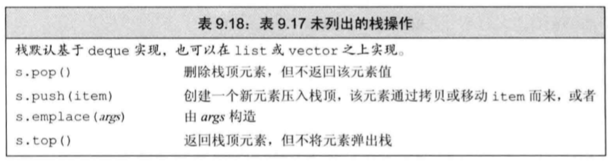
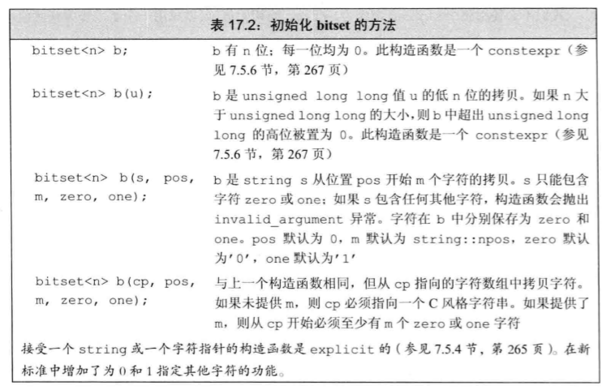

# 容器适配器

> 目录
> * stack
> * queue
> * priority_queue


## 0 简介

### 概念
* 适配器 (adaptor) 是标准库巾的一个通用概念。容器、类和函数都有适配器。 本质上， 一个适配器是一种机制， 能使某种事物的行为看起来像另外一种事物一样。。一个容器适配器接受一种己有的容器类型， 使其行为看起来像一利1不同的类型。 
* 添加额外操作，实现某种特殊的数据结构。

### 容器适配器的操作


## 1 stack

### 概念

### 特有操作




## 2 queue和priority_queue

### 概念


### 特有操作


## 3 bitset特殊容器


### 头文件

```
#include<bitset>
```

### 定义和初始化
```
bitset<32> bitvec(1U);
```
* 编号从0开始的二进制位被称为低位。编号31结束的二进制位被称为高位。



### bitset操作
* bitset支持位运算


