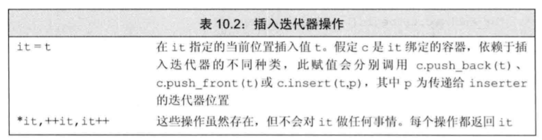
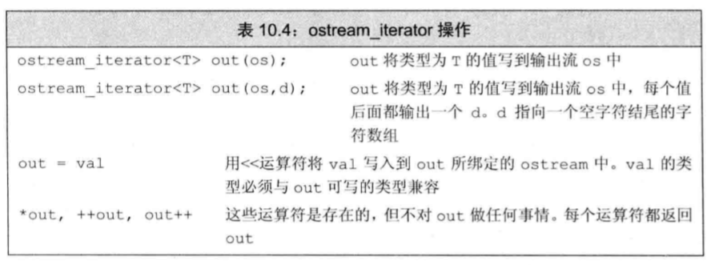

# 迭代器


## 1 基础
### 头文件
```
#include<iterator>
```
### 迭代器范围
> begin和end被容器使用了，可以用front和back作为游标。
左闭右开区间
```
[begin,end)
```

### 使用迭代器进行遍历

> 遍历方法有三种：下标遍历、范围for遍历、迭代器遍历
```
container c;
first = c.begin();
last = c.end();
while(first != last){
    cout<<*first<<endl;//指向元素的游标指针。
    ++begin;
}
```

### 迭代器的类型

* 正常迭代器
```
begin()
end()
```
* 反向迭代器
```
rbegin()
rend()
```
* 常量迭代器

```
cbegin()
cend()
```

### 操作冲突

容器操作可能会使迭代器实效。


## 2 迭代器类型——迭代器的适配器

除了容器定义的迭代器之外，标准库头文件iterator总额外定义了几种迭代器。
* 插入迭代器。绑定到一个容器上，用来向容器中国插入元素
* 流迭代器。绑定到输入输出流上，用来遍历关联的IO流
* 反向迭代器。反向移动，除了forward_list外，标准库容器都有方向迭代器。
* 移动迭代器。不会拷贝元素，而是移动元素。

### 插入迭代器

接受一个容器，生成迭代器，能够向容器中的指定位置添加元素。




* back_inserter:创建一个push_back迭代器
* front_inserter:创建一个push_front迭代器
* inserter:创建一个insert迭代器。接受一个指向容器的迭代器。元素将被插入到给定迭代器所表示的元素之前。

```
#include<iostream>
#include<iterator>
#include<vector>
#include<list>

using namespace std;

int main(){

    list<int> lst ={1,2,3,4};
    list<int> lst2,lst3;
    //反向一个列表
    copy(lst.cbegin(),lst.cend(),front_inserter(lst2));
    //正向一个列表
    copy(lst.cbegin(),lst.cend(),inserter(lst3,lst3.begin()));
    return 0;
}
```

### 流迭代器

接受输入输出流，使用迭代器的方式读取数据。


* istream_iterator:读取输入流。可以为任何定义了输入运算符的类创建迭代器对象。


```
    /*
    * 读取数据的三种方法
    * 直接使用输入输出流iostream
    * 使用字符串方法封装getline
    * 使用迭代器读取输入输出流istream_iterator/ostream_iterator
    */
    istream_iterator<int> in_iter(cin);//从cin读取数据
    istream_iterator<int> eof;//尾后迭代器
    istringstream in_string("hello world");
    istream_iterator<string> str_it(in_string);//字符串流迭代器
    
    int a =0;
    a = *in_iter;
    cout<<a<<endl;
    // in_iter++;
    cout<<*str_it<<endl;
    str_it++;
    cout<<*str_it<<endl;
```

* ostream_iterator:读取输出流。可以为任何创建了输出运算符的类，创建输出流迭代器。




```
    ostream_iterator<int> out_iter(cout,"\n");
    *out_iter =10;
    *out_iter = 100;
```

### 反向迭代器

从容器的尾元素向首元素反向移动的迭代器。递增递减操作相反。

