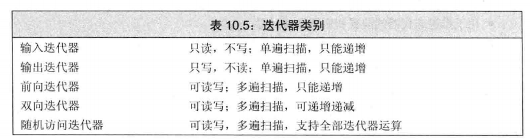
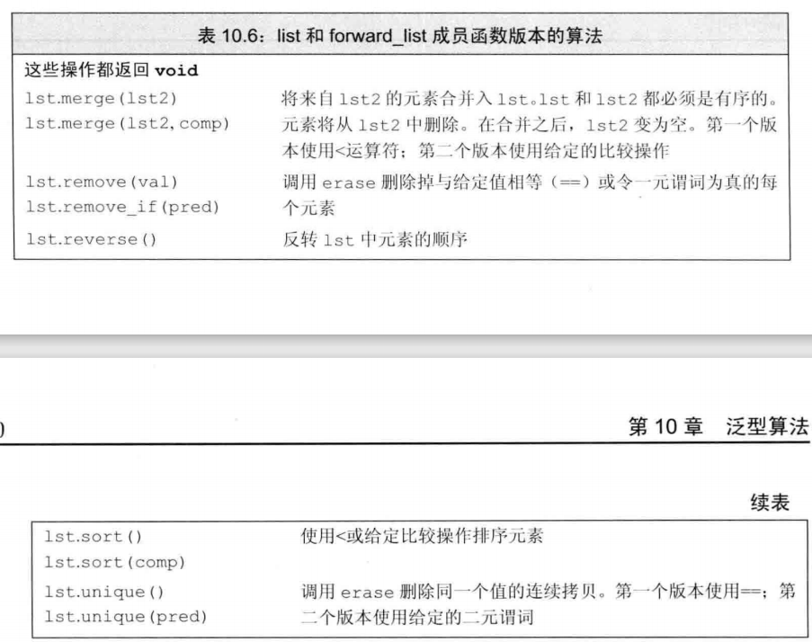
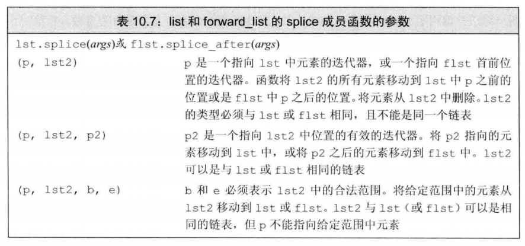

# 算法

> 参考文献
> * [C++进阶：STL算法总结](https://www.jianshu.com/p/eb554b0943ab)
> * [C++标准库STL算法](https://www.cnblogs.com/larry-xia/p/9497340.html)

## 1 泛型算法概览

### 说明

* 容器的**迭代器**使得算法不依赖于容器。但算法依赖于元素类型的操作。
* 标准库仅仅提供了100多个算法

### 头文件
| 头文件 | 功能 |
|---|---|
| `<algorithm>` | 算法函数 |
| `<numeric>` | 数值算法 |
| `<functional>` | 函数对象/仿函数 |

### 分类

| No. | 分类 |
|---|---|
| 1 | 非可变序列算法Non-modifying sequence operations(不直接修改容器内容的算法。) |
| 2 | 可变序列算法Modifying sequence operations(可以修改容器内容的算法。) |
| 3 | 排序算法Sorting/Partitions/Binary search/(对序列排序、合并、搜索算法操作。) |
| 4 | 数值算法Merge/Heap/Min/max(对容器内容进行数值计算。) |

### 参数说明

|参数|说明|
|----|----|
beg|开始迭代器
end|终止迭代器
val|值
n|整数
func|操作函数。用于操作。
pred |==比较函数。返回true/false。用于搜索。
cmp|大小比较函数,返回true/false。用于排序。
binary|判断函数,返回true/false。用于判断。

## 1.1 基础算法（遍历算法）

### 检查
* 检查谓词是否对范围中所有、任一或无元素为 true

| 函数 | 作用 |
|---|---|
|all_of(beg,end,binary)|检查所有的元素是否满足binary|
|any_of(beg,end,binary)|检查任意的元素是否满足binary|
|none_of(beg,end,binary)|检查没有元素满足binary|

### 遍历变换

| 函数 | 作用 |
|---|---|
| for_each(beg,end,func) | 将[beg,end)范围内所有元素依次调用函数func，返回func。可以使用func修改序列中的元素。但必须传递引用参数 |
| transform(beg,end,res,func) | 将[beg,end)范围内所有元素依次调用函数unary，结果放入res中。 |
| transform(beg1,end1,beg2,res,binary) | 将[beg,end)范围内所有元素与[beg2,beg2+end-beg)中所有元素依次调用函数binary，结果放入res中。 |

### 最大最小
| 函数 | 作用 |
|---|---|
| max(a,b) | 返回两个元素中较大一个。 |
| max(a,b,cmp) | 使用自定义比较操作cmp,返回两个元素中较大一个。 |
| max_element(beg,end) | 返回一个ForwardIterator，指出[beg,end)中最大的元素。 |
| max_element(beg,end,cmp) | 使用自定义比较操作cmp,返回一个ForwardIterator，指出[beg,end)中最大的元素。 |
| min(a,b) | 返回两个元素中较小一个。 |
| min(a,b,cmp) | 使用自定义比较操作cmp,返回两个元素中较小一个。 |
| min_element(beg,end) | 返回一个ForwardIterator，指出[beg,end)中最小的元素。 |
| min_element(beg,end,cmp) | 使用自定义比较操作cmp,返回一个ForwardIterator，指出[beg,end)中最小的元素。 |
|minmax(beg,end)|返回一个pair，包含最小最大值|
|minmax(beg,end,cmp)|自定义比较函数|
|minmax_element(beg,end)|返回一个pair，包含最大最小值的位置|
|minmax_element(beg,end,cmp)|自定义比较函数|

## 1.2 排序算法（12个）

### 排序

| 函数 | 作用 |
|---|---|
| sort(beg,end) | 默认升序重新排列元素 |
| sort(beg,end,comp) | 使用函数comp代替比较操作符执行sort()。排序sort使用快排进行排序。排序过程中的cmp表示是否将第一个参数移到第二个参数之前。如果是true则会发生移动。如果不是true则不会发生移动。 |
| partition(beg,end,pred) | 元素重新排序，使用pred函数，把结果为true的元素放在结果为false的元素之前。 |
| stable_sort(beg,end) | 与sort()类似，保留相等元素之间的顺序关系。 |
| stable_sort(beg,end,pred) | 使用函数pred代替比较操作符执行stable_sort()。 |
| stable_partition(beg,end) | 与partition()类似，保留容器中的相对顺序。 |
| stable_partition(beg,end,pred) | 使用函数pred代替比较操作符执行stable_partition()。 |
| partial_sort(beg,mid,end) | 部分排序，被排序元素个数放到[beg,end)内。 |
| partial_sort(beg,mid,end,comp) | 使用函数comp代替比较操作符执行partial_sort()。 |
| partial_sort_copy (beg1,end1,beg2,end2) | 与partial_sort()类似，只是将[beg1,end1)排序的序列复制到[beg2,end2)。 |
| partial_sort_copy (beg1,end1,beg2,end2,comp) | 使用函数comp代替比较操作符执行partial_sort_copy()。 |
| nth_element(beg,nth,end) | 单个元素序列重新排序，使所有小于第n个元素的元素都出现在它前面，而大于它的都出现在后面。 |
| nth_element(beg,nth,end,comp) | 使用函数comp代替比较操作符执行nth_element()。 |

### 反转

| 函数 | 作用 |
|---|---|
| reverse(beg,end) | 元素重新反序排序。 |
| reverse_copy(beg,end,res) | 与reverse()类似，结果写入res。 |
| rotate(beg,mid,end) | 元素移到容器末尾，由mid成为容器第一个元素。 |
| rotate_copy(beg,mid,end,res) | 与rotate()类似，结果写入res |

### 随机

| 函数 | 作用 |
|---|---|
| random_shuffle(beg,end) | 元素随机调整次序。 |
| random_shuffle(beg,end,gen) | 使用函数gen代替随机生成函数执行random_shuffle()。 |

## 1.3 查找算法（13个）
判断容器中是否包含某个值
### 统计

| 函数 | 作用 |
|---|---|
| count(beg,end,val) | 利用==操作符，对[beg,end)的元素与val进行比较，返回相等元素个数。 |
| count_if(beg,end,pred) | 使用函数pred代替==操作符执行count()。 |

### 查找(查找某个值)

| 函数 | 作用 |
|---|---|
| find(beg,end,val) | 利用==操作符，对[beg,end)的元素与val进行比较。当匹配时结束搜索，返回该元素的InputIterator。 |
| find_if(beg,end,pred) | 使用函数pred代替==操作符执行find()。 |
| find_first_of(beg1,end1,beg2,end2) | 在[beg1,end1)范围内查找[beg2,end2)中任意一个元素的第一次出现。返回该元素的Iterator。 |
| find_first_of(beg1,end1,beg2,end2,pred) | 使用函数pred代替==操作符执行find_first_of()。返回该元素的Iterator。 |
| find_end(beg1,end1,beg2,end2) | 在[beg1,end1)范围内查找[beg2,end2)最后一次出现。找到则返回最后一对的第一个ForwardIterator，否则返回end1。 |
| find_end(beg1,end1,beg2,end2,pred) | 使用函数pred代替==操作符执行find_end()。返回该元素的Iterator。 |
| adjacent_find(beg,end) | 对[beg,end)的元素，查找一对相邻重复元素，找到则返回指向这对元素的第一个元素的ForwardIterator。否则返回end。 |
| adjacent_find(beg,end,pred) | 使用函数pred代替==操作符执行adjacent_find()。 |

### 搜索（搜索某个序列）

| 函数 | 作用 |
|---|---|
| search(beg1,end1,beg2,end2) | 在[beg1,end1)范围内查找[beg2,end2)首一次出现，返回一个ForwardIterator，查找成功,返回[beg1,end1)内第一次出现[beg2,end2)的位置，查找失败指向end1。 |
| search(beg1,end1,beg2,end2,pred) | 使用函数pred代替==操作符执行search()。 |
| search_n(beg,end,n,val) | 在[beg,end)范围内查找val出现n次的子序列 |
| search_n(beg,end,n,val,pred) | 使用函数pred代替==操作符执行search_n()。 |
| binary_search(beg,end,val) | 在[beg,end)中查找val，找到返回true。 |
| binary_search(beg,end,val,comp) | 使用函数comp代替比较操作符执行binary_search()。 |

### 边界

| 函数 | 作用 |
|---|---|
| lower_bound(beg,end,val) | 在[beg,end)范围内的可以插入val而不破坏容器顺序的第一个位置，返回一个ForwardIterator。 |
| lower_bound(beg,end,val,comp) | 使用函数comp代替比较操作符执行lower_bound()。 |
| upper_bound(beg,end,val) | 在[beg,end)范围内插入val而不破坏容器顺序的最后一个位置，该位置标志一个大于val的值，返回一个ForwardIterator。 |
| upper_bound(beg,end,val,comp) | 使用函数comp代替比较操作符执行upper_bound()。 |
| equal_range(beg,end,val) | 返回一对iterator，第一个表示lower_bound，第二个表示upper_bound。 |
| equal_range(beg,end,val,comp) | 使用函数comp代替比较操作符执行lower_bound()。 |

## 1.4 填充复制移除替换算法19个

### 填充

| 函数 | 作用 |
|---|---|
| fill(beg,end,val) | 将值val赋给[beg,end)范围内的所有元素。 |
| fill_n(beg,n,val) | 将值val赋给[beg,beg+n)范围内的所有元素。 |
| generate(beg,end,func) | 连续调用函数func填充[beg,end)范围内的所有元素。 |
| generate_n(beg,n,func) | 连续调用函数func填充[beg,beg+n)范围内的所有元素。 |

### 复制 

| 函数 | 作用 |
|---|---|
| copy(beg,end,res) | 复制[beg,end)到res |
| copy_backward(beg,end,res) | 与copy()相同，不过元素是以相反顺序被拷贝。 |

### 移除

| 函数 | 作用 |
|---|---|
| remove(beg,end,val) | 删除[beg,end)内所有等于val的元素。注意，该函数不是真正删除函数。 |
| remove_if(beg,end,pred) | 删除[beg,end)内pred结果为true的元素。 |
| remove_copy(beg,end,res,val) | 将所有不等于val元素复制到res，返回OutputIterator指向被拷贝的末元素的下一个位置。 |
| remove_copy_if(beg,end,res,pred) | 将所有使pred结果为true的元素拷贝到res。 |

### 替换

| 函数 | 作用 |
|---|---|
| replace(beg,end,oval,nval) | 将[beg,end)内所有等于oval的元素都用nval代替。 |
| replace_copy(beg,end,res,oval,nval) | 与replace()类似，不过将结果写入res。 |
| replace_if(beg,end,pred,nval) | 将[beg,end)内所有pred为true的元素用nval代替。 |
| replace_copy_if(beg,end,res,pred,nval) | 与replace_if()，不过将结果写入res。 |

### 去重

| 函数 | 作用 |
|---|---|
| unique(beg,end) | 清除序列中相邻重复元素，不能真正删除元素。重载版本使用自定义比较操作。 |
| unique(beg,end,pred) | 将所有使pred结果为true的相邻重复元素去重。 |
| unique_copy(beg,end,res) | 与unique类似，不过把结果输出到res。 |
| unique_copy(beg,end,res,pred) | 与unique类似，不过把结果输出到res。 |

### 交换

| 函数 | 作用 |
|---|---|
| swap(a,b) | 交换存储在a与b中的值。 |
| swap_range(beg1,end1,beg2) | 将[beg1,end1)内的元素[beg2,beg2+beg1-end1)元素值进行交换。 |
| iter_swap(it_a,it_b) | 交换两个ForwardIterator的值。 |

## 1.5 算术算法（4个）

`#inlcude<numeric>`

| 函数 | 作用 |
|---|---|
| accumulate(beg,end,val) | 对[beg,end)内元素之和，加到初始值val上。 |
| accumulate(beg,end,val,binary) | 将函数binary代替加法运算，执行accumulate()。 |
| partial_sum(beg,end,res) | 将[beg,end)内该位置前所有元素之和放进res中。 |
| partial_sum(beg,end,res,binary) | 将函数binary代替加法运算，执行partial_sum()。 |
| adjacent_difference(beg1,end1,res) | 将[beg,end)内每个新值代表当前元素与上一个元素的差放进res中。 |
| adjacent_difference(beg1,end1,res,binary) | 将函数binary代替减法运算，执行adjacent_difference()。 |
| inner_product(beg1,end1,beg2,val) | 对两个序列做内积(对应元素相乘，再求和)并将内积加到初始值val上。 |
| inner_product(beg1,end1,beg2,val,binary1,binary2) | 将函数binary1代替加法运算,将binary2代替乘法运算，执行inner_product()。 |

## 1.6 关系算法（4个）

| 函数 | 作用 |
|---|---|
| equal(beg1,end1,beg2) | 判断[beg1,end1)与[beg2,end2)内元素都相等 |
| equal(beg1,end1,beg2,pred) | 使用pred函数代替默认的==操作符。 |
| includes(beg1,end1,beg2,end2) | 判断[beg1,end1)是否包含[beg2,end2)，使用底层元素的<操作符，成功返回true。重载版本使用用户输入的函数。 |
| includes(beg1,end1,beg2,end2,comp) | 将函数comp代替<操作符，执行includes()。 |
| lexicographical_compare(beg1,end1,beg2,end2) | 按字典序判断[beg1,end1)是否小于[beg2,end2) |
| lexicographical_compare(beg1,end1,beg2,end2,comp) | 将函数comp代替<操作符，执行lexicographical_compare()。 |
| mismatch(beg1,end1,beg2) | 并行比较[beg1,end1)与[beg2,end2)，指出第一个不匹配的位置，返回一对iterator，标志第一个不匹配元素位置。如果都匹配，返回每个容器的end。 |
| mismatch(beg1,end1,beg2,pred) | 使用pred函数代替默认的==操作符。 |

## 1.7 集合算法（6个）

| 函数 | 作用 |
|---|---|
| merge(beg1,end1,beg2,end2,res) | 合并[beg1,end1)与[beg2,end2)存放到res。 |
| merge(beg1,end1,beg2,end2,res,comp) | 将函数comp代替<操作符，执行merge()。 |
| inplace_merge(beg,mid,end) | 合并[beg,mid)与[mid,end)，结果覆盖[beg,end)。 |
| inplace_merge(beg,mid,end,cmp) | 将函数comp代替<操作符，执行inplace_merge()。 |
| set_union(beg1,end1,beg2,end2,res) | 取[beg1,end1)与[beg2,end2)元素并集存放到res。 |
| set_union(beg1,end1,beg2,end2,res,comp) | 将函数comp代替<操作符，执行set_union()。 |
| set_intersection(beg1,end1,beg2,end2,res) | 取[beg1,end1)与[beg2,end2)元素交集存放到res。 |
| set_intersection(beg1,end1,beg2,end2,res,comp) | 将函数comp代替<操作符，执行set_intersection()。 |
| set_difference(beg1,end1,beg2,end2,res) | 取[beg1,end1)与[beg2,end2)元素内差集存放到res。 |
| set_difference(beg1,end1,beg2,end2,res,comp) | 将函数comp代替<操作符，执行set_difference()。 |
| set_symmetric_difference(beg1,end1,beg2,end2,res) | 取[beg1,end1)与[beg2,end2)元素外差集存放到res。 |

## 1.8 排序组合算法（两个）
| 函数 | 作用 |
|---|---|
| next_permutation(beg,end) | 取出[beg,end)内的下移一个排列。 |
| next_permutation(beg,end,comp) | 将函数comp代替<操作符，执行next_permutation()。 |
| prev_permutation(beg,end) | 取出[beg,end)内的上移一个排列。 |
| prev_permutation(beg,end,comp) | 将函数comp代替<操作符，执行prev_permutation()。 |

## 1.9 堆算法（4个）

| 函数 | 作用 |
|---|---|
|is_heap(beg,end[,comp]) | 检查给定范围是否为一个最大堆|
|is_heap_until(beg,end[,comp]) | 查找能成为最大堆的最大子范围|
| make_heap(beg,end) | 把[beg,end)内的元素生成一个堆。 |
| make_heap(beg,end,comp) | 将函数comp代替<操作符，执行make_heap()。 |
| push_heap(beg,end) | 假设first到last-1是一个有效堆，要被加入到堆的元素存放在位置last-1，重新生成堆。在指向该函数前，必须先把元素插入容器后。 |
| push_heap(beg,end,comp) | 将函数comp代替<操作符，执行push_heap()。 |
| pop_heap(beg,end) | 重新排序堆。它把first和last-1交换，然后重新生成一个堆。可使用容器的back来访问被"弹出"的元素或者使用pop_back进行真正的删除。并不真正把最大元素从堆中弹出。 |
| pop_heap(beg,end,comp) | 将函数comp代替<操作符，执行pop_heap()。 |
| sort_heap(beg,end) | 对[beg,end)内的序列重新排序。 |
| sort_heap(beg,end,comp) | 将函数comp代替<操作符，执行push_heap()。 |

## 2 泛型算法的结构

### 五类迭代器
泛型算法只要能够提供五个迭代器类别，所有到的泛型算法都能够执行。每个算法都会对他的每个迭代器指明提供哪类迭代器。

### 输入迭代器

* 可以读取序列中的元素
  * 比较两个迭代器的运算符==，!=
  * 推进迭代器前置或后置的递增运算符++
  * 用于读取元素的解引用运算符* ->

### 输出迭代器
* 可以向序列中写入元素
  * 用于推进迭代器前置和后置的递增运算
  * 用于写入的解引用运算符。只能是左值。

### 前向迭代器
* 只能沿一个方向运动

### 双向迭代器
* 可以正反两个方向运动。支持++和--

### 随机访问迭代器

* 常量时间内随机访问序列中任意元素的能力。下标访问。
  * 用于比较迭代器相对位置的关系运算符< > <= >=，基于随机访问能力。
  * 迭代器和一个整数值的加减运算 + += - -=
  * 用于计算迭代器距离的运算符-。基于随机访问能力
  * 下标运算符[]。提供随机访问能力

### 算法的形参模式

* 必然是一下四中形式之一
  * 接受单个目标迭代器的算法
  * 接受第二个输入序列的算法

### 算法的命名规范
* 算法有多个重载版本
* _if结尾多加一个**谓词**。可以传递一个函数。
* _copy结尾，表示多加一个序列用来拷贝结果。

## 3 特定容器算法

### list和forward_list的特定算法

* 成员函数中的算法

* splice算法

