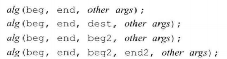

# 算法

## 1 泛型算法概览

### 头文件
#include<algorithm>//标准库算法
#include<numeric>//用于数值处理相关的函数
#include<functional>//函数相关的东西

### 说明

* 容器的**迭代器**使得算法不依赖于容器。但算法依赖于元素类型的操作。
* 标准库仅仅提供了100多个算法

### 分类

* 只读算法。不改变元素的值
* 更易算法。该表容器的元素

### 常用算法示例
* 只读算法
accumulate()

* 判断算法

equal()

* 写容器算法

fill()

* 拷贝算法

copy()

* 重排算法

sort()
unique()

* 查找算法

find()
find_if()

## 2 泛型算法的结构

### 五类迭代器
泛型算法只要能够提供五个迭代器类别，所有到的泛型算法都能够执行。每个算法都会对他的每个迭代器指明提供哪类迭代器。

### 输入迭代器

* 可以读取序列中的元素
  * 比较两个迭代器的运算符==，!=
  * 推进迭代器前置或后置的递增运算符++
  * 用于读取元素的解引用运算符* ->

### 输出迭代器
* 可以向序列中写入元素
  * 用于推进迭代器前置和后置的递增运算
  * 用于写入的解引用运算符。只能是左值。

### 前向迭代器
* 只能沿一个方向运动

### 双向迭代器
* 可以正反两个方向运动。支持++和--

### 随机访问迭代器

* 常量时间内随机访问序列中任意元素的能力。下标访问。
  * 用于比较迭代器相对位置的关系运算符< > <= >=，基于随机访问能力。
  * 迭代器和一个整数值的加减运算 + += - -=
  * 用于计算迭代器距离的运算符-。基于随机访问能力
  * 下标运算符[]。提供随机访问能力

### 算法的形参模式

* 必然是一下四中形式之一
  * 接受单个目标迭代器的算法
  * 接受第二个输入序列的算法

### 算法的命名规范
* 算法有多个重载版本
* _if结尾多加一个**谓词**。可以传递一个函数。
* _copy结尾，表示多加一个序列用来拷贝结果。

## 3 特定容器算法

### list和forward_list的特定算法

* 成员函数中的算法

* splice算法

