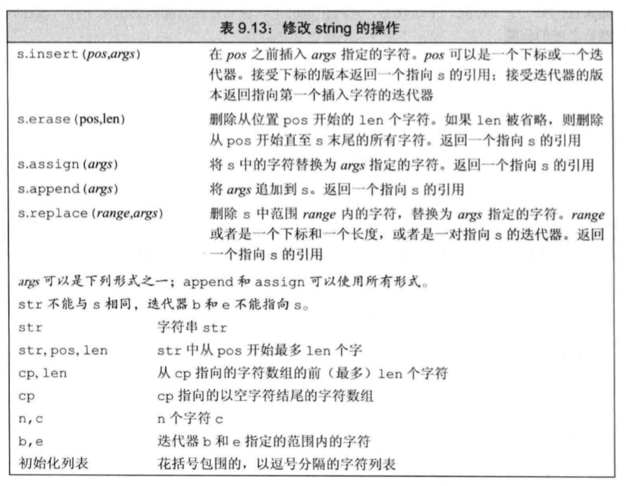
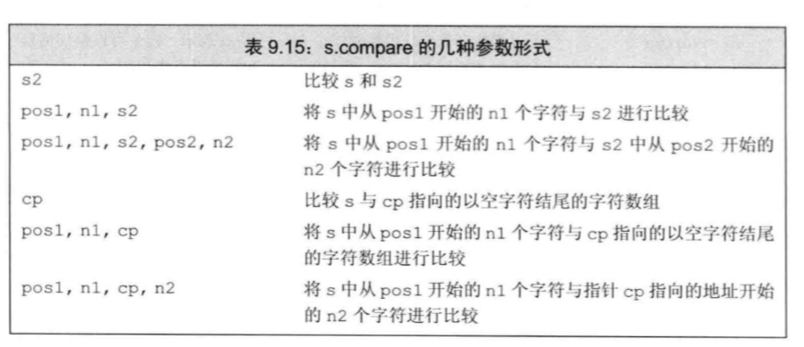

## 1 string容器的操作

> 参考顺序容器部分

## 2 string字符串操作

## 2.1 构造函数
* string 类有多个构造函数，用法示例如下：
```C++
string s1();  // si = ""
string s2("Hello");  // s2 = "Hello"
string s3(4, 'K');  // s3 = "KKKK"
string s4("12345", 1, 3);  //s4 = "234"，即 "12345" 的从下标 1 开始，长度为 3 的子串
```
* 为称呼方便，本教程后文将从字符串下标 n 开始、长度为 m 的字符串称为“子串(n, m)”。
* string 类没有接收一个整型参数或一个字符型参数的构造函数。下面的两种写法是错误的：

```C++
string s1('K');
string s2(123);
```
## 2.2 对 string 对象赋值
* 可以用 char* 类型的变量、常量，以及 char 类型的变量、常量对 string 对象进行赋值。例如：
```C++
string s1;
s1 = "Hello";  // s1 = "Hello"
s2 = 'K';  // s2 = "K”
```
* string 类还有 assign 成员函数，可以用来对 string 对象赋值。assign 成员函数返回对象自身的引用。例如：
```C++
string s1("12345"), s2;
s3.assign(s1);  // s3 = s1
s2.assign(s1, 1, 2);  // s2 = "23"，即 s1 的子串(1, 2)
s2.assign(4, 'K');  // s2 = "KKKK"
s2.assign("abcde", 2, 3);  // s2 = "cde"，即 "abcde" 的子串(2, 3)
```
## 2.3 求字符串的长度
* length 成员函数返回字符串的长度。size 成员函数可以实现同样的功能。
## 2.4 string对象中字符串的连接
* 除了可以使用+和+=运算符对 string 对象执行字符串的连接操作外，string 类还有 append 成员函数，可以用来向字符串后面添加内容。append 成员函数返回对象自身的引用。例如：

```C++
string s1("123"), s2("abc");
s1.append(s2);  // s1 = "123abc"
s1.append(s2, 1, 2);  // s1 = "123abcbc"
s1.append(3, 'K');  // s1 = "123abcbcKKK"
s1.append("ABCDE", 2, 3);  // s1 = "123abcbcKKKCDE"，添加 "ABCDE" 的子串(2, 3)
```
## 2.5 string对象的比较
* 除了可以用 <、<=、==、!=、>=、> 运算符比较 string 对象外，string 类还有 compare 成员函数，可用于比较字符串。compare 成员函数有以下返回值：
  * 小于 0 表示当前的字符串小；
  * 等于 0 表示两个字符串相等；
  * 大于 0 表示另一个字符串小。

例如：
```C++
string s1("hello"), s2("hello, world");
int n = s1.compare(s2);
n = s1.compare(1, 2, s2, 0, 3);  //比较s1的子串 (1,2) 和s2的子串 (0,3)
n = s1.compare(0, 2, s2);  // 比较s1的子串 (0,2) 和 s2
n = s1.compare("Hello");
n = s1.compare(1, 2, "Hello");  //比较 s1 的子串(1,2)和"Hello”
n = s1.compare(1, 2, "Hello", 1, 2);  //比较 s1 的子串(1,2)和 "Hello" 的子串(1,2)
```
## 2.6 求 string 对象的子串
* substr 成员函数可以用于求子串 (n, m)，原型如下：

```C++
string substr(int n = 0, int m = string::npos) const;
```
* 调用时，如果省略 m 或 m 超过了字符串的长度，则求出来的子串就是从下标 n 开始一直到字符串结束的部分。例如：

```C++
string s1 = "this is ok";
string s2 = s1.substr(2, 4);  // s2 = "is i"
s2 = s1.substr(2);  // s2 = "is is ok"
```
## 2.7 交换两个string对象的内容

* swap 成员函数可以交换两个 string 对象的内容。例如：
```C++
string s1("West”), s2("East");
s1.swap(s2);  // s1 = "East"，s2 = "West"
```

## 2.8 查找子串和字符
* string 类有一些查找子串和字符的成员函数，它们的返回值都是子串或字符在 string 对象字符串中的位置（即下标）。如果查不到，则返回 **string::npos**。string: :npos 是在 string 类中定义的一个静态常量。这些函数如下：


* find：从前往后查找子串或字符出现的位置。
* rfind：从后往前查找子串或字符出现的位置。
* find_first_of：从前往后查找何处出现另一个字符串中包含的字符。例如：

```C++
s1.find_first_of("abc");  //查找s1中第一次出现"abc"中任一字符的位置
```
find_last_of：从后往前查找何处出现另一个字符串中包含的字符。
find_first_not_of：从前往后查找何处出现另一个字符串中没有包含的字符。
find_last_not_of：从后往前查找何处出现另一个字符串中没有包含的字符。

* 下面是 string 类的查找成员函数的示例程序。
```C++
#include <iostream>
#include <string>
using namespace std;
int main()
{
    string s1("Source Code");
    int n;
    if ((n = s1.find('u')) != string::npos) //查找 u 出现的位置
        cout << "1) " << n << "," << s1.substr(n) << endl;
    //输出 l)2,urce Code
    if ((n = s1.find("Source", 3)) == string::npos)
        //从下标3开始查找"Source"，找不到
        cout << "2) " << "Not Found" << endl;  //输出 2) Not Found
    if ((n = s1.find("Co")) != string::npos)
        //查找子串"Co"。能找到，返回"Co"的位置
        cout << "3) " << n << ", " << s1.substr(n) << endl;
    //输出 3) 7, Code
    if ((n = s1.find_first_of("ceo")) != string::npos)
        //查找第一次出现或 'c'、'e'或'o'的位置
        cout << "4) " << n << ", " << s1.substr(n) << endl;
    //输出 4) l, ource Code
    if ((n = s1.find_last_of('e')) != string::npos)
        //查找最后一个 'e' 的位置
        cout << "5) " << n << ", " << s1.substr(n) << endl;  //输出 5) 10, e
    if ((n = s1.find_first_not_of("eou", 1)) != string::npos)
        //从下标1开始查找第一次出现非 'e'、'o' 或 'u' 字符的位置
        cout << "6) " << n << ", " << s1.substr(n) << endl;
    //输出 6) 3, rce Code
    return 0;
}
```
## 2.9 替换子串
* replace 成员函数可以对 string 对象中的子串进行替换，返回值为对象自身的引用。例如：

```C++
string s1("Real Steel");
s1.replace(1, 3, "123456", 2, 4);  //用 "123456" 的子串(2,4) 替换 s1 的子串(1,3)
cout << s1 << endl;  //输出 R3456 Steel
string s2("Harry Potter");
s2.replace(2, 3, 5, '0');  //用 5 个 '0' 替换子串(2,3)
cout << s2 << endl;  //输出 HaOOOOO Potter
int n = s2.find("OOOOO");  //查找子串 "00000" 的位置，n=2
s2.replace(n, 5, "XXX");  //将子串(n,5)替换为"XXX"
cout << s2 < < endl;  //输出 HaXXX Potter
```
## 2.10 删除子串
* erase 成员函数可以删除 string 对象中的子串，返回值为对象自身的引用。例如：

```C++
string s1("Real Steel");
s1.erase(1, 3);  //删除子串(1, 3)，此后 s1 = "R Steel"
s1.erase(5);  //删除下标5及其后面的所有字符，此后 s1 = "R Ste"
```
## 2.11 插入字符串
* insert 成员函数可以在 string 对象中插入另一个字符串，返回值为对象自身的引用。例如：

```C++
string s1("Limitless"), s2("00");
s1.insert(2, "123");  //在下标 2 处插入字符串"123"，s1 = "Li123mitless"
s1.insert(3, s2);  //在下标 2 处插入 s2 , s1 = "Li10023mitless"
s1.insert(3, 5, 'X');  //在下标 3 处插入 5 个 'X'，s1 = "Li1XXXXX0023mitless"
```
## 2.12 将 string 对象作为流处理
* 使用流对象 istringstream 和 ostringstream，可以将 string 对象当作一个流进行输入输出。使用这两个类需要包含头文件 sstream。

* 示例程序如下：

```C++
#include <iostream>
#include <sstream>
#include <string>
using namespace std;
int main()
{
    string src("Avatar 123 5.2 Titanic K");
    istringstream istrStream(src); //建立src到istrStream的联系
    string s1, s2;
    int n;  double d;  char c;
    istrStream >> s1 >> n >> d >> s2 >> c; //把src的内容当做输入流进行读取
    ostringstream ostrStream;
    ostrStream << s1 << endl << s2 << endl << n << endl << d << endl << c <<endl;
    cout << ostrStream.str();
    return 0;
}
```
## 2.13  用 STL 算法操作 string 对象
* string 对象也可以看作一个顺序容器，它支持随机访问迭代器，也有 begin 和 end 等成员函数。STL 中的许多算法也适用于 string 对象。下面是用 STL 算法操作 string 对象的程序示例。

```C++
#include <iostream>
#include <algorithm>
#include <string>
using namespace std;
int main()
{
    string s("afgcbed");
    string::iterator p = find(s.begin(), s.end(), 'c');
    if (p!= s.end())
        cout << p - s.begin() << endl;  //输出 3
    sort(s.begin(), s.end());
    cout << s << endl;  //输出 abcdefg
    next_permutation(s.begin(), s.end());
    cout << s << endl; //输出 abcdegf
    return 0;
}
```
## 3 string字符串的操作

### string的构造方法


### 子字符串操作


### 修改string的操作



### string搜索操作


### compare函数




### 数值转换


### C 字符串转 string

```
str ="helloworld";
string s(str);
```

### string 转 C 风格字符串

```
string s("helloworld");
const char * str = s.c_str();
```

## 4 string相关的外部算法

> string因为支持迭代器，所以支持所有的容器模板算法。


## 5 正则匹配

> 在正则表达式部分，有专门针对string的正则匹配搜索算法。
