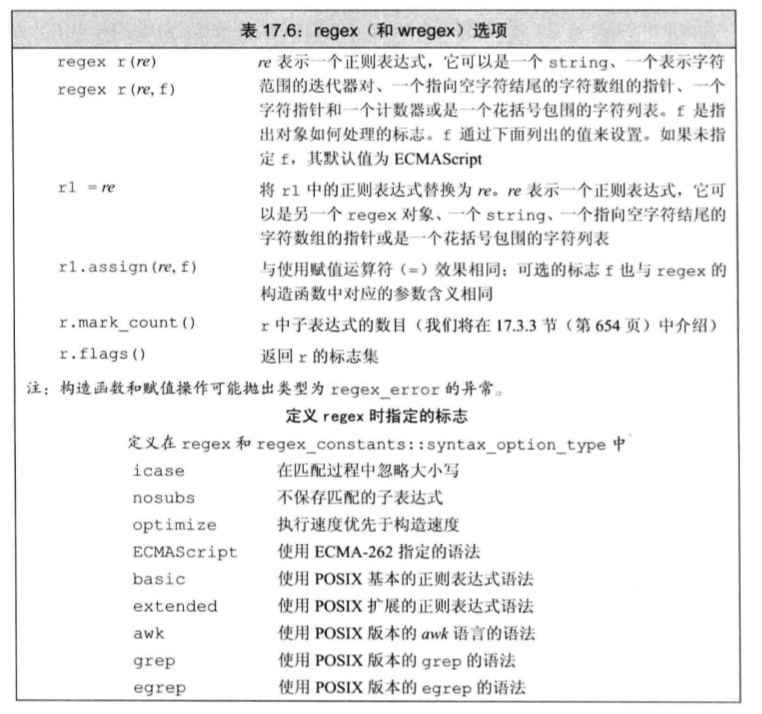
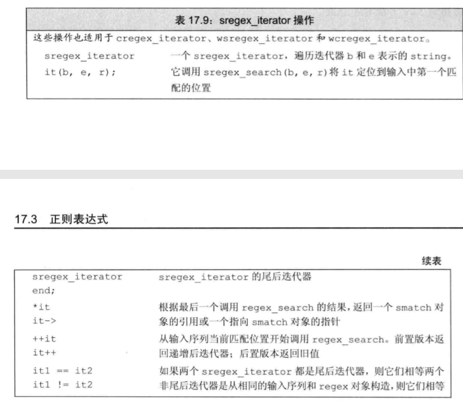
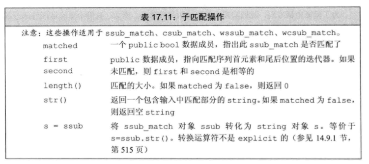
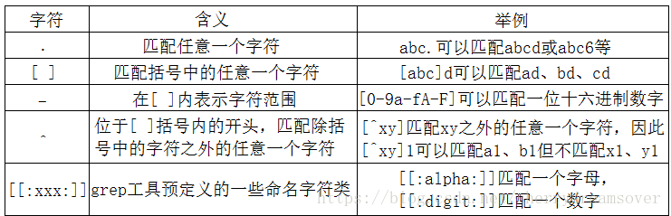
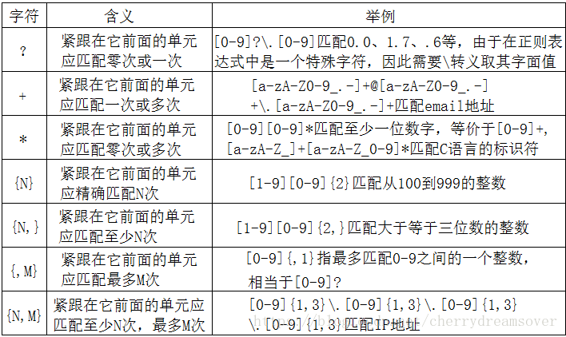
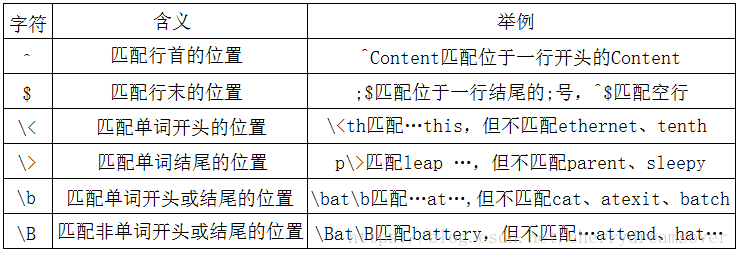
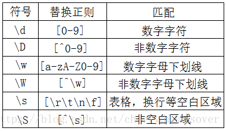

# 正则表达式


## 1 正则表达式组件

## 1.1 正则表达式的基础用法

### 头文件

```
#include<regex>
```

### 库组件


### 正则表达式对象


### 操作




```C++
#include<iostream>
#include<regex>

using namespace std;

int main(){
    //i 必须在e之前，除非在c之后
    string pattern("[^c]ei");
    pattern ="[a-zA-Z]"+pattern+"[a-zA-Z]";
    regex r(pattern);
    smatch results;

    string test_str="receipt freind theif receive";
    if(regex_search(test_str,results,r))   
        cout<<results.str()<<endl;
    else
        cout<<results.str()<<endl;
    return 0;
}
```

## 1.2 正则表达式的迭代器string对象

### regex迭代器选择


### regex迭代器使用，针对string



```
#include<iostream>
#include<regex>

using namespace std;

int main(){
    //i 必须在e之前，除非在c之后
    string pattern("[^c]ei");
    pattern ="[a-zA-Z]"+pattern+"[a-zA-Z]";
    regex r(pattern);
    smatch results;

    string test_str="receipt freind theif receive";
    if(regex_search(test_str,results,r))   
        cout<<results.str()<<endl;
    else
        cout<<results.str()<<endl;

    regex r2(pattern, regex::icase);

    sregex_iterator end_it;//string 
    sregex_iterator it(test_str.begin(),test_str.end(),r2);
    for(;it != end_it;++it){
        cout<<it->str()<<endl;
    }
    return 0;
}
```
### smatch的操作，针对string


## 1.3 子表达式的正则匹配


## 1.4 regex_replace


## 2 正则表达式规则

主要包括四类
* 字符类
* 数量限定符
* 位置限定符
* 特殊符号


### 2.1 字符类



### 2.2 数量限定符



### 2.3 位置限定符



### 2.4 特殊符号


### 2.5 普通字符集及其替换



### 2.6 贪婪模式与非贪婪模式

1. 贪婪模式：正则表达式匹配时，会尽量多的匹配符合条件的内容。
2. 非贪婪模式：正则表达式匹配时，会尽量少的匹配符合条件的内容，也就是说，一旦发现匹配符合要求，立马就匹配成功，而不会继续匹配下去（除非有g，开启下一组匹配）

### 2.7 特殊规则
* '[:alnum:]' 匹配任何字母和数字
Alphanumeric characters: '[:alpha:]' and '[:digit:]'.

* '[:alpha:]' 匹配任何字母
Alphabetic characters: '[:lower:]' and '[:upper:]'.

* '[:blank:]'
Blank characters: space and tab.

* '[:cntrl:]'
Control characters. In ASCII, these characters have octal codes 000 through 037, and 177 ('DEL'). In other character sets, these are the equivalent characters, if any.

* '[:digit:]' 匹配任何数字
Digits: '0 1 2 3 4 5 6 7 8 9'.

* '[:graph:]'
Graphical characters: '[:alnum:]' and '[:punct:]'.

* '[:lower:]' 匹配任何小写字母
Lower-case letters: 'a b c d e f g h i j k l m n o p q r s t u v w
x y z'.
* '[:print:]'
Printable characters: '[:alnum:]', '[:punct:]', and space.

* '[:punct:]' 匹配任何标点符号
Punctuation characters: '! " # $ % & ' ( ) * + , - . / : ; < = > ? @ [ \ ] ^ _ ' { | } ~'.

* '[:space:]' 匹配空格符
Space characters: tab, newline, vertical tab, form feed, carriage
return, and space.

* '[:upper:]' 匹配任何大写字母
Upper-case letters: 'A B C D E F G H I J K L M N O P Q R S T U V W
X Y Z'.

* '[:xdigit:]' 匹配任何16进制数字
Hexadecimal digits: '0 1 2 3 4 5 6 7 8 9 A B C D E F a b c d e f'.

### 2.8 正则规则速查表

| **字符**       | **描述**  |
|--------------|----------------|
| \            | 将下一个字符标记为一个特殊字符、或一个原义字符、或一个向后引用、或一个八进制转义符。例如，“n”匹配字符“n”。“\n”匹配一个换行符。串行“\\”匹配“\”而“\(”则匹配“(”。                                                                                                                       |
| ^            | 匹配输入字符串的开始位置。如果设置了RegExp对象的Multiline属性，^也匹配“\n”或“\r”之后的位置。                                                                                                                                                        |
| $            | 匹配输入字符串的结束位置。如果设置了RegExp对象的Multiline属性，$也匹配“\n”或“\r”之前的位置。                                                                                                                                                        |
| *            | 匹配前面的子表达式零次或多次。例如，zo*能匹配“z”以及“zoo”。*等价于{0,}。                                                                                                                                                                      |
| +            | 匹配前面的子表达式一次或多次。例如，“zo+”能匹配“zo”以及“zoo”，但不能匹配“z”。+等价于{1,}。                                                                                                                                                          |
| ?            | 匹配前面的子表达式零次或一次。例如，“do(es)?”可以匹配“does”或“does”中的“do”。?等价于{0,1}。                                                                                                                                                     |
| {n}          | n是一个非负整数。匹配确定的n次。例如，“o{2}”不能匹配“Bob”中的“o”，但是能匹配“food”中的两个o。                                                                                                                                                        |
| {n,}         | n是一个非负整数。至少匹配n次。例如，“o{2,}”不能匹配“Bob”中的“o”，但能匹配“foooood”中的所有o。“o{1,}”等价于“o+”。“o{0,}”则等价于“o*”。                                                                                                                       |
| {n,m}        | m和n均为非负整数，其中n<=m。最少匹配n次且最多匹配m次。例如，“o{1,3}”将匹配“fooooood”中的前三个o。“o{0,1}”等价于“o?”。请注意在逗号和两个数之间不能有空格。                                                                                                                  |
| ?            | 当该字符紧跟在任何一个其他限制符（*,+,?，{n}，{n,}，{n,m}）后面时，匹配模式是非贪婪的。非贪婪模式尽可能少的匹配所搜索的字符串，而默认的贪婪模式则尽可能多的匹配所搜索的字符串。例如，对于字符串“oooo”，“o+?”将匹配单个“o”，而“o+”将匹配所有“o”。                                                                       |
| .            | 匹配除“\n”之外的任何单个字符。要匹配包括“\n”在内的任何字符，请使用像“(.|\n)”的模式。                                                                                                                                                                |
| (pattern)    | 匹配pattern并获取这一匹配。所获取的匹配可以从产生的Matches集合得到，在VBScript中使用SubMatches集合，在JScript中则使用$0…$9属性。要匹配圆括号字符，请使用“\(”或“\)”。                                                                                                      |
| (?:pattern)  | 匹配pattern但不获取匹配结果，也就是说这是一个非获取匹配，不进行存储供以后使用。这在使用或字符“(|)”来组合一个模式的各个部分是很有用。例如“industr(?:y|ies)”就是一个比“industry|industries”更简略的表达式。                                                                                    |
| (?=pattern)  | 正向肯定预查，在任何匹配pattern的字符串开始处匹配查找字符串。这是一个非获取匹配，也就是说，该匹配不需要获取供以后使用。例如，“Windows(?=95|98|NT|2000)”能匹配“Windows2000”中的“Windows”，但不能匹配“Windows3.1”中的“Windows”。预查不消耗字符，也就是说，在一个匹配发生后，在最后一次匹配之后立即开始下一次匹配的搜索，而不是从包含预查的字符之后开始。 |
| (?!pattern)  | 正向否定预查，在任何不匹配pattern的字符串开始处匹配查找字符串。这是一个非获取匹配，也就是说，该匹配不需要获取供以后使用。例如“Windows(?!95|98|NT|2000)”能匹配“Windows3.1”中的“Windows”，但不能匹配“Windows2000”中的“Windows”。预查不消耗字符，也就是说，在一个匹配发生后，在最后一次匹配之后立即开始下一次匹配的搜索，而不是从包含预查的字符之后开始  |
| (?<=pattern) | 反向肯定预查，与正向肯定预查类拟，只是方向相反。例如，“(?<=95|98|NT|2000)Windows”能匹配“2000Windows”中的“Windows”，但不能匹配“3.1Windows”中的“Windows”。                                                                                                   |
| (?<!pattern) | 反向否定预查，与正向否定预查类拟，只是方向相反。例如“(?<!95|98|NT|2000)Windows”能匹配“3.1Windows”中的“Windows”，但不能匹配“2000Windows”中的“Windows”。                                                                                                    |
| x|y          | 匹配x或y。例如，“z|food”能匹配“z”或“food”。“(z|f)ood”则匹配“zood”或“food”。                                                                                                                                                        |
| [xyz]        | 字符集合。匹配所包含的任意一个字符。例如，“[abc]”可以匹配“plain”中的“a”。                                                                                                                                                                     |
| [^xyz]       | 负值字符集合。匹配未包含的任意字符。例如，“[^abc]”可以匹配“plain”中的“p”。                                                                                                                                                                    |
| [a-z]        | 字符范围。匹配指定范围内的任意字符。例如，“[a-z]”可以匹配“a”到“z”范围内的任意小写字母字符。                                                                                                                                                              |
| [^a-z]       | 负值字符范围。匹配任何不在指定范围内的任意字符。例如，“[^a-z]”可以匹配任何不在“a”到“z”范围内的任意字符。                                                                                                                                                       |
| \b           | 匹配一个单词边界，也就是指单词和空格间的位置。例如，“er\b”可以匹配“never”中的“er”，但不能匹配“verb”中的“er”。                                                                                                                                              |
| \B           | 匹配非单词边界。“er\B”能匹配“verb”中的“er”，但不能匹配“never”中的“er”。                                                                                                                                                                 |
| \cx          | 匹配由x指明的控制字符。例如，\cM匹配一个Control-M或回车符。x的值必须为A-Z或a-z之一。否则，将c视为一个原义的“c”字符。                                                                                                                                            |
| \d           | 匹配一个数字字符。等价于[0-9]。                                                                                                                                                                                                |
| \D           | 匹配一个非数字字符。等价于[^0-9]。                                                                                                                                                                                              |
| \f           | 匹配一个换页符。等价于\x0c和\cL。                                                                                                                                                                                              |
| \n           | 匹配一个换行符。等价于\x0a和\cJ。                                                                                                                                                                                              |
| \r           | 匹配一个回车符。等价于\x0d和\cM。                                                                                                                                                                                              |
| \s           | 匹配任何空白字符，包括空格、制表符、换页符等等。等价于[ \f\n\r	\v]。                                                                                                                                                                          |
| \S           | 匹配任何非空白字符。等价于[^ \f\n\r\t\v]。                                                                                                                                                                                      |
| \t           | 匹配一个制表符。等价于\x09和\cI。                                                                                                                                                                                              |
| \v           | 匹配一个垂直制表符。等价于\x0b和\cK。                                                                                                                                                                                            |
| \w           | 匹配包括下划线的任何单词字符。等价于“[A-Za-z0-9_]”。                                                                                                                                                                                 |
| \W           | 匹配任何非单词字符。等价于“[^A-Za-z0-9_]”。                                                                                                                                                                                     |
| \xn          | 匹配n，其中n为十六进制转义值。十六进制转义值必须为确定的两个数字长。例如，“\x41”匹配“A”。“\x041”则等价于“\x04&1”。正则表达式中可以使用ASCII编码。.                                                                                                                         |
| \num         | 匹配num，其中num是一个正整数。对所获取的匹配的引用。例如，“(.)\1”匹配两个连续的相同字符。                                                                                                                                                               |
| \n           | 标识一个八进制转义值或一个向后引用。如果\n之前至少n个获取的子表达式，则n为向后引用。否则，如果n为八进制数字（0-7），则n为一个八进制转义值。                                                                                                                                        |
| \nm          | 标识一个八进制转义值或一个向后引用。如果\nm之前至少有nm个获得子表达式，则nm为向后引用。如果\nm之前至少有n个获取，则n为一个后跟文字m的向后引用。如果前面的条件都不满足，若n和m均为八进制数字（0-7），则\nm将匹配八进制转义值nm。                                                                                       |
| \nml         | 如果n为八进制数字（0-3），且m和l均为八进制数字（0-7），则匹配八进制转义值nml。                                                                                                                                                                     |
| \un          | 匹配n，其中n是一个用四个十六进制数字表示的Unicode字符。例如，\u00A9匹配版权符号（©）。                                                                                                                                                               |
