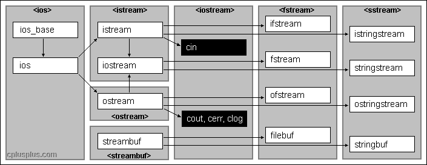
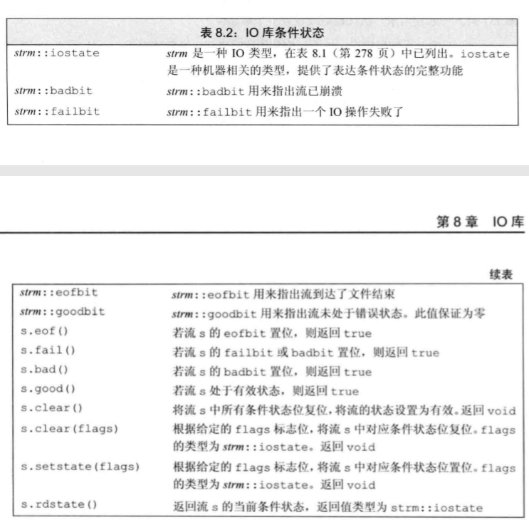

# IO 

> IO关系图




> 目录
> * 输入输出流iostream
> * 文件输入输出流fstream
> * 字符串输入输出流sstream

## 0 stream基础知识

### IO对象没有拷贝或赋值

### 管理IO的状态

* 用来记录stream可能出现的状态。



* 使用iostate对象来记录和管理io的状态
* `>> <<`流运算符（流函数）会返回io的运行状态，如果成功，则会返回true，否则返回false
```
#include<iostream>
using namespace std;

int main(){

    //IO state test
    int a{3};
    cin>>a;
    auto old_state = cin.rdstate();//返回s当前的状态
    cout<<old_state<<endl;//输出状态
    cout<<cin.eof()<<endl;//是否终止符
    cout<<cin.fail()<<endl;//是否IO过程错误，但未崩溃
    cout<<cin.bad()<<endl;//是否崩溃
    cout<<cin.good()<<endl;//是否正产
    cin.clear();//充值最初的状态
    cin.setstate(old_state);//设置流的状态

    int word =0;
    while(cin>>word){//>>函数返回流的状态。如果成功则返回true

    }
    return 0;
}
```

### 管理输出缓冲区

导致缓冲区刷新的方法

* 程序正常结束，main函数return之后，缓冲区刷新
* 缓冲区满时，缓冲区刷新。
* 流操纵符endl、flush、ends，刷新缓冲区
* 每个输出操作后，使用流操纵符unitbuf设置流的内部状态，来清空缓冲区。unitbuf是流的属性。
* 一个输出流可能被关联到另一个流。关联到流的缓冲区会被刷新。cin、cerr、cout相互关联。

```
cout<<""<<endl;
cout<<""<<flush;
cout<<""<<ends;

cout<<unitbuf;//所有的输出操作后立即刷新缓冲区
cout<<nounitbuf;//回到正常的刷新方式
```

## 1 iostream


## 2 fstream


### 文件流的方法

### 文件模式

### 实例


## 3 sstream

### string流
```
    //string stream
    struct Person{
        string name;
        string phone;
    };
    vector<Person> p;
    string line;
    if(getline(cin,line)){
        Person pp;
        stringstream record(line);
        record>>pp.name;
        record>>pp.phone;
        p.push_back(pp);
    }
    cout<<p[0].name<<endl;
    cout<<p[0].phone<<endl;
```