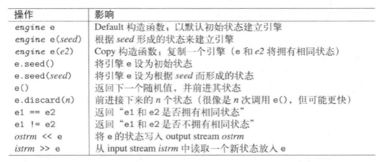
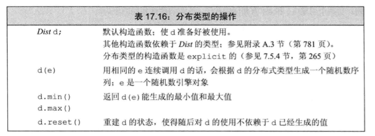
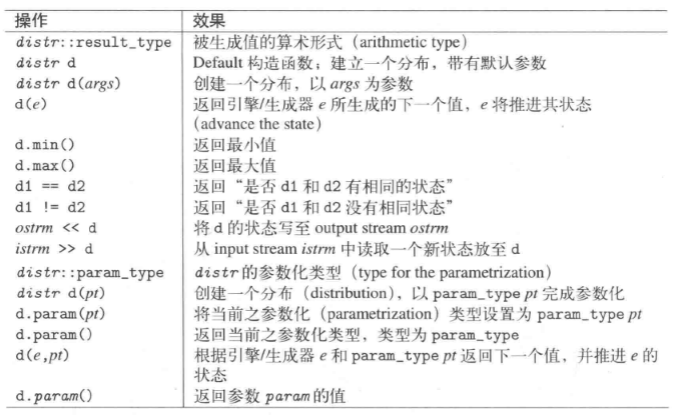
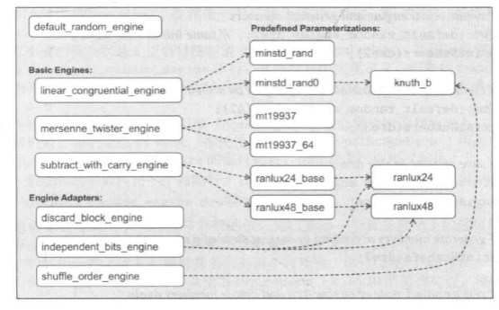
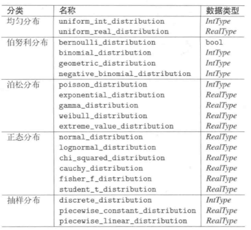
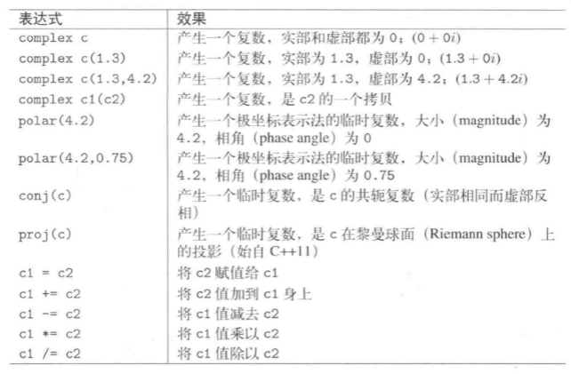
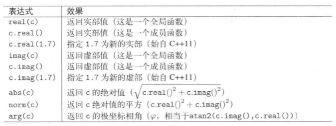
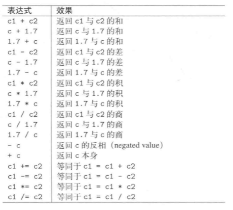

# 数值方法


## 1.1 随机数

### 头文件

```
#include<random>
```

### 随机数概述

* 随机数分布。随机数的分布方式distribution
* 随机数引擎。产生随机数engin。随机性的源头

* 随机数生成器。由一个随机数引擎和一个随机数分布，组合成一个随机数生成器。


### 随机数引擎的操作


* 编译器会自动选择一个随机数引擎作为default_random_engine的类型的引擎。
```
    default_random_engine e;
    cout<<e()<<endl;
```

### 随机数分布的操作



* 需要给默认的随机数引擎选择一个分布序列。
```
uniform_int_distribution<unsigned> u<0,9>;
default_random_engine e(323);//指定初始化的种子
```

### 生成随机数的标准操作

```
#include <iostream>
#include <random>

#include<ctime>
using namespace std;
 
int main( ){
    default_random_engine e;
    cout<<time(NULL)<<endl;
    e.seed(time(NULL));
    uniform_int_distribution<unsigned> u(0, 9);
    for(int i=0; i<10; ++i)
        cout<<u(e)<<endl;
    return 0;
}
```
## 1.2 随机分布引擎
C++提供了16个随机数引擎。


* default_random_engine
## 1.3 随机分布类型

C++提供了五大类随机分布




* uniform_int_distribution<T>(up_bound,down_bound)均匀整数分布T:short int long longlong。指定均匀分布的最大最小值。
* uniform_real_distribution<T>(up_bound,down_bound)均匀浮点数分布T:float double.指定均匀分的的最大最小值

## 1.4 C的方法

### rand()
```
rand()%100//在100中产生随机数， 但是因为没有随机种子所以，下一次运行也是这个数，因此就要引出srand
```

### srand()

```
srand((int)time(0));  // 产生随机种子把0换成NULL也行
```
## 2 复数

### 常用操作




### 数值访问



### 算数运算


### 输入输出运算


### 超越函数


## 3 全局数值函数

### 头文件
```
#include<cmath>
#include<cstdlib>
```

### 数值函数


## 4 Valarray 数值数组