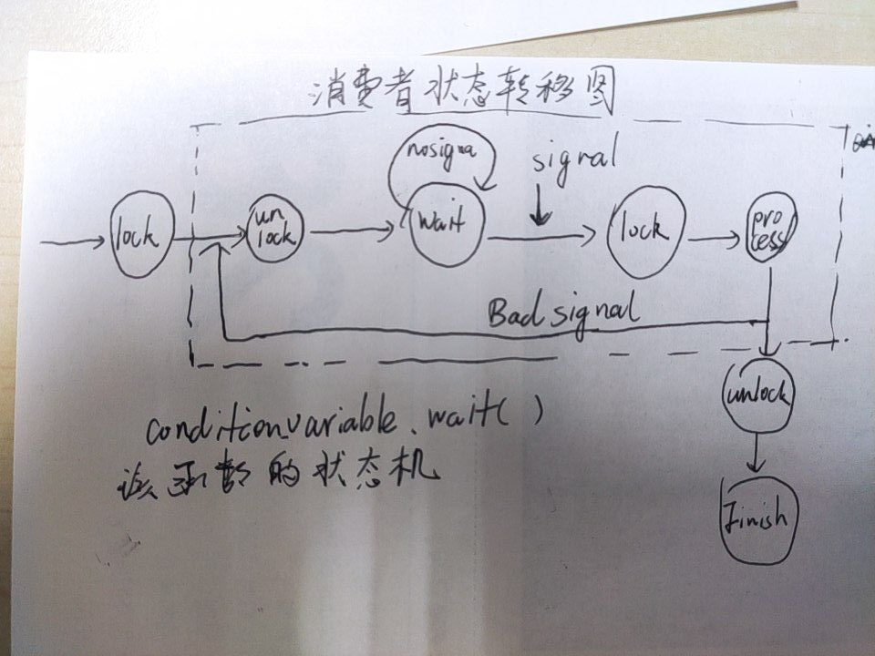

# 并发编程与多线程


## 1. 基础知识

### C++多线程

* **线程**：线程是操作系统能够进行CPU调度的最小单位，它被包含在进程之中，一个进程可包含单个或者多个线程。可以用多个线程去完成一个任务，也可以用多个进程去完成一个任务，它们的本质都相当于多个人去合伙完成一件事。
* **多线程并发**多线程是实现并发(双核的真正并行或者单核机器的任务切换都叫并发）的一种手段，多线程并发即多个线程同时执行,一般而言，多线程并发就是把一个任务拆分为多个子任务，然后交由不同线程处理不同子任务,使得这多个子任务同时执行。
* **C++多线程并发**C++98标准中并没有线程库的存在,而在C++11中才提供了多线程的标准库,提供了管理线程、保护共享数据、线程间同步操作、原子操作等类，。（简单情况下）实现C++多线程并发程序的思路如下：将任务的不同功能交由多个函数分别实现，创建多个线程，每个线程执行一个函数，一个任务就这样同时分由不同线程执行了。

### 相关的头文件说明


* thread头文件：存储thread线程与this_thread 命名空间的东西。基础实现
* future头文件：存储future、promise、async相关的类。高级实现
* mutex头文件：存储异步通信的相关的类


## 2. 高级接口：Async与Future
### 头文件
```
#include<futrue>
```

### future说明
标准库提供了一些工具来获取异步任务（即在单独的线程中启动的函数）的返回值，并捕捉其所抛出的异常。这些值在共享状态中传递，其中异步任务可以写入其返回值或存储异常，而且可以由持有该引用该共享态的 std::future 或 std::shared_future 实例的线程检验、等待或是操作这个状态。


定义于头文件 `<future>`
* promise存储一个值以进行异步获取(类模板)
* packaged_task打包一个函数，存储其返回值以进行异步获取(类模板)
* future等待被异步设置的值(类模板)
* shared_future等待被异步设置的值（可能为其他 future 所引用）(类模板)
* async异步运行一个函数（有可能在新线程中执行），并返回保有其结果的 std::future(函数模板)
* launch指定 std::async 所用的运行策略(枚举)
* future_status指定在 std::future 和 std::shared_future上的定时等待的结果(枚举)

Future 错误
* future_error报告与 future 或 promise 有关的错误(类)
* future_category鉴别 future 错误类别(函数)
* future_errc鉴别 future 错误码(枚举)

### 编程实例
```
#include<iostream>
#include<future>
#include<chrono>
#include<random>
#include<iostream>
#include<exception>

using namespace std;

int do_something(char c){
    //初始化了一个随机数引擎和一个随机数分布
    default_random_engine dre(c);
    uniform_int_distribution<int> id(10,1000);

    for(int i =0;i<10;++i){
        //随机停止一段时间。
        this_thread::sleep_for(chrono::milliseconds(id(dre)));
        cout.put(c).flush();
    }
    return c;
}

int func1(){
    return do_something('.');
}

int func2(){
    return do_something('+');
}

int main(){
    //启动异步线程，执行函数1。使用future作为占位符
    //async的返回值与func1自动匹配，是模板函数。
    //future object的类型也可以与async自动匹配，设置成auto result1()
    //async接受任何可调用对象。包括函数、函数指针、lambda函数
    future<int> result1(async(func1));

    //主线程中执行函数2
    int result2 = func2();

    int result=0;
    try
    {
        result = result1.get()+result2;

    }
    catch(const std::exception& e)
    {
        std::cerr << e.what() << '\n';
    }
    
    //计算结果，阻塞主线程

    //输出结果
    cout<<result<<endl;
    return 0;
}
```
### async与future说明
* sync的返回值与func1自动匹配，是模板函数。
* future object的类型也可以与async自动匹配，设置成auto result1()
* async接受任何可调用对象。包括函数、函数指针、lambda函数

### future说明

| 函数名字| 作用|
|---|---|
| get | 调用future.get()函数会阻塞线程。等待另一个线程结束返回结果。如果不调用get函数。则main函数在结束前会等待这个线程结束并返回。get函数会捕获线程内的异常抛出，可以在get外捕获异常 |
|valid|future.valid()检测线程是否处于正常运行状态还是已经退出。|
|wait|future.wait()函数会阻塞线程。但不需要获得返回结果。|
|wait_for|future.wait_for(std::chrono::seconds(10));等待最多10秒|
|wait_until|future.wait_until(system_clock::now()+chrono::minutes(1));等待当前时间后一分钟。|


### future_status说明

* wait_for和wait_until返回future status

|常量	|解释|
|---|---|
|deferred	|共享状态含有延迟的函数，故将仅在显式请求时计算结果|
|ready	|共享状态就绪|
|timeout	|共享状态在经过指定的时限时长前仍未就绪|

### shared_future说明

* 其操作与future完全一致，可用于同时向多个线程发信。多个线程可以多次调用get函数。来获取线程执行结果。

## 3. 底层接口：Thread与Promise
### 头文件
```
#include<thread>
```

### Thread与future的区别

* future在一定程度上提供了线程通信和线程同步的方法。例如get可以获得另一个线程的返回值。wait()可以等待线程，实现线程同步。但是thread没有提供任何线程通信的方法。需要自己实现线程通信。（在操作系统部分，应该理解线程通信的原理和所有的方法）
* 异常无法在线程之间传递。
* 必须声明是同步线程join()还是一部线程detach()。future和async实现的线程是异步线程。可以使用get(),wait()进行同步。
* 如果线程运行与后台，main函数没有通过join等待线程结束，后台线程会被强制终止。


### thread说明

* 观察器

|函数|作用|
|---|---|
joinable | 检查线程是否可合并，即潜在地运行于平行环境中(公开成员函数)
get_id | 返回线程的 id(公开成员函数)
native_handle | 返回底层实现定义的线程句柄(公开成员函数)
hardware_concurrency | [静态]返回实现支持的并发线程数(公开静态成员函数)

* 操作


|函数|作用|
|---|---|
join | 等待线程完成其执行
detach | 容许线程从线程句柄独立开来执行


### thread编程实现

```
#include<thread>
#include<chrono>
#include<random>
#include<iostream>
#include<exception>


using namespace std;

void doSomething(int num,char c){
    try
    {
        default_random_engine dre(42*c);
        uniform_int_distribution<int> id(10,1000);
        for(int i=0;i<num;++i){
            this_thread::sleep_for(chrono::milliseconds(id(dre)));
            cout.put(c).flush();
        }
    }
    catch(const std::exception& e)
    {
        cerr << e.what() << '\n';
        cerr << this_thread::get_id()<<endl;
    }
}

int main(){
    try{
        thread t1(doSomething,5,'.');
        cout<<"start thread"<<t1.get_id()<<endl;
        //启动了多个异步线程
        for(int i=0;i<5;++i){
            thread t(doSomething,10,'a'+i);//启动了5个线程
            cout<<"detach start thread"<<t.get_id()<<endl;
            t.detach();
        }
        cin.get();
        cout<<"join thread"<<t1.get_id()<<endl;
        //进行线程同步
        t1.join();
    }
    catch(const exception& e){
        cerr<<e.what()<<endl;
    }
}
```
* 卸离之后，无法控制线程。最好使用值传递的方式启动线程。使用引用传递在线程中可能会访问无效的变量（已经被销毁）。


### promise说明

提供了异步通信的方法。async相当于自动设置了promise推端，利用return语句抛出一个promise，解锁future.get的阻塞；使用thread启动线程的话，需要手动设置promise实现信号发出，接触future.get的阻塞。

* 类模板promise 提供存储值或异常的设施，之后通过promise 对象所创建的 future 对象异步获得结果。promise 只应当使用一次。
* 每个 promise 与共享状态关联，共享状态含有一些状态信息和可能仍未求值的结果，它求值为值（可能为 void ）或求值为异常。 promise 可以对共享状态做三件事：
  * 使就绪： promise 存储结果或异常于共享状态。标记共享状态为就绪，并解除阻塞任何等待于与该共享状态关联的 future 上的线程。
  * 释放： promise 放弃其对共享状态的引用。若这是最后一个这种引用，则销毁共享状态。除非这是 std::async 所创建的未就绪的共享状态，否则此操作不阻塞。
  * 抛弃： promise 存储以 future_errc::broken_promise 为 error_code 的 future_error 类型异常，令共享状态为就绪，然后释放它。
* promise 是 promise-future 交流通道的“推”端：存储值于共享状态的操作同步于任何在共享状态上等待的函数（如 std::future::get ）的成功返回。其他情况下对共享状态的共时访问可能冲突：例如shared_future::get 的多个调用方必须全都是只读，或提供外部同步。


|函数|作用|
|----|----|
get_future | 返回与承诺的结果关联的 future(公开成员函数)
set_value | 设置结果为指定值(公开成员函数)
set_value_at_thread_exit| 设置结果为指定值，同时仅在线程退出时分发提醒(公开成员函数)
set_exception | 设置结果为指示异常(公开成员函数)
set_exception_at_thread_exit |设置结果为指示异常，同时仅在线程退出时分发提醒(公开成员函数)


### promise编程

```
#include<thread>
#include<future>
#include<iostream>
#include<string>
#include<exception>
#include<functional>
#include<utility>

using namespace std;
void doSomething(promise<string>& p){
    try{
        cout<<"read char x for exception"<<endl;
        char c = cin.get();
        if(c=='x'){
            throw runtime_error(string("char")+c+"fault");
        }
        else{
            string s = string("char")+c+"correct";
            p.set_value(move(s));//移动赋值函数。防止退出局部变量后销毁。
        }
    }
    catch(...){
        p.set_exception(current_exception());
    }
}

int main()
{

    try{
        promise<string>p;
        thread t(doSomething,std::ref(p));
        t.detach();

        future<string> f(p.get_future());

        cout<<"result:"<<f.get()<<endl;
    }
    catch(const exception& e){
        std::cerr<<"exception"<<e.what()<<endl;
    }
}
```

### package_task说明
* 是一个线程池，可以用来多次启动某一个线程。
* 是async方法的扩展版，通过return语句来抛出一个默认的promise，解锁future的执行。


|函数|作用|
|---|---|
get_future|返回与承诺的结果关联的 std::future
operator() | 执行函数
make_ready_at_thread_exit | 执行函数，并确保结果仅在一旦当前线程退出时就绪
reset | 重置状态，抛弃任何先前执行的存储结果

### package_task编程说明

```
//线程执行的函数
double doSomething(int x,int y);
//申请一个线程池。
package_task<double(int,int)> task(doSomething);

//获得线程池的future
future<double> f = task.get_future();

//使用线程池启动一个县城
task(7,5);

//使用future获得线程执行的结果。
double res = f.get();
```
## 4 线程同步与数据访问

### 存在问题

多个线程共享资源出现访问冲突

* 读读互补冲突
* 读写冲突
* 写写冲突

### 解决问题的方法

保证操作的原子性和次序。atomicity不可分割。order按次序执行。

* future和promise能够保证原子性和次序。一定是在形成返回值和异常后，future才会读取数据，否则进行堵塞。
* mutex和lock
* condition variable
* atomic data type底层接口

## 4.1 mutex和lock

### mutex简单说明mutex

|函数|作用|
|---|---|
lock|锁定互斥，若互斥不可用则阻塞
try_lock|尝试锁定互斥，若互斥不可用则返回
unlock|解锁互斥

```
int val ;
mutex valMutex;
valMutex.lock();

//val的访问和修改

valMutex.unlock();
```
* 每次访问前上锁。访问后开锁。
* 如果其他程序已经上锁，那么当前程序阻塞，直到其他程序释放锁。（发送开锁信号激活）
* 存在的问题：中途出现异常，无法执行开锁。资源会被永久上锁。
* mutex尝试锁try_lock()用来判断资源是否上锁。如果成功就返回true，此时调用可以上锁

```
mutex m;

while(m.try_lock()==false){
    doSomethingOthers();
}

lock_guard<mutex> lg(m,adopt_lock);
```

### mutex递归锁recursive_mutex
* recursive_mutex与mutex操作完全一致。
* 死锁：两个程序分别锁上了对方需要的资源，并在相互等待。
* 递归锁：一个线程两次上锁，导致第二次上锁的时候资源被自己占用。也是一种死锁。
* recursive_mutex 能够防止递归锁出现。即防止同一个线程多次上锁同一个资源

### mutex时间锁timed_mutex/recursive_time_mutex

|函数|作用|
|---|---|
lock|锁定互斥，若互斥不可用则阻塞
try_lock|尝试锁定互斥，若互斥不可用则返回
try_lock_for|尝试锁定互斥，若互斥在指定的时限时期中不可用则返回
try_lock_until|尝试锁定互斥，若直至抵达指定时间点互斥不可用则返回
(公开成员函数)
unlock|解锁互斥


* 等待某个时间段。返回是否上锁。有如下成员函数
```
try_lock_for()
try_lock_until()
```

### mutex进阶版本lock_guard
```
std::lock_guard<std::mutex> sbguard1(my_mutex1, std::adopt_lock);// std::adopt_lock标记作用；
```

* 使用lock_guard管理锁。这样当出现异常后，lock_guard局部变量被销毁，执行析构函数的时候回自动释放资源锁。
* lock_guard的第二个标质量adopt_lock标记的效果就是假设调用一方已经拥有了互斥量的所有权（已经lock成功了）；通知lock_guard不需要再构造函数中lock这个互斥量了。
```
//mute & lock
#include<future>
#include<mutex>
#include<iostream>
#include<string>

using namespace std;

//互斥体的控制变量
mutex printMutex;

void print(const std::string&s){
    // 如果没有枷锁，多个线程共同调用会乱序输出
    lock_guard<mutex> l(printMutex);
    for(char c:s){
        cout.put(c);
    }
    cout<<endl;
}

int main()
{
    auto f1 = async(print,"Hello from a first thread");
    auto f2 = async(print,"hello from a second thread");

    print("hello from the main thread");

    return 0;
}
```

### mutex包装器unique_lock
* 加强版的lock_guard。保存一个mutex对象。可以只是用这一个函数解决所有问题。
* lock_gurad只能在析构函数中解锁，无法在同一个线程中进行细粒度的控制。但是unique_lock可以自己加锁解锁。

|函数|作用|
|---|---|
lock | 锁定关联互斥
try_lock |  尝试锁定关联互斥，若互斥不可用则返回
try_lock_for |  试图锁定关联的可定时锁定 (TimedLockable) 互斥，若互斥在给定时长中不可用则返回
try_lock_until |  尝试锁定关联可定时锁定 (TimedLockable) 互斥，若抵达指定时间点互斥仍不可用则返回
unlock |  解锁关联互斥
release |  将关联互斥解关联而不解锁它.返回unique_lock所有的锁的指针。可以自己解锁
mutex |  返回指向关联互斥的指针
owns_lock |  测试锁是否占有其关联互斥
operator bool |  测试锁是否占有其关联互斥


```
void shared_print(string msg, int id) {

        std::unique_lock<std::mutex> guard(_mu);
        //do something 1
        guard.unlock(); //临时解锁

        //do something 2

        guard.lock(); //继续上锁
        // do something 3
        f << msg << id << endl;
        cout << msg << id << endl;
        // 结束时析构guard会临时解锁
        // 这句话可要可不要，不写，析构的时候也会自动执行
        // guard.ulock();
    }
```

## 4.2 condition variable

### 简介
* future的目的是处理线程的返回值和异常。因为它只能携带一次数据返回。
* 这个明显是解决生产者和消费者问题。或者读、写问题。因为资源有数量限制。而之前的mutex只有互斥限制，也就是说，mutex与lock只能控制数量为1的消费者互斥访问问题。
* condition variable控制数量大于1 的生产和消费问题

### condition_variable原理
* condition_variable 类是同步原语，能用于阻塞一个线程，或同时阻塞多个线程，直至另一线程修改共享变量（条件）并通知 condition_variable 。

* 有意修改变量的线程必须
  1. 获得 std::mutex （常通过 std::lock_guard ）
  2. 在保有锁时进行修改
  3. 在 std::condition_variable 上执行 notify_one 或 notify_all （不需要为通知保有锁）

* 即使共享变量是原子的，也必须在互斥下修改它，以正确地发布修改到等待的线程。

* 任何有意在 std::condition_variable 上等待的线程必须
  1. 在与用于保护共享变量者相同的互斥上获得 std::unique_lock<std::mutex>
  2. 执行下列之一：
     1. 检查条件，是否为已更新或提醒它的情况
     2.  执行 wait 、 wait_for 或 wait_until ，等待操作**自动释放互斥**，并悬挂线程的执行。
     3.  condition_variable 被通知时，时限消失或虚假唤醒发生，**线程被唤醒，且自动重获得互斥**。之后线程应检查条件，若唤醒是虚假的，则继续等待。
     4.  或者,使用 wait 、 wait_for 及 wait_until 的有谓词重载，它们包揽以上三个步骤

> condition_variable的消费者。有一下三种情况。
> * 当资源没有被生产出来，没有加锁时，加锁，wait(),解锁，等待通知。
> * 当资源被锁时，在unique_lock处等待解锁。
> * 当资源生产出来，没有加锁时，直接执行。

> 对于第一种情况：condition_varaiblewait操作能够解锁等待信号量。当信号量来到时，加锁执行操作，然后解锁，退出。当信号量来到时，加锁，但是第二个参数的内容发现是虚假信号，能够继续解锁等待信号量。



### condition_variable操作


|函数|作用|
|---|---|
notify_one|通知一个等待的线程
notify_all|通知所有等待的线程
wait|阻塞当前线程，直到条件变量被唤醒
wait_for|阻塞当前线程，直到条件变量被唤醒，或到指定时限时长后
wait_until|阻塞当前线程，直到条件变量被唤醒，或直到抵达指定时间点

### 使用条件

* 一个“存放数据”的对象，或一个“表示条件满足”的flag。此处的readyFlag
* 一个mutex对象，此处的readyMutex
* 一个condition_variable对象词的readyCondVar

### 编程实现——简单使用

```
//condition variable生产者消费者问题
#include<condition_variable>
#include<mutex>
#include<future>
#include<iostream>

using namespace std;


bool readyFlag;
mutex readyMutex;
condition_variable readyCondVar;

void thread1(){
    cout<<"thread1"<<endl;
    cin.get();

    //以下是lock保护区
    {
        lock_guard<mutex> lg(readyMutex);
        readyFlag = true;
    }
    readyCondVar.notify_one();
}

void thread2(){
    {
        unique_lock<mutex> ul(readyMutex);
        readyCondVar.wait(ul,[]{return readyFlag;});
    }

    cout<<"done"<<endl;
    return;
}

int main(){
    auto f1 = async(thread1);
    auto f2 = async(thread2);
}
```
### 编程实现——多线程Queue
* 生产者和消费者问题

```
//condition variable实现多线程queue
#include<condition_variable>
#include<mutex>
#include<future>
#include<thread>
#include<iostream>
#include<queue>

using namespace std;

queue<int> que;//消费对象
mutex queueMutex;
condition_variable queueCondVar;

//生产者
void provider(int val){
    for(int i=0;i<6;++i){
        lock_guard<mutex> lg(queueMutex);
        que.push(val+i);
        //貌似这句话会被优化掉
        this_thread::sleep_for(chrono::microseconds(100000));
    }
    queueCondVar.notify_one();

    this_thread::sleep_for(chrono::microseconds(val));
}


//消费者
void consumer(int num){
    while(true){
        int val;
        {
            unique_lock<mutex> ul(queueMutex);
            queueCondVar.wait(ul,[]{return !que.empty();});
            val = que.front();
            que.pop();
            cout<<"consumer"<<num<<":"<<val<<endl;

        }
    }

}

int main()
{
    //生产者列表
    auto p1 = async(provider,1000);
    auto p2 = async(provider,2000);
    auto p3 = async(provider,3000);

    //消费者列表
    auto c1 = async(consumer,1);
    auto c2 = async(consumer,2);
}
```
## 4.3 atomic data

> 等到以后再写吧。感觉没有必要。


## 5 this_thread

|函数|作用|
|----|----|
get_id | 获得thread id (function )
yield | 放弃执行 (function )
sleep_until | 休眠到某个时间节点chrono::timepoint (function )
sleep_for | 休眠某个时间段chrono::duration (function )
