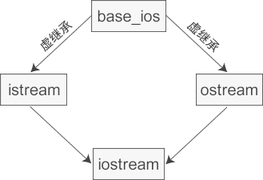

## 1 多态

### 多态分类

1. 静态多态，是只在编译期间确定的多态。静态多态在编译期间，根据函数参数的个数和类型推断出调用的函数。静态多态有两种实现的方式
   1. 重载。（函数重载）
   2. 模板。
2. 动态多态，是运行时多态。通过虚函数机制实现（也称为重写override），使用父类的指针或者是引用，调用一个虚函数时，会根据其指向的具体对象确定调用的函数。基类和子类维护一个虚函数表，对象当中包含的虚指针，指向基类或子类的虚函数表。如果子类没有重写父类的虚函数则会直接调用父类的方法，否则调用子类重写的方法。


### 多态原理

* （对象的多态性）使用基类的引用或指针调用一个函数时。无法确定该函数作用的对象是什么类型。因为它可能是一个基类的对象，也可能是一个派生类的对象。
* （函数的多态性）如果该函数是虚函数，则直到运行时才会决定执行哪个版本。判断的依据是引用或指针所绑定的对象真实类型。
* 函数绑定。对非虚函数的调用在编译时进行绑定。我们通过对象进行的函数调用也在编译时绑定。对象的类型是确定不变的。

> 也就是说多态性体现在指针和引用的不确实能够性上。但对象在内存中的状态是确定的。当且晋档通过指针或引用调用虚函数是，才会在运行时解析该调用，也只有在这种情况下对动态类型才有可能与静态类型不同。

```C++
    Bulk_quote a();//定义了对象a。这时候，无法触发多态。
    Bulk_quote* b = new Bulk_quote();//指针可以指向不同的类型的对象。
    Bulk_quote &b = a;//引用可以指向不同类型的对象。
```

### 重写与重定义对比
* 重定义：基类中没有声明函数是虚函数。派生类中对普通函数进行了重定义。只是作用域上的覆盖，没有触发多态和动态绑定。
* 重定义不能触发动态多态。无论指针或引用绑定的是什么对象，都会根据指针或引用的类型，调用该类型的函数。而不是使用虚指针查找虚函数表。只有调用虚函数的时候，才会去根据对象的虚函数指针，查找类中的虚函数表。

```C++
class A{
public:
    int a;
    A():a(10){};
    int real_ex(){
        return a;
    }
    virtual int virtual_ex(){
        return a;
    }
};

class B:public A{
public:
    int b;
    B():b(20){};
    int real_ex(){//重定义A的函数
        return b;
    }
    virtual int virtual_ex(){//重写A的函数
        return b;
    }
};
int main(){

    Quote p(Bulk_quote());//直接初始化，拷贝构造函数
    Quote q = Bulk_quote();//赋值初始化，拷贝构造函数
    
    // B test_b;
    // A* test = &test_b;
    A* test=new B();
    cout<<test->real_ex()<<endl;//B重定义了函数。但是A类型的指针，调用基类的函数。
    cout<<test->virtual_ex()<<endl;//B重写类函数。B类型的对象，动态绑定，调用了派生类的函数。
    return 0;
}
```
### 实现条件
运行时多态的条件：
* 必须是继承关系
* 基类中必须包含虚函数，并且派生类中一定要对基类中的虚函数进行重写。
* 通过基类对象的指针或者引用调用虚函数。

### 注意事项

以下函数不能作为虚函数
1. 友元函数，它不是类的成员函数
2. 全局函数
3. 静态成员函数，它没有this指针
3. 构造函数，拷贝构造函数，以及赋值运算符重载（可以但是一般不建议作为虚函数）

### 实现原理
//参考虚函数。


## 2 虚函数

### 虚函数的定义
* 虚函数：基类希望它的派生类自定义适合自身的版本。为了实现多态

```
class Animal{
public:
    virtual double price(int n)const;
}
```

### 虚函数的原理
* 除了构造函数的非静态函数都可以是虚函数。
* 关键字virtual只能出现在类内部的声明语句之前。不能出现在类外部的函数定义。
* 如果把一个函数声明成虚函数，则该函数在派生类中也是隐式的虚函数。（即派生类的派生类，也需要重写次函数）
* 派生类可以不用重写虚函数。
* 派生类可以在它重写的虚函数前使用**virtual关键字**

### 回避虚函数的机制

* 类中的数据成员和成员函数是相互独立的。两者没有必然的联系。
* 成员函数通过this指针访问对象的数据成员。在继承体系中，this指针的指向是可以改变。即可以用派生类对象的this指针传递给基类的函数，从而实现派生类调用基类函数的方法。
* 调用是不进行动态绑定，而是强迫执行虚函数的某个特定版本。通过域作用运算符实现。
```
//强制调用基类中定义的函数
Bulk_quote *baseP = Bulk_quote();
double u = baseP->Quote::net_price();
```
### 纯虚函数和抽象基类

```
 virtual void Eat() = 0;
```
* 一个纯虚函数无须定义，在函数体的位置书写=0，就可以讲一个虚函数说明为纯虚函数。只能出现在类内部的函数声明语句出。在类的内部必须没有定义，在类的外部可以定义纯虚函数。
* 含有纯虚函数的类是抽象基类。纯虚函数相当于接口，不能创建抽象基类的对象。
* 派生类构造函数只初始化它的直接基类。


### 虚函数表和虚指针原理

```C++
class A
{
public:
    virtual void f();
    virtual void g();
private:
    int a
};
 
class B : public A
{
public:
    void g();
private:
    int b;
};//A、B实现省略
```
* 因为A有virtual void f（）和g（），所以编译器为A类准备了一个虚函数表vtableA，内容如下：


```
A::f 的地址
A::g 的地址
```

* B因为继承了A，所以编译器也为B准备了一个虚函数表vtableB，内容如下：
```
A::f 的地址
B::g 的地址
```
> 注意：因为B::ｇ是重写了的，所以B的虚表的g放的是B::g的入口地址，但是f是从上面的A继承下来的，所以f的地址是A::f的入口地址。

* 某处有语句 B bB;的时候，编译器分配空间时，除了A的int a，B的成员int b；以外，还分配了一个虚指针vptr，指向B的虚函数表vtableB，bB的布局如下：

```
vptr ： 指向B的虚表vtableB
int a： 继承A的成员
int b： B成员
```

## 3 虚继承和虚基类

### 多继承
* 多继承（Multiple Inheritance）是指从多个直接基类中产生派生类的能力，多继承的派生类继承了所有父类的成员。尽管概念上非常简单，但是多个基类的相互交织可能会带来错综复杂的设计问题，命名冲突就是不可回避的一个。

* 多继承时很容易产生命名冲突，即使我们很小心地将所有类中的成员变量和成员函数都命名为不同的名字，命名冲突依然有可能发生，比如典型的是菱形继承，如下图所示：

### 菱形继承


* 类 A 派生出类 B 和类 C，类 D 继承自类 B 和类 C，这个时候类 A 中的成员变量和成员函数继承到类 D 中变成了两份，一份来自 A-->B-->D 这条路径，另一份来自 A-->C-->D 这条路径。

* 下面是菱形继承的具体实现：

```
//间接基类A
class A{
protected:
    int m_a;
};
//直接基类B
class B: public A{
protected:
    int m_b;
};
//直接基类C
class C: public A{
protected:
    int m_c;
};
//派生类D
class D: public B, public C{
public:
    void seta(int a){ m_a = a; }  //命名冲突
    void setb(int b){ m_b = b; }  //正确
    void setc(int c){ m_c = c; }  //正确
    void setd(int d){ m_d = d; }  //正确
private:
    int m_d;
};
int main(){
    D d;
    return 0;
}
```
* 这段代码实现了上图所示的菱形继承，第 25 行代码试图直接访问成员变量 m_a，结果发生了错误，因为类 B 和类 C 中都有成员变量 m_a（从 A 类继承而来），编译器不知道选用哪一个，所以产生了歧义。

* 为了消除歧义，我们可以在 m_a 的前面指明它具体来自哪个类：
```
void seta(int a){ B::m_a = a; }
```
* 这样表示使用 B 类的 m_a。当然也可以使用 C 类的：
```
void seta(int a){ C::m_a = a; }
```

### 虚继承（Virtual Inheritance）

* 为了解决多继承时的命名冲突和冗余数据问题，C++ 提出了虚继承，使得在派生类中只保留一份间接基类的成员。

* 在继承方式前面加上 virtual 关键字就是虚继承，请看下面的例子：

```
//间接基类A
class A{
protected:
    int m_a;
};
//直接基类B
class B: virtual public A{  //虚继承
protected:
    int m_b;
};
//直接基类C
class C: virtual public A{  //虚继承
protected:
    int m_c;
};
//派生类D
class D: public B, public C{
public:
    void seta(int a){ m_a = a; }  //正确
    void setb(int b){ m_b = b; }  //正确
    void setc(int c){ m_c = c; }  //正确
    void setd(int d){ m_d = d; }  //正确
private:
    int m_d;
};
int main(){
    D d;
    return 0;
}
```
* 这段代码使用虚继承重新实现了上图所示的菱形继承，这样在派生类 D 中就只保留了一份成员变量 m_a，直接访问就不会再有歧义了。

* 虚继承的目的是让某个类做出声明，承诺愿意共享它的基类。其中，这个被共享的基类就称为虚基类（Virtual Base Class），本例中的 A 就是一个虚基类。在这种机制下，不论虚基类在继承体系中出现了多少次，在派生类中都只包含一份虚基类的成员。

* 现在让我们重新梳理一下本例的继承关系，如下图所示：


* 观察这个新的继承体系，我们会发现虚继承的一个不太直观的特征：必须在虚派生的真实需求出现前就已经完成虚派生的操作。在上图中，当定义 D 类时才出现了对虚派生的需求，但是如果 B 类和 C 类不是从 A 类虚派生得到的，那么 D 类还是会保留 A 类的两份成员。

* 换个角度讲，虚派生只影响从指定了虚基类的派生类中进一步派生出来的类，它不会影响派生类本身。

### 虚继承在C++标准库中的实际应用
* 在实际开发中，位于中间层次的基类将其继承声明为虚继承一般不会带来什么问题。通常情况下，使用虚继承的类层次是由一个人或者一个项目组一次性设计完成的。对于一个独立开发的类来说，很少需要基类中的某一个类是虚基类，况且新类的开发者也无法改变已经存在的类体系。

* C++标准库中的 iostream 类就是一个虚继承的实际应用案例。iostream 从 istream 和 ostream 直接继承而来，而 istream 和 ostream 又都继承自一个共同的名为 base_ios 的类，是典型的菱形继承。此时 istream 和 ostream 必须采用虚继承，否则将导致 iostream 类中保留两份 base_ios 类的成员。




### 虚基类成员的可见性

* 因为在虚继承的最终派生类中只保留了一份虚基类的成员，所以该成员可以被直接访问，不会产生二义性。此外，如果虚基类的成员只被一条派生路径覆盖，那么仍然可以直接访问这个被覆盖的成员。但是如果该成员被两条或多条路径覆盖了，那就不能直接访问了，此时必须指明该成员属于哪个类。

* 以图2中的菱形继承为例，假设 A 定义了一个名为 x 的成员变量，当我们在 D 中直接访问 x 时，会有三种可能性：
  * 如果 B 和 C 中都没有 x 的定义，那么 x 将被解析为 A 的成员，此时不存在二义性。
  * 如果 B 或 C 其中的一个类定义了 x，也不会有二义性，派生类的 x 比虚基类的 x 优先级更高。
  * 如果 B 和 C 中都定义了 x，那么直接访问 x 将产生二义性问题。

