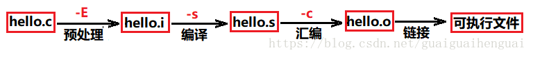
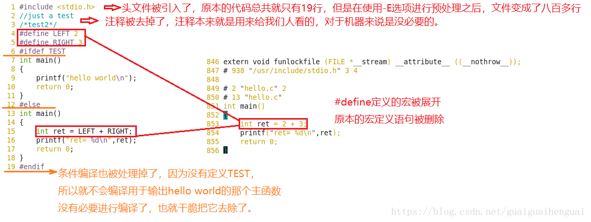

# 编译和链接的过程

## 0 概述

程序要运行起来，必须要经过四个步骤：预处理、编译、汇编和链接。接下来通过几个简单的例子来详细讲解一下这些过程。

对于上边用到的几个选项需要说明一下。

* 使用 gcc 命令不跟任何的选项的话，会默认执行预处理、编译、汇编、链接这整个过程，如果程序没有错，就会得到一个可执行文件，默认为a.out

* -E选项：提示编译器执行完预处理就停下来，后边的编译、汇编、链接就先不执行了。

* -S选项：提示编译器执行完编译就停下来，不去执行汇编和链接了。

* -c选项：提示编译器执行完汇编就停下来。

* 所以，这三个选项相当于是限定了编译器执行操作的停止时间，而不是单独的将某一步拎出来执行。

## 1 预处理：

使用-E选项，表示只进行预编译，对应生成一个 .i 文件。

预处理过程进行的操作：

* 将所有的“#define”删除，并且展开所有的**宏定义**
* 处理所有的**条件编译指令**，比如“#if”、“#ifdef”、“#elif”、“#else”、“#endif”
* 处理“#include”**预编译指令**，将被包含的头文件插入到该编译指令的位置。（这个过程是递归进行的，因为被包含的文件可能还包含了其他文件）
* 删除所有的注释“//”和“/* */”。
* 添加行号和文件名标识，方便后边编译时编译器产生调试用的行号心意以及编译时产生编译错误或警告时能够显示行号。
* 保留所有的#pragma编译指令，因为编译器需要使用它们。

编写一个简单的程序，然后使用-E选项执行预处理过程，打开生成的 .i 文件与源文件进行比对，结果一目了然

对于给代码加上行号这个就不在这里演示了，我们在写代码的时候是不会手动添加行号的，我们看到的行号都是自己使用的编辑工具自动加上的，而这些行号编译系统是看不到的，但是呢，我们发现如果我们哪一行的代码出现了问题，编译的时候就会给出提示说哪行的代码有什么问题，这就已经证明，编译器是会自动添加行号的。

## 2 编译

使用-S选项，表示编译操作执行完就结束。对应生成一个 .s 文件。

编译过程是整个程序构建的核心部分，编译成功，会将源代码由文本形式转换成机器语言，编译过程就是把预处理完的文件进行一系列词法分析、语法分析、语义分析以及优化后生成相应的汇编代码文件。

* 词法分析：词法分析是使用一种叫做lex的程序实现词法扫描，它会按照用户之前描述好的词法规则将输入的字符串分割成一个个记号。产生的记号一般分为：关键字、标识符、字面量（包含数字、字符串等）和特殊符号（运算符、等号等），然后他们放到对应的表中。
* 语法分析：语法分析器根据用户给定的语法规则，将词法分析产生的记号序列进行解析，然后将它们构成一棵语法树。对于不同的语言，只是其语法规则不一样。用于语法分析也有一个现成的工具，叫做：yacc。
* 语义分析：语法分析完成了对表达式语法层面的分析，但是它不了解这个语句是否真正有意义。有的语句在语法上是合法的，但是却是没有实际的意义，比如说两个指针的做乘法运算，这个时候就需要进行语义分析，但是编译器能分析的语义也只有静态语义。
    * 静态语义：在编译期就可以确定的语义。通常包括声明与类型的匹配、类型的转换。比如当一个浮点型的表达式赋值给一个整型的表达式时，其中隐含一个从浮点型到整型的转换，而语义分析就需要完成这个转换，再比如，将一个浮点型的表达式赋值给一个指针，这肯定是不行的，语义分析的时候就会发现两者类型不匹配，编译器就会报错。
    * 动态语义：只有在运行期才能确定的语义。比如说两个整数做除法，语法上没问题，类型也匹配，听着好像没毛病，但是，如果除数是0的话，这就有问题了，而这个问题事先是不知道的，只有在运行的时候才能发现他是有问题的，这就是动态语义。

* 中间代码生成：我们的代码是可以进行优化的，对于一些在编译期间就能确定的值，是会将它进行优化的，比如说上边例子中的 2+6，在编译期间就可以确定他的值为8了，但是直接在语法上进行优化的话比较困难，这时优化器会先将语法树转成中间代码。中间代码一般与目标机器和运行环境无关。（不包含数据的尺寸、变量地址和寄存器的名字等）。中间代码在不同的编译器中有着不同的形式，比较常见的有三地址码和P-代码。中间代码使得编译器可以分为前端和后端。编译器前端负责产生于机器无关的中间代码，编译器后端将中间代码换成机器代码。

* 目标代码生成与优化：代码生成器将中间代码转成机器代码，这个过程是依赖于目标机器的，因为不同的机器有着不同的字长、寄存器、数据类型等。最后目标代码优化器对目标代码进行优化，比如选择合适的寻址方式、使用唯一来代替乘除法、删除出多余的指令等。

三、汇编

汇编过程调用汇编器as来完成，是用于将汇编代码转换成机器可以执行的指令，每一个汇编语句几乎都对应一条机器指令。

使用命令as hello.s -o hello.o 或者使用gcc -c hello.s -o hello.o来执行到汇编过程结束，对应生成的文件是.o文件。

## 4 链接

链接的主要内容就是将各个模块之间相互引用的部分正确的衔接起来。它的工作就是把一些指令**对其他符号地址的引用加以修正**。链接过程主要包括了地址和空间分配、符号决议和重定向。

* 符号决议：有时候也被叫做符号绑定、名称绑定、名称决议、或者地址绑定，其实就是指用符号来去标识一个地址。比如说 int a = 6;这样一句代码，用a来标识一个块4个字节大小的空间，空间里边存放的内容就是4.

* 重定位：重新计算各个目标的地址过程叫做重定位。最基本的链接叫做静态链接，就是将每个模块的源代码文件编译成目标文件（Linux：.o  Windows：.obj），然后将目标文件和库一起链接形成最后的可执行文件。库其实就是一组目标文件的包，就是一些最常用的代码变异成目标文件后打包存放。最常见的库就是运行时库，它是支持程序运行的基本函数的集合。
