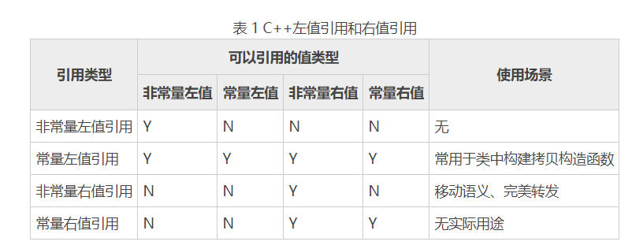

# 左值右值

> 参考文献
> * [cnblogs.com/sunchaothu/p/11343517.html](cnblogs.com/sunchaothu/p/11343517.html)


> 为了导入右值和移动语义，首先复习了以下临时对象在函数返回值和传参数时构造了几次；然后对比介绍了左值和右值，以及右值引用的形式和含义。为移动语义和完美转发的介绍做铺垫。
## 1 问题导入

C++11 引入了 std::move 语义、右值引用、移动构造和完美转发这些特性。


* 函数返回值是传值的时候发生几次对象构造、几次拷贝？
* 函数的形参是值传递的时候发生几次对象构造？

### 函数返回值原理
```
// main.cpp
#include <iostream>
using namespace  std;

class A{
public:
   A(){
      cout<<"class A construct!"<<endl;
   } 
   A(const A&){
      cout<<"class A copy!"<<endl;
   }
   A& operator=(const A&){
      cout<<"assignment called!"<<endl;
   }
   ~A(){
      cout<<"class A destruct!"<<endl;
   }
};

A get_A_value(){
    return A();
}
int main(){
    A a = get_A_value();
    return 0;
}
```
使用 g++ 编译；注意使用 -fno-elide-constructors关闭省略构造优化

```
g++ main.cpp -fno-elide-constructors
```
可以得到以下输出
```
class A construct!
class A copy!
class A destruct!
class A copy!
class A destruct!
class A destruct!
```


可以看到A a=get_A_value(); 一行代码居然产生1次对象构造和2次对象的拷贝构造！具体为

1. 在 get_A_value() 里 A() 构造了临时对象，发生了一次默认构造；
2. 函数返回的时候会把临时对象拷贝后作为返回值，发生一次拷贝构造；
3. A a = 函数返回值发生了拷贝构造。

如果使用编译器优化（默认）, 则会把临时对象拷贝的那次 和 用返回值构造最终对象的拷贝的给省略了；也即，只有一次构造和析构。
```
class A construct!
class A destruct!
```

### 函数参数原理

```
// ... A

void pass_A_by_value(A a){

}
int main(){
    A a;
    pass_A_by_value(a);
    return 0;
}
```
在去掉优化 g++ main.cpp -fno-elide-constructors时输出为
```
class A construct!
class A copy!
class A destruct!
class A destruct!
```

* 1次构造加上1次拷贝。


### 总结拷贝构造函数

事实上，在未经优化的情况下，以下时候拷贝构造函数会被调用：

1. 函数内的局部对象做为返回值返回(不是引用)的时候会发生拷贝（拷贝为临时对象返回）
2. 函数形参为传值的时候，会发生拷贝构造
3. 一个对象以另外一个对象进行初始化的时候

对象的频繁构造是程序的开销，特别是当对象内部有堆上内存（比如有 new 出来的成员）的时候，每次拷贝构造的时候都需要用 new 申请一块内存，造成性能的降低。对于情况2，好习惯是如果函数参数是只读的（也即不会在程序内进行修改），传引用作为参数，也即 pass_A_by_refrence(const A &a); 对于情况1，编译器会为我们进行优化; 对于情况3，C++11 引入了一种移动构造函数的概念，它将获取**右值引用*,右值的“资源” move 到新对象中，这个过程中不会申请新的内存，从而达到提高了效率和性能。

所以，要理解些关键词 “移动构造”、“移动语义” ，首先要理解右值和右值引用。

## 2 左值(lvalue)和右值(rvalue)

### 概念

左值的英文简写为“lvalue”，右值的英文简写为“rvalue”。很多人认为它们分别是"left value"、"right value" 的缩写，其实不然。lvalue 是“loactor value”的缩写，可意为存储在内存中、有明确存储地址（可寻址）的数据，而 rvalue 译为 "read value"，指的是那些可以提供数据值的数据（不一定可以寻址，例如存储于寄存器中的数据）。

```C++
A a = foo(); // foo() 为右值
int a = 5; //5字面量为右值
char *x = "thu"; // “thu”为字面值也为右值
a = b + c; // b + c这个结果也是一个右值
return a //临时对象，也即函数返回值的时候只会“临时”存在的对象（运行超过那一行就会结束它的生存期），这个临时返回值就是一个右值；
```

* 位于赋值运算符 = 右边的值，为右值；在左边的则为左值

* 左值可以取得地址、有名字； 不可以取得地址、没有名字的为右值。所以 A a = foo()可以用 &a取得a的地址，a 是左值，然是不能取得 foo()的地址，（&foo()）无法通过编译， foo()返回的临时对象也是没有名字的，所以是右值。

* 在C++11中，右值包括两种，一中是将亡值(xvalue, eXpiring Value)，一种是纯右值(prvalue,Pure Rvalue)[1]。函数非引用返回的临时对象、运算表达式的结果、1, 3.14,'c'这样的字面值等都属于纯右值。而xvalue则是由 C++11引入的 如返回值为 A&& 的函数返回值或者std::move()的返回值等。


## 3 左值引用和右值引用

### 左值引用

左值引用就是一般的引用，一般用一个&表示，例如

```
const A &a_ref = a; // 取得对象 a 的引用
```

左值引用相当于别名，指向一个具体的对象。


### 右值引用


右值引用顾名思义，就是右值的引用， 用 &&表示；
```
A &&r_ref = getRvalue(); // r_ref 是一个右值引用
```
右值引用也相当于别名，与左值的区别为右值引用是无名变量的别名。

getRvalue() 是一个返回右值的函数，右值在这一句执行完就该结束他的生存期了，如果是对象就该调用析构函数了；但是右值引用让它强行续命；使用右值引用指向右值，右值的生存期和右值引用一样长了，这也就少一次对象的析构和构造了。

C++的右值引用主要有两个用处，
* 一个是移动语义
* 一个是完美转发。

### 性质补充


* 虽然 C++98/03 标准不支持为右值建立非常量左值引用，但允许使用常量左值引用操作右值。也就是说，常量左值引用既可以操作左值，也可以操作右值，例如：
```
int num = 10;
const int &b = num;
const int &c = 10;
```
* 和声明左值引用一样，右值引用也必须立即进行初始化操作，且只能使用右值进行初始化
```
int num = 10;
//int && a = num;  //右值引用不能初始化为左值
int && a = 10;
```

* 和常量左值引用不同的是，右值引用还可以对右值进行修改。例如：
```
int && a = 10;
a = 100;
cout << a << endl;
````
