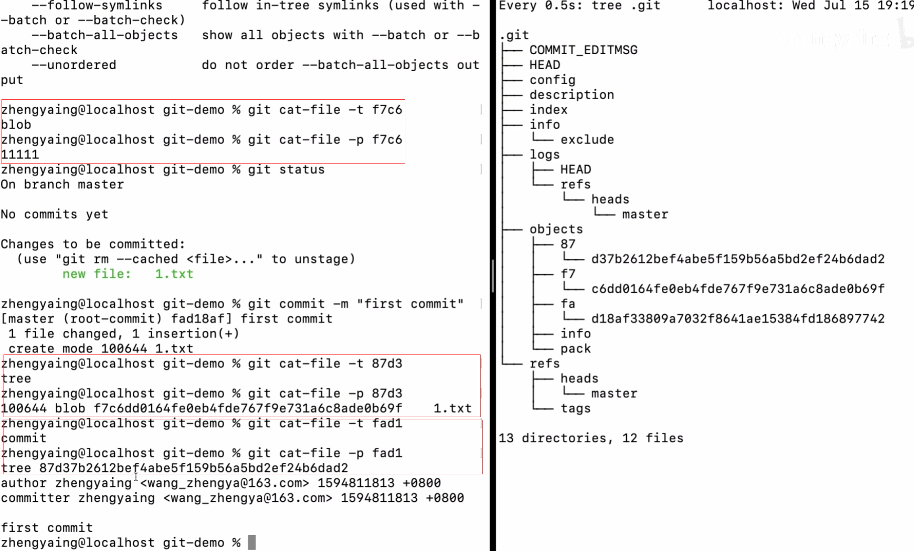
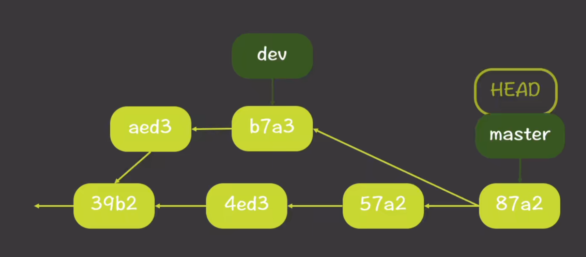
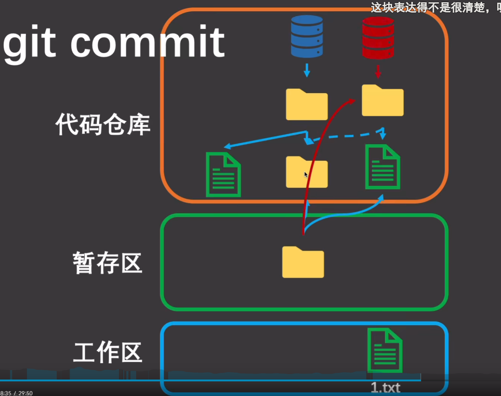
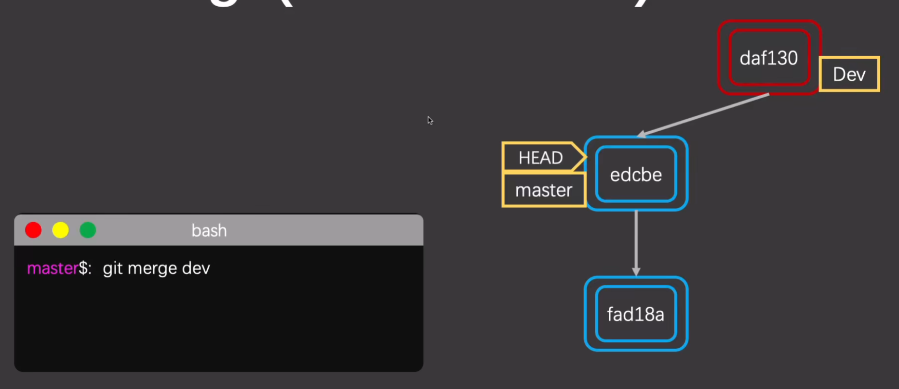
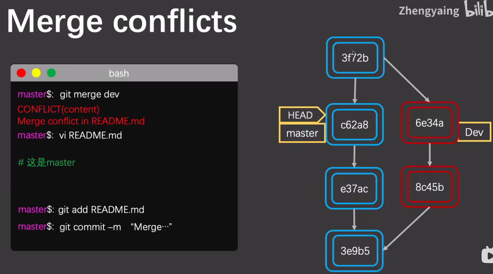

# 基本原理

## 1 基本对象
### 简介

git仓库版本控制相关的数据都存储在git的数据库中，可以将它看做一个简单的KV数据库，存储在根目录的.git/文件夹下面。他的Key依赖哈希算法生成。

在git数据库中主要有三种类型的对象，所有的对象都是一个KV对象的形式存储。
* Blob对象
* Tree对象
* Commit对象

每个对象都有有个ObjectId进行索引。每个ObjectId会指向一个具体类型的对象。

### git cat-file
命令可以访问git数据库中的对象，根据objectId搜索对象的值。

```
    -e                    check if <object> exists
    -p                    pretty-print <object> content
    -t                    show object type (one of 'blob', 'tree', 'commit','tag', ...)
    -s                    show object size
```



### ObjectId

使用哈希算法sha-1生成ObjectId
* 加密长度结果一致
* 输入数据确定，输出结果不变。
* 输入数据不同，输出结果不同

### Blog对象
git是一个快照式文件管理系统。与SVN不同，SVN将文件作为管理对象，保存文件的增量修改内容，是增量式版本控制。只要文件有变更，就会生成一个新的Blob，并根据Blob的内容生成ObjectId，如果文件没有变更则不会保存新文件，直接复用直接ObjectId的对象。如果两个文件的内容王权相同，也会直接复用Blob，不会生成新的Blob对象。

优点是，如果版本切换，能够快速地根据当前的版本快照显示当前仓库中的所有内容，而不需要增量的查看某个文件的修改记录，组合出当前版本的内容。


### Tree对象

Tree对象存储了当前目录的结构。相当于目录结构的一个快照。

一个tree对象存储了多个Blob对象和Blob对象对应的文件路径。


### Commint对象


commit对象主要包括一下内容
* Tree：ObjectId指针指向一个唯一的目录结构快照。
* 父提交parent：ObjectId指针指向父提交，同一个Commit可能有两个父提交。
* 创建者Author：包括创建者名称、创建者邮箱、创建日期Date。是git commit命令执行时原始的数据。
* 提交Commit：提交者的名称、提交者邮箱、提交日期Date。是Commit经过合并和merge后的最新的数据。
* 提交信息Message：git commit提交的时候的说明。

### 分支指针

git通过不同类型的指针实现分支管理。不同的指针指向不同的Commit，表示不同的分支。
* Head是工作去当前工作区的指针。
* 暂存区的指针
* master、header是提交去不同分支的指针



## 版本控制原理

git上的版本控制，在纵向（时间维度）上基于Commit Object组成的链进行管理的。在横向（空间维度）上基于Commit、Tree、Blob组成的树状结构进行存储。

### 提交流原理

1. git add 生成新的Blob，然后构建新的Tree，并将暂存区的指针指向新的Tree
2. git commit 生成新的commit，指向新的Tree。
3. 最后将当前分支的指针指向新的commit



### 分支合并原理
1. 如果fast-forward模式，则直接改变指针的指向即可。



2. 如果存在冲突，则会生成新的commit，其父指针同时指向之前的两个commit。

