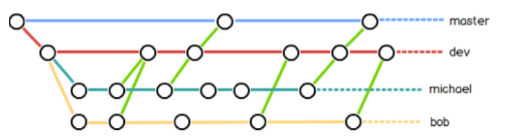

Git的本地操作

> 参考文献
> * [git使用教程](https://github.com/geeeeeeeeek/git-recipes/wiki)

## 1 git安装

- Linux上通过命令行能够很轻松的部署好git
- Windows上需要安装GitBash，模拟linux命令行
- 安装完成后需要配置全局信息的命令

```
git config --global user.name "Your Name"
git config --global user.email "email@example.com"
```

## 2 创建版本库

```
git init
```
生成.git文件，将这个目录初始化为一个版本的仓库。

```
git add readme.txt
```

将文件添加到缓冲区，可以连续多次向缓冲区中添加东西

```
git commit -m "wrote a message"
```
将缓冲区的文件提交到历史记录当中当中，可以一次提交对缓冲区的多次修改。

## 3 时光穿梭机

```
git status
```

用来查看当前仓库的状态。主要有changes not staged for
commit状态（工作区有变化没有提交），chages to be
committed状态（缓存区有变化等待提价）

```
git diff readme.txt
```

用来对比工作区和历史记录内容的差别。

## 4 版本回退

```
git log
```
用来查看版本的历史记录

```
git log --pretty=oneline
```

在一行显示历史记录

```
git reset --hard HEAD\^
```

回退到上一次的历史记录
```
git reset --hard id
```

回退到指定id的版本

```
git reflog
```

用来查看所有操作的历史记录，可以使用reset命令去定位到任何版本

## 5 工作区和暂存区

### **概念理解**

- 工作区Wording Directory：在电脑中能够看到的目录，是工作区

- 版本库Repository：工作区有一个隐藏的目录.git是版本库

- 版本库中有Stage暂存区和master等分支以及一个纸箱master的指针HEAD

- git跟踪管理的是对文件的修改而并非文件本身

### **撤销修改**
```
git checkout --readme.txt
```
把readme.txt在工作区的修改全部撤销掉。如果缓存区有readme.txt的中间状态，则从缓存区恢复，如果缓存区没有readme.txt的中间状态，则从版本库中恢复。

```
git reset HEAD readme.txt
```
把readmen.txt在缓存区的修改全部撤销掉。但是依然会保留工作区的修改。

### **删除文件**
```
git rm test.txt
```

把某个文件从缓存区删掉，然后commit之后会从版本库删掉。如果删错了可以通过checkout从缓存区恢复这个文件。

## 7 Git的远程操作

远程操作主要是指，在不同的仓库之间进行提交和代码更改。是一个明显的对等的分布式系统。其中本地个仓库与远程仓库，不同的远程仓库之间都可以建立这种关系。这种关系之间的操作主要有pull和push。

### **远程仓库**

创建SSH key远程仓库和本地仓库一般是通过ssh通信的，需要ssh通信的加密钥匙。

id_rsa是私钥，id_rsa.pub是公钥，可以告诉别人。
```
ssh-keygen -t rsa -C 'yinkanglong@163.com'
```

登录github，添加公钥内容。建立本地与远程仓库的通信协议

### **添加远程仓库**

github的界面操作可以很轻松的创建一个远程仓库。但如果想要直接上传自己本地的完整git库，必须创建一个没有lisence和readme的空库。

```
git remote add origin git@github.com:michaelliao/learngit.git
```
将本地仓库和远程仓库进行关联。一般都叫远程关联仓库为origin，本地的主干分支一般名为master

```
git push -u origin master
```

将本地的主干分支master推送到远程的origin分支上。-u参数实现了两个分支的关联，将远程的git仓库的master和本地的master进行了分支管理，当再次执行时，只需要使用git
push origin master命令。

### **从远程仓库克隆**

```
git clone git@github.com:michaelliao/gitskills.git
```


### **git remote**

```
git remote
```

列出你和远程仓库之间的远程连接

```
git remote -v
```

列出每个连接的名字和url

```
git remote add <name> <url>
```

创建一个新的远程连接并添加名字
```
git remote rm <name>
```

移除远程仓库的链接

### **git fetch**

```
git fetch <remote>
```

拉取仓库中的所有分支（包括相关的文件和所有的提交）
```
git fetch <remote> <branch>
```

拉取制定仓库中的所有分支（包括相关的文件和所欲的提交）

> 注意，这个步骤知识拉取远程的分支，在本地并没有合并也没有生成本地分支，知识一个可读的远程分支。
> * 使用git branch -r 命令可以查看所有只读的远程分支。
> * 使用gitcheckout命令可以创建本地分支，并与远程分支关联。
> * 使用git merge命令可以将远程分支与本地分支合并。

### **git pull**
```
git pull remote
```

拉取当前分支对应的远程副本，并将远程副本的更改写入本地副本。相当于git fetch之后git merge。

```
git pull -rebase \<remote\>
```

使用git rebase命令合并远程分支与本地分支，不使用git merge

### **git push**

```
git push <remote> \<branch\>
```

将制定分支推送到远程分支。包括所有的文件和提交。

```
git push <remote> --force
```
强制推送
```
git push <remote> --all
```

本地所有的分支推送到远程仓库当中

```
git push <remote> --tags
```

将本地所有标签推送到远程仓库中

## 8 分支管理

这里主要体现的git的功能的分离，这才是真正的git吧。每一个分支都是一个单独的可以分离的工作单位。每个用户可以建立不同的分支进行工作，最终提交到同一个开发分支上。一个用户可以建立不同的分支实现不同的功能，最终提交到同一个用户分支上。分支的灵活性，可以让我们很容易的实现不同分工的分割。

### **创建分支**

```
git checkout -b dev
```
创建分支，并且将工作目录切换到dev的工作目录上。

```
git branch dev
```
使用当前版本分支创建新的分支（即添加一个分支指针）。
```
git checkout dev
```
将工作区切换到某一个分支指针所指的版本上。
```
git branch
```
会列出所有的分支目录。

### **分支合并**

```
git merge dev
```

将dev分支合并到当前工作目录下的分支上（不一定是产生他的父分支）
```
git branch -d dev
```
用来删除一个已经无效的分支指正，但是在这个分支指针上左右的操作都会保留。

### **解决冲突**

-   当合并过程中出现冲突，会进入长途解决工作区，手动解决后提交，就会退出。

-   关于一点，提交后的分支有必要继续工作吗，都行。完全可以提交后删掉重新创建一个分支，获取主干分支上集成的最新内容，然后继续工作。也可以直接在分支上合并一次主干分支，然后得到最新的内容，继续在原来的分支上进行工作。

```
git log --graph
```

可以查看分支合并图。

### **分支合并方式**
```
git merge --no-ff -m "merge messge" dev --no-ff
```
不适用fastfoward方式进行合并，会产生一个新的版本节点。加上-m参数，是因为这种方式合并过程中会自己提交合并后的版本。

### **分支管理**

-   团队合作的分支管理组图就是你们要的方式



### **BUG分支**

-   因为总会在自己工作的过程中出现紧急的需要更改的bug，但是现在工作区中的内容还不能提交，所以必须生成现在工作区的一个快照，等处理完紧急的bug之后，再来回复工作区的内容。

```
git stash
```
将当前的工作现场储存起来，等到修复完成bug之后可以再次进行更改。工作现场包括工作区和stage缓存区。然后可以清空工作区和缓存区的内容，新建bug分支进行工作。

```
git stash list
```
用来查看保存中的工作区。

```
git stash apply stash@{0}
```
恢复stash内容，但并不清楚stash列表中的内容。

```
get stash drop
```
用来删除stash列表中的内容。（因为已经恢复或者没有必要恢复）

```
git stash pop
```
可以用来弹出stash列表中的内容。

### **Feature分支**

-   当添加一个新的功能的时候，因为是一些实验性的代码，所以要创建一个单独的分支进行处理。

-   git checkout -b feature-vulcan

创建一个新的功能分支
```
git status

git add vulcan.py

git commit -m "add feature vulcan"

git checkout dev

git merge vulcan.py

git branch -D feature-vulcan 不合并，强制删除
```
## 9 多人协作

通过远程库的push和pull操作实现夺人合作

### **推送分支或分支内容**

-   当从远程库进行克隆的时候，实际上已经将本地master分支和远程的master分支进行乐关联。

```
git remote [-v]
```
可以显示与远程库关联的信息

```
git push origin master
```

推送分支，吧分支上的所有本地内容提交到远程库中的相同分支当中。

### **哪些分支需要推送**
- mater分支是主分支，需要实时推送
- dev是开发分支，所有成员都要在上面工作。也需要与远程同步。
- bug分支只需要在本地修复bug，没有必要推送到远程。
- feature分支，可以不用推送到远程。单人开发不用，夺人开发要推送到远程。

### **抓取分支或者分支的内容**

```
git checkout -b dev origin/dev
```
可以用来抓取远程分支dev，这样会建立一个本地的本地的dev分支与远程的dev分支进行关联，可以直接实现dev分支的控制（push）

```
git pull \<remote\> \<branch\>
```

如果Git push失败，说明，当前的版本不是最新的版本。git pull
可以将远程库中的最新版本拉去到本地。

```
git branch --set-upstream dev origin/\<branch\>
```
这样会制定git的本地分支与远程的分支之间的链接。

-  如果git pull有冲突，与分支合并中解决冲突的方法一直。

### **多人协作的协作模式通常是这样：**

1. 首先，可以试图⽤git push origin branch-name推送自己的修改；
2. 如果推送失败，则因为远程分支比你的本地更新，需要先用git pull试图合并；
3. 如果合并有冲突，则解决冲突，并在本地提交；
4. 没有冲突或者解决掉冲突后，再用git push origin branch-name推送就能成功！
5. 如果git pull提“no tracking information”，则说明本地分支和远程分支的链接关系没有创建，用命令git branch --set-upstream branch-name origin/branch-name。

## 10 标签管理

### **创建标签**

```
git tag v1.0
```

对当前版本打标签，为v1.0

```
git tag
```
查看所有已经创建的标签

```
git tag v0.9 6.225
```

对指定id的版本打标签
```
git show v0.9
```

查看标签信息

```
git tag -a v0.1 -m "version 0.1 released" 3628164
```

创建带有标签说明的标签

### **操作标签**

```
git tag -d v0.1
```

删除制定版本的标签

```
git push origin v1.0
```

推送某个标签到远程

```
git push origin --tags
```

一次性推送所有标签。

```
git tag -d v0.9

git push origin :refs/tags/v0.9
```

从远程删除标签，先在本地删除标签，然后将操作推送到远程。

