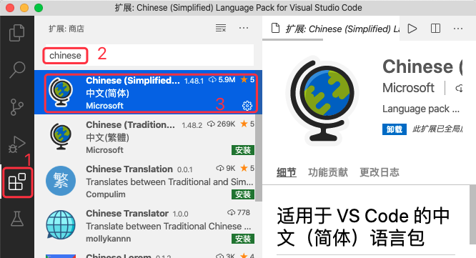
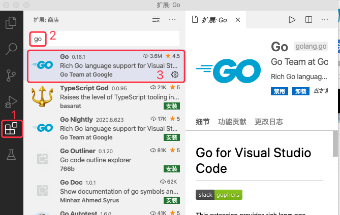
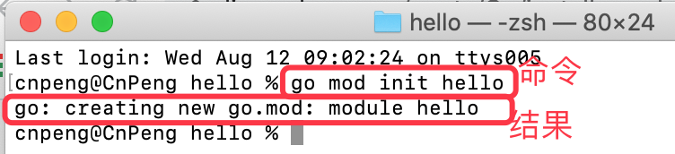
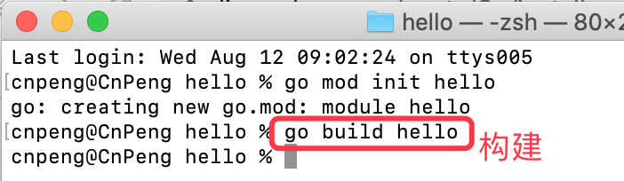
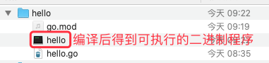
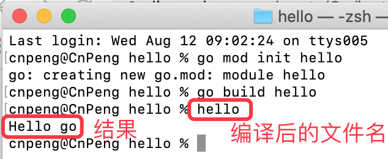
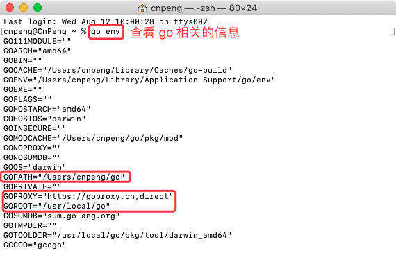
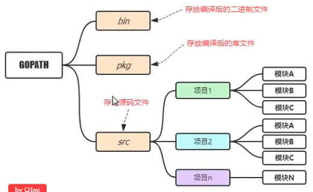
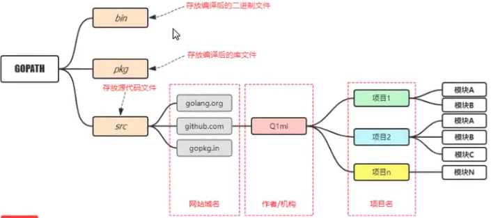

该笔记基于 [Go语言（基础+进阶+就业）](https://www.bilibili.com/video/BV17Q4y1P7n9?p=3) 进行整理

该视频作者的播客 [李文周的博客](https://www.liwenzhou.com/)

## 1.1 安装 Go 开发包

[环境搭建内容参考视频老师的文章地址](https://www.liwenzhou.com/posts/Go/go_menu/)

* 下载地址

[Go官网下载地址](https://golang.org/dl/)

[Go官方镜像站（推荐）](https://golang.google.cn/dl/)


## 1.2 配置环境变量及 GOPROXY

### 1.2.1 环境变量

`GOROOT` 和 `GOPATH` 都是环境变量，其中 `GOROOT` 是我们安装 go 开发包的路径，而从 `Go 1.8` 版本开始，Go 开发包在安装完成后会为 `GOPATH` 设置一个默认目录，参见下表。

GOPATH 在不同操作系统平台上的默认值

平台 |	GOPATH默认值 | 	举例
---|---|---
Windows	| `%USERPROFILE%/go`	| `C:\Users\用户名\go`
Unix	| `$HOME/go`	 | `/home/用户名/go`

> 配置方式可以参考 [从零开始搭建Go语言开发环境](https://www.liwenzhou.com/posts/Go/install_go_dev/)。MAC 下的配置方式可以参考本套笔记 Android 目录下的环境变量配置。

### 1.2.2 GOPROXY

Go 1.11 版本开始，官方支持了 `go module` 包依赖管理工具和 `GOPROXY` 变量。 

设置 `GOPROXY` 环境变量后下载源代码时将会走该环境变量设置的代理地址，不再直接从默认代码库下载。

默认 `GOPROXY` 配置是：`GOPROXY=https://proxy.golang.org,direct`，由于国内访问不到 `https://proxy.golang.org`，所以我们需要换一个 PROXY ，这里推荐使用 `https://goproxy.io` 或 `https://goproxy.cn` 。

可以执行下面的命令修改 `GOPROXY` ：

```go
go env -w GOPROXY=https://goproxy.cn,direct
```

### 1.2.3 `go mod`

从 Go 1.11 版本开始，官方支持了 `go module` 包依赖管理工具，这样我们就不需要非得把项目源码放到 GOPATH 指定的 src 目录下了。

> 使用方式参考 1.4 中的内容

也可以参考：[告别GOPATH，快速使用 go mod（Golang包管理工具）](https://www.jianshu.com/p/bbed916d16ea)

## 1.3 编辑器

Go 采用的是 `UTF-8` 编码的文本文件存放源代码，理论上使用任何一款文本编辑器都可以做 Go 语言开发，这里推荐使用 `VS Code` 和 `Goland` 。 `VS Code` 是微软开源的编辑器，而 Goland 是 jetbrains 出品的付费 IDE。

我们这里使用 `VS Code` 加插件做为 go 语言的开发工具。

### 1.3.1 下载 VS

[VS Code 官方下载地址](https://code.visualstudio.com/Download)

### 1.3.2 安装插件

* 安装中文插件

VS 默认英文界面，安装中文插件并重启后即可变成中文界面



* 安装 go 扩展插件



## 1.4 第一个 go 程序

### 1.4.1 第一个 go 程序

在本机任意目录新建一个名称为 `hello` 的目录, 然后在该目录下新建一个名称为 `hello.go` 的文件, 并编辑该文件内容，内容如下：


```go
package main

// 这是导包语句
import "fmt"

// 函数外面只能放置变量、常量、函数的声明语句

// main 是程序的入口
func main() {
	fmt.Println("hello go")
}
```

### 1.4.2 通过 `go mod` 管理项目

通过命令行/终端进入到我们新建的 `hello` 目录下，然后在终端中执行如下命令:

```go
// 末尾的 hello 可以自定义，通常为项目名
go mod init hello
```

执行命令:



初始化成功后，`hello` 目录下会多出来一个 `go.mod` 文件。

### 1.4.3 编译并运行项目

通过命令行/终端进入到我们新建的 `hello` 目录下，然后在终端中执行如下命令:

```go
// 此处的 hello 表示 hello.go 的文件名
go build hello
```

执行命令：



编译成功后会得到一个可执行的二进制程序：



> 因为我是使用 MAC 编译的，所以，编译后的文件没有 `.exe` 后缀。Windows 下会有 `.exe` 后缀。

直接在命令行中输入编译后的文件名 `hello` ，然后回车即可运行二进制程序：



## 1.5 补充

以下内容都是基于 GOPATH 来管理项目的。

### 1.5.1 使用 GOPATH 管理项目

如果不使用 `go mod` 管理项目，而是依旧使用 GOPATH 管理项目，那么我们就需要在 GOPATH 指定的目录下新建三个子目录：`src` 、`pkg`、`bin`。其中，src 目录是我们的源代码，pkg 是编译的中间状态的包，bin 中是一些可执行文件。

另外，通过 `go env` 可以查看 go 相关的信息，如下：



### 1.5.2 Go 项目结构

目录|作用
---|---
`$GOPATH/src` | 存放源代码 ，或存储执行 `go build`、`go install`、`go get` 等指令后的三方库
`$GOPATH/bin` | 存储执行 `go build`、`go install`、`go get` 等指令后产生的二进制文件
`$GOPATH/pkg`| 存储执行 `go build`、`go install`、`go get` 等指令后产生的中间缓存文件

在使用版本管理工具管理项目代码时，只需要控制 src 目录中的内容即可。

适合个人开发者的目录结构：



Go 语言中也是通过包来组织代码文件，我们可以引用别人的包，也可以发布自己的包，但为了防止不同包的项目名冲突，所以，我们通常使用 `顶级域名` 来作为包名的前缀，这样就不用担心项目名称冲突的问题了。如下：



由于企业中的业务线比较多，所以适合企业的目录结构如下：


### 1.5.3 相关命令

* 执行 `go build` 时如果 go 文件就在当前目录下，直接执行 `go build xxx` , xxx 表示文件名。

* 执行 `go build` 时如果 go 文件不在当前目录下，则需要写明其路径，该路径从 src 后面的路径开始写；编译完成后的文件存放在当前目录下。

* `go build -o xxx`  指定编译后的文件名称为 `xxx` 。Windows 中需要添加 `.exe` 后缀，如：`go build -o xxx.exe`

* `go run xx.go` 直接编译 xx.go 文件并运行编译后的结果

* `go install` 先执行 build ，然后将编译后的可执行文件拷贝到环境变量下的 bin 目录中
 
### 1.5.4 跨平台编译
 
跨平台编译参考自 [从零开始搭建Go语言开发环境](https://www.liwenzhou.com/posts/Go/install_go_dev/) 中的跨平台部分。

默认我们 `go build` 的可执行文件都是当前操作系统可执行的文件，如果我想在 windows 下编译一个 linux 下可执行文件，那需要怎么做呢？

只需要指定目标操作系统的平台和处理器架构即可：

```go
SET CGO_ENABLED=0  // 禁用CGO
SET GOOS=linux  // 目标平台是linux
SET GOARCH=amd64  // 目标处理器架构是amd64
```

使用了 cgo 的代码是不支持跨平台编译的, 所以需要禁用。

然后再执行 `go build` 命令，得到的就是能够在 Linux 平台运行的可执行文件了。

Mac 下编译 Linux 和 Windows平台 64位 可执行程序：

```go
CGO_ENABLED=0 GOOS=linux GOARCH=amd64 go build
CGO_ENABLED=0 GOOS=windows GOARCH=amd64 go build
```

Linux 下编译 Mac 和 Windows 平台64位可执行程序：

```go
CGO_ENABLED=0 GOOS=darwin GOARCH=amd64 go build
CGO_ENABLED=0 GOOS=windows GOARCH=amd64 go build
```

Windows下编译Mac平台64位可执行程序：

```go
SET CGO_ENABLED=0
SET GOOS=darwin
SET GOARCH=amd64
go build
```