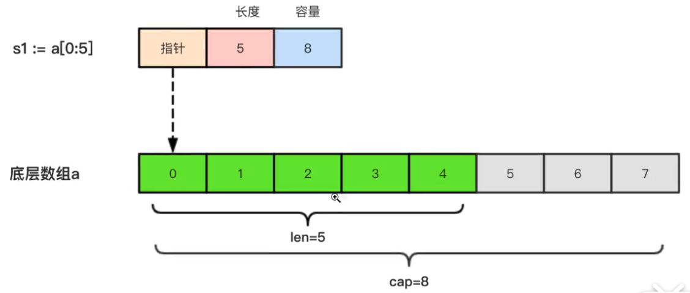

# 7 切片

由于数组的长度时固定的且数组的长度属于类型的一部分，所以数组有很多局限性。如：

```go
func arrSum(x [3]int)int{
	sum :=0
	for _, v := range x {
		sum += v
	}
	return sum
}
```

上述代码中，只能接受 `[3]int` 类型，其他的都不支持。再比如：

```go
x := [3]int{1,2,3}
```

上述代码中，数组 x 中已经有 3 个值了，我们无法再继续向其中添加新的元素了。

基于数组的如上缺陷，我们就需要使用 `切片(slice)`

**切片是一个相同类型元素的可变长度的序列。它是基于数组类型的一种封装。**

**切片是一个引用类型，它的内部结构包括：`地址`、`长度`、`容量`**。切片多用于快速操作一块数据集合。

## 7.1 切片的定义

### 7.1.1 基本定义格式

声明切片类型的基本语法如下：

```go
var name [] T 
```

其中：

* name 是变量名
* T 表示切片中的元素类型
* `[ ]` 内不需要声明长度
* 切片是引用类型，所以两个切片无法直接进行比较，切片只能和 `nil` 做比较。（ nil 表示未初始化的引用类型变量 ）
* **切片有自己的长度和容量，我们可以通过使用内置的 `len(切片名)` 来获取长度，通过 `cap(切片名)` 获取切片的容量。**

示例如下：

```go
package main

import "fmt"

func main() {
	// 声明一个字符串类型的切片
	var a []string
	// 声明一个 int 类型的切片并执行初始化
	var b = []int{}
	// 声明一个 bool 类型的切片并执行初始化
	c := []bool{false, true}

	// [ ]
	fmt.Println(a)
	// [ ]
	fmt.Println(b)
	//[false true]
	fmt.Println(c)

	// true —— 因为 a 没有初始化，所以为 nil
	fmt.Println(nil == a)
	// false —— 因为 b 虽然没有值，但已经初始化了
	fmt.Println(nil == b)
	
	//a 的长度为：0,容量为：0 
	fmt.Printf("a 的长度为：%d,容量为：%d \n", len(a), cap(a))
	//b 的长度为：0，容量为：0
	fmt.Printf("b 的长度为：%d，容量为：%d \n", len(b), cap(b))
	//c 的长度为：2，容量为：2 
	fmt.Printf("c 的长度为：%d，容量为：%d \n", len(c), cap(c))
}
```

### 7.1.2 基于数组定义切片

基于数组定义切片的格式为：**`切片名 := 数组名[起始索引:结束索引]`,**

其中的 `起始索引:结束索引` 遵循前闭后开的原则，也就是说，实际取的是`起始索引` 和 `结束索引` 之间的值，包含`起始索引`，但不包含`结束索引`。

```go
package main

import "fmt"

func main() {
	// 定义并初始化一个 [5]int 类型的数组
	a := [5]int{1, 2, 3, 4, 5}
	// 基于数组 a 创建切片，取索引 1-4 的元素，该索引前闭后开，所以，实际取的是索引 1，2，3 对应的元素
	b := a[1:4]

	// [2 3 4]
	fmt.Println(b)
	// b 的类型是：[]int
	fmt.Printf("b 的类型是：%T\n", b)
	
	
	// 还支持如下切割方式：

	// 从索引 1 开始切割到最后
	c := a[1:]
	// [2 3 4 5]
	fmt.Println(c)

	// 截止到索引为4的元素——不包含该元素
	d := a[:4]
	//[1 2 3 4]
	fmt.Println(d)

	// 截取全部
	e := a[:]
	// [1 2 3 4 5]
	fmt.Println(e)
}
```

基于上述代码，我们再分别来获取不同切片的长度和容量：

```go
// b 的长度和容量分别为：3，4
fmt.Printf("b 的长度和容量分别为：%d，%d \n", len(b), cap(b))
// c 的长度和容量分别为：4，4
fmt.Printf("c 的长度和容量分别为：%d，%d \n", len(c), cap(c))
// d 的长度和容量分别为：4，5
fmt.Printf("d 的长度和容量分别为：%d，%d \n", len(d), cap(d))
// e 的长度和容量分别为：5，5
fmt.Printf("e 的长度和容量分别为：%d，%d \n", len(e), cap(e))
```

通过上述代码我们可以分析得知：

* **切片的长度 = 结束索引 - 起始索引**
* 切片的底层实际是指向了一个数组
* 切片的容量取决于其底层依赖的数组，**切片的容量 = 数组的长度 - 起始索引**

切片的长度和容量与底层数组的关系可以参考如下两个图：




### 7.1.3 切片再切片

```go

package main

import "fmt"

func main() {
	// 定义并初始化一个数组，此处 ... 的意思是让数组自己计算长度
	a := [...]int{1, 2, 3, 4, 5, 6, 7, 8, 9}
	b := a[1:3]
	c := b[1:5]

	// a 的类型：[9]int,长度：9,容量：9,元素内容：[1 2 3 4 5 6 7 8 9]
	fmt.Printf("a 的类型：%T,长度：%d,容量：%d,元素内容：%v \n", a, len(a), cap(a), a)
	// b 的类型：[]int,长度：2,容量：8,元素内容：[2 3]
	fmt.Printf("b 的类型：%T,长度：%d,容量：%d,元素内容：%v \n", b, len(b), cap(b), b)
	// c 的类型：[]int,长度：4,容量：7,元素内容：[3 4 5 6] 
	fmt.Printf("c 的类型：%T,长度：%d,容量：%d,元素内容：%v \n", c, len(c), cap(c), c)
}
```

上述代码中，`b := a[1:3]` 得到切片之后，b 对应的底层数组此时就相应的变成了 `[...]int{2,3,4,5,6,7,8,9}`。`c := b[1:5]` 表示基于 b 切片底层的数组再做切片，所以 c  切片的数据为 `[3,4,5,6]` 其底层对应的数组为 `[...]int{3,4,5,6,7,8,9}`

需要注意的是：对切片再做切片时，索引不能超过原切片底层数组的长度，否则会出现索引越界的错误。

基于上面的代码我们再看下面的例子：

```go
b[1] = 20
// [1 2 20 4 5 6 7 8 9]
fmt.Println(a)
// [2 20]
fmt.Println(b)
// [20 4 5 6]
fmt.Println(c)
```

我们通过 `b[1] = 20` 修改了切片 b 中的第一个元素值，通过打印发现其底层数组 a、切片 b 、切片 c 都发生了变化，这是因为，**切片是引用类型数据**。

### 7.1.4 使用 `make()` 构造切片

通过 `make()` 函数可以动态的构建一个切片，其格式如下下：

```go
make( []T, size, cap)
```

其中：

* T 是切片元素的类型
* size 是切片中元素的数量
* cap 是切片的容量

```go
package main

import "fmt"

func main() {
	a := make([]int, 2, 10)

	// [0 0]
	fmt.Println(a)
	// 2
	fmt.Println(len(a))
	// 10
	fmt.Println(cap(a))
	
	b := make([]int, 0, 10)
	// 长度：0,容量：10,元素：[]
	fmt.Printf("长度：%d,容量：%d,元素：%v", len(b), cap(b), b)
}
```

上述代码中，`a` 的内部存储空间已经分配了 10 个，但实际上只用了 2 个。容量并不会影响当前元素的个数，所以，`len(a)` 的值为 2，`cap(a)` 的值为 10 。


## 7.2 切片的本质

切片的本质是对底层数组的封装，它包含了三个信息：底层数组的指针、切片的长度（len）和切片的容量（cap）。真正的数据存储还是操作的底层数组。

### 7.2.1 切片赋值

```go
package main

import "fmt"

func main() {
	s3 := []int{1, 3, 5}
	s4 := s3
	// [1 3 5] [1 3 5]
	fmt.Println(s3, s4)

	s3[0] = 100
	// [100 3 5] [100 3 5]——修改切片元素时本质是修改了其底层数组，s3 和 s4 都指向同一个数组，所以，切片 s3 和 s4 都会发生变化
	fmt.Println(s3, s4)
}
```

### 7.2.2 切片的遍历

#### 7.2.2.1 索引遍历

```go
package main

import "fmt"

func main() {
	s3 := []int{1, 3, 5}
	for i := 0; i < len(s3); i++ {
		fmt.Println(s3[i])
	}
}
```

#### 7.2.2.2 `for-range` 遍历

```go
package main

import "fmt"

func main() {
	s3 := []int{1, 3, 5}
	for _, v := range s3 {
		fmt.Println(v)
	}
}
```

## 7.3 通过 `append()` 为切片追加元素

### 7.3.1 追加元素的基本使用

Go 语言的内建函数 `切片A = append(切片A,被追加的数据)` 可以为切片动态添加元素。

> 上述格式的含义是，将数据追加到切片 A 中，这样会产生一个新的切片，继续使用原切片 A 来接收新的切片。

每个切片都会指向一个底层数组，该数组能容纳一定数量的元素。

当底层数组不能容纳新增的元素时，切片就会自动按照一定的策略**进行“扩容”，此时该切片执行的底层数组就会更换。**

```go
package main

import "fmt"

func main() {

	var numSlice []int
	for i := 0; i < 10; i++ {
		// 必须使用原切片来接收追加后得到的新切片
		numSlice = append(numSlice, i)
		fmt.Printf("长度：%d, 容量：%d,指针地址：%p,元素内容：%v\n", len(numSlice), cap(numSlice), numSlice, numSlice)
	}
}
```

输出结果：

```go
长度：1, 容量：1,指针地址：0xc0000b4008,元素内容：[0]
长度：2, 容量：2,指针地址：0xc0000b4030,元素内容：[0 1]
长度：3, 容量：4,指针地址：0xc0000b8020,元素内容：[0 1 2]
长度：4, 容量：4,指针地址：0xc0000b8020,元素内容：[0 1 2 3]
长度：5, 容量：8,指针地址：0xc0000ba040,元素内容：[0 1 2 3 4]
长度：6, 容量：8,指针地址：0xc0000ba040,元素内容：[0 1 2 3 4 5]
长度：7, 容量：8,指针地址：0xc0000ba040,元素内容：[0 1 2 3 4 5 6]
长度：8, 容量：8,指针地址：0xc0000ba040,元素内容：[0 1 2 3 4 5 6 7]
长度：9, 容量：16,指针地址：0xc0000bc080,元素内容：[0 1 2 3 4 5 6 7 8]
长度：10, 容量：16,指针地址：0xc0000bc080,元素内容：[0 1 2 3 4 5 6 7 8 9]
```

切片扩容的规则大致如下：

* 如果新申请的容量大于旧有容量的 2 倍，则新申请的容量即为该切片的容量。否则，
* 如果旧切片的长度小于 1024，则最终容量是为旧有容量的 2 倍。否则，
* 如果旧切片的长度大于等于 1024 ，则最终容量（newcap) 从旧容量（old.cap）开始循环增加原来的 1/4，即 `newcap = old.cap, for{ newcap += newcap/4}`, 直到最终容量（newcap）大于等于新申请的容量（cap），即 `newcap>=cap`.
* 如果最终容量计算值溢出，则最终容量就是新申请的容量。

> 切片扩容时还会根据切片中元素的类型不同而做不同的处理。

### 7.3.2 一次追加多个元素到切片

```go
package main

import "fmt"

func main() {

	var numSlice []int

	// 一次追加单个元素
	numSlice = append(numSlice, 1)
	// [1]
	fmt.Println(numSlice)

	// 一次追加多个元素
	numSlice = append(numSlice, 2, 3, 4)
	//[1 2 3 4]
	fmt.Println(numSlice)

	// 将一个切片追击到另一个切片中，注意，numSlice1... 后面的三个点表示解构。
	numSlice1 := []int{5, 6, 7}
	numSlice = append(numSlice, numSlice1...)
	//[1 2 3 4 5 6 7]
	fmt.Println(numSlice)
}
```


## 7.4 使用 `copy()` 函数复制切片

先看一个例子：

```go
package main

import "fmt"

func main() {
	a := []int{1, 2, 3, 4, 5}
	b := a

	// [1 2 3 4 5]
	fmt.Println(a)
	// [1 2 3 4 5]
	fmt.Println(b)

	b[0] = 100
	// [100 2 3 4 5]
	fmt.Println(a)
	// [100 2 3 4 5]
	fmt.Println(b)
}
```

在上述代码中，由于切片是引用类型的，所以 a 和 b 其实都指向了同一块内存地址，因此，修改 b 的同时 a  的值也会发生变化。

Go 语言内建的 `copy()` 函数可以快速的将一个切片的数据赋值到另外一个切片空间中，`cppy()` 函数的使用格式如下：

```go
copy(destSlice , srcSlice)
```

其中：

* destSlice 表示目标切片（即要复制到哪里去）
* srcSlice 数据来源切片（即从哪里复制）
* destSlice 作为 copy 的目标切片时，必须初始化，且长度必须大于等于被拷贝的切片,否则，拷贝出来的内容会被裁剪。

```go
package main

import "fmt"

func main() {
	a := []int{1, 2, 3, 4, 5}
	b := a

	// c 作为 copy 的目标切片时，必须初始化，且长度必须大于等于被拷贝的切片,否则，拷贝出来的内容会被裁剪
	c := make([]int, 5, 5)
	copy(c, b)

	// [1 2 3 4 5] [1 2 3 4 5] [1 2 3 4 5]
	fmt.Println(a, b, c)

	b[0] = 100

	// [100 2 3 4 5] [100 2 3 4 5] [1 2 3 4 5]
	fmt.Println(a, b, c)
}
```

## 7.5 从切片中删除元素

Go 语言中并没有删除切片元素的专用方法，我们可以使用切片本身的特性来删除元素，代码如下：

```go
package main

import "fmt"

func main() {
	a := []int{1, 2, 3, 4, 5}

	// 通过切片再切片以及追加的方式删除索引为 2 的元素
	a = append(a[:2], a[3:]...)

	// [1 2 4 5]
	fmt.Println(a)
	
	// 长度：4，容量：5
	fmt.Printf("长度：%d，容量：%d\n", len(a), cap(a))
}
```

示例2：

```go
package main

import "fmt"

func main() {
	arrA := [...]int{1, 2, 3, 4, 5}

	sliceA := arrA[:]
	// 通过切片再切片以及追加的方式删除索引为 2 的元素
	sliceA = append(sliceA[:2], sliceA[3:]...)

	//[1 2 4 5 5]
	fmt.Println(arrA)
	// 长度：4，容量：5, 元素：[1 2 4 5]
	fmt.Printf("长度：%d，容量：%d,元素：%v \n", len(sliceA), cap(sliceA), sliceA)
}
```

上述代码中，先构建了一个数组 arrA , 然后基于该数组得到切片 sliceA . 由于切片的底层是一个数组，所以在 `sliceA = append(sliceA[:2], sliceA[3:]...)` 这一句代码中，通过 `sliceA[:2]` 取到了数组前两个元素，然后通过 `sliceA[3:]...` 取到了索引为 3 和 4 的元素，`append` 操作时，先在数组的 0 和 1 索引处放置  `sliceA[:2]`, 然后追加解构出来的  `sliceA[3:]...`  中的元素，也就是说  `sliceA[3:]...`  中的元素占用了索引 2、3 , 数组索引 4 处的数据没有发生改变，依旧是原数组中的数据。所以，最终 arrA 的数据为：`[1 2 4 5 5]`


## 7.6 练习题

### 7.6.1 计算下面代码的输出值

```go
package main

import "fmt"

func main() {
	a := make([]int, 5, 10)
	for i := 0; i < 10; i++ {
		a = append(a, i)
	}
	fmt.Println(a)
}
```

上述代码中，先通过 `a := make([]int, 5, 10)` 初始化了一个切片，其长度为 5 ，容量为 10 ，此时，a 中的元素为 `[0,0,0,0,0]` , 然后在 for 循环中做了的操作是向  a 中追加数据，所以，最终得到的结果为：

```go
[0 0 0 0 0 0 1 2 3 4 5 6 7 8 9]
```

### 7.6.2 使用内置的 `sort` 对数组进行排序

数组：`var a=[...]int{3,7,8,9,1}`

```go
package main

import (
	"fmt"
	"sort"
)

func main() {
	a1 := [...]int{3, 7, 8, 9, 1}
	// 先将数组转换成切片，然后使用 sort 排序,因为数组中的元素为 int ，所以此处使用了 sort.Ints
	sort.Ints(a1[:])
	// [1 3 7 8 9]
	fmt.Println(a1)
}
```

