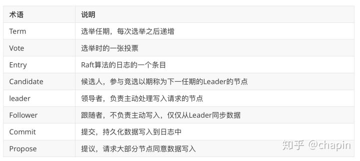

[原文: 《etcd 快速入门》](https://zhuanlan.zhihu.com/p/96428375?from_voters_page=true)

## .1 认识etcd

### .1.1 etcd 概念

从哪里说起呢？官网第一个页面，有那么一句话："A distributed, reliable key-value store for the most critical data of a distributed system"。也就是说 **`etcd` 是一个分布式、可靠 `key-value` 存储的分布式系统**。当然，**它不仅仅用于存储，还提供共享配置及服务发现**。

### .1.2 etcd vs Zookeeper

提供配置共享和服务发现的系统比较多，其中最为大家熟知的是 `Zookeeper`，而 etcd 可以算得上是后起之秀了。在项目实现、一致性协议易理解性、运维、安全等多个维度上，`etcd` 相比 `zookeeper` 都占据优势。

本文选取 `Zookeeper` 作为典型代表与 `etcd` 进行比较，而不考虑 `Consul` 项目作为比较对象，因为 `Consul` 的可靠性和稳定性还需要时间来验证（项目发起方自身服务并未使用 Consul，自己都不用)。

* 一致性协议： `etcd` 使用 `Raft` 协议，`Zookeeper` 使用 `ZAB`（类 `PAXOS` 协议），前者容易理解，方便工程实现；
* 运维方面：`etcd` 方便运维，`Zookeeper` 难以运维；
* 数据存储：`etcd` 多版本并发控制（`MVCC`）数据模型 ， 支持查询先前版本的键值对
* 项目活跃度：`etcd` 社区与开发活跃，Zookeeper 感觉已经快死了；
* API：`etcd` 提供 `HTTP+JSON`, `gRPC 接口`，跨平台跨语言；`Zookeeper` 需要使用其客户端；
* 访问安全方面：`etcd` 支持 `HTTPS` 访问，`Zookeeper` 在这方面缺失；
...

### .1.3 etcd 应用场景

`etcd` 比较多的应用场景是用于服务发现。

**服务发现 (Service Discovery)** 要解决的是分布式系统中最常见的问题之一，即在同一个分布式集群中的进程或服务如何才能找到对方并建立连接。和 `Zookeeper` 类似，`etcd` 有很多使用场景，包括：

* 配置管理
* 服务注册发现
* 选主
* 应用调度
* 分布式队列
* 分布式锁

### .1.4 etcd 工作原理

#### .1.4.1 如何保证一致性

`etcd` 使用 `raft` 协议来维护集群内各个节点状态的一致性。简单说，`etcd` 集群是一个分布式系统，由多个节点相互通信构成整体对外服务，每个节点都存储了完整的数据，并且通过 `Raft` 协议保证每个节点维护的数据是一致的。

每个 `etcd` 节点都维护了一个状态机，并且，任意时刻至多存在一个有效的主节点。主节点处理所有来自客户端写操作，通过 `Raft` 协议保证写操作对状态机的改动会可靠的同步到其他节点。

#### .1.4.2 数据模型

`etcd` 的设计目标是用来**存放非频繁更新的数据**，提供可靠的 `Watch` 插件，它暴露了键值对的历史版本，以支持低成本的快照、监控历史事件。这些设计目标要求它使用一个持久化的、多版本的、支持并发的数据数据模型。

当 `etcd` 键值对的新版本保存后，先前的版本依然存在。从效果上来说，键值对是不可变的，`etcd` 不会对其进行 `in-place` 的更新操作，而总是生成一个新的数据结构。为了防止历史版本无限增加，`etcd` 的存储支持压缩（Compact）以及删除老旧版本。

##### .1.4.2.1 逻辑视图

从逻辑角度看，**`etcd` 的存储是一个扁平的二进制键空间，键空间有一个针对键（字节字符串）的词典序索引**，因此范围查询的成本较低。

键空间维护了多个修订版本（Revisions），每一个原子变动操作（一个事务可由多个子操作组成）都会产生一个新的修订版本。在集群的整个生命周期中，修订版都是单调递增的。修订版同样支持索引，因此基于修订版的范围扫描也是高效的。压缩操作需要指定一个修订版本号，小于它的修订版会被移除。

一个键的一次生命周期（从创建到删除）叫做 **`代 (Generation)`**，每个键可以有多个代。创建一个键时会增加键的版本（version），如果在当前修订版中键不存在则版本设置为1。删除一个键会创建一个**`墓碑（Tombstone）`**，将版本设置为0，结束当前代。每次对键的值进行修改都会增加其版本号 — 在同一代中版本号是单调递增的。

当压缩时，任何在压缩修订版之前结束的代，都会被移除。值在修订版之前的修改记录（仅仅保留最后一个）都会被移除。

##### .1.4.2.2 物理视图

`etcd` 将数据存放在一个持久化的 B+ 树中，出于效率的考虑，每个修订版仅仅存储相对前一个修订版的数据状态变化（Delta）。单个修订版中可能包含了 B+ 树中的多个键。

键值对的键，是三元组（major，sub，type）：

* major：存储键值的修订版
* sub：用于区分相同修订版中的不同键
* type：用于特殊值的可选后缀，例如 t 表示值包含墓碑

键值对的值，包含从上一个修订版的 Delta。B+ 树 —— 键的词法字节序排列，基于修订版的范围扫描速度快，可以方便的从一个修改版到另外一个的值变更情况查找。

`etcd` 同时在内存中维护了一个 B 树索引，用于加速针对键的范围扫描。索引的键是物理存储的键面向用户的映射，索引的值则是指向 B+ 树修该点的指针。

### .1.5 etcd 读写性能

按照官网给出的数据， 在 2CPU，1.8G 内存，SSD 磁盘这样的配置下，单节点的写性能可以达到 16K QPS, 而先写后读也能达到 12K QPS。这个性能还是相当可观。

### .1.6 etcd 术语



## .2 安装和运行

### .2.1 构建

需要 Go 1.9 以上版本：

```
cd $GOPATH/src
mkdir go.etcd.io && cd go.etcd.io
git clone https://github.com/etcd-io/etcd.git
cd etcd
./build
```

使用 `build` 脚本构建会在当前项目的 `bin` 目录生产 `etcd` 和 `etcdctl` 可执行程序。

* `etcd` 就是 `etcd server` 了，
* `etcdctl` 主要为 `etcd server` 提供了命令行操作。

### .2.2 静态集群

如果 Etcd 集群成员是已知的，具有固定的 IP 地址，则可以静态的初始化一个集群。

每个节点都可以使用如下环境变量：

```
ETCD_INITIAL_CLUSTER="radon=http://10.0.2.1:2380,neon=http://10.0.3.1:2380"
ETCD_INITIAL_CLUSTER_STATE=new
```

或者如下命令行参数

```
--initial-cluster radon=http://10.0.2.1:2380,neon=http://10.0.3.1:2380
--initial-cluster-state new
```

来指定集群成员。

### .2.3 初始化集群

完整的命令行示例：

```
etcd --name radon --initial-advertise-peer-urls http://10.0.2.1:2380
  --listen-peer-urls http://10.0.2.1:2380
  --listen-client-urls http://10.0.2.1:2379,http://127.0.0.1:2379
  --advertise-client-urls http://10.0.2.1:2380
  # 所有以-initial-cluster开头的选项，在第一次运行（Bootstrap）后都被忽略
  --initial-cluster-token etcd.gmem.cc
  --initial-cluster radon=http://10.0.2.1:2380,neon=http://10.0.3.1:2380
  --initial-cluster-state new
```

### .2.4 使用TLS

Etcd 支持基于 TLS 加密的集群内部、客户端-集群通信。每个集群节点都应该拥有被共享 CA 签名的证书：

```
# 密钥对、证书签名请求
openssl genrsa -out radon.key 2048
export SAN_CFG=$(printf "\n[SAN]\nsubjectAltName=IP:127.0.0.1,IP:10.0.2.1,DNS:radon.gmem.cc")
openssl req -new -sha256 -key radon.key -out radon.csr \
    -subj "/C=CN/ST=BeiJing/O=Gmem Studio/CN=Server Radon" \
    -reqexts SAN -config <(cat /etc/ssl/openssl.cnf <(echo $SAN_CFG))

# 执行签名
openssl x509 -req -sha256 -in radon.csr  -out radon.crt -CA ../ca.crt -CAkey ../ca.key -CAcreateserial -days 3650 \
     -extensions SAN -extfile <(echo "${SAN_CFG}")
```     
     
初始化集群命令需要修改为：

```
etcd --name radon --initial-advertise-peer-urls https://10.0.2.1:2380
  --listen-peer-urls https://10.0.2.1:2380
  --listen-client-urls https://10.0.2.1:2379,https://127.0.0.1:2379
  --advertise-client-urls https://10.0.2.1:2380

   # 所有以-initial-cluster开头的选项，在第一次运行（Bootstrap）后都被忽略
  --initial-cluster-token etcd.gmem.cc
  --initial-cluster radon=https://10.0.2.1:2380,neon=https://10.0.3.1:2380 # 指定集群成员列表
  --initial-cluster-state new         # 初始化新集群时使用  
  --initial-cluster-state existing    # 加入已有集群时使用 

  # 客户端TLS相关参数
  --client-cert-auth 
  --trusted-ca-file=/usr/share/ca-certificates/GmemCA.crt
  --cert-file=/opt/etcd/cert/radon.crt
  --key-file=/opt/etcd/cert/radon.key

  # 集群内部TLS相关参数
  --peer-client-cert-auth
  --peer-trusted-ca-file=/usr/share/ca-certificates/GmemCA.crt
  --peer-cert-file=/opt/etcd/cert/radon.crt
  --peer-key-file=/opt/etcd/cert/radon.key
```

## .3 与 etcd 交互

etcd 提供了 `etcdctl 命令行工具` 和 `HTTP API` 两种交互方法。etcdctl 命令行工具用 go 语言编写，也是对 HTTP API 的封装，日常使用起来也更容易。所以这里我们主要使用 etcdctl 命令行工具演示。

### .3.1 put

应用程序通过 `put` 将 key 和 value 存储到 etcd 集群中。每个存储的密钥都通过 Raft 协议复制到所有 etcd 集群成员，以实现一致性和可靠性。

这里是设置键的值的命令 foo 到 bar：

```
$ etcdctl put foo bar
OK
```

### .3.2 get

应用程序可以从一个 etcd 集群中读取 key 的值。

假设 etcd 集群已经存储了以下密钥：

```
foo = bar
foo1 = bar1
foo2 = bar2
foo3 = bar3
a = 123
b = 456
z = 789
```

* 读取键为 foo 的命令：

```
$ etcdctl get foo
foo  // key
bar  // value
```

上面同时返回了 key 和 value，怎么只读取 key 对应的值呢：

```
$ etcdctl get foo --print-value-only
bar
```

* 以十六进制格式读取键为 foo 的命令：

```
$ etcdctl get foo --hex
\x66\x6f\x6f
\x62\x61\x72
```

* 查询可以读取单个 key ，也可以读取一系列 key：

```
$ etcdctl get foo foo3
foo
bar
foo1
bar1
foo2
bar2
```

请注意，foo3 由于范围超过了半开放区间间隔 `[foo, foo3)`，因此不包括在内 foo3。

* 按前缀读取：

```
$ etcdctl get --prefix foo
foo
bar
foo1
bar1
foo2
bar2
foo3
bar3
```

* 按结果数量限制读取

```
$ etcdctl get --limit=2 --prefix foo
foo
bar
foo1
bar1
```

* 读取大于或等于指定键的字节值的键：

```
$ etcdctl get --from-key b
b
456
z
789
```

应用程序可能希望通过访问早期版本的 key 来回滚到旧配置。由于对 etcd 集群键值存储区的每次修改都会增加一个 etcd 集群的全局修订版本，因此应用程序可以通过提供旧的 etcd 修订版来读取被取代的键。

假设一个 etcd 集群已经有以下 key：

```
foo = bar         # revision = 2
foo1 = bar1       # revision = 3
foo = bar_new     # revision = 4
foo1 = bar1_new   # revision = 5
```

以下是访问以前版本 key 的示例：

```
$ etcdctl get --prefix foo # 访问最新版本的key
foo
bar_new
foo1
bar1_new

$ etcdctl get --prefix --rev=4 foo # 访问第4个版本的key
foo
bar_new
foo1
bar1

$ etcdctl get --prefix --rev=3 foo #  访问第3个版本的key
foo
bar
foo1
bar1

$ etcdctl get --prefix --rev=2 foo #  访问第3个版本的key
foo
bar

$ etcdctl get --prefix --rev=1 foo #  访问第1个版本的key
```

### .3.3 del

应用程序可以从一个 etcd 集群中删除一个 key 或一系列 key。

假设一个 etcd 集群已经有以下key：

```
foo = bar
foo1 = bar1
foo3 = bar3
zoo = val
zoo1 = val1
zoo2 = val2
a = 123
b = 456
z = 789
```

* 删除 key 为 foo 的命令：

```
$ etcdctl del foo
1
```

* 删除键值对的命令：

```
$ etcdctl del --prev-kv zoo
1
zoo
val
```

* 删除从 foo 到 foo9 的命令：

```
$ etcdctl del foo foo9
2
```

* 删除具有前缀的键的命令：

```
$ etcdctl del --prefix zoo
2
```

* 删除大于或等于键的字节值的键的命令:

```
$ etcdctl del --from-key b
2
```

### .3.4 watch

应用程序可以使用 watch 观察一个键或一系列键来监视任何更新。

打开第一个终端，监听 foo 的变化，我们输入如下命令：

```
$ etcdctl watch foo
```

再打开另外一个终端来对 foo 进行操作：

```
$ etcdctl put foo 123
OK
$ etcdctl put foo 456
OK
$ ./etcdctl del foo
1
```

第一个终端结果如下：

```
$ etcdctl watch foo
PUT
foo
123
PUT
foo
456
DELETE
foo
```

除了以上基本操作，watch 也可以像 get、del 操作那样使用 prefix、rev、 hex 等参数，这里就不一一列举了。

### .3.5 lock

>`Distributed locks`: 分布式锁，一个人操作的时候，另外一个人只能看，不能操作

`lock` 可以通过指定的名字加锁。注意，只有当**正常退出且释放锁后，lock 命令的退出码是 `0`，否则这个锁会一直被占用直到过期（默认60秒）**

在第一个终端输入如下命令：

```
$ etcdctl lock mutex1
mutex1/326963a02758b52d
```

在第二个终端输入同样的命令：

```
$ etcdctl lock mutex1
```

从上可以发现第二个终端发生了阻塞，并未返回像 `mutex1/326963a02758b52d` 的字样。此时我们需要结束第一个终端的 lock ，可以使用 `Ctrl+C` 正常退出 lock 命令。第一个终端 lock 退出后，第二个终端的显示如下：

```
$ etcdctl lock mutex1                                                                                                                          
mutex1/694d6ee9ac069436
```

### .3.6 txn


`txn` 从标准输入中读取多个请求，将它们看做一个原子性的事务执行。

**`事务`**是由条件列表，条件判断成功时的执行列表（条件列表中全部条件为真表示成功）和条件判断失败时的执行列表（条件列表中有一个为假即为失败）组成的。

```
$ etcdctl put user frank
OK

$ ./etcdctl txn -i
compares:
value("user") = "frank"

success requests (get, put, del):
put result ok

failure requests (get, put, del):
put result failed

SUCCESS

OK

$ etcdctl get result                                                                                                                            
result
ok
```

解释如下：

* 先使用 `etcdctl put user frank` 设置 user 为 frank
* `etcdctl txn -i` 开启事务（`-i`表示交互模式）
* 第2步输入命令后回车，终端显示出 `compares`：
* 输入 `value("user") = "frank"`，此命令是比较 user 的值与 frank 是否相等
* 第 4 步完成后输入回车，终端会换行显示，此时可以继续输入判断条件（前面说过事务由条件列表组成），**再次输入回车表示判断条件输入完毕**
* 第 5 步连续输入两个回车后，终端显示出 `success requests (get, put, delete):`，表示下面输入判断条件为真时要执行的命令
* 与输入判断条件相同，连续两个回车表示成功时的执行列表输入完成
* 终端显示 `failure requests (get, put, delete)：`后输入条件判断失败时的执行列表

为了看起来简洁，此实例中条件列表和执行列表只写了一行命令，实际可以输入多行。

总结上面的事务，要做的事情就是 user 为 frank 时设置 result 为 ok，否则设置 result 为 failed

上述事务执行完成后查看 result 值为 ok。

### .3.7 compact

正如我们所提到的，etcd 保持修改，以便应用程序可以读取以前版本的 key。但是，为了避免累积无限的历史，重要的是要压缩过去的修订版本。**压缩后，etcd 删除历史版本，释放资源供将来使用**。**在压缩版本之前的所有被修改的数据都将不可用**（即无法访问压缩版本之前的数据）。

```
$ etcdctl compact 5
compacted revision 5

$ etcdctl get --rev=4 foo
Error: etcdserver: mvcc: required revision has been compacted
```

### .3.8 lease 与 TTL

etcd 也能为 key 设置超时时间，但与 redis 不同，etcd 需要先创建 `lease`，然后 `put` 命令加上参数 `–lease=` 来设置。

`lease` 又由生存时间（TTL）管理，每个租约都有一个在授予时间由应用程序指定的最小生存时间（TTL）值。

以下是授予租约的命令：

```
$ etcdctl lease grant 30                                                                                                                        
lease 694d6ee9ac06945d granted with TTL(30s)

$ etcdctl put --lease=694d6ee9ac06945d foo bar
OK
```


以下是撤销同一租约的命令：

```
$ etcdctl lease revoke 694d6ee9ac06945d                                                                                                               
lease 694d6ee9ac06945d revoked

$ etcdctl get foo
```

应用程序**可以通过刷新其 TTL 来保持租约活着，因此不会过期**。

假设我们完成了以下一系列操作：

```
$ etcdctl lease grant 10
lease 32695410dcc0ca06 granted with TTL(10s)
```

以下是保持同一租约有效的命令：

```
$ etcdctl lease keep-alive 32695410dcc0ca06
lease 32695410dcc0ca06 keepalived with TTL(10)
lease 32695410dcc0ca06 keepalived with TTL(10)
lease 32695410dcc0ca06 keepalived with TTL(10)
...
```

应用程序可能想要了解租赁信息，以便它们可以续订或检查租赁是否仍然存在或已过期。应用程序也可能想知道特定租约所附的 key。

假设我们完成了以下一系列操作：

```
$ etcdctl lease grant 200
lease 694d6ee9ac06946a granted with TTL(200s)

$ etcdctl put demo1 val1 --lease=694d6ee9ac06946a
OK

$ etcdctl put demo2 val2 --lease=694d6ee9ac06946a
OK
```

以下是获取有关租赁信息的命令：

```
$ etcdctl lease timetolive 694d6ee9ac06946a
lease 694d6ee9ac06946a granted with TTL(200s), remaining(178s)
```

以下是获取哪些 key 使用了租赁信息的命令：

```
$ etcdctl lease timetolive --keys 694d6ee9ac06946a
lease 694d6ee9ac06946a granted with TTL(200s), remaining(129s), attached keys([demo1 demo2])
```

## .4 服务发现实战

如果有一个**让系统可以动态调整集群大小的需求，那么首先就要支持服务发现**。就是说当一个新的节点启动时，可以将自己的信息注册到 `master`，让 `master` 把它加入到集群里，关闭之后也可以把自己从集群中删除。这个情况，其实就是一个 `membership protocol`，用来维护集群成员的信息。

整个代码的逻辑很简单，`worker` 启动时向 `etcd` 注册自己的信息，并设置一个带 TTL 的租约，每隔一段时间更新这个 TTL，如果该 `worker` 挂掉了，这个 TTL 就会 `expire` 并删除相应的 key。发现服务监听` workers/` 这个 etcd directory，根据检测到的不同 `action` 来增加，更新，或删除 `worker`。

首先我们要建立一个 `etcd client`：

```go
func NewMaster(endpoints []string) *Master {

    // etcd 配置
    cfg := client.Config{
	Endpoints:   endpoints,
	DialTimeout: 5 * time.Second,
    }

    // 创建 etcd 客户端
    etcdClient, err := client.New(cfg)
    if err != nil {
        log.Fatal("Error: cannot connect to etcd: ", err)
    }

    // 创建 master
    master := &Master{
	members: make(map[string]*Member),
	API:     etcdClient,
    }

    return master
}
```

这里我们先建立一个 `etcd client`，然后把它的 key API 放进 `master` 里面，这样我们以后只需要通过这个 API 来跟 etcd 进行交互。 `Endpoints` 是指 etcd 服务器们的地址，如 ”http://127.0.0.1:2379“ 等。

`go master.WatchWorkers()` 这一行启动一个 Goroutine 来监控节点的情况。下面是 WatchWorkers 的代码:

```
func (master *Master) WatchWorkers() {

    // 创建 watcher channel
    watcherCh := master.API.Watch(context.TODO(), "workers", client.WithPrefix())

    // 从 chanel 取数据
    for wresp := range watcherCh {
        for _, ev := range wresp.Events {
            key := string(ev.Kv.Key)
            if ev.Type.String() == "PUT" { // put 方法
                info := NodeToWorkerInfo(ev.Kv.Value)
                if _, ok := master.members[key]; ok {
                    log.Println("Update worker ", info.Name)
                    master.UpdateWorker(key,info)
                } else {
                    log.Println("Add worker ", info.Name)
                    master.AddWorker(key, info)
                }

            } else if ev.Type.String() == "DELETE" {  // del 方法
                log.Println("Delete worker ", key)
                delete(master.members, key)
            }
        }
    }
}
```

worker 这边也跟 master 类似，保存一个 etcd KeysAPI，通过它与 etcd 交互，然后用 `heartbeat` 来保持自己的状态，在 `heartbeat` 定时创建租约，如果租用失效，master 将会收到 delete 事件。代码如下：

```
func NewWorker(name, IP string, endpoints []string) *Worker {

    // etcd 配置
    cfg := client.Config {
        Endpoints: endpoints,
	DialTimeout: 5 * time.Second,
    }

    // 创建 etcd 客户端
    etcdClient, err := client.New(cfg)
    if err != nil {
	log.Fatal("Error: cannot connect to etcd: ", err)
    }

    // 创建 worker
    worker := &Worker {
        Name:    name,
	IP:      IP,
	API: etcdClient,
    }
  
    return worker
}

func (worker *Worker) HeartBeat() {

    for {
	// worker info
	info := &WorkerInfo{
	    Name: worker.Name,
	    IP:   worker.IP,
	    CPU:  runtime.NumCPU(),
	}

	key := "workers/" + worker.Name
	value, _ := json.Marshal(info)

	// 创建 lease
	leaseResp, err := worker.API.Lease.Grant(context.TODO(), 10)
	if err != nil {
	    log.Fatalf("设置租约时间失败:%s\n", err.Error())
	}

	// 创建 watcher channel
	_, err = worker.API.Put(context.TODO(), key, string(value), client.WithLease(leaseResp.ID))
	if err != nil {
	    log.Println("Error update workerInfo:", err)
	}

	time.Sleep(time.Second * 3)
    }
}
```

启动的时候需要有多个 worker 节点（至少一个）和一个 master 节点，所以我们在启动程序的时候，可以传递一个 “role” 参数。代码如下：

```
var role = flag.String("role", "", "master | worker")
flag.Parse()
endpoints := []string{"http://127.0.0.1:2379"}
if *role == "master" {
  master := discovery.NewMaster(endpoints)
  master.WatchWorkers()
} else if *role == "worker" {
  worker := discovery.NewWorker("localhost", "127.0.0.1", endpoints)
  worker.HeartBeat()
} else {
  ...
}
```

项目地址： [https://github.com/chapin666/etcd-service-discovery](https://github.com/chapin666/etcd-service-discovery)

## .5 总结

* etcd **默认只保存 1000 个历史事件**，所以不适合有大量更新操作的场景，这样会导致数据的丢失。
* **etcd 典型的应用场景是配置管理和服务发现，这些场景都是读多写少的**。
* 相比于 `zookeeper`，`etcd` 使用起来要简单很多。不过要实现真正的服务发现功能，`etcd` 还需要和其他工具（比如 `registrator`、`confd` 等）一起使用来实现服务的自动注册和更新。


## .6 其他参考

* [《ETCD 简介 + 使用》——还没看](https://blog.csdn.net/bbwangj/article/details/82584988)
* [《Etcd 使用入门》——还没看](https://www.jianshu.com/p/f68028682192)