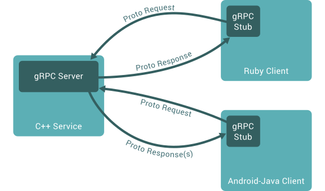

[原文：《gRPC快速入门》](https://www.liwenzhou.com/posts/Go/gRPC/)

RPC 算是近些年比较火热的概念了，随着微服务架构的兴起，RPC 的应用越来越广泛。本文介绍了 RPC 和 gRPC 的相关概念，并且通过详细的代码示例介绍了 gRPC 的基本使用。

## .1 RPC 和 gRPC 含义

### .1.1 RPC 是什么

在分布式计算，远程过程调用（英语：`Remote Procedure Call`，缩写为 `RPC`）是一个计算机通信协议。

该协议允许**运行于一台计算机的程序调用另一个地址空间（通常为一个开放网络的一台计算机）的子程序**，而程序员就像调用本地程序一样，无需额外地为这个交互作用编程（无需关注细节）。

RPC 是一种 `服务器-客户端（Client/Server）`模式，经典实现是一个通过 `发送请求-接受回应` 进行信息交互的系统。

### .1.2 gRPC 是什么

`gRPC` 是一种现代化开源的高性能 RPC 框架，能够运行于任意环境之中。最初由谷歌进行开发。它使用`HTTP/2` 作为传输协议。

在 `gRPC` 里，客户端可以像调用本地方法一样直接调用其他机器上的服务端应用程序的方法，帮助你更容易创建分布式应用程序和服务。

与许多 RPC 系统一样，`gRPC` 是基于定义一个服务，指定一个可以远程调用的带有参数和返回类型的的方法。在服务端程序中实现这个接口并且运行 `gRPC` 服务处理客户端调用。在客户端，有一个 `stub` 提供和服务端相同的方法。



### .1.3 为什么要用 gRPC

使用 `gRPC`， 我们可以一次性的在一个 `.proto` 文件中定义服务并使用任何支持它的语言去实现客户端和服务端，反过来，它们可以应用在各种场景中，从 Google 的服务器到你自己的平板电脑—— `gRPC` 帮你解决了不同语言及环境间通信的复杂性。

使用 `protocol buffers` 还能获得其他好处，包括高效的序列号，简单的 IDL 以及容易进行接口更新。总之一句话，使用 gRPC 能让我们更容易编写跨语言的分布式代码。

## .2 安装 gRPC

### .2.1 安装 gRPC

```go
go get -u google.golang.org/grpc
```

### .2.2 安装 Protocol Buffers v3

安装用于生成 `gRPC` 服务代码的协议编译器，最简单的方法是从下面的链接：[https://github.com/google/protobuf/releases](https://github.com/google/protobuf/releases) 下载适合你平台的预编译好的二进制文件（`protoc-<version>-<platform>.zip`）。

下载完之后，执行下面的步骤：

* 解压下载好的文件
* 把 `protoc` 二进制文件的路径加到环境变量中

接下来执行下面的命令安装 `protoc` 的 Go 插件：

```go
go get -u github.com/golang/protobuf/protoc-gen-go
```

编译插件 `protoc-gen-go` 将会安装到 `$GOBIN`，默认是 `$GOPATH/bin`，它必须在你的 `$PATH` 中以便协议编译器 `protoc` 能够找到它。


## .3 gRPC 开发分三步

把大象放进冰箱分几步？

* 把冰箱门打开。
* 把大象放进去。
* 把冰箱门带上。

gRPC 开发同样分三步：

* 编写 `.proto` 文件，生成指定语言源代码。
* 编写服务端代码
* 编写客户端代码


## .4 gRPC 入门示例

### .4.1 编写 proto 代码

`gRPC` 是基于 `Protocol Buffers`。

`Protocol Buffers` 是一种与语言无关，平台无关的可扩展机制，用于序列化结构化数据。

使用`Protocol Buffers` 可以一次定义结构化的数据，然后可以使用特殊生成的源代码轻松地在各种数据流中使用各种语言编写和读取结构化数据。

关于 `Protocol Buffers` 的教程可以自行在网上搜索，本文默认读者熟悉 `Protocol Buffers` 。

```
// 版本声明，使用Protocol Buffers v3版本
syntax = "proto3";
// 包名
package pb; 

// 定义一个打招呼服务
service Greeter {
    // SayHello 方法
    rpc SayHello (HelloRequest) returns (HelloReply) {}
}

// 包含人名的一个请求消息
message HelloRequest {
    string name = 1;
}

// 包含问候语的响应消息
message HelloReply {
    string message = 1;
}
```

执行下面的命令，生成 go 语言源代码：

```
protoc -I helloworld/ helloworld/pb/helloworld.proto --go_out=plugins=grpc:helloworld
```

在 `gRPC_demo/helloworld/pb` 目录下会生成 `helloworld.pb.go` 文件。

### .4.2 编写 Server 端 Go 代码

```go
package main

import (
	"fmt"
	"net"

	pb "gRPC_demo/helloworld/pb"
	"golang.org/x/net/context"
	"google.golang.org/grpc"
	"google.golang.org/grpc/reflection"
)

type server struct{}

func (s *server) SayHello(ctx context.Context, in *pb.HelloRequest) (*pb.HelloReply, error) {
	return &pb.HelloReply{Message: "Hello " + in.Name}, nil
}

func main() {
	// 监听本地的8972端口
	lis, err := net.Listen("tcp", ":8972")
	if err != nil {
		fmt.Printf("failed to listen: %v", err)
		return
	}
	s := grpc.NewServer() // 创建gRPC服务器
	pb.RegisterGreeterServer(s, &server{}) // 在gRPC服务端注册服务

	reflection.Register(s) //在给定的gRPC服务器上注册服务器反射服务
	// Serve方法在lis上接受传入连接，为每个连接创建一个ServerTransport和server的goroutine。
	// 该goroutine读取gRPC请求，然后调用已注册的处理程序来响应它们。
	err = s.Serve(lis)
	if err != nil {
		fmt.Printf("failed to serve: %v", err)
		return
	}
}
```

将上面的代码保存到 `gRPC_demo/helloworld/server/server.go` 文件中，编译并执行：

```
cd helloworld/server
go build
./server
```

### .4.3 编写 Client 端 Go 代码

```go
package main

import (
	"context"
	"fmt"

	pb "gRPC_demo/helloworld/pb"
	"google.golang.org/grpc"
)

func main() {
	// 连接服务器
	conn, err := grpc.Dial(":8972", grpc.WithInsecure())
	if err != nil {
		fmt.Printf("faild to connect: %v", err)
	}
	defer conn.Close()

	c := pb.NewGreeterClient(conn)
	// 调用服务端的SayHello
	r, err := c.SayHello(context.Background(), &pb.HelloRequest{Name: "q1mi"})
	if err != nil {
		fmt.Printf("could not greet: %v", err)
	}
	fmt.Printf("Greeting: %s !\n", r.Message)
}
```

将上面的代码保存到 `gRPC_demo/helloworld/client/client.go` 文件中，编译并执行：

```
cd helloworld/client/
go build
./client
```

得到输出如下（注意要先启动 server 端再启动 client 端）：

```
$ ./client 
Greeting: Hello q1mi!
```

此时我们的目录结构如下：

```
./gRPC_demo
├── go.mod
├── go.sum
└── helloworld
    ├── client
    │   ├── client
    │   └── client.go
    │   ├── client.py
    ├── pb
    │   ├── helloworld.pb.go
    │   └── helloworld.proto
    └── server
        ├── server
        └── server.go
```

### .4.4 gRPC跨语言调用

接下来，我们演示一下如何使用 gRPC 实现跨语言的 RPC 调用。

我们使用 Python 语言编写 Client，然后向上面使用 go 语言编写的 server 发送 RPC 请求。

#### .4.4.1 生成Python代码

在 `gRPC_demo`  目录执行下面的命令：

```
python -m grpc_tools.protoc -I helloworld/pb/ --python_out=helloworld/client/ --grpc_python_out=helloworld/client/ helloworld/pb/helloworld.proto
```

上面的命令会在 `gRPC_demo/helloworld/client/` 目录生成如下两个 python 文件：

```
helloworld_pb2.py
helloworld_pb2_grpc.py
```

#### .4.4.2 编写 Python 版 Client

在 `gRPC_demo/helloworld/client/` 目录创建 `client.py` 文件，其内容如下：

```python
# coding=utf-8

import logging

import grpc

import helloworld_pb2
import helloworld_pb2_grpc


def run():
    # 注意(gRPC Python Team): .close()方法在channel上是可用的。
    # 并且应该在with语句不符合代码需求的情况下使用。
    with grpc.insecure_channel('localhost:8972') as channel:
        stub = helloworld_pb2_grpc.GreeterStub(channel)
        response = stub.SayHello(helloworld_pb2.HelloRequest(name='q1mi'))
    print("Greeter client received: {}!".format(response.message))


if __name__ == '__main__':
    logging.basicConfig()
    run()
```

将上面的代码保存执行，得到输出结果如下：

```
gRPC_demo $ python helloworld/client/client.py 
Greeter client received: Hello q1mi!
```

这里我们就实现了，使用 python 代码编写的 client 去调用 Go 语言版本的 server 了。

点击右边的链接查看完整代码：[gRPC_demo完整代码](https://github.com/Q1mi/gRPC_demo)

gRPC还有更多进阶用法，未完待续…