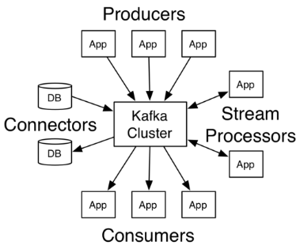
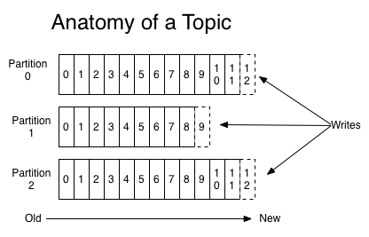
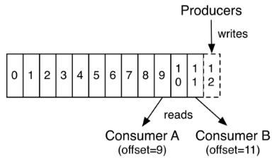
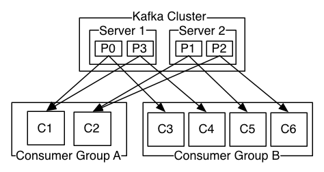

[原文链接：《超详细“零”基础kafka入门篇》](https://www.cnblogs.com/along21/p/10278100.html)

> 原文中很多内容读起来不通顺，名词一会儿用中文，一会儿用英文，比如  consumer ，文中部分位置将其翻译为 消费者，部分位置又翻译为 使用者，所以，严重怀疑文章是机翻的。虽然内容很全很细，但读起来很累😢
> 
> CnPeng 2020-12-22 我读不下去了。。。。

---

## 1.1 认识 kafka

**Kafka 是一个分布式流媒体平台**

kafka官网：[http://kafka.apache.org/](http://kafka.apache.org/)

### 1.1.1 kafka 简介

#### 1.1.1.1 流媒体平台有三个关键功能：

 * **发布和订阅记录流**，类似于消息队列或企业消息传递系统。
 * 以容错的**持久方式存储记录流**。
 * **记录发生时处理流**。
 

#### 1.1.1.2 Kafka 通常用于两大类应用：

 * 构建可在系统或应用程序之间可靠获取数据的**实时流数据管道**
 * 构建转换或响应数据流的**实时流应用程序**

要了解 Kafka 如何做这些事情，让我们深入探讨 Kafka 的能力。

 

#### 1.1.1.2 首先是几个概念：

 * Kafka 作为一个集群运行在一个或多个可跨多个数据中心的服务器上。
 * Kafka 集群以称为 `topics主题` 的类别存储记录流。
 * 每条记录都包含一个 **`键`**，一个 **`值`** 和一个 **`时间戳`**。
 

#### 1.1.1.3 Kafka 有四个核心 API：

* **`Producer API（生产者API）`**: 允许应用程序发布记录流至一个或多个 kafka 的 `topics（主题）`。
* **`Consumer API（消费者API）`**: 允许应用程序订阅一个或多个 `topics（主题）`，并处理所产生的对他们记录的数据流。
* **`Streams API（流API）`**: 允许应用程序充当流处理器，从一个或多个 `topics（主题）`消耗的输入流，并产生一个输出流至一个或多个输出的 `topics（主题）`，有效地变换所述输入流，以输出流。
* **`Connector API（连接器API）`**: 允许构建和运行 kafka `topics（主题）` 连接到现有的应用程序或数据系统中重用生产者或消费者。例如，关系数据库的连接器可能捕获对表的每个更改。

在 Kafka 中，客户端和服务器之间的通信是通过简单，高性能，语言无关的 **TCP 协议** 完成的。此协议已版本化并保持与旧版本的向后兼容性。Kafka 提供 Java 客户端，但客户端有多种语言版本。

## 1.2 Topics 主题 和 partitions 分区

我们首先深入了解 Kafka 为记录流提供的核心抽象 - `主题topics`

* 一个 `Topic` 可以认为是一类消息，每个 `topic` 将被分成多个 `partition(区)`,每个 `partition` 在存储层面是 `append log` 文件

* **topic 主题是发布记录的类别或订阅源名称**。Kafka 的主题总是多用户; 也就是说，一个主题可以有零个，一个或多个消费者订阅写入它的数据。

对于每个主题，Kafka 群集都维护一个如下所示的 `分区` 日志：

**每个分区都是一个有序的**，不可变的记录序列，不断附加到结构化的提交日志中。分区中的记录每个都分配了一个称为**偏移**的**顺序ID号**，**它唯一地标识分区中的每个记录**。

**Kafka 集群持久保存所有已发布的记录，直到保留期结束才会丢弃记录**。例如，如果保留策略设置为两天，则在发布记录后的两天内，它可供使用，之后将被丢弃以释放空间。Kafka 的性能在数据大小方面实际上是恒定的，因此长时间存储数据不是问题。

实际上，**基于每个消费者保留的唯一元数据是该消费者在日志中的偏移或位置**。这种偏移由消费者控制：通常消费者在读取记录时会线性地提高其偏移量，但事实上，由于该位置由消费者控制，因此它可以按照自己喜欢的任何顺序消费记录。例如，消费者可以重置为较旧的偏移量来重新处理过去的数据，或者跳到最近的记录并从“现在”开始消费。

这些功能组合意味着 Kafka `消费者consumers` 非常 cheap - 他们可以来来往往对集群或其他消费者没有太大影响。例如，您可以使用我们的命令行工具 “tail” 任何主题的内容，而无需更改任何现有使用者所消耗的内容。

日志中的分区有多种用途。首先，它们允许日志扩展到超出适合单个服务器的大小。每个单独的分区必须适合托管它的服务器，但主题可能有许多分区，因此它可以处理任意数量的数据。其次，它们充当了并行性的单位 - 更多的是它。

## 1.3 Distribution 分配

一个 `Topic` 的多个 `partitions`, 被分布在 kafka 集群中的多个 `server` 上; 每个`server( kafka 实例)` 负责 `partitions` 中消息的读写操作; 此外 kafka 还可以配置 `partitions` 需要备份的个数 (`replicas`),每个 `partition` 将会被备份到多台机器上,以提高可用性.

基于 `replicated` 方案,那么就意味着需要对多个备份进行调度; 

每个 `partition` 都有一个 `server` 为 `leader`; `leader` 负责所有的读写操作,如果`leader` 失效,那么将会有其他 `follower` 来接管(成为新的 `leader` );

`follower`只是单调的和 `leader` 跟进,同步消息即可.

由此可见作为 `leader` 的 `server` 承载了全部的请求压力,因此从集群的整体考虑,有多少个 `partitions` 就意味着有多少个 `leader` ,kafka 会将 `leader` 均衡的分散在每个实例上,来确保整体的性能稳定。

## 1.4 Producers 生产者和 Consumers 消费者

### 1.4.1 Producers 生产者

`Producers` 将数据发布到指定的 `topics 主题`。同时 `Producer` 也能决定将此消息归属于哪个`partition`; 比如基于 `round-robin` 方式或者通过其他的一些算法等。

 
### 1.4.2 Consumers

* 本质上 kafka 只支持 `Topic` .每个 `consumer` 属于一个 `consumer group` ;反过来说,每个`group` 中可以有多个 `consumer` .发送到 `Topic` 的消息,只会被订阅此 `Topic` 的每个 `group` 中的一个 `consumer`消费。

* 如果所有使用者实例具有**相同的使用者组**，则记录将有效地在使用者实例上进行**负载平衡**。

* 如果所有消费者实例具有**不同的消费者组**，则每个记录将**广播**到所有消费者进程。

上图中，有两个服务器 Kafka 集群，托管四个分区（P0-P3），包含两个使用者组。消费者组 A 有两个消费者实例，B 组有四个消费者实例。

在 Kafka 中实现消费 `consumption` 的方式是通过**在消费者实例上划分日志中的分区，以便每个实例在任何时间点都是分配的“公平份额”的独占消费者**。维护组中成员资格的过程由 Kafka 协议动态处理。如果新实例加入该组，他们将从该组的其他成员接管一些分区; 如果实例死亡，其分区将分发给其余实例。

**Kafka 仅提供分区内记录的总订单，而不是主题中不同分区之间的记录**。对于大多数应用程序而言，按分区排序与按键分区数据的能力相结合就足够了。但是，如果您需要对记录进行总订单，则可以使用仅包含一个分区的主题来实现，但这将意味着每个使用者组只有一个使用者进程。

## 1.5 Consumers kafka 确保

* 发送到 `partitions` 中的消息将会按照它接收的顺序追加到日志中。也就是说，如果记录 M1 由与记录 M2 相同的生成者发送，并且首先发送 M1 ，则 M1 将具有比 M2 更低的偏移并且在日志中更早出现。

* 消费者实例按照它们存储在日志中的顺序查看记录。对于消费者而言,它们消费消息的顺序和日志中消息顺序一致。

* 如果 `Topic` 的 `replicationfactor` 为 N ,那么允许 N-1 个 kafka 实例失效，我们将容忍最多 N-1 个服务器故障，而不会丢失任何提交到日志的记录。
 

## 1.6 kafka 作为消息系统

Kafka 的流概念与传统的企业邮件系统相比如何？

### 1.6.1 与传统消息系统对比

消息传统上有两种模型：`queuing`(队列) 和`publish-subscribe`（发布 - 订阅）。

* 在 `队列` 中，消费者池可以从服务器读取并且每个记录转到其中一个; 
* `在发布 - 订阅`中，记录被广播给所有消费者。

这两种模型中的每一种都有优点和缺点。`队列` 的优势在于它允许您在多个消费者实例上划分数据处理，从而可以扩展您的处理。不幸的是，一旦一个进程读取它已经消失的数据，队列就不是​​多用户。`发布 - 订阅` 允许您将数据广播到多个进程，但由于每条消息都发送给每个订阅者，因此无法进行扩展处理。

kafka 的消费者群体概念概括了这两个概念。与队列一样，使用者组允许您将处理划分为一组进程（使用者组的成员）。与 `发布 - 订阅` 一样，Kafka 允许您向多个消费者组广播消息。

 

### 1.6.2 kafka 的优势

Kafka 模型的优势在于每个主题都具有这些属性 - 它可以扩展处理并且也是多用户 - 不需要选择其中一个。

与传统的消息系统相比，Kafka 具有更强的订购保证。

传统队列在服务器上按顺序保留记录，如果多个消费者从队列中消耗，则服务器按照存储顺序分发记录。但是，虽然服务器按顺序分发记录，但是记录是异步传递给消费者的，因此它们可能会在不同的消费者处出现故障。这实际上意味着在存在并行消耗的情况下丢失记录的顺序。消息传递系统通常通过具有“独占消费者”概念来解决这个问题，该概念只允许一个进程从队列中消耗，但当然这意味着处理中没有并行性。

kafka 做得更好。通过在主题中具有并行性概念 - 分区 - ，Kafka 能够在消费者流程池中提供订购保证和负载平衡。这是通过将主题中的分区分配给使用者组中的使用者来实现的，以便每个分区仅由该组中的一个使用者使用。通过这样做，我们确保使用者是该分区的唯一读者并按顺序使用数据。由于有许多分区，这仍然可以平衡许多消费者实例的负载。但请注意，消费者组中的消费者实例不能超过分区。

 
TODO 

1.7 kafka作为存储系统
 任何允许发布与消费消息分离的消息的消息队列实际上充当了正在进行的消息的存储系统。Kafka的不同之处在于它是一个非常好的存储系统。
 写入Kafka的数据将写入磁盘并进行复制以实现容错。Kafka允许生产者等待确认，以便在完全复制之前写入不被认为是完整的，并且即使写入的服务器失败也保证写入仍然存在。
 磁盘结构Kafka很好地使用了规模 - 无论服务器上有50 KB还是50 TB的持久数据，Kafka都会执行相同的操作。
 由于认真对待存储并允许客户端控制其读取位置，您可以将Kafka视为一种专用于高性能，低延迟提交日志存储，复制和传播的专用分布式文件系统。
有关Kafka的提交日志存储和复制设计的详细信息，请阅读此页面。
 

1.8 kafka用于流处理
 仅仅读取，写入和存储数据流是不够的，目的是实现流的实时处理。
 在Kafka中，流处理器是指从输入主题获取连续数据流，对此输入执行某些处理以及生成连续数据流以输出主题的任何内容。
 例如，零售应用程序可能会接收销售和发货的输入流，并输出重新排序流和根据此数据计算的价格调整。
 可以使用生产者和消费者API直接进行简单处理。但是，对于更复杂的转换，Kafka提供了完全集成的Streams API。这允许构建执行非平凡处理的应用程序，这些应用程序可以计算流的聚合或将流连接在一起。
 此工具有助于解决此类应用程序面临的难题：处理无序数据，在代码更改时重新处理输入，执行有状态计算等。
 流API构建在Kafka提供的核心原语上：它使用生产者和消费者API进行输入，使用Kafka进行有状态存储，并在流处理器实例之间使用相同的组机制来实现容错。
 

2、kafka使用场景
2.1 消息Messaging
　　Kafka可以替代更传统的消息代理。消息代理的使用有多种原因（将处理与数据生成器分离，缓冲未处理的消息等）。与大多数消息传递系统相比，Kafka具有更好的吞吐量，内置分区，复制和容错功能，这使其成为大规模消息处理应用程序的理想解决方案。

　　根据经验，消息传递的使用通常相对较低，但可能需要较低的端到端延迟，并且通常取决于Kafka提供的强大的耐用性保证。

　　在这个领域，Kafka可与传统的消息传递系统（如ActiveMQ或 RabbitMQ）相媲美。

 

2.2 网站活动跟踪
　　Kafka的原始用例是能够将用户活动跟踪管道重建为一组实时发布 - 订阅源。这意味着站点活动（页面查看，搜索或用户可能采取的其他操作）将发布到中心主题，每个活动类型包含一个主题。这些源可用于订购一系列用例，包括实时处理，实时监控以及加载到Hadoop或离线数据仓库系统以进行脱机处理和报告。

　　活动跟踪通常非常高，因为为每个用户页面视图生成了许多活动消息。

 

2.3 度量Metrics
　　Kafka通常用于运营监控数据。这涉及从分布式应用程序聚合统计信息以生成操作数据的集中式提要。

 

2.4 日志聚合
　　许多人使用Kafka作为日志聚合解决方案的替代品。日志聚合通常从服务器收集物理日志文件，并将它们放在中央位置（可能是文件服务器或HDFS）进行处理。Kafka抽象出文件的细节，并将日志或事件数据作为消息流更清晰地抽象出来。这允许更低延迟的处理并更容易支持多个数据源和分布式数据消耗。与Scribe或Flume等以日志为中心的系统相比，Kafka提供了同样出色的性能，由于复制而具有更强的耐用性保证，以及更低的端到端延迟。

 

2.5 流处理
　　许多Kafka用户在处理由多个阶段组成的管道时处理数据，其中原始输入数据从Kafka主题中消费，然后聚合，丰富或以其他方式转换为新主题以供进一步消费或后续处理。

　　例如，用于推荐新闻文章的处理管道可以从RSS订阅源抓取文章内容并将其发布到“文章”主题; 进一步处理可能会对此内容进行规范化或重复数据删除，并将已清理的文章内容发布到新主题; 最终处理阶段可能会尝试向用户推荐此内容。此类处理管道基于各个主题创建实时数据流的图形。从0.10.0.0开始，这是一个轻量级但功能强大的流处理库，名为Kafka Streams 在Apache Kafka中可用于执行如上所述的此类数据处理。除了Kafka Streams之外，其他开源流处理工具包括Apache Storm和 Apache Samza。

 

2.6 Event Sourcing
　　Event Sourcing是一种应用程序设计风格，其中状态更改记录为按时间排序的记录序列。Kafka对非常大的存储日志数据的支持使其成为以这种风格构建的应用程序的出色后端。

 

2.7 提交日志
　　Kafka可以作为分布式系统的一种外部提交日志。该日志有助于在节点之间复制数据，并充当故障节点恢复其数据的重新同步机制。Kafka中的日志压缩功能有助于支持此用法。在这种用法中，Kafka类似于Apache BookKeeper项目。

 

3、kafka安装
3.1 下载安装
到官网http://kafka.apache.org/downloads.html下载想要的版本；我这里下载的最新稳定版2.1.0

注：由于Kafka控制台脚本对于基于Unix和Windows的平台是不同的，因此在Windows平台上使用bin\windows\ 而不是bin/ 将脚本扩展名更改为.bat。

1
2
3
[root@along ~]# wget http://mirrors.shu.edu.cn/apache/kafka/2.1.0/kafka_2.11-2.1.0.tgz
[root@along ~]# tar -C /data/ -xvf kafka_2.11-2.1.0.tgz
[root@along ~]# cd /data/kafka_2.11-2.1.0/
　　

3.2 配置启动zookeeper
　　kafka正常运行，必须配置zookeeper，否则无论是kafka集群还是客户端的生存者和消费者都无法正常的工作的；所以需要配置启动zookeeper服务。

（1）zookeeper需要java环境

1
[root@along ~]# yum -y install java-1.8.0
 

（2）这里kafka下载包已经包括zookeeper服务，所以只需修改配置文件，启动即可。

如果需要下载指定zookeeper版本；可以单独去zookeeper官网http://mirrors.shu.edu.cn/apache/zookeeper/下载指定版本。

1
2
3
4
5
[root@along ~]# cd /data/kafka_2.11-2.1.0/
[root@along kafka_2.11-2.1.0]# grep "^[^#]" config/zookeeper.properties
dataDir=/tmp/zookeeper   #数据存储目录
clientPort=2181   #zookeeper端口
maxClientCnxns=0
注：可自行添加修改zookeeper配置

 

3.3 配置kafka
（1）修改配置文件

1
2
3
4
5
6
7
8
9
10
11
12
13
14
15
16
17
18
19
20
[root@along kafka_2.11-2.1.0]# grep "^[^#]" config/server.properties
broker.id=0
listeners=PLAINTEXT://localhost:9092
num.network.threads=3
num.io.threads=8
socket.send.buffer.bytes=102400
socket.receive.buffer.bytes=102400
socket.request.max.bytes=104857600
log.dirs=/tmp/kafka-logs
num.partitions=1
num.recovery.threads.per.data.dir=1
offsets.topic.replication.factor=1
transaction.state.log.replication.factor=1
transaction.state.log.min.isr=1
log.retention.hours=168
log.segment.bytes=1073741824
log.retention.check.interval.ms=300000
zookeeper.connect=localhost:2181
zookeeper.connection.timeout.ms=6000
group.initial.rebalance.delay.ms=0
注：可根据自己需求修改配置文件

 broker.id：唯一标识ID
 listeners=PLAINTEXT://localhost:9092：kafka服务监听地址和端口
 log.dirs：日志存储目录
 zookeeper.connect：指定zookeeper服务
 

（2）配置环境变量

1
2
3
4
[root@along ~]# vim /etc/profile.d/kafka.sh
export KAFKA_HOME="/data/kafka_2.11-2.1.0"
export PATH="${KAFKA_HOME}/bin:$PATH"
[root@along ~]# source /etc/profile.d/kafka.sh
　　

（3）配置服务启动脚本

1
2
3
4
5
6
7
8
9
10
11
12
13
14
15
16
17
18
19
20
21
22
23
24
25
26
27
28
29
30
31
32
33
34
35
36
37
38
39
40
41
42
43
44
45
46
47
48
49
50
51
52
53
54
55
56
57
58
59
60
61
62
63
64
[root@along ~]# vim /etc/init.d/kafka
#!/bin/sh
#
# chkconfig: 345 99 01
# description: Kafka
#
# File : Kafka
#
# Description: Starts and stops the Kafka server
#
 
source /etc/rc.d/init.d/functions
 
KAFKA_HOME=/data/kafka_2.11-2.1.0
KAFKA_USER=root
export LOG_DIR=/tmp/kafka-logs
 
[ -e /etc/sysconfig/kafka ] && . /etc/sysconfig/kafka
 
# See how we were called.
case "$1" in
 
  start)
    echo -n "Starting Kafka:"
    /sbin/runuser -s /bin/sh $KAFKA_USER -c "nohup $KAFKA_HOME/bin/kafka-server-start.sh $KAFKA_HOME/config/server.properties > $LOG_DIR/server.out 2> $LOG_DIR/server.err &"
    echo " done."
    exit 0
    ;;
 
  stop)
    echo -n "Stopping Kafka: "
    /sbin/runuser -s /bin/sh $KAFKA_USER  -c "ps -ef | grep kafka.Kafka | grep -v grep | awk '{print \$2}' | xargs kill \-9"
    echo " done."
    exit 0
    ;;
  hardstop)
    echo -n "Stopping (hard) Kafka: "
    /sbin/runuser -s /bin/sh $KAFKA_USER  -c "ps -ef | grep kafka.Kafka | grep -v grep | awk '{print \$2}' | xargs kill -9"
    echo " done."
    exit 0
    ;;
 
  status)
    c_pid=`ps -ef | grep kafka.Kafka | grep -v grep | awk '{print $2}'`
    if [ "$c_pid" = "" ] ; then
      echo "Stopped"
      exit 3
    else
      echo "Running $c_pid"
      exit 0
    fi
    ;;
 
  restart)
    stop
    start
    ;;
 
  *)
    echo "Usage: kafka {start|stop|hardstop|status|restart}"
    exit 1
    ;;
 
esac
　　

3.4 启动kafka服务
（1）后台启动zookeeper服务

1
[root@along ~]# nohup zookeeper-server-start.sh /data/kafka_2.11-2.1.0/config/zookeeper.properties &
 

（2）启动kafka服务

1
2
3
4
5
6
7
8
[root@along ~]# service kafka start
Starting kafka (via systemctl):                            [  OK  ]
[root@along ~]# service kafka status
Running 86018
[root@along ~]# ss -nutl
Netid State      Recv-Q Send-Q     Local Address:Port                    Peer Address:Port                              
tcp   LISTEN     0      50                    :::9092                              :::*                 
tcp   LISTEN     0      50                    :::2181                              :::*
　　

4、kafka使用简单入门
4.1 创建主题topics
创建一个名为“along”的主题，它只包含一个分区，只有一个副本：

1
2
[root@along ~]# kafka-topics.sh --create --zookeeper localhost:2181 --replication-factor 1 --partitions 1 --topic along
Created topic "along".
如果我们运行list topic命令，我们现在可以看到该主题：

1
2
[root@along ~]# kafka-topics.sh --list --zookeeper localhost:2181
along
　　

4.2 发送一些消息
Kafka附带一个命令行客户端，它将从文件或标准输入中获取输入，并将其作为消息发送到Kafka集群。默认情况下，每行将作为单独的消息发送。

运行生产者，然后在控制台中键入一些消息以发送到服务器。

1
2
3
[root@along ~]# kafka-console-producer.sh --broker-list localhost:9092 --topic along
>This is a message
>This is another message
　　

4.3 启动消费者
Kafka还有一个命令行使用者，它会将消息转储到标准输出。

1
2
3
[root@along ~]# kafka-console-consumer.sh --bootstrap-server localhost:9092 --topic along --from-beginning
This is a message
This is another message
所有命令行工具都有其他选项; 运行不带参数的命令将显示更详细地记录它们的使用信息。

 

5、设置多代理kafka群集
　　到目前为止，我们一直在与一个broker运行，但这并不好玩。对于Kafka，单个代理只是一个大小为1的集群，因此除了启动一些代理实例之外没有太多变化。但是为了感受它，让我们将我们的集群扩展到三个节点（仍然在我们的本地机器上）。

5.1 准备配置文件
1
2
3
4
5
6
7
8
9
10
11
[root@along kafka_2.11-2.1.0]# cd /data/kafka_2.11-2.1.0/
[root@along kafka_2.11-2.1.0]# cp config/server.properties config/server-1.properties
[root@along kafka_2.11-2.1.0]# cp config/server.properties config/server-2.properties
[root@along kafka_2.11-2.1.0]# vim config/server-1.properties
    broker.id=1
    listeners=PLAINTEXT://:9093
    log.dirs=/tmp/kafka-logs-1
[root@along kafka_2.11-2.1.0]# vim config/server-2.properties
    broker.id=2
    listeners=PLAINTEXT://:9094
    log.dirs=/tmp/kafka-logs-2
注：该broker.id 属性是群集中每个节点的唯一且永久的名称。我们必须覆盖端口和日志目录，因为我们在同一台机器上运行这些，并且我们希望让所有代理尝试在同一端口上注册或覆盖彼此的数据。

 

5.2 开启集群另2个kafka服务
1
2
3
4
5
6
7
[root@along ~]# nohup kafka-server-start.sh /data/kafka_2.11-2.1.0/config/server-1.properties &
[root@along ~]# nohup kafka-server-start.sh /data/kafka_2.11-2.1.0/config/server-2.properties &
[root@along ~]# ss -nutl
Netid State      Recv-Q Send-Q     Local Address:Port                    Peer Address:Port                          
tcp   LISTEN     0      50      ::ffff:127.0.0.1:9092                              :::*                 
tcp   LISTEN     0      50      ::ffff:127.0.0.1:9093                              :::*                                
tcp   LISTEN     0      50      ::ffff:127.0.0.1:9094                              :::*
　　

5.3 在集群中进行操作
（1）现在创建一个复制因子为3的新主题my-replicated-topic

1
2
[root@along ~]# kafka-topics.sh --create --zookeeper localhost:2181 --replication-factor 3 --partitions 1 --topic my-replicated-topic
Created topic "my-replicated-topic".
　　

（2）在一个集群中，运行“describe topics”命令查看哪个broker正在做什么

1
2
3
[root@along ~]# kafka-topics.sh --describe --zookeeper localhost:2181 --topic my-replicated-topic
Topic:my-replicated-topic   PartitionCount:1    ReplicationFactor:3 Configs:
    Topic: my-replicated-topic  Partition: 0    Leader: 2   Replicas: 2,0,1 Isr: 2,0,1
注释：第一行给出了所有分区的摘要，每个附加行提供有关一个分区的信息。由于我们只有一个分区用于此主题，因此只有一行。

 “leader”是负责给定分区的所有读取和写入的节点。每个节点将成为随机选择的分区部分的领导者。
 “replicas”是复制此分区日志的节点列表，无论它们是否为领导者，或者即使它们当前处于活动状态。
 “isr”是“同步”复制品的集合。这是副本列表的子集，该列表当前处于活跃状态并且已经被领导者捕获。
请注意，Leader: 2，在我的示例中，节点2 是该主题的唯一分区的Leader。

 

（3）可以在我们创建的原始主题上运行相同的命令，以查看它的位置

1
2
3
[root@along ~]# kafka-topics.sh --describe --zookeeper localhost:2181 --topic along
Topic:along PartitionCount:1    ReplicationFactor:1 Configs:
    Topic: along    Partition: 0    Leader: 0   Replicas: 0 Isr: 0
　　

（4）向我们的新主题发布一些消息：

1
2
3
4
[root@along ~]# kafka-console-producer.sh --broker-list localhost:9092 --topic my-replicated-topic
>my test message 1
>my test message 2
>^C
　　

（5）现在让我们使用这些消息：

1
2
3
[root@along ~]# kafka-console-consumer.sh --bootstrap-server localhost:9092 --from-beginning --topic my-replicated-topic
my test message 1
my test message 2
　　

5.4 测试集群的容错性
（1）现在让我们测试一下容错性。Broker 2 充当leader 所以让我们杀了它：

1
2
3
4
5
6
[root@along ~]# ps aux | grep server-2.properties |awk '{print $2}'
106737
[root@along ~]# kill -9 106737
[root@along ~]# ss -nutl
tcp   LISTEN     0      50      ::ffff:127.0.0.1:9092                              :::*                       
tcp   LISTEN     0      50      ::ffff:127.0.0.1:9093                              :::*
　　

（2）leader 已切换到其中一个从属节点，节点2不再位于同步副本集中：

1
2
3
[root@along ~]# kafka-topics.sh --describe --zookeeper localhost:2181 --topic my-replicated-topic
Topic:my-replicated-topic   PartitionCount:1    ReplicationFactor:3 Configs:
    Topic: my-replicated-topic  Partition: 0    Leader: 0   Replicas: 2,0,1 Isr: 0,1
　　

（3）即使最初接受写入的leader 已经失败，这些消息仍可供消费：

1
2
3
[root@along ~]# kafka-console-consumer.sh --bootstrap-server localhost:9092 --from-beginning --topic my-replicated-topic
my test message 1
my test message 2
　　

6、使用Kafka Connect导入/导出数据
　　从控制台写入数据并将其写回控制台是一个方便的起点，但有时候可能希望使用其他来源的数据或将数据从Kafka导出到其他系统。对于许多系统，您可以使用Kafka Connect导入或导出数据，而不是编写自定义集成代码。

　　Kafka Connect是Kafka附带的工具，用于向Kafka导入和导出数据。它是一个可扩展的工具，运行连接器，实现与外部系统交互的自定义​​逻辑。在本快速入门中，我们将了解如何使用简单的连接器运行Kafka Connect，这些连接器将数据从文件导入Kafka主题并将数据从Kafka主题导出到文件。

（1）首先创建一些种子数据进行测试：

1
[root@along ~]# echo -e "foo\nbar" > test.txt
或者在Windows上：

1
2
> echo foo> test.txt
> echo bar>> test.txt
　　

（2）接下来，启动两个以独立模式运行的连接器，这意味着它们在单个本地专用进程中运行。提供三个配置文件作为参数。

 第一个始终是Kafka Connect流程的配置，包含常见配置，例如要连接的Kafka代理和数据的序列化格式。
 其余配置文件均指定要创建的连接器。这些文件包括唯一的连接器名称，要实例化的连接器类以及连接器所需的任何其他配置。
1
2
3
4
[root@along ~]# connect-standalone.sh config/connect-standalone.properties config/connect-file-source.properties config/connect-file-sink.properties
[2019-01-16 16:16:31,884] INFO Kafka Connect standalone worker initializing ... (org.apache.kafka.connect.cli.ConnectStandalone:67)
[2019-01-16 16:16:31,903] INFO WorkerInfo values:
... ...
　　注：Kafka附带的这些示例配置文件使用您之前启动的默认本地群集配置并创建两个连接器：第一个是源连接器，它从输入文件读取行并生成每个Kafka主题，第二个是宿连接器从Kafka主题读取消息并将每个消息生成为输出文件中的一行。

 

（3）验证是否导入成功（另起终端）

在启动过程中，您将看到许多日志消息，包括一些指示正在实例化连接器的日志消息。

① 一旦Kafka Connect进程启动，源连接器应该开始从test.txt主题读取行并将其生成到主题connect-test，并且接收器连接器应该开始从主题读取消息connect-test 并将它们写入文件test.sink.txt。我们可以通过检查输出文件的内容来验证数据是否已通过整个管道传递：

1
2
3
[root@along ~]# cat test.sink.txt
foo
bar
　　

② 请注意，数据存储在Kafka主题中connect-test，因此我们还可以运行控制台使用者来查看主题中的数据（或使用自定义使用者代码来处理它）：

1
2
3
[root@along ~]# kafka-console-consumer.sh --bootstrap-server localhost:9092 --topic connect-test --from-beginning
{"schema":{"type":"string","optional":false},"payload":"foo"}
{"schema":{"type":"string","optional":false},"payload":"bar"}
　　

（4）继续追加数据，验证

1
2
3
4
5
6
7
8
9
[root@along ~]# echo Another line>> test.txt     
[root@along ~]# cat test.sink.txt
foo
bar
Another line
[root@along ~]# kafka-console-consumer.sh --bootstrap-server localhost:9092 --topic connect-test --from-beginning
{"schema":{"type":"string","optional":false},"payload":"foo"}
{"schema":{"type":"string","optional":false},"payload":"bar"}
{"schema":{"type":"string","optional":false},"payload":"Another line"}
 