* 原文：[NSQ](https://www.liwenzhou.com/posts/Go/go_nsq/)
* [视频地址](https://www.bilibili.com/video/BV17Q4y1P7n9?p=142)


NSQ 是目前比较流行的一个分布式的消息队列，本文主要介绍了 NSQ 及 Go 语言如何操作 NSQ。

## 26.1 NSQ 介绍

**[`NSQ`](https://nsq.io/)是 Go 语言编写的一个开源的实时分布式内存消息队列**，其性能十分优异。 NSQ的优势有以下优势：

* NSQ 提倡分布式和分散的拓扑，没有单点故障，支持容错和高可用性，并提供可靠的消息交付保证
* NSQ 支持横向扩展，没有任何集中式代理。
* NSQ 易于配置和部署，并且内置了管理界面。

## 26.2 NSQ 的应用场景

通常来说，消息队列都适用以下场景。

### 26.2.1 异步处理

参照下图利用消息队列把业务流程中的**非关键流程异步化**，从而显著降低业务请求的响应时间。

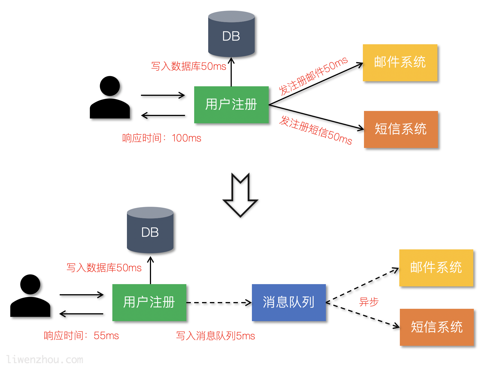

### 26.2.2 应用解耦

通过使用消息队列将不同的业务逻辑解耦，降低系统间的耦合，提高系统的健壮性。后续有其他业务要使用订单数据可直接订阅消息队列，提高系统的灵活性。

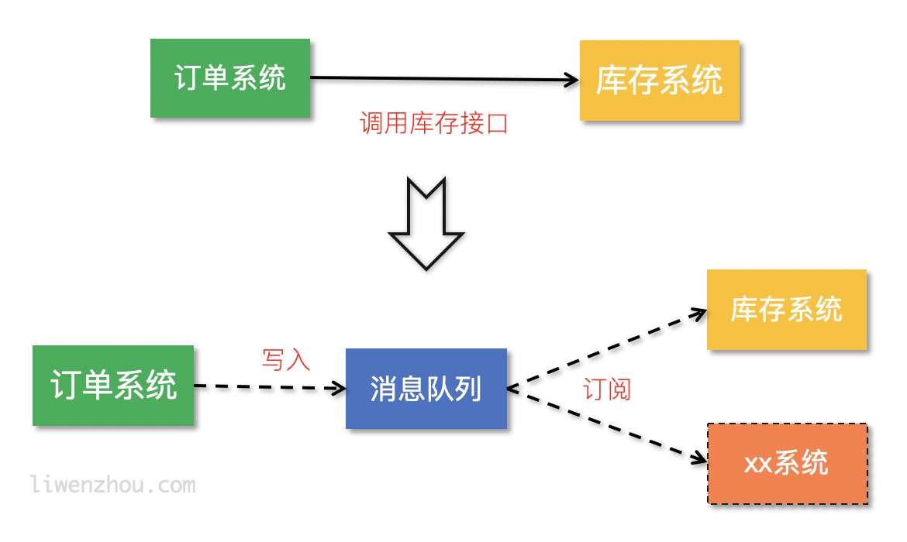

### 26.2.3 流量削峰

类似秒杀（大秒）等场景下，某一时间可能会产生大量的请求，使用消息队列能够为后端处理请求提供一定的缓冲区，保证后端服务的稳定性。


## 26.3 安装

[官方下载页面](https://nsq.io/deployment/installing.html) 根据自己的平台下载并解压即可。

## 26.4 NSQ组件

### 26.4.1 nsqd

**`nsqd` 是一个守护进程，它接收、排队并向客户端发送消息。**

启动 `nsqd`，指定 `-broadcast-address=127.0.0.1` 来配置广播地址:

```
./nsqd -broadcast-address=127.0.0.1
```

如果是在搭配 `nsqlookupd` 使用的模式下需要还指定 `nsqlookupd` 地址:

```
./nsqd -broadcast-address=127.0.0.1 -lookupd-tcp-address=127.0.0.1:4160
```

如果是部署了多个 `nsqlookupd` 节点的集群，那还可以指定多个 `-lookupd-tcp-address`。

`nsqdq` 相关配置项如下：

```go
-auth-http-address value
    <addr>:<port> to query auth server (may be given multiple times)
-broadcast-address string
    address that will be registered with lookupd (defaults to the OS hostname) (default "PROSNAKES.local")
-config string
    path to config file
-data-path string
    path to store disk-backed messages
-deflate
    enable deflate feature negotiation (client compression) (default true)
-e2e-processing-latency-percentile value
    message processing time percentiles (as float (0, 1.0]) to track (can be specified multiple times or comma separated '1.0,0.99,0.95', default none)
-e2e-processing-latency-window-time duration
    calculate end to end latency quantiles for this duration of time (ie: 60s would only show quantile calculations from the past 60 seconds) (default 10m0s)
-http-address string
    <addr>:<port> to listen on for HTTP clients (default "0.0.0.0:4151")
-http-client-connect-timeout duration
    timeout for HTTP connect (default 2s)
-http-client-request-timeout duration
    timeout for HTTP request (default 5s)
-https-address string
    <addr>:<port> to listen on for HTTPS clients (default "0.0.0.0:4152")
-log-prefix string
    log message prefix (default "[nsqd] ")
-lookupd-tcp-address value
    lookupd TCP address (may be given multiple times)
-max-body-size int
    maximum size of a single command body (default 5242880)
-max-bytes-per-file int
    number of bytes per diskqueue file before rolling (default 104857600)
-max-deflate-level int
    max deflate compression level a client can negotiate (> values == > nsqd CPU usage) (default 6)
-max-heartbeat-interval duration
    maximum client configurable duration of time between client heartbeats (default 1m0s)
-max-msg-size int
    maximum size of a single message in bytes (default 1048576)
-max-msg-timeout duration
    maximum duration before a message will timeout (default 15m0s)
-max-output-buffer-size int
    maximum client configurable size (in bytes) for a client output buffer (default 65536)
-max-output-buffer-timeout duration
    maximum client configurable duration of time between flushing to a client (default 1s)
-max-rdy-count int
    maximum RDY count for a client (default 2500)
-max-req-timeout duration
    maximum requeuing timeout for a message (default 1h0m0s)
-mem-queue-size int
    number of messages to keep in memory (per topic/channel) (default 10000)
-msg-timeout string
    duration to wait before auto-requeing a message (default "1m0s")
-node-id int
    unique part for message IDs, (int) in range [0,1024) (default is hash of hostname) (default 616)
-snappy
    enable snappy feature negotiation (client compression) (default true)
-statsd-address string
    UDP <addr>:<port> of a statsd daemon for pushing stats
-statsd-interval string
    duration between pushing to statsd (default "1m0s")
-statsd-mem-stats
    toggle sending memory and GC stats to statsd (default true)
-statsd-prefix string
    prefix used for keys sent to statsd (%s for host replacement) (default "nsq.%s")
-sync-every int
    number of messages per diskqueue fsync (default 2500)
-sync-timeout duration
    duration of time per diskqueue fsync (default 2s)
-tcp-address string
    <addr>:<port> to listen on for TCP clients (default "0.0.0.0:4150")
-tls-cert string
    path to certificate file
-tls-client-auth-policy string
    client certificate auth policy ('require' or 'require-verify')
-tls-key string
    path to key file
-tls-min-version value
    minimum SSL/TLS version acceptable ('ssl3.0', 'tls1.0', 'tls1.1', or 'tls1.2') (default 769)
-tls-required
    require TLS for client connections (true, false, tcp-https)
-tls-root-ca-file string
    path to certificate authority file
-verbose
    enable verbose logging
-version
    print version string
-worker-id
    do NOT use this, use --node-id
```

### 26.4.2 nsqlookupd

**`nsqlookupd` 是维护所有 `nsqd` 状态、提供服务发现的守护进程。**它能为消费者查找特定 topic 下的 nsqd 提供了运行时的自动发现服务。 它不维持持久状态，也不需要与任何其他 nsqlookupd 实例协调以满足查询。因此**根据你系统的冗余要求尽可能多地部署 nsqlookupd 节点**。它们消耗的资源很少，可以与其他服务共存。我们的建议是为每个数据中心运行至少3个集群。

nsqlookupd相 关配置项如下：

```go
-broadcast-address string
    address of this lookupd node, (default to the OS hostname) (default "PROSNAKES.local")
-config string
    path to config file
-http-address string
    <addr>:<port> to listen on for HTTP clients (default "0.0.0.0:4161")
-inactive-producer-timeout duration
    duration of time a producer will remain in the active list since its last ping (default 5m0s)
-log-prefix string
    log message prefix (default "[nsqlookupd] ")
-tcp-address string
    <addr>:<port> to listen on for TCP clients (default "0.0.0.0:4160")
-tombstone-lifetime duration
    duration of time a producer will remain tombstoned if registration remains (default 45s)
-verbose
    enable verbose logging
-version
    print version string
```

### 26.4.3 nsqadmin

**一个实时监控集群状态、执行各种管理任务的 Web 管理平台**。 启动 nsqadmin，指定 nsqlookupd 地址:

```
./nsqadmin -lookupd-http-address=127.0.0.1:4161
```

我们可以使用浏览器打开 `http://127.0.0.1:4171/` 访问如下管理界面。 

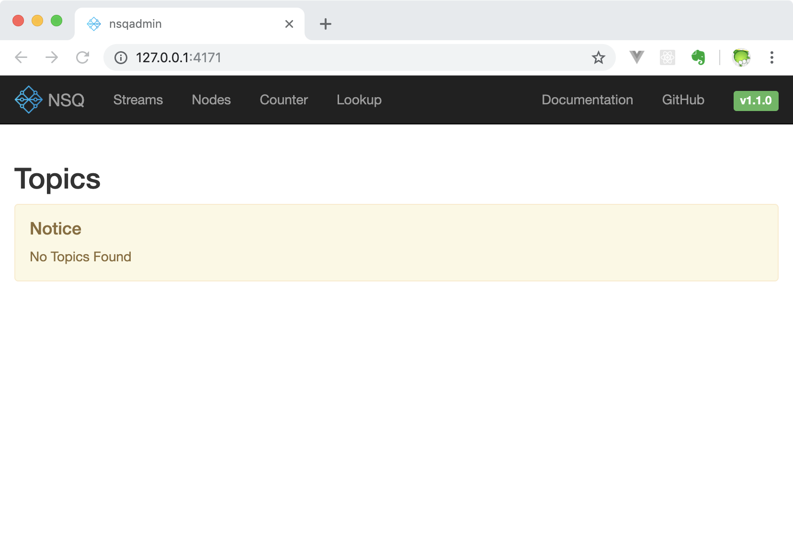

`nsqadmin` 相关的配置项如下：

```
-allow-config-from-cidr string
    A CIDR from which to allow HTTP requests to the /config endpoint (default "127.0.0.1/8")
-config string
    path to config file
-graphite-url string
    graphite HTTP address
-http-address string
    <addr>:<port> to listen on for HTTP clients (default "0.0.0.0:4171")
-http-client-connect-timeout duration
    timeout for HTTP connect (default 2s)
-http-client-request-timeout duration
    timeout for HTTP request (default 5s)
-http-client-tls-cert string
    path to certificate file for the HTTP client
-http-client-tls-insecure-skip-verify
    configure the HTTP client to skip verification of TLS certificates
-http-client-tls-key string
    path to key file for the HTTP client
-http-client-tls-root-ca-file string
    path to CA file for the HTTP client
-log-prefix string
    log message prefix (default "[nsqadmin] ")
-lookupd-http-address value
    lookupd HTTP address (may be given multiple times)
-notification-http-endpoint string
    HTTP endpoint (fully qualified) to which POST notifications of admin actions will be sent
-nsqd-http-address value
    nsqd HTTP address (may be given multiple times)
-proxy-graphite
    proxy HTTP requests to graphite
-statsd-counter-format string
    The counter stats key formatting applied by the implementation of statsd. If no formatting is desired, set this to an empty string. (default "stats.counters.%s.count")
-statsd-gauge-format string
    The gauge stats key formatting applied by the implementation of statsd. If no formatting is desired, set this to an empty string. (default "stats.gauges.%s")
-statsd-interval duration
    time interval nsqd is configured to push to statsd (must match nsqd) (default 1m0s)
-statsd-prefix string
    prefix used for keys sent to statsd (%s for host replacement, must match nsqd) (default "nsq.%s")
-version
    print version string
```

## 26.5 NSQ 架构

### 26.5.1 NSQ 工作模式

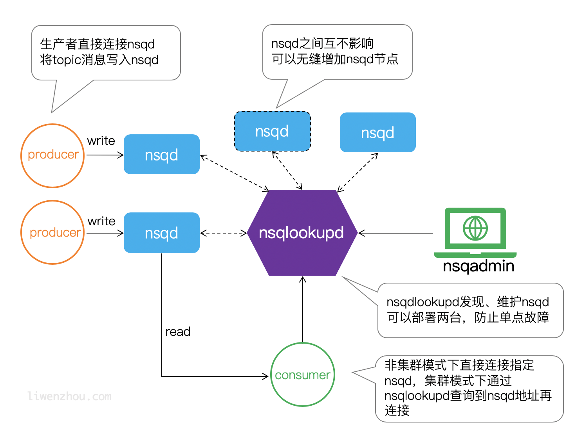

### 26.5.2 Topic 和 Channel

每个 `nsqd 实例` 旨在一次处理多个数据流。这些数据流称为 `topics`，一个 `topic` 具有一个或多个`channels`。每个 `channel` 都会收到 `topic` 所有消息的副本，实际上下游的服务是通过对应的 `channel` 来消费 `topic` 消息。

`topic` 和 `channel` 不是预先配置的。`topic` 在首次使用时创建，方法是将其发布到指定 `topic`，或者订阅指定 `topic` 上的 `channel`。`channel` 是通过订阅指定的 `channel`在第一次使用时创建的。

`topic` 和 `channel` 都相互独立地缓冲数据，防止缓慢的消费者导致其他 `chennel` 的积压（同样适用于 `topic` 级别）。

`channel` 可以并且通常会连接多个客户端。**假设所有连接的客户端都处于准备接收消息的状态，则每条消息将被传递到随机客户端**。例如：

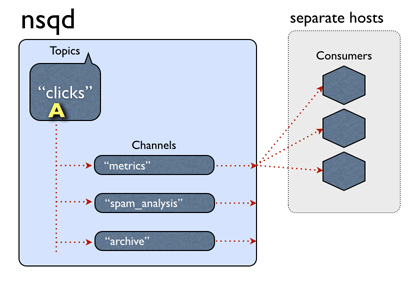

总而言之，消息是从 `topic -> channel`（每个 channel 接收该 topic 的所有消息的副本）多播的，但是从 `channel -> consumers` 均匀分布（每个消费者接收该 channel 的一部分消息）。

### 26.5.3 NSQ 接收和发送消息流程

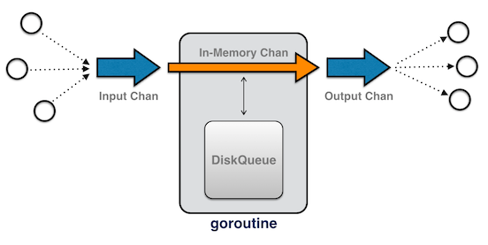

## 26.6 NSQ 特性

* 消息默认不持久化，可以配置成持久化模式。nsq 采用的方式是 `内存+硬盘` 的模式，当内存到达一定程度时就会将数据持久化到硬盘。
	* 如果将 `--mem-queue-size` 设置为 0，所有的消息将会存储到磁盘。
	* 服务器重启时也会将当时在内存中的消息持久化。
* 每条消息至少传递一次。
* 消息不保证有序。

## 26.7 Go 操作 NSQ

官方提供了 Go 语言版的客户端：[go-nsq](https://github.com/nsqio/go-nsq)，更多客户端支持请查看 [CLIENT LIBRARIES](https://nsq.io/clients/client_libraries.html)。

### 26.7.1 安装

```go
go get -u github.com/nsqio/go-nsq
```

### 26.7.2 生产者

一个简单的生产者示例代码如下：

```go
// nsq_producer/main.go
package main

import (
	"bufio"
	"fmt"
	"os"
	"strings"

	"github.com/nsqio/go-nsq"
)

// NSQ Producer Demo

var producer *nsq.Producer

// 初始化生产者
func initProducer(str string) (err error) {
	config := nsq.NewConfig()
	producer, err = nsq.NewProducer(str, config)
	if err != nil {
		fmt.Printf("create producer failed, err:%v\n", err)
		return err
	}
	return nil
}

func main() {
	nsqAddress := "127.0.0.1:4150"
	err := initProducer(nsqAddress)
	if err != nil {
		fmt.Printf("init producer failed, err:%v\n", err)
		return
	}

	reader := bufio.NewReader(os.Stdin) // 从标准输入读取
	for {
		data, err := reader.ReadString('\n')
		if err != nil {
			fmt.Printf("read string from stdin failed, err:%v\n", err)
			continue
		}
		data = strings.TrimSpace(data)
		if strings.ToUpper(data) == "Q" { // 输入Q退出
			break
		}
		// 向 'topic_demo' publish 数据
		err = producer.Publish("topic_demo", []byte(data))
		if err != nil {
			fmt.Printf("publish msg to nsq failed, err:%v\n", err)
			continue
		}
	}
}
```

将上面的代码编译执行，然后在终端输入两条数据 123 和 456 ：

```
$ ./nsq_producer 
123
2018/10/22 18:41:20 INF    1 (127.0.0.1:4150) connecting to nsqd
456
```

使用浏览器打开 `http://127.0.0.1:4171/` 可以查看到类似下面的页面： 在下面这个页面能看到当前的 topic 信息：

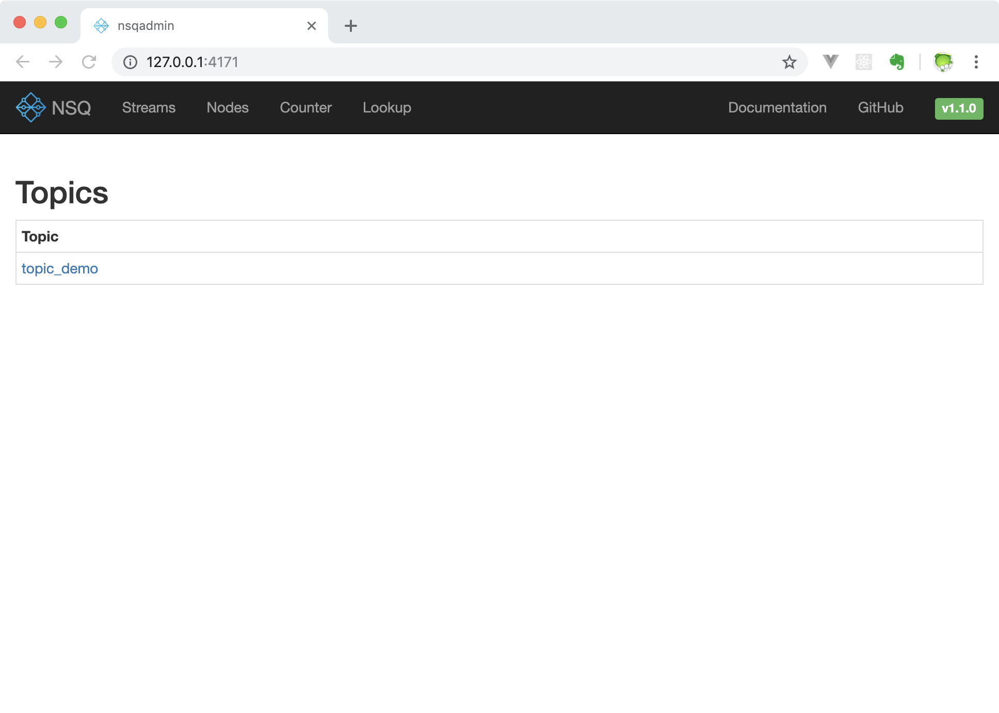

点击页面上的 `topic_demo` 就能进入一个展示更多详细信息的页面，在这个页面上我们可以查看和管理 topic ，同时能够看到目前在 `LWZMBP:4151 (127.0.01:4151)` 这个 `nsqd` 上有 2 条 message。又因为没有消费者接入所以暂时没有创建 channel 。

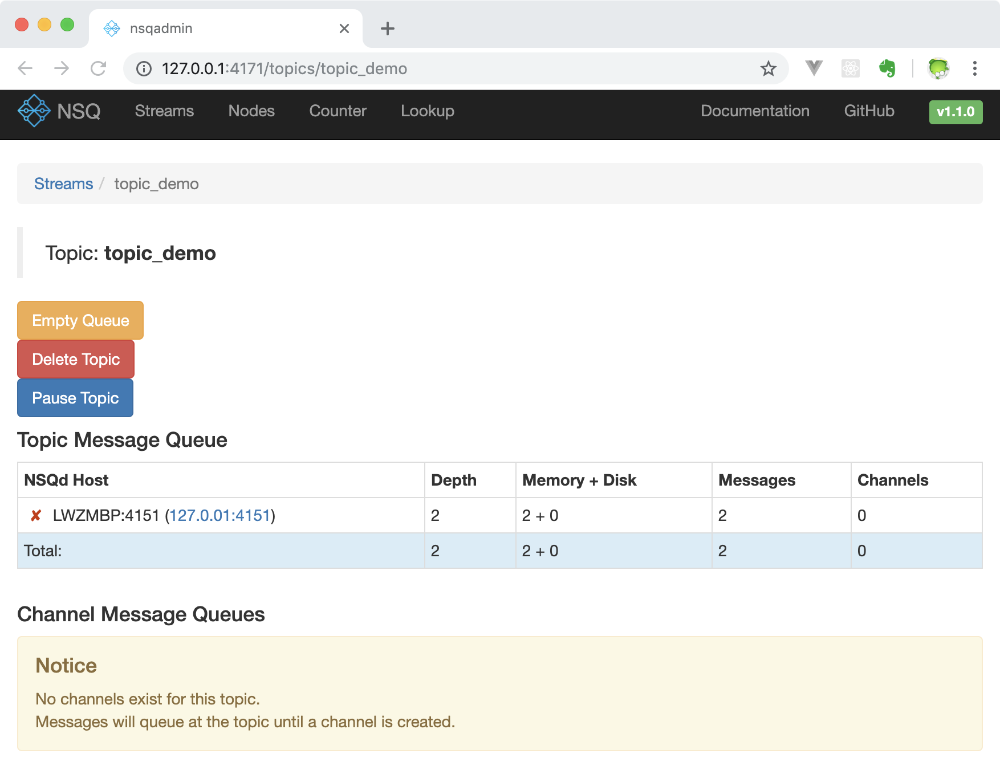

在 `/nodes` 这个页面我们能够很方便的查看当前接入 lookupd 的 nsqd 节点。

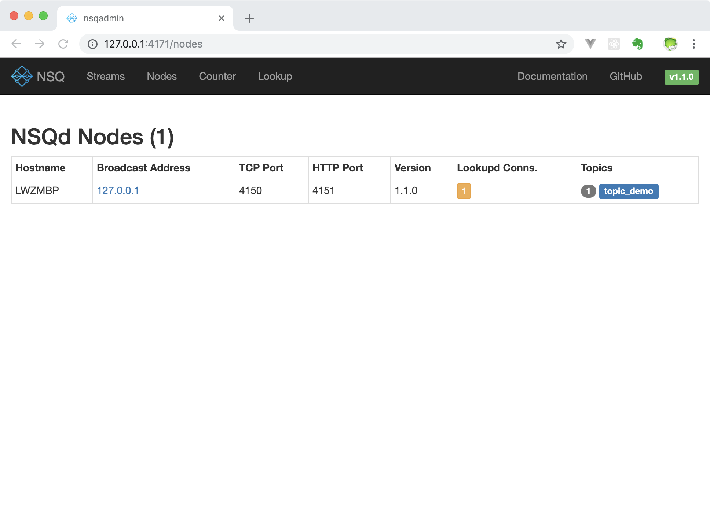

这个 `/counter` 页面显示了处理的消息数量，因为我们没有接入消费者，所以处理的消息数量为 0。

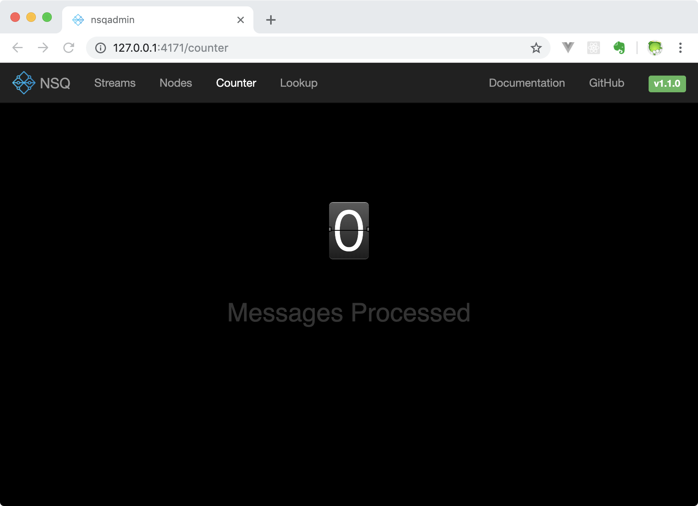

在 `/lookup` 界面支持创建 topic 和 channel。

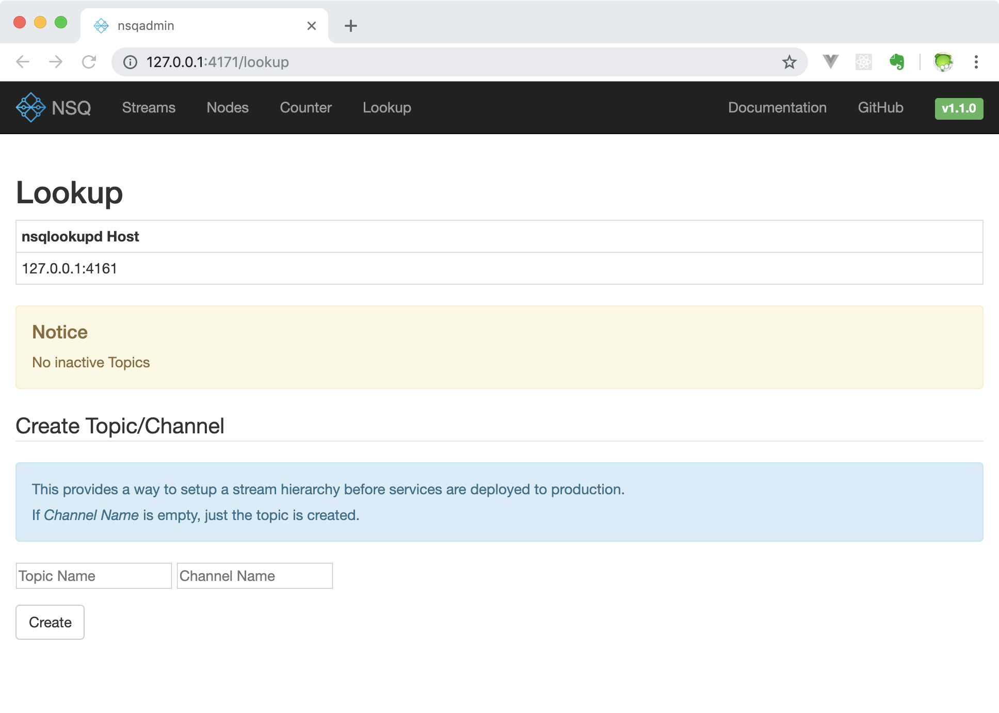

## 26.7.3 消费者

一个简单的消费者示例代码如下：

```go
// nsq_consumer/main.go
package main

import (
	"fmt"
	"os"
	"os/signal"
	"syscall"
	"time"

	"github.com/nsqio/go-nsq"
)

// NSQ Consumer Demo

// MyHandler 是一个消费者类型
type MyHandler struct {
	Title string
}

// HandleMessage 是需要实现的处理消息的方法
func (m *MyHandler) HandleMessage(msg *nsq.Message) (err error) {
	fmt.Printf("%s recv from %v, msg:%v\n", m.Title, msg.NSQDAddress, string(msg.Body))
	return
}

// 初始化消费者
func initConsumer(topic string, channel string, address string) (err error) {
	config := nsq.NewConfig()
	config.LookupdPollInterval = 15 * time.Second
	c, err := nsq.NewConsumer(topic, channel, config)
	if err != nil {
		fmt.Printf("create consumer failed, err:%v\n", err)
		return
	}
	consumer := &MyHandler{
		Title: "沙河1号",
	}
	c.AddHandler(consumer)

	// if err := c.ConnectToNSQD(address); err != nil { // 直接连NSQD
	if err := c.ConnectToNSQLookupd(address); err != nil { // 通过lookupd查询
		return err
	}
	return nil

}

func main() {
	err := initConsumer("topic_demo", "first", "127.0.0.1:4161")
	if err != nil {
		fmt.Printf("init consumer failed, err:%v\n", err)
		return
	}
	c := make(chan os.Signal)        // 定义一个信号的通道
	signal.Notify(c, syscall.SIGINT) // 转发键盘中断信号到c
	<-c                              // 阻塞
}
```

将上面的代码保存之后编译执行，就能够获取之前我们 publish 的两条消息了：

```
$ ./nsq_consumer 
2018/10/22 18:49:06 INF    1 [topic_demo/first] querying nsqlookupd http://127.0.0.1:4161/lookup?topic=topic_demo
2018/10/22 18:49:06 INF    1 [topic_demo/first] (127.0.0.1:4150) connecting to nsqd
沙河1号 recv from 127.0.0.1:4150, msg:123
沙河1号 recv from 127.0.0.1:4150, msg:456
```

同时在 nsqadmin 的 `/counter` 页面查看到处理的数据数量为 2。

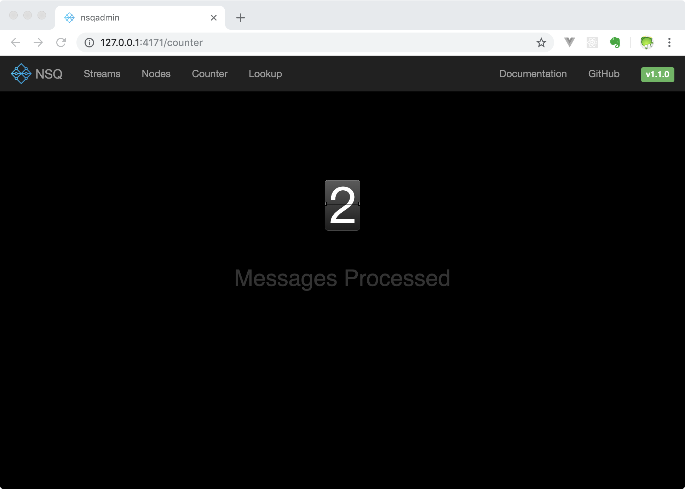

关于 go-nsq 的更多内容请阅读 [go-nsq的官方文档](https://godoc.org/github.com/nsqio/go-nsq)。

