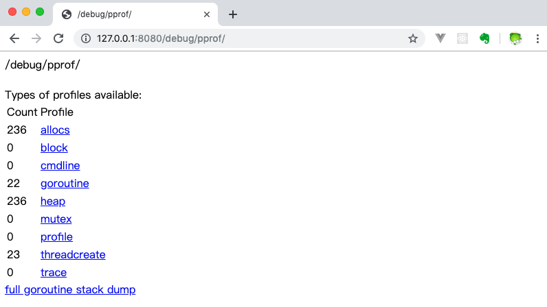
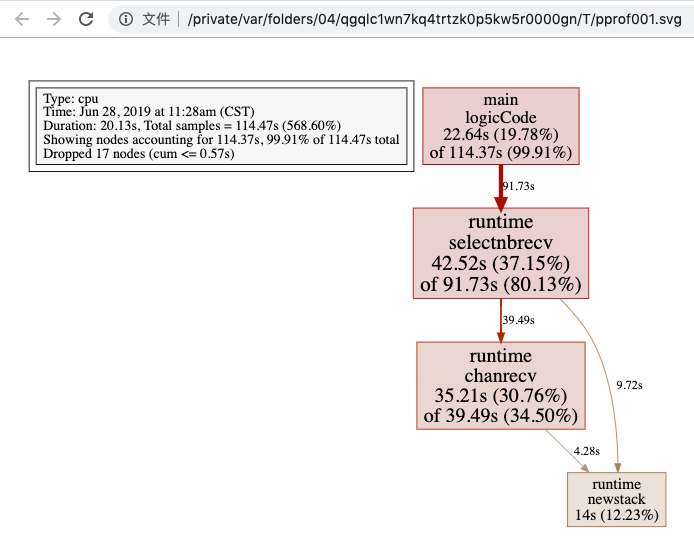
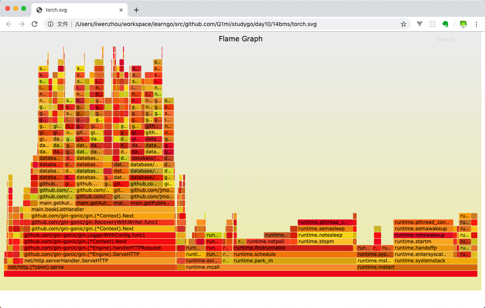

基于原文：[Go性能调优](https://www.liwenzhou.com/posts/Go/performance_optimisation/) 和 [视频 125-128](https://www.bilibili.com/video/BV17Q4y1P7n9?p=125) 整理。

在计算机性能调试领域里，**`profiling` 是指对应用程序的画像，画像就是应用程序使用 CPU 和内存的情况**。 Go 语言是一个对性能特别看重的语言，因此语言中自带了 `profiling` 的库，这篇文章就要讲解怎么在 golang 中做 `profiling`。

Go 语言项目中的性能优化主要有以下几个方面：

* `CPU profile`：报告程序的 CPU 使用情况，按照一定频率去采集应用程序在 CPU 和寄存器上面的数据
* `Memory Profile（Heap Profile）`：报告程序的内存使用情况
* `Block Profiling`：报告 `goroutines` 不在运行状态的情况，可以**用来分析和查找死锁**等性能瓶颈
* `Goroutine Profiling`：报告 `goroutines` 的使用情况，有哪些 `goroutine`，它们的调用关系是怎样的

## 21.1 采集性能数据

Go 语言内置了获取程序的运行数据的工具，包括以下两个标准库：

* `runtime/pprof`：采集**工具型应用**运行数据进行分析
* `net/http/pprof`：采集**服务型应用**运行时数据进行分析
 
`pprof` 开启后，每隔一段时间（10ms）就会收集下当前的堆栈信息，获取各个函数占用的 CPU 以及内存资源；最后通过对这些采样数据进行分析，形成一个性能分析报告。

**注意，我们只应该在性能测试的时候才在代码中引入 pprof**。

## 21.2 工具型应用

如果你的应用程序是运行一段时间就结束退出类型。那么最好的办法是在应用退出的时候把 profiling 的报告保存到文件中，进行分析。对于这种情况，可以使用 `runtime/pprof` 库。 首先在代码中导入`runtime/pprof`工具：

```go
import "runtime/pprof"
```

### 21.2.1 CPU性能分析

开启 CPU 性能分析：

```go
pprof.StartCPUProfile(w io.Writer)
```

停止 CPU 性能分析：

```go
pprof.StopCPUProfile()
```

应用执行结束后，就会生成一个文件，保存了我们的 CPU profiling 数据。得到采样数据之后，使用 `go tool pprof`工具进行 CPU 性能分析。

### 21.2.2 内存性能优化

记录程序的堆栈信息

```go
pprof.WriteHeapProfile(w io.Writer)
```

得到采样数据之后，使用 `go tool pprof`工具进行内存性能分析。

`go tool pprof` 默认是使用 `-inuse_space` 进行统计，还可以使用 `-inuse-objects` 查看分配对象的数量。

## 21.3 服务型应用

如果你的应用程序是一直运行的，比如 web 应用，那么可以使用 `net/http/pprof` 库，它能够在提供 HTTP 服务进行分析。

如果使用了默认的 `http.DefaultServeMux`（通常是代码直接使用 `http.ListenAndServe(“0.0.0.0:8000”, nil)`），只需要在你的 web server 端代码中按如下方式导入 `net/http/pprof`

```go
import _ "net/http/pprof"
```

如果你使用自定义的 Mux，则需要手动注册一些路由规则：

```go
r.HandleFunc("/debug/pprof/", pprof.Index)
r.HandleFunc("/debug/pprof/cmdline", pprof.Cmdline)
r.HandleFunc("/debug/pprof/profile", pprof.Profile)
r.HandleFunc("/debug/pprof/symbol", pprof.Symbol)
r.HandleFunc("/debug/pprof/trace", pprof.Trace)
```

如果你使用的是 gin 框架，那么推荐使用 [github.com/gin-contrib/pprof](https://github.com/gin-contrib/pprof)，在代码中通过以下命令注册 pprof 相关路由。

```go
pprof.Register(router)
```

不管哪种方式，你的 HTTP 服务都会多出 `/debug/pprof` endpoint，访问它会得到类似下面的内容：



`debug/pprof` 这个路径下还有几个子页面：

* `/debug/pprof/profile`：访问这个链接会自动进行 CPU profiling，持续 30s，并生成一个文件供下载
* `/debug/pprof/heap`： Memory Profiling 的路径，访问这个链接会得到一个内存 Profiling 结果的文件
* `/debug/pprof/block`：block Profiling 的路径
* `/debug/pprof/goroutines`：运行的 goroutines 列表，以及调用关系

## 21.4 go tool pprof命令

不管是工具型应用还是服务型应用，我们使用相应的 pprof 库获取数据之后，下一步的都要对这些数据进行分析，我们可以使用 `go tool pprof` 命令行工具。

`go tool pprof` 最简单的使用方式为:

```go
go tool pprof [binary] [source]
```

其中：

* `binary`: 是应用的二进制文件，用来解析各种符号；
* `source`: 表示 profile 数据的来源，可以是本地的文件，也可以是 http 地址。

注意事项： **获取的 Profiling 数据是动态的，要想获得有效的数据，请保证应用处于较大的负载**（比如正在生成中运行的服务，或者通过其他工具模拟访问压力）。否则如果应用处于空闲状态，得到的结果可能没有任何意义。

## 21.5 具体示例 

首先我们来写一段有问题的代码：

```go
// runtime_pprof/main.go
package main

import (
	"flag"
	"fmt"
	"os"
	"runtime/pprof"
	"time"
)

// 一段有问题的代码
func logicCode() {
	var c chan int
	for {
		select {
		case v := <-c:
			fmt.Printf("recv from chan, value:%v\n", v)
		default:

		}
	}
}

func main() {
	var isCPUPprof bool
	var isMemPprof bool

	flag.BoolVar(&isCPUPprof, "cpu", false, "turn cpu pprof on")
	flag.BoolVar(&isMemPprof, "mem", false, "turn mem pprof on")
	flag.Parse()

	if isCPUPprof {
		file, err := os.Create("./cpu.pprof")
		if err != nil {
			fmt.Printf("create cpu pprof failed, err:%v\n", err)
			return
		}
		pprof.StartCPUProfile(file)
		defer pprof.StopCPUProfile()
	}
	for i := 0; i < 8; i++ {
		go logicCode()
	}
	time.Sleep(20 * time.Second)
	if isMemPprof {
		file, err := os.Create("./mem.pprof")
		if err != nil {
			fmt.Printf("create mem pprof failed, err:%v\n", err)
			return
		}
		pprof.WriteHeapProfile(file)
		file.Close()
	}
}
```

通过 flag 我们可以在命令行控制是否开启 CPU 和 Mem 的性能分析。 将上面的代码保存并编译成`runtime_pprof` 可执行文件，执行时加上 `-cpu`命令行参数如下：

```
./runtime_pprof -cpu
```

等待 30 秒后会在当前目录下生成一个 cpu.pprof 文件。

### 21.5.1 命令行交互界面

我们使用 go 工具链里的 pprof 来分析一下。

```
go tool pprof cpu.pprof
```

执行上面的代码会进入交互界面如下：

```
runtime_pprof $ go tool pprof cpu.pprof
Type: cpu
Time: Jun 28, 2019 at 11:28am (CST)
Duration: 20.13s, Total samples = 1.91mins (568.60%)
Entering interactive mode (type "help" for commands, "o" for options)
(pprof)  
```

我们可以在交互界面输入 top3 来查看程序中占用 CPU 前 3 位的函数：

```
(pprof) top3
Showing nodes accounting for 100.37s, 87.68% of 114.47s total
Dropped 17 nodes (cum <= 0.57s)
Showing top 3 nodes out of 4
      flat  flat%   sum%        cum   cum%
    42.52s 37.15% 37.15%     91.73s 80.13%  runtime.selectnbrecv
    35.21s 30.76% 67.90%     39.49s 34.50%  runtime.chanrecv
    22.64s 19.78% 87.68%    114.37s 99.91%  main.logicCode
```    
    
其中：

* `flat`：当前函数占用 CPU 的耗时
* `flat%`:当前函数占用 CPU 的耗时百分比
* `sum%`：函数占用 CPU 的耗时累计百分比
* `cum`：当前函数加上调用当前函数的函数占用 CPU 的总耗时
* `cum%`：当前函数加上调用当前函数的函数占用 CPU 的总耗时百分比
* 最后一列：函数名称

在大多数的情况下，我们可以通过分析这五列得出一个应用程序的运行情况，并对程序进行优化。

我们还可以使用 `list 函数名` 命令查看具体的函数分析，例如执行 `list logicCode` 查看我们编写的函数的详细分析。

```
(pprof) list logicCode
Total: 1.91mins
ROUTINE ================ main.logicCode in .../runtime_pprof/main.go
    22.64s   1.91mins (flat, cum) 99.91% of Total
         .          .     12:func logicCode() {
         .          .     13:   var c chan int
         .          .     14:   for {
         .          .     15:           select {
         .          .     16:           case v := <-c:
    22.64s   1.91mins     17:                   fmt.Printf("recv from chan, value:%v\n", v)
         .          .     18:           default:
         .          .     19:
         .          .     20:           }
         .          .     21:   }
         .          .     22:}
```

通过分析发现大部分 CPU 资源被17行占用，我们分析出 select 语句中的 default 没有内容会导致上面的 `case v:=<-c:` 一直执行。我们在 default 分支添加一行 `time.Sleep(time.Second)` 即可。

### 21.5.2 图形化

或者可以**直接输入 web，通过 svg 图的方式查看程序中详细的 CPU 占用情况**。 想要查看图形化的界面首先需要安装 `graphviz` 图形化工具。

#### 21.5.2.1 graphviz 安装

Mac 下的安装方式：

```
brew install graphviz
```

Windows 下的安装方式:

下载 `graphviz` 将 `graphviz` 安装目录下的 bin 文件夹添加到 Path 环境变量中。 在终端输入 `dot -version` 查看是否安装成功。

#### 21.5.2.2 图形界面说明



关于图形的说明： 

* 每个框代表一个函数，理论上框的越大表示占用的 CPU 资源越多。 
* 方框之间的线条代表函数之间的调用关系。 
* 线条上的数字表示函数调用的次数。 
* 方框中的第一行数字表示当前函数占用 CPU 的百分比，第二行数字表示当前函数累计占用 CPU 的百分比。

### 21.5.3 分析内存数据

除了分析 CPU 性能数据，pprof 也支持分析内存性能数据。比如，使用下面的命令分析 http 服务的 heap 性能数据，查看当前程序的内存占用以及热点内存对象使用的情况。

```
# 查看内存占用数据
go tool pprof -inuse_space http://127.0.0.1:8080/debug/pprof/heap
go tool pprof -inuse_objects http://127.0.0.1:8080/debug/pprof/heap
# 查看临时内存分配数据
go tool pprof -alloc_space http://127.0.0.1:8080/debug/pprof/heap
go tool pprof -alloc_objects http://127.0.0.1:8080/debug/pprof/heap
```
## 21.6 go-torch和火焰图

**火焰图（Flame Graph）**: 是 Bredan Gregg 创建的一种**性能分析图表**，因为它的样子近似 🔥而得名。

上面的 profiling 结果也可以转换成火焰图，如果对火焰图比较了解可以手动来操作，不过这里我们要介绍一个工具：**`go-torch`**。这是 uber 开源的一个工具，可以直接读取 `golang profiling` 数据，并生成一个火焰图的 svg 文件。

### 21.6.1 安装 `go-torch`

```
go get -v github.com/uber/go-torch
```   
   
火焰图 svg 文件可以通过浏览器打开，它对于调用图的最优点是**它是动态的，可以通过点击每个方块来 zoom in 分析它上面的内容**。

火焰图的**调用顺序从下到上，每个方块代表一个函数，它上面一层表示这个函数会调用哪些函数，方块的大小代表了占用 CPU 使用的长短**。火焰图的配色并没有特殊的意义，默认的红、黄配色是为了更像火焰而已。

`go-torch` 工具的使用非常简单，没有任何参数的话，它会尝试从 `http://localhost:8080/debug/pprof/profile` 获取 profiling 数据。它有三个常用的参数可以调整：

* `-u –url`：要访问的 URL，这里只是主机和端口部分
* `-s –suffix`：pprof profile 的路径，默认为 `/debug/pprof/profile`
* `–seconds`：要执行 profiling 的时间长度，默认为 30s

### 21.6.2 安装 FlameGraph

要生成火焰图，需要事先安装 `FlameGraph`工具，这个工具的安装很简单（需要 `perl` 环境支持），只要把对应的可执行文件加入到环境变量中即可。

* [下载安装 perl ：https://www.perl.org/get.html](https://www.perl.org/get.html)

* 下载 FlameGraph：`git clone https://github.com/brendangregg/FlameGraph.git`
* 将 FlameGraph 目录加入到操作系统的环境变量中。
* Windows平台下需要把 `go-torch/render/flamegraph.go` 文件中的 `GenerateFlameGraph` 按如下方式修改，然后在 `go-torch` 目录下执行 `go install` 即可。

```go
// GenerateFlameGraph runs the flamegraph script to generate a flame graph SVG. func GenerateFlameGraph(graphInput []byte, args ...string) ([]byte, error) {
flameGraph := findInPath(flameGraphScripts)
if flameGraph == "" {
	return nil, errNoPerlScript
}
if runtime.GOOS == "windows" {
	return runScript("perl", append([]string{flameGraph}, args...), graphInput)
}
  return runScript(flameGraph, args, graphInput)
}
```

### 21.6.3 压测工具 wrk

推荐使用 [https://github.com/wg/wrk](https://github.com/wg/wrk) 或 [https://github.com/adjust/go-wrk](https://github.com/adjust/go-wrk)

### 21.6.4 使用 `go-torch`

使用 wrk 进行压测:

```
go-wrk -n 50000 http://127.0.0.1:8080/book/list
```

在上面压测进行的同时，打开另一个终端执行:

```
go-torch -u http://127.0.0.1:8080 -t 30
```

30 秒之后终端会出现如下提示：`Writing svg to torch.svg`

然后我们使用浏览器打开 `torch.svg` 就能看到如下火焰图了。



* 火焰图的 y 轴表示 cpu 调用方法的先后，
* x 轴表示在每个采样调用时间内，方法所占的时间百分比，越宽代表占据 cpu 时间越多。

通过火焰图我们就可以更清楚的找出耗时长的函数调用，然后不断的修正代码，重新采样，不断优化。

此外还可以借助火焰图分析内存性能数据：

```
go-torch -inuse_space http://127.0.0.1:8080/debug/pprof/heap
go-torch -inuse_objects http://127.0.0.1:8080/debug/pprof/heap
go-torch -alloc_space http://127.0.0.1:8080/debug/pprof/heap
go-torch -alloc_objects http://127.0.0.1:8080/debug/pprof/heap
```

## 21.7 pprof 与性能测试结合

`go test` 命令有两个参数和 pprof 相关，它们分别指定生成的 CPU 和 Memory profiling 保存的文件：

* `-cpuprofile`：cpu profiling 数据要保存的文件地址
* `-memprofile`：memory profiling 数据要保存的文件地址

我们还可以选择将 pprof 与性能测试相结合，比如：

* 下面执行测试的同时，也会执行 CPU profiling，并把结果保存在 cpu.prof 文件中：

```
go test -bench . -cpuprofile=cpu.prof
```

* 下面执行测试的同时，也会执行 Mem profiling，并把结果保存在 mem.prof 文件中：

```
go test -bench . -memprofile=./mem.prof
```

需要注意的是，Profiling 一般和性能测试一起使用，这个原因在前文也提到过，只有应用在负载高的情况下 Profiling 才有意义。

## 21.8 练习题

使用 gin 框架编写一个接口，使用 `go-wrk` 进行压测，使用性能调优工具采集数据绘制出调用图和火焰图。