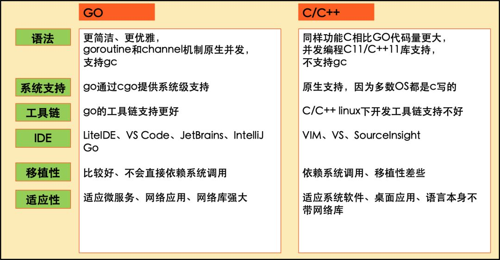

# 概述
## 1 背景

### 产生原因
Go是Google开发的一种静态、强类型、编译型、并发型，并具有垃圾回收功能的类C编程语言。2009以开源项目的形式发布，2012年发布1.0稳定版本，距今已经十年了。

Go语言之父Pike提到：Go语言是以C为原型，以C++为目标而设计的。因为他觉得C++忒复杂了，要解救程序员于水火。

核心设计师Pike和Ken都是出身自贝尔实验室，Ken之于Pike，亦师亦友，共同发明了UTF-8，还共同结对编程过，感情好的像穿一条裤子。

Pike是Unix先驱，贝尔实验室最早跟Ken、Dennis一起开发Unix的猛人，Plan9 OS的灵魂人物。大胡子Ken爷爷则是Unix之父，和Dennis一起发明了C语言，殿堂骨灰级程序员，早已是名满天下。

### 设计哲学

C++语法自由自在，于是乎一群大佬为tab or space、大括号要不要换行等诸如此类的格式问题吵得不可开交。Go设计师认为，都是吃饱了撑的。

Go编译器内建工具gofmt强制源码格式化。对不起，没有选项，我的地盘听我的，把精力focus到真正重要的事情上来，停止无意义的争吵。

Go在某些点确实有突破，比如让并发编程更容易、运行更高效，比如垃圾回收让程序更安全，比如基于消息（Channel）编程的支持，比如内嵌关联结构，这些都很赞，因为编程语言发展这么多年，任何突破都是艰难和宝贵的。
### Go特色

Go是介于C与C++之间的语言，比C抽象层次高，比C++抽象层次低。因为是一门新的编程语言，站在巨人的肩膀，博采众长，规避了一些已知的问题，开发了一些优秀的特征，相比C/C++，Go的核心特征包括以下几个方面：

* 原生并发，以东尼·霍尔的通信顺序进程（CSP）为基础的goroutine，适合现代多核机器
* 垃圾回收，非常高效（请来世界顶级内存管理专家设计）
* 强大的标准库，对网络编程等的良好支持
* CGO提供了GO调用C机制，扩展了GO的能力边界
* 内嵌关联数组
* 非侵入式的接口设计
* 简单清晰的语法

### 优点

* 自带gc。
* 静态编译，编译好后，扔服务器直接运行。
* 简单的思想，没有继承，多态，类等。
* 丰富的库和详细的开发文档。
* 语法层支持并发，和拥有同步并发的channel类型，使并发开发变得非常方便。
* 简洁的语法，提高开发效率，同时提高代码的阅读性和可维护性。
* 超级简单的交叉编译，仅需更改环境变量。（花了我两天时间编译一个imagemagick到arm平台）
* 内含完善、全面的软件工程工具。Go语言自带的命令和工具相当地强大。通过它们，我们可以很轻松地完成
* Go语言程序的获取、编译、测试、安装、运行、运行分析等一系列工作，这几乎涉及了开发和维护一个软件的所有环节。

### Go VS C/C++

Go号称兼备C++的运行效率和PHP的开发效率，但benchmarks好像并不支持这个结论，数据有点打脸，Go的运行效率接近却略低于Java。

## 2 从C的角度理解Go

