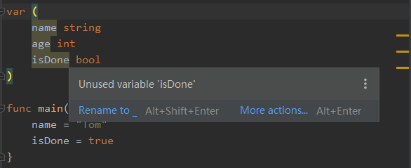

[TOC]

### 一、Hello Go

```go
// 包名为main , 表示当前go将会被编译成二进制可执行文件
// 当前文件想被编译成二进制的可执行文件,除了main包, 还得出现main()函数
// 如果是我们写一个工具包, 那么不用取名叫main
package main

import "fmt"

// 函数外只能放置变量的声明,不能防止逻辑语句( 如打印一句话 )

// main() 很干净,没参数,没返回值
func main(){
	fmt.Println("hello world")
}
```


### 二、变量和常量

#### 2.1  标识符

GO中的标识符，实际上就是程序员提供的变量名，方法名，常量名等等，在Go中这些标识符由字母、数字、下划线组成， 并且只用以字符和下划线开头。

```go
abc 
_123
a312
```


#### 2.2  关键字

* Go中一共有25个关键字。

```go
for     break 	continue	func 	interface  var
if		else    switch      case	import     return
range    type    package     const   default	map
select	 defer	struct		goto	chan	   go
fallthrough
```


* 37个保留字

就像java中Goto的是保留字一样，虽然现在好没有开发，但是未来可能会拓展。

```go
常量4个    true false  iota  nil

类型19个	int  int8    int16  int32  int64 
		  uint uint8   uint16 uint32  uint64
		  float32  float64 complex64  complex128
		  bool byte  rune  string  error

函数13个   make len cap  new  append  copy  close  delete
		  complex  real  imag
		  panic recover
```

#### 2.3  变量

* 变量的声明

```go
var 变量名	变量类型
```

Go的变量名推荐驼峰命令法 如： `studentName`。

同一个作用域下不能申明重复的变量。

* 标准声明

```go
var name string
var age  int
var isDone bool

// 声明变量的同时并赋值
var name string = "zhangsan"

// Go同样支持类型推导，所以我们可以直接这样写
var name  = "Jerry"
```

> **和Java中顺序有不同，且每行语句后都没有分号结尾。**


* 批量声明全局变量

```go
var (
     name string  // ""
	 age  int     // 0
     isDone bool   // false
)

// 声明时赋值
var (
     name string  // ""
	 age  int     // 0
     isDone bool   // false
)
```


* 短变量声明：

```go
name := "Jerry" // 相当于 var name = "Jerry"  的简写
```

短变量声明，要求只能在函数中使用。


* 变量一旦声明，必须使用

demo如下：



**变量先声明，再使用**，变量一旦声明了，就要求我们使用它

* 对于全局变量： 爆出黄色的警告说，变量不曾使用到。
* 对于方法内部的局部变量：  声明了，但是不使用，就会爆红。


#### 2.4  匿名变量

```go
func foo()(int,string){
	return 1,"tom"
}

func main(){
	x,_ := foo()
	_,y := foo()
	fmt.Print(x)
	fmt.Print(y)
}
```

Go中的匿名变量使用 _ 表示， 表示占位与忽略值。

如果我们确定不会使用函数的返回值，就将其表示成匿名变量。

匿名变量不占用命名空间，不会分配内存，所以匿名变量不存在重复声明。


#### 2.5 常量

相当于js中的const， 数值恒定不变的量， 同样的关键字使用const

```go
// 声明常量
const pi  = 3.1415926
const e  = 2.71

// 批量声明常量
const (
	name = "tom"
	age = 23
)

// 声明多个常量同时使用相同值， var变量则不行
const(
	n1= 100
	n2
	n3
)
```

尝试修改常量时，编译器会爆红


#### 2.6  iota

iota是Go语言中的**常量计数器**

在const中出现时重置为0 ，每多一行const变量的声明，计数+1

```go
const (
	n1 = iota //0
	n2        //1
	n3        //2
)

func main() {
	fmt.Print(n1) // 0
	fmt.Print(n2) // 1
	fmt.Print(n3) // 2
}
```

更多示例：

```go
const (
	n1 = iota //0
	n2        //1
	_		  // 什么都没写表示和上面一行
	n3        //3
)

const (
	n1 = iota //0
	n2        //1
	n3=100	  // 100
	n4        //100和上一行一样
)

const (
	n1 = iota //0
	n2 =100       //100
	n3=	iota  // 1
	n4        //2
)

// 多个常量声明在一行, 想知道结果话，得记住下面这句话
// 当const出现时 iota初始化为1，以后const中每多一行（不算空行），iota+1
const (
	d1, d2 = iota+1, iota+2
	d3, d4 = iota+1, iota+2
)

func main() {
	fmt.Println("n1: ", d1) //1
	fmt.Println("n2: ", d2) //2
	fmt.Println("n3: ", d3) //2
	fmt.Println("n4: ", d4)	//3
}

// 定义数量级常量
const(
	_ = iota
    kB = 1 << (10*iota) //1左移10位， 相当于2的10次方
    MB = 1 << (10*iota)
    GB = 1 << (10*iota)
    TB = 1 << (10*iota)
    PB = 1 << (10*iota)
)
	kB:  1024
	MB:  1048576
	GB:  1073741824
	TB:  1099511627776
	PB:  1125899906842624
```


### 三、Go基本数据类型


整形、浮点型、布尔型、字符串

数组、切片、结构体、函数、map、通道（channel) 

#### 3.01 整形

|                  类型                   |                       描述                        |
| :-------------------------------------: | :-----------------------------------------------: |
| uint8(能表示的范围实际上就是byte的范围) |                   无符号 0-255                    |
|                 uint16                  |                   无符号0-65535                   |
|                 uint32                  |                无符号 0-4294967295                |
|                 uint64                  |           无符号0-18446744073709551615            |
|                  int8                   |                 有符号-128 到127                  |
|                  int16                  |              有符号 -32768 到 32767               |
|                  int32                  |         有符号 -2147483648 到 2147484647          |
|                  int64                  | 有符号 -9223372037854776808到 9223372037854776807 |

特殊整型： 

| 类型    | 描述                                                |
| ------- | --------------------------------------------------- |
| uint    | 32位的操作系统就是uint32,  64位的操作系统就是uint64 |
| int     | 32位的操作系统就是int32,  64位的操作系统就是int64   |
| uintptr | 无符号整形，用于存放一个指针                        |

#### 3.02  八进制和十六进制

Go无法直接定义二进制数，如下是8进制和16进制数的示例

```go
func main() {
	var a int = 10
	fmt.Printf("%d \n", a) // %d 十进制表示10
	fmt.Printf("%b \n", a) // %b 二进制表示1010

	// 八进制数，以0开头
	var b int = 077
	fmt.Printf("%o \n", b)// 77

	// 16进制数，以0x 开头
	var c int = 0xff
    // c := 0xff
	fmt.Printf("%x \n", c) //ff
	fmt.Printf("%X \n", c) //FF
}
```


#### 3.03  浮点数

见如下实例：

```go
	fmt.Printf("%f \n",math.Pi) // 3.141593
	fmt.Printf("%.2f \n",math.Pi)// 3.14
	fmt.Printf("%f \n",math.MaxFloat32) // 340282346638528859811704183484516925440.000000
	fmt.Printf("%f \n",math.MaxFloat64) //179769313486231570814527423731704356798070567525844996598917476803157260780028538760589558632766878171540458953514382464234321326889464182768467546703537516986049910576551282076245490090389328944075868508455133942304583236903222948165808559332123348274797826204144723168738177180919299881250404026184124858368.000000

	f1:=1.23456
	fmt.Printf("%T \n",f1) // float64

	f2:=float32(1.23456) // 显示声明
	fmt.Printf("%T \n",f2) // float32

	// 和java一样，Go是静态类型的语言，所以f1与f2之间不能随便相互赋值, 
    // 需要进行强转，但是强转后会发生精度损失
	 f1= float64(f2)
```


#### 3.04 复数

```go
	var c1 complex64
	c1 = 1+2i

	var c2 complex128
	c2 = 2+3i

	fmt.Println(c1) // (1+2i)
	fmt.Println(c2) // (2+3i)
}
```

#### 3.05 布尔值

```go
	var b1 bool = true
	b2:=false
	var b3 bool
	fmt.Print(b1) // true
	fmt.Print(b2) // false
	fmt.Print(b3) // false
```

Go中， bool 不能参与类型强制转换其他类型


#### 3.06 字符串

Go语言中的字符串不同于java， Go中的字符串以原生的类型出现，string

Go中的字符串的内部编码实现使用utf-8

只能用 “ ” 包裹

```go
	var s string = "string"
	s2:= "string"
	fmt.Printf("s= %#v \n", s) // s= "string"
	fmt.Printf("s= %#v \n", s2) // s= "string"
```

#### 3.07 字符串的常见操作

```go
	var name string = "tom"
	var address string = "beijing"

	//全局函数，求长度
	fmt.Println(len(name)) //3

	// 合并两个字符串
	result:=fmt.Sprintf("%s %s",name,address) 
	fmt.Println(result) // tom   beijing
	
	// 和java一样，重载了+号，实现运算符的拼接
	result2:=name+address
	fmt.Println(result2) //tombeijing
```

其他方法的使用strings工具

```go
func main() {

	var address string = "bei jing"

	// 分隔
	result1:=strings.Split(address," ")
	fmt.Println(result1) // [bei jing]

	// 收否包含
	result2:=strings.Contains(address,"jing")
	fmt.Println(result2) // true

	// 前后缀判断
	result3:=strings.HasPrefix(address,"b")
	fmt.Println(result3) // true

	// 后缀判断
	result4:=strings.HasSuffix(address,"g")
	fmt.Println(result4) // true

	// 返回字符首次出现的下标
	result5:=strings.Index(address,"i")
	fmt.Println(result5) // 2

	// 返回字符首次出现的下标
	result6:=strings.LastIndex(address,"i")
	fmt.Println(result6) // 5

	// 连接字符串
	fmt.Println(strings.Join(result1,"+")) //bei+jing

}	
```


#### 3.08  转义符号 

| 转义 |         含义          |
| :--: | :-------------------: |
|  \r  |         回车          |
|  \n  |         换行          |
|  \t  | 制表符，相当于4个空格 |
| `\'` |        单引号         |
| `\"` |        双引号         |
| `\\` |        反斜杠         |

```go
	path1:=`D:\EEText` // 反引号里面的东西会原样输出
	path2:= "D:\\EEText" //通过 \ 转意路径
	fmt.Print(path1)
	fmt.Print(path2)	
```

#### 3.09  byte ， rune  和 int32

在Go中，字符串中的元素叫做**字符**， 使用 ’  ‘ 表示

1. **uint8 或者叫byte类型，代表了ASCII的字符**

   int8 可以表示 0-2^8 即 0-128, uint8可以表示 0-256 , 整好在ascii范围内

2. **rune ,  代表一个UTF8类型的字符**

当我们需要处理中文或者其他国家的语言时，我们选择使用`rune`类型， `rune`类型实际上是一个`int32`

```go
func main() {

	var address string = "嗨！ bei jing"

	// 处理英文数字
	for i:=0; i<len(address);i++{ // byte
		// 将他们编码值，转换成单个字符
         // byte能查找字符在ASCII中，英文，数字已经少量符号
		fmt.Printf("%c",address[i])
	}

	fmt.Println()

	// 处理中文，日文，其他复合文字
	for _,c:=range address{ // rune
		// 将他们编码值，转换成单个字符
		fmt.Printf("%c",c)
	}

}
```

#### 3.10 字符串的修改和类型转换

参见如下的实例-- 字符串不可更改：

```go
	var address string = "嗨！ bei jing"

	// 字符串是不可以更改的
	// address[0]:='A'　　会报错

	// 可以通过切片是形式，将字符串转换成切片，然后修改, 切片里面保存的就是字符
	s3:=[]rune(address)
	s3[0] = 'A'

	fmt.Print(string(s3)) // A！ bei jing
```


参见如下示例，整明白 int32, byte, rune 本质上都是在表示一个字符

```go
	c1:='A' // int32
	c2:="a" // string
	c3:='嗨'// int32 == rune
	c4:="嗨"// string
	fmt.Printf("c1: %T , c2:%T",c1,c2)
	fmt.Printf("c3: %T , c4:%T",c3,c4)
	// todo 实际总结一下就是： Go里面的字符串中每一个单位都是一个字符， 具体是中文的字符还是英文的字符Go给出了两个别命
	// todo 如果是中文的字符,用Utf8编码占3位 叫做 rune
	// todo 如果是英文的字符，用ＡＣＳＩＩ编码占一位， 叫做 byte
	// todo 但是不管是中文字符，还是英文字符，都是int32类型的
```


参见如下示例进行类型的转换

* 整形可以和float类型转换
* 字符串可以和切片之间进行类型的转换

```go
	n:=1
	f:=float32(n)
	fmt.Print(f) // 1
```


