### 一、go test 工具

Go为了我们提供了成体系内置的测试工具

测试依赖命令 `go test`

按照约定，对于`go test`来说，所有以`_test.go` 为后缀名的源代码文件都是需要测试的一部分，而不会被`go build`命令编译进最终的可执行文件中

在`*test.go`中有三种类型的函数，单元测试函数，基准测试函数和示例函数

| 类型     | 格式                  | 作用                   |
| -------- | --------------------- | ---------------------- |
| 测试函数 | 函数名前缀为Test      | 测试程序的逻辑是否正确 |
| 基准函数 | 函数名前缀为Benchmark | 测试函数性能           |
| 示例函数 | 前缀名为Example       | 提供实例文档           |

**当我们执行 `go test` 命令时， 遍历项目中所有的 `*_test.go` 文件中符合上述命名规则的函数，然后生成一个临时main包去调用相关的测试函数，然后运行 -> 构建测试结果 -> 清理测试生成的临时文件**


### 二、测试函数

> **如果使用编译器为Golang , 可以不使用下面的命令...** , 但是使用命令行,有丰富的参数供我们选择

**使用测试函数主要是看看我们的代码能不能跑通**

#### 2.1 格式：

所有的测试函数都需要如下要求

* 导入 `testing`包
* 函数名以Test开头

基本格式如下：

```go
func TestAdd(t *testing.T){
    // ...
}
```

其中的参数t用来**报告测试失败和附加的日志信息**， testing t 还有如下的方法

```go
func (c *T) Error(args ...interface{})
func (c *T) Errorf(format string, args ...interface{})
func (c *T) Fail()
func (c *T) FailNow()
func (c *T) Failed() bool
func (c *T) Fatal(args ...interface{})
func (c *T) Fatalf(format string, args ...interface{})
func (c *T) Log(args ...interface{})
func (c *T) Logf(format string, args ...interface{})
func (c *T) Name() string
func (t *T) Parallel()
func (t *T) Run(name string, f func(t *T)) bool
func (c *T) Skip(args ...interface{})
func (c *T) SkipNow()
func (c *T) Skipf(format string, args ...interface{})
func (c *T) Skipped() bool
```

#### 2.2 示例：

在测试之前， 我们得先有一个需要被测试的模块， 如下随便写个模块待会就测试它

```go
/*按照给定的sep， 完成str的切割*/
func Split(str,sep string)(result []string){
	i:=strings.Index(str,sep)
	for i>-1{
		result = append(result,str[:i])
		str = str[i+1:]
		i=strings.Index(str,sep)
	}
	result = append(result,str)
	return 
}

```

测试函数:

```go
func TestSplit(t *testing.T) {
	// 运行函数， 得到结果
	got:=Split("a:b:c",":")
	// 期望的结果
	want:=[]string{"a","b","c"}
	//slice不能直接进行比较， 借助反射包里卖弄的DeepEquals比较
	if !reflect.DeepEqual(got,want){
		// 使用T, 输出错误日志
		t.Errorf("except:%v , got:%v",want,got)
	}
}
```


测试命令 : go test  

结果如下:

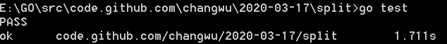


测试命令: go test -v

**可以查看到测试函数是谁, 耗费了多少时间**


测试未通过,  会按我们预先的定义, 打印错误日志

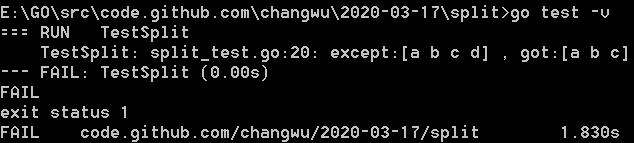


如果我们已经确定了未通过测试的函数的函数名, 我们通过`-run="FuncName"`  参数, 明确指定仅测试函数名为FuncName 的方法 , 他是一个正则表达式, 当函数名匹配上时, 才会被 go test 运行


如果我们通过-run="不存在的方法名" , go test 会提示我们没有可以测试的函数

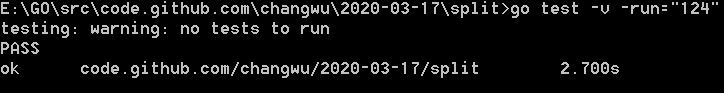


### 三、测试组

使用测试组一次性测试多组数据

```go
func TestSplit(t *testing.T) {
	// 定义测试类型
	type test struct {
		input string
		seq string
		want []string
	}
	// 定义存储测试用例的切片
	tests:=[]test{
		{input:"a:b:c",seq:":",want:[]string{"a","b","c"}},
		{input:"a:b:c",seq:",",want:[]string{"a:b:c"}},
		{input:"abcd",seq:"bc",want:[]string{"a","d"}},
	}

	// 遍历切片,测试
	for _,tc:=range tests{
		got:=Split(tc.input,tc.seq)
		if !reflect.DeepEqual(got,tc.want){
			t.Errorf("got:%#v ,  want:%#v",got,tc.want)
		}
	}
}
```

测试:

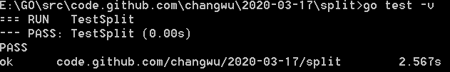


### 四、子测试

上面的测试组是存在问题的,  测试组中可能有多个测试,  但是我们没办法一眼就判断出测试组中那个测试出现问题了 ,  这时可以考虑子测试


* 我们可以使用map去解决这个事, 将上面的切片换成map

```go

/*
	1. 方法名以Test开头
	2. 参数位置传入参数 *testing.T
*/
func TestSplit(t *testing.T) {
	// 定义测试类型
	type test struct {
		input string
		seq string
		want []string
	}
	// 定义存储测试用例的切片
	tests:=map[string]test{
		"t1":{input:"a:b:c",seq:":",want:[]string{"a","b","c"}},
		"t2":{input:"a:b:c",seq:",",want:[]string{"a:b:c"}},
		"t3":{input:"abcd",seq:"bc",want:[]string{"a","d"}},
	}

	// 遍历切片,测试
	for _,tc:=range tests{
		got:=Split(tc.input,tc.seq)
		if !reflect.DeepEqual(got,tc.want){
			t.Errorf("got:%#v ,  want:%#v",got,tc.want)
		}
	}
}

```


* Go1.7中也添加了测试组 , 我们可以按照如下的方式执行 t.Run 执行子测试

```go
/*
	1. 方法名以Test开头
	2. 参数位置传入参数 *testing.T
*/
func TestSplit(t *testing.T) {
	// 定义测试类型
	type test struct {
		input string
		seq string
		want []string
	}
	// 定义存储测试用例的切片
	tests:=map[string]test{
		"t1":{input:"a:b:c",seq:":",want:[]string{"a","b","c"}},
		"t2":{input:"a:b:c",seq:",",want:[]string{"a:b:c"}},
		"t3":{input:"abcd",seq:"bc",want:[]string{"a","d"}},
	}

	// 遍历切片,测试
	for key,tc:=range tests{
        // 使用,t.Run(name,func) 完成子测试
		t.Run(key, func(t *testing.T) {
			got:=Split(tc.input,tc.seq)
			if !reflect.DeepEqual(got,tc.want){
				t.Errorf("got:%#v ,  want:%#v",got,tc.want)
			}
		})
	}
}
```


测试结果:

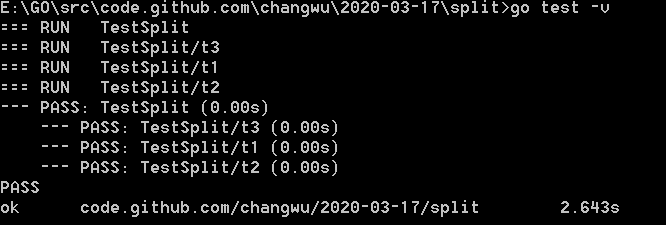


### 五、测试覆盖率

测试覆盖率是你的代码被测试套件覆盖的百分比。通常我们使用的都是语句的覆盖率，也就是在测试中至少被运行一次的代码占总代码的比例。


Go提供内置功能来检查你的代码覆盖率。我们可以使用`go test -cover`来查看测试覆盖率。例如

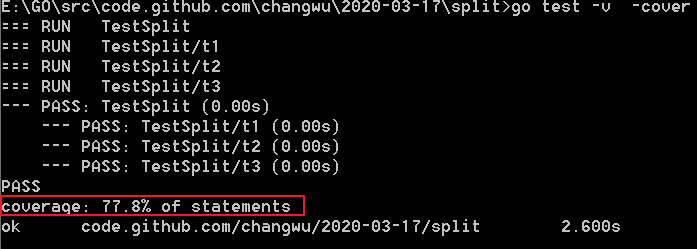


也可以使用 -coverprofile 参数, 将覆盖率输出到每一个具体的文件

```bash
go test -v -coverprofile=./c.out
```

查看生成结果

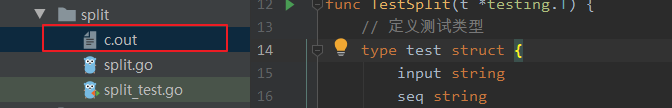


使用如下命令, 将c.out 文件以html的形式打开

```go
go tool cover -html=c.out
```


红色部分是未被覆盖的部分


### 六、基准测试

基准测试目的是检测程序的性能

命名格式要求

* 测试函数以 `benchMarkXXX` 为前缀
* 入参位置需要参数 `*testing.B`

```go
func BenchmarkName(b *testing.B){
    // ...
}
```


`testing.B`有如下的方法

```go
func (c *B) Error(args ...interface{})
func (c *B) Errorf(format string, args ...interface{})
func (c *B) Fail()
func (c *B) FailNow()
func (c *B) Failed() bool
func (c *B) Fatal(args ...interface{})
func (c *B) Fatalf(format string, args ...interface{})
func (c *B) Log(args ...interface{})
func (c *B) Logf(format string, args ...interface{})
func (c *B) Name() string
func (b *B) ReportAllocs()
func (b *B) ResetTimer()
func (b *B) Run(name string, f func(b *B)) bool
func (b *B) RunParallel(body func(*PB))
func (b *B) SetBytes(n int64)
func (b *B) SetParallelism(p int)
func (c *B) Skip(args ...interface{})
func (c *B) SkipNow()
func (c *B) Skipf(format string, args ...interface{})
func (c *B) Skipped() bool
func (b *B) StartTimer()
func (b *B) StopTimer()
```


#### 6.1 基准测试示例

```go
func BenchmarkSplit(t *testing.B) {
	for i:=0;i<t.N;i++{
		Split("a:b:c",":")
	}
}
```

测试结果: 如下图

有包信息, 系统信息, 测试次数, 平均多少ns测试完成一次

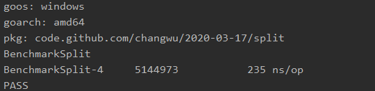


在命令行中完成测试 `go test -bench=XXX`

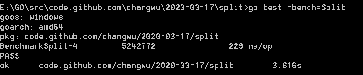


使用-benchmem 参数, 获取内存分配的统计数据

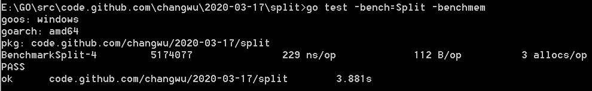


通过上图可以看出, 我们每次测试都会分配三次内存, 每次分配的内存大小是 112B , 接着我们就能根据这个报告去针对性的提升代码的性能

```go
// 提前分配内存, 减少内存的分配次数
result = make([]string,0,strings.Count(s,sep)+1)

```

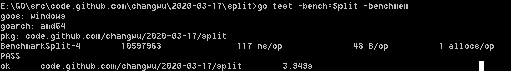


结果如上, 每次测试只申请一次内存, 每次分配的内存大小为 48B, 完成了1千万次测试, 性能提升了1倍

#### 6.2 性能比较函数

基准测试只能得到给定操作的绝对耗时，但是在**很多性能问题是发生在两个不同操作之间的相对耗时**

* 比如同一个函数处理1000个元素的耗时与处理1万甚至100万个元素的耗时的差别是多少？
* 再或者对于同一个任务究竟使用哪种算法性能最佳？我们通常需要对两个不同算法的实现使用相同的输入来进行基准比较测试。

例如下:

```go
func benchmark(b *testing.B, size int){/* ... */}
func Benchmark10(b *testing.B){ benchmark(b, 10) }
func Benchmark100(b *testing.B){ benchmark(b, 100) }
func Benchmark1000(b *testing.B){ benchmark(b, 1000) }
```


示例:

```go
// 注意下面这个函数
func benchmarkFib(b *testing.B, n int) {
    // 依然是从 0 ~ b.N
	for i:=0;i<b.N;i++{
        // 每次循环都是这个指定的fib值 n
		Fib(n)
	}
}


func BenchmarkFib1(b *testing.B) {
	benchmarkFib(b,1)
}
func BenchmarkFib5(b *testing.B) {
	benchmarkFib(b,5)
}
func BenchmarkFib10(b *testing.B) {
	benchmarkFib(b,10)
}
func BenchmarkFib20(b *testing.B) {
	benchmarkFib(b,20)
}
```


测试命令

```go
// 测试全部
go test -bench=.

// 测试指定的函数
go test -bench="Fib"
```


运行结果如下:

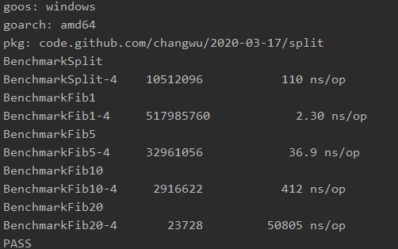


默认情况下:  每个基准测试都至少要运行1秒, 如果在Benchmark函数返回值还没有到1秒, 那么 b.N 会按照1,2,5,10,20,50 ... 增加, 并且重新运行函数

我们也可以使用 -benchtime=xs 设置基准测试的时间 , 以 产生更准确的结果


#### 6.3 重置时间

如果我们确定, 在真正执行性能测试之前会有一段和业务代码无关紧要的代码需要执行, 而且还会耗时影响整个测试的时间准确度, 可以考虑使用`b.ResetTimer` 重置时间

```go
func BenchMarkXXX(b *testing.B){
    // 耗时操作
    b.ResetTimer()
    // 开始测试
    xxx
}
```


#### 6.4 并行测试

```go
func (b *B) RunParallel(body func(*PB))
```

RunParallel 会创建出多个 `goroutine` , 并将`b.N` 分配给这些`goroutine`中执行

其中的`goroutine`的默认数量是GOMAXPROCS (默认为CPU数)

如果用户想添加非CPU的受限(non-CPU-bound) , 可以在`RunParallel`调用 `SetParallelism` , `SetParallelism`通常和 `-cpu` 一起使用

```go
func BenchmarkSplitParallel(b *testing.B) {

	// 在代码中,可以像下面这样设置CPU数量, 也可以在命令行中设置
	// b.SetParallelism(4)

	b.RunParallel(func(pb *testing.PB) {
		for pb.Next(){
			Split("a,b,c",",")
		}
	})
}
```


在命令行中设置CPU的数量

```go
go test -bench=Spilt -cpu 4
```

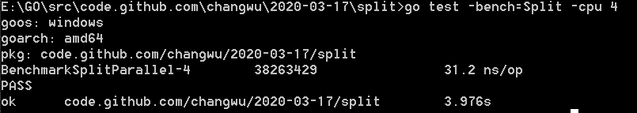


### 七、Setup 和 TearDown

* Setup : 用来在测试之前添加额外的配置
* TearDown: 用来在测试结束之后, 卸载额外的配置

#### 7.1 TestMain


如果 `*test.go`中  包含`func TestMain(m *testing.M)` 函数时, 生成的测试会先调用TestMain(m) , 然后再运行具体的测试

`TestMain` 运行在`主goroutine`中 , 于是我们就可以像下面这样, 在`m.Run`前后做一些setup和tearDown的操作, 退出测试的时候, 使用 `os.Exit`

```go
func TestMain(m *testing.M) {
	fmt.Println("setup ... ")
	retCode := m.Run()

	fmt.Println("teardown ... ")
	fmt.Println("retCode=", retCode)

	os.Exit(retCode)
}

func TestFib(t *testing.T) {
	Fib(4)
}
```

结果如图所示:

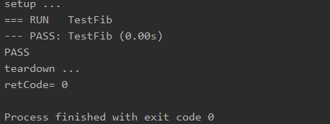


#### 7.2 子测试的Setup 和 TearDown

如下Demo, 我们可以为子测试设置Setup和TearDown

```go

func TestMain(m *testing.M) {
	fmt.Println("setup ... ")
	retCode := m.Run()

	fmt.Println("teardown ... ")
	fmt.Println("retCode=", retCode)

	os.Exit(retCode)
}

// 测试集的Setup 与 TearDown
func setupTestCase(t *testing.T) func(t *testing.T) {
	t.Log("测试执行前执行")
	return func(t *testing.T) {
		t.Log("测试执行后执行")
	}
}

// 子测试的Serup和TearDown
func setupSubTest(t *testing.T)func(t *testing.T){
	t.Log("子测试之前执行")
	return func(t *testing.T) {
		t.Log("子测试之后执行")
	}
}

func TestSplit(t *testing.T) {
	type test struct{
		input string
		sep string
		want []string
	}

	tests:=map[string]test{
		"t1":{input:"a,b,c",sep:",",want:[]string{"a","b","c"}},
		"t2":{input:"a:b:c",sep:":",want:[]string{"a","b","c"}},
		"t3":{input:"a,b,c",sep:",",want:[]string{"a","b","c"}},
	}

	// 测试之前执行 setup
	testCase := setupTestCase(t)
	// 测试之后执行tearDown
	defer testCase(t)

	for name,tc := range  tests{
		t.Run(name, func(t *testing.T) {
			// 子测试之前执行setup
			subTest := setupSubTest(t)
			// 子测试之后, 执行teardown
			defer subTest(t)

			got:=Split(tc.input,tc.sep)
			if !reflect.DeepEqual(got,tc.want) {
				t.Errorf("got:%v  but want:%v",got,tc.want)
			}
		})
	}
}

```

执行结果如下图示

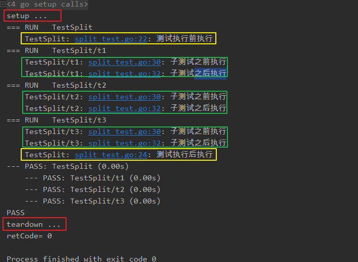


