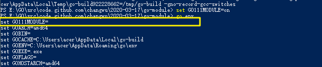
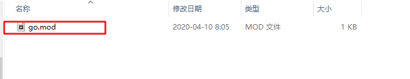
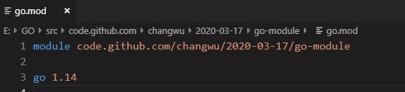
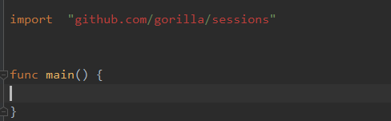
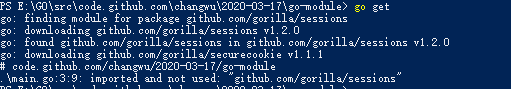
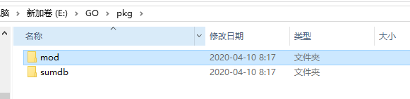
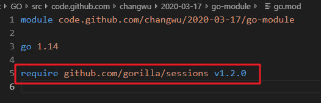
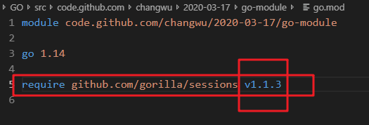

### 一. go-module

在Go的1.11版本之后， 官方推出了版本管理工具，并且从G1.13版本之后， go module 将成为Go默认的版本依赖工具


### 二. GO111MODULE

要启用`go module` 支持首先需要配置环境变量 ， `GO111MODULE` 通过他可以开启或者关闭模块支持 ， 它有如下三个可选值

* `GO111MODULE=off` 禁用模块支持， 编译时会从 GOPATH和Vendor文件夹中查找依赖
*  `GO111MODULE=on` 启用模块支持，编译时会忽略GOPATH和Vendor ， 直接从 `go.mod`中查找配置
*  `GO111MODULE=auto` 当前项目在 $Path/src 外， 且根路径有`go.mod`时开启模块支持


**一般我们使用 on 就可以了 , 这也就意味着, 以后写代码,不用必须在goPath中编写了, 任何地方都可以写**

当我们启用模块支持后,  go module将在我们项目的根路径下生成两个文件,` go.mod 和 go.sum` 

通过`go get`命令可以查找生成当前项目中的依赖关系, 同时生成一个`go.sum`记录每一个依赖库的版本和hash


### 三. 设置代理

很多库都是谷歌公司自己出的,  但是在国内, 谷歌被强了, 故我们设置代理, 间接访问

Go1.11之后的版本设置

```bash
# 在windowsshang 
set  GOPROXY=https://goproxy.cn
# mac
export GOPROXY=https://goproxy.cn
```

Go1.13之后设置

```
go env -w GOPROXY=https://goproxy.cn,direct
```


### 四. 常见命令

```bash
go mod init 	# 初始化,创建go.mod 
go mod download # 下载依赖的module到本地的cache中, 默认是 $GOPATH/pkg/mod

go mod edit		 # 编辑go.mod文件
go mod edit -fmt  # 快捷格式化go.mod文件

go mod graph 	# 打印模块依赖图
go mod tidy		# 添加缺失的mod, 删除没有的module
go mod vendor	# 将依赖复制到vendor中
go mod verify	# 校验依赖
go mod why 		# 解释为什么需要依赖
```


### 五. 示例:

* 开启

```bash
# go1.13版本后, go mod默认是开启的
# 通过如下命令 go env 可以看到 GO111MODULE
# 如果没有开启的话, 我们使用 如下命令开启
# windows
set GO111MODULE=on
# mac
export GO111MODULE=on
```




* 初始化

```go
go mod init
```




查看文件内容




* 设置代理

```go
go env -w GOPROXY=https://goproxy.cn,direct
```


比如 , 我们依赖了 github上的库, 那go原生没有的代码, 我们只能去github上下载



结果如下:




下载的位置:  默认会下载到 $GOPATH / pkg 目录下面




再次查看go.mod文件可以发现已经将我们下载的文件加入进去了




默认`go get`下载的都是最新的版本, 我们可以通过去github上找一个自己需要的版本, 然后明确下载它在

github上的某一个分支, 因为每一个分支都有tag , 下载时, 指定tag就ok


第一步: 改`go.mod` 将其换成我们希望的版本




第二步: 校验是否存在: `go mod verify`

如果存在, 返回 all modules verified

如果不存在,返回 Not Found


第三步: 使用 `go mod download` 下载指定的依赖


