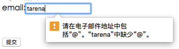
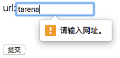
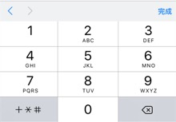
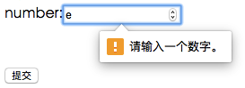
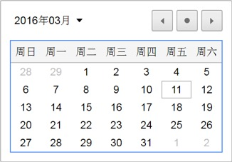
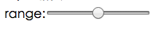
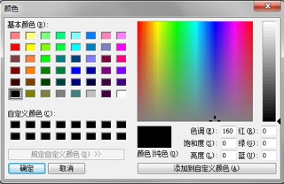

## Input 新类型

| 类型 | 描述 | 说明 | 
| ---- | ---- | --- |
| email | 邮箱类型 | 判断当前字符串中是否包含`@`符号 |
| search | 搜索类型 | 
| url | 网址类型 | 判断当前字符串中是否包含`http://` |
| number | 数字类型 | 
| tel | 电话号码类型 | 只在移动端浏览器有效 |
| range | 范围类型 | 适用于应该包含某个范围内数值的输入字段 |
| color | 颜色类型 | 
| date | 日期类型 | 按照 `ISO 8601` 编码的日期（包括年，月，日） |
| month | 月份类型 | 由 `ISO 8601` 编码的年和月组成的日期 |
| week | 星期类型 | 由 `ISO 8601` 编码的年和星期数组成的日期 | 

下述示例代码使用了 HTML5 提供的表单 2.0 中的 `input` 类型：

```html
<form>
	Email:<input type="email"><br>
	搜索:<input type="search"><br>
	URL地址:<input type="url"><br>
	电话号码:<input type="tel"><br>
	数字类型:<input type="number" min="18" max="50" step="2"><br>
	范围类型:<input type="range" min="0" max="10" step="2" value="10"><br>
	颜色类型:<input type="color"><br>
	日期类型:<input type="date"><br>
	<input type="submit">
</form>
```

### email类型

`email` 类型是专门用于输入 `email` 地址的文本框。

如果输入内容不是 `email` 地址，则不允许提交，并提示错误信息。效果如下图所示：



根据上图效果，总结 `email` 类型的规则是：提交表单时，检查 `email` 类型的文本框中是否包含 `@` 符号。

> **值得注意的是：** `email` 类型的文本框并不能检查 `email` 地址是否真实存在。

```html
<input type="email" />
```

### url类型

`url` 类型是专门用于输入 `url` 地址的文本框。

如果输入内容不是 `url` 地址，则不允许提交，并提示错误信息。效果如下图所示：



根据上图效果，总结 `url` 类型的规则是：提交表单时，检查 `url` 类型的文本框中是否包含 `http://` 符号。

```html
<input type="url" />
```

### search类型

`search` 类型是专门用于输入搜索关键词的文本框。

在移动设备中，当 `search` 类型的元素获取焦点时，键盘的“前往”会改为“搜索”字样。效果如下图所示：

* iPhone设备：


* Android设备：


> **值得注意的是：**在`PC`端浏览器 `search` 类型与 `text` 类型外观相同。

```html
<input type="search" />
```

### tel类型

`tel` 类型是专门用于输入电话号码的文本框。

在移动设备中，当 `tel` 类型的元素获取焦点时，键盘使用数字面板。效果如下图所示：

* iPhone设备：



* Android设备：


> **值得注意的是：**该元素没有特殊的校验规则，不强制输入数字。

```html
<input type="tel" />
```

### number类型

`number` 类型是专门用于输入数字的文本框。

如果输入内容不是数字，则不允许提交，并提示错误信息。效果如下图所示：



根据上图效果，总结 `number` 类型的规则是：提交表单时，检查 `number` 类型的文本框中是否为数字。

| 属性名称 | 类型 | 描述 |
| --- | --- | --- |
| min | Number | 允许输入的最小数值。 |
| max | Number | 允许输入的最大数值。 |
| step | Number | 设置增加或减少的间隔。（步长）|

```html
<input type="number" min="0" max="100" step="5" />
```

### date类型

`date` 类型是专门用于输入日期，提供日期选择控件。

当用户单击向下箭头按钮时浏览器页面中显示日历。效果如下图所示：



```html
<input type="date" />
```

### range类型

`range` 类型是专门用于输入一定范围内数字值。

`range` 类型在HTML页面显示为滑动条。效果如下图所示：



| 属性名称 | 类型 | 描述 |
| --- | --- | --- |
| min | Number | 允许输入的最小数值。 |
| max | Number | 允许输入的最大数值。 |
| step | Number | 设置增加或减少的间隔。（步长）| 
| value | Number | 设置滑动条的当前值。 |

```html
<input type="range" min="0" max="100" step="5" value="50" />
```

### color类型

`color` 类型是专门用于选取颜色。

`color` 类型提供了一个颜色选取器。效果如下图所示：

* 显示效果：


* 颜色选取器：



color 类型的显示效果，当用户单击 color 类型弹出显示颜色选取器。

```html
<input type="color" />
```

### 练习：自定义调色器

```html
<!DOCTYPE html>
<html lang="en">
<head>
    <meta charset="UTF-8">
    <title>自定义调色器</title>
    <style>
        body {
            padding-left: 100px;
            padding-top: 100px;
        }
        .show {
            width: 300px;
            height: 300px;
            border: 1px solid black;
        }
    </style>
</head>
<body>
    <div class="show"></div>
    <br><br>
    红:<input onchange="mychange()" id="red" min="0" max="255" step="1" value="255" type="range"><br>
    绿:<input onchange="mychange()" id="green" min="0" max="255" step="1" value="255" type="range"><br>
    蓝:<input onchange="mychange()" id="blue" min="0" max="255" step="1" value="255" type="range">
    <script>
        function mychange(){
            var red = document.getElementById("red").value;
            var green = document.getElementById("green").value;
            var blue = document.getElementById("blue").value;
            var show = document.getElementsByTagName("div")[0];
            show.style.backgroundColor = "rgb("+red+","+green+","+blue+")";
        }
    </script>
</body>
</html>
```

## 表单新元素

| 元素名称 | 描述 |
| ------ | ---- |
| `<datalist>` | `<input>`标签定义选项列表。请与 input 元素配合使用该元素，来定义 input 可能的值 |
| `<progress>` | `<progress>` 标签定义运行中的任务进度（进程） |
| `<meter>` | `<meter>` 标签定义度量衡。仅用于已知最大和最小值的度量 |
| `<output>` | `<output>` 标签定义不同类型的输出，比如脚本的输出 |

### datalist元素

`<datalist>` 元素规定输入域的选项列表。

`<datalist>` 属性规定 `form` 或 `input` 域应该拥有自动完成功能。当用户在自动完成域中开始输入时，浏览器应该在该域中显示填写的选项：

使用 `<input>` 元素的列表属性与 `<datalist>` 元素绑定：

```html
<input list="browsers">

<datalist id="browsers">
  <option value="Internet Explorer">
  <option value="Firefox">
  <option value="Chrome">
  <option value="Opera">
  <option value="Safari">
</datalist>
```

### progress元素

`<progress>` 标签表示进度条，用于显示一个任务的完成进度。

**属性：**

| 属性 | 值 | 描述 |
| --- | --- | --- |
| max | number | 规定需要完成的值 |
| value | number | 规定进程的当前值 |

> **提示：**请将 `<progress>` 标签与 JavaScript 一起使用来显示任务的进度。
> 
> **值得注意的是：**`<progress>` 标签不适合用来表示度量衡（例如，磁盘空间使用情况或相关的查询结果）。表示度量衡，请使用 `<meter>` 标签代替。

```html
<progress id="progress" max="100" value="0"></progress>
<script>
    var progress = document.getElementById("progress");
    var max = progress.max;
    var t = setInterval(function(){
        var v = progress.value;
        if(v == max){
            clearInterval(t);
        }else{
            v++;
            progress.value = v;
        }
    },100);
</script>
```

### meter元素

`<meter>` 标签定义度量衡。仅用于已知最大和最小值的度量。

比如：磁盘使用情况，查询结果的相关性等。

**属性：**

| 属性 | 值 | 描述 |
| --- | --- | --- |
| high | number | 规定被界定为高的值的范围 |
| low | number | 规定被界定为低的值的范围 |
| max | number | 规定范围的最大值 |
| min | number | 规定范围的最小值 |
| value | number | 必需。规定度量的当前值 |

**值得注意的是：**`<meter>` 不能作为一个进度条来使用， 进度条 `<progress>` 标签。

```html
<meter min="0" max="100" value="95" low="10" high="90"></meter>
```

### output元素

`<output>` 元素用于不同类型的输出，比如计算或脚本输出：

```html
<form oninput="x.value=parseInt(a.value)+parseInt(b.value)">0
	<input type="range" id="a" value="50">100 +
	<input type="number" id="b" value="50">=
	<output name="x" for="a b"></output>
</form>
```

## 表单新属性

### placeholder属性

`placeholder` 属性提供一种提示（hint），描述输入域所期待的值。

简短的提示在用户输入值前会显示在输入域上。

> **值得注意的是：**placeholder 属性适用于以下类型的 `<input>` 标签：`text`, `search`, `url`, `telephone`, `email` 以及 `password`。

```html
<input type="text" name="fname" placeholder="First name">
```

### autofocus属性

`autofocus` 属性是一个 `boolean` 属性。

`autofocus` 属性规定在页面加载时，域自动地获得焦点。

```html
First name:<input type="text" name="fname" autofocus>
```

### multiple属性

`multiple` 属性是一个 `boolean` 属性。

`multiple` 属性规定`<input>` 元素中可选择多个值。

> **值得注意的是：**`multiple` 属性适用于以下类型的 `<input>` 标签：`email` 和 `file`。

```html
Email: <input type="email" multiple>
```

### form属性

`form` 属性规定输入域所属的一个或多个表单。

> **值得注意的是：**如需引用一个以上的表单，请使用空格分隔的列表。

位于form表单外的input 字段引用了 HTML form (该 input 表单仍然属于form表单的一部分)：

```html
<form action="demo-form.php" id="form1">
  First name: <input type="text" name="fname"><br>
  <input type="submit" value="Submit">
</form>

Last name: <input type="text" name="lname" form="form1">
```

## 表单验证

### 1. 验证属性

| 属性名称 | 描述 |
| --- | --- |
| required | 验证不为空 |
| pattern | 匹配正则表达式 |
| min和max | 验证最小值和最大值 |
| minlength和maxlength | 验证最小长度和最大长度 |
| validity | 获取validityState对象 |

#### required属性

`required` 属性规定必须在提交之前填写输入域（不能为空）。

> **值得注意的是：**required 属性适用于以下类型的 `<input>` 标签：`text`, `search`, `url`, `telephone`, `email`, `password`, `date pickers`, `number`, `checkbox`, `radio` 以及 `file`。

```html
Username: <input type="text" name="usrname" required>
```

#### pattern属性

`pattern` 属性的值与指定的正则表达式进行匹配（一般用于验证特定格式）。

> **值得注意的是：**`pattern` 属性适用于以下类型的 `<input>` 标签: `text`, `search`, `url`, `tel`, `email`, 和 `password`。

```html
Country code: <input type="text" name="country_code" pattern="[A-Za-z]{3}" title="Three letter country code">
```

#### min和max属性

`min`、`max` 和 `step` 属性用于为包含数字或日期的 input 类型规定限定（约束）。

> **值得注意的是：**`min`、`max` 和 `step` 属性适用于以下类型的 `<input>` 标签：`date pickers`、`number` 以及 `range`。

```html
Enter a date before 1980-01-01:
<input type="date" name="bday" max="1979-12-31">

Enter a date after 2000-01-01:
<input type="date" name="bday" min="2000-01-02">

Quantity (between 1 and 5):
<input type="number" name="quantity" min="1" max="5">
```

#### maxlength属性

`maxlength` 属性用于设定允许输入的最大字符个数。

> **值得注意的是：**`maxlength` 属性应该叫做限制属性。

### 有效状态

ValidityState 代表了一个元素可以处于的与约束验证相关的有效性状态。

| 名称 | 类型 | 描述 |
| ---- | --- | ---- |
| valid | Boolean | 其他的约束验证条件都不为 `true` | 
| valueMissing | Boolean | 该元素有 `required` 属性,但却没有值 |
| typeMismatch | Boolean | 该元素的值不符合元素类型所要求的格式(当 `type` 是 `email` 或者 `url` 时) |
| patternMismatch | Boolean | 该元素的值与指定的 `pattern` 属性不匹配 |
| stepMismatch | Boolean | 该元素的值不符合由 `step` 属性指定的规则 |
| rangeUnderflow | Boolean | 该元素的值小于指定的 `min` 属性 |
| tooLong | Boolean | 该元素的值的长度超过了 `HTMLInputElement` 或者 `HTMLTextAreaElement` 对象指定的 `maxlength` 属性中的值 |
| rangeOverflow | Boolean | 该元素的值大于指定的 `max` 属性 |
| customError | Boolean | 该元素的自定义有效性消息已经通过调用元素的`setCustomValidity()` 方法设置成为一个非空字符串 |

```html
<form>
	用户名:<input id="user" type="text" required><br>
	密码:<input id="pwd" type="text" pattern="^[0-9]{6,8}$"><br>
	Email:<input id="mail" type="email"><br>
	年龄:<input id="age" step="5" type="number" min="20"><br>
	<input type="submit">
</form>
<script>
	 var user = document.getElementById("user");
	 user.onblur = function(){
		if(user.validity.valid){
			alert("验证通过.");
		}else if(user.validity.valueMissing){
			alert("用户名为空.");
		}
	 }
	 var pwd = document.getElementById("pwd");
	 pwd.onblur = function(){
		if(pwd.validity.valid){
			alert("验证通过.");
		}else if(pwd.validity.patternMismatch){
			alert("密码输入有误.");
		}
	 }
	 var mail = document.getElementById("mail");
	 mail.onblur = function(){
		if(mail.validity.valid){
			alert("验证通过.");
		}else if(mail.validity.typeMismatch){
			alert("Email输入有误.");
		}
	 }
	 var age = document.getElementById("age");
	 age.onblur = function(){
		if(age.validity.valid){
			alert("验证通过.");
		}else if(age.validity.rangeUnderflow){
			alert("年龄过小.");
		}else if(age.validity.stepMismatch){
			alert("年龄有误.");
		}
	 }
</script>
```

### setCustomValidity() 方法

`setCustomValidity()` 方法设置自定义验证信息，用于即将实施与验证的约束来覆盖预定义的信息。

```html
<form>
	<input id="data" type="text" required>
	<input type="submit">
</form>
<script>
	var data = document.getElementById("data");
	data.onblur = function(){
		if(data.validity.valueMissing){
			data.setCustomValidity("不能为空.");
		}else if(data.validity.customError){
			data.setCustomValidity("");
		}
	}
</script>
```