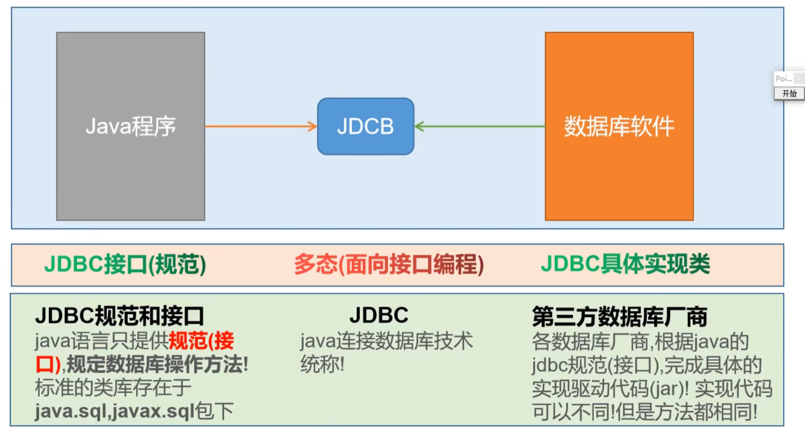
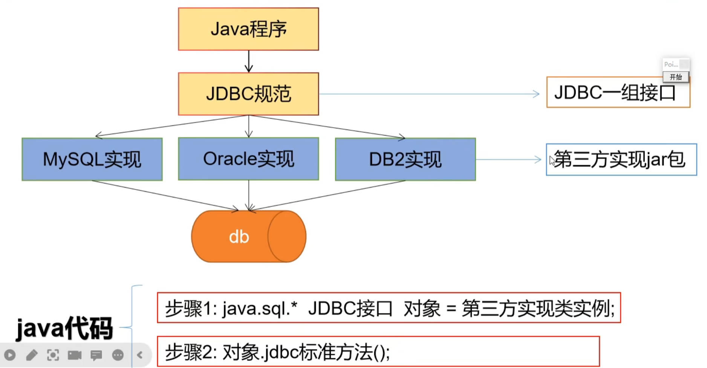
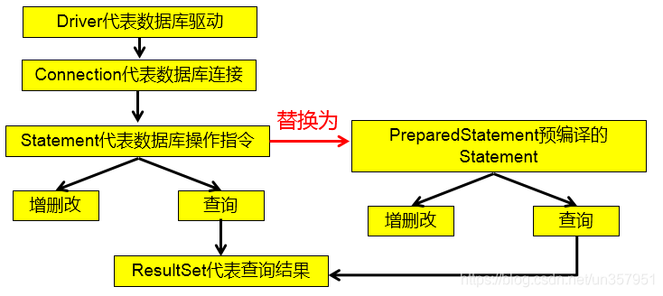

## 1. 简介

### 概述

各个数据库厂商去实现这套接口，提供数据库驱动jar包
我们可以使用这套接口（JDBC）编程，真正执行的代码是驱动jar包中的实现类

各数据库厂商使用相同的接口，Java代码不需要针对不同数据库分别开发。可随时替换底层数据库，访问数据库的Java代码基本不变。以后编写操作数据库的代码只需要面向JDBC（接口），操作哪儿个关系型数据库就需要导入该数据库的驱动包，如需要操作MySQL数据库，就需要再项目中导入MySQL数据库的驱动包。

### jdbc的架构

 

### 数据库操作的层次
1. 准备一个数据库：mysql
2. JDBC数据库连接：JDBC定义了数据库操作的规范，数据库驱动实现了数据库操作的规范。
3. DataSource数据源/连接池。舔奶盖理论，当创建和销毁连接消耗了大量的性能，引进池化技术，创建连接池只释放连接、不销毁连接，实现对连接的复用。
4. 数据库操作框架：SpringData、Mybatis。提供了对JDBC基本数据库操作的封装。

## 2. 核心类

### DriverManager
1. 将第三方尝试实现的驱动jar注册到程序中
2. 可以根据数据库链接信息获取connection

### Connection
1. 和数据库建立链接，在此基础上可以进行多次CRUD操作
2. 可以获取statement/preparestatement/callablestatement对象

### Statement
1. Statement ：用于执行静态 SQL 语句并返回它所生成结果的对象。
2. PrepatedStatement：SQL 语句被预编译并存储在此对象中，可以使用此对象多次高效地执行该语句。
2. CallableStatement：用于执行 SQL 存储过程

发送sql语句到数据库软件，
不同statement封装了不同的发送方式

### Result

封装了返回的结果。