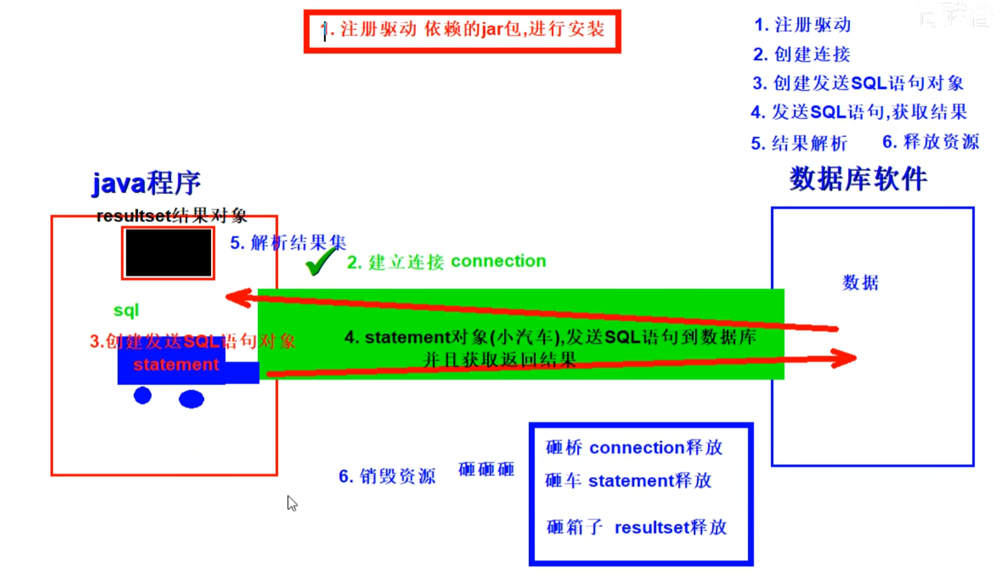
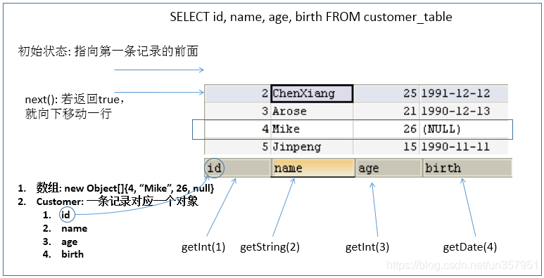

## 基本步骤



### 1.注册驱动
1. 准备数据库的建表语句

```sql
CREATE TABLE user (
    id INT AUTO_INCREMENT,
    name VARCHAR(100),
    PRIMARY KEY(id)
);
```
2. 通过反射机制+静态代码块初始化数据库驱动。
   1. 通过反射的方式读取文件中的数据库驱动类路径，，方便外部化配置
   2. 使用静态代码块，在类加载的时候数据库初始化驱动只需要初始化一次，实现数据库驱动的初始化。

```java
//反射的方式
try {
    Class.forName("com.mysql.jdbc.Driver");        
} catch (ClassNotFoundException e) {                 
    e.printStackTrace();
}

//在无惨构造方法中通过静态代码块初始化了唯一的数据库驱动。
public class Driver extends NonRegisteringDriver implements java.sql.Driver {
    public Driver() throws SQLException {
    }

    static {
        try {
            DriverManager.registerDriver(new Driver());
        } catch (SQLException var1) {
            throw new RuntimeException("Can't register driver!");
        }
    }
}
```


### 2.获取连接

Connection是与特定数据库连接回话的接口，使用的时候需要导包，而且必须在程序结束的时候将其关闭。getConnection方法也需要捕获SQLException异常。

```java
Connection c = DriverManager.getConnection("jdbc:mysql://127.0.0.1:3306/exam?characterEncoding=UTF-8", "root", "admin");
```

通过加载外部配置建立数据库连接的方法

```java
	@Test
    public  void testConnection5() throws Exception {
    	//1.加载配置文件
        InputStream is = ConnectionTest.class.getClassLoader().getResourceAsStream("jdbc.properties");
        Properties pros = new Properties();
        pros.load(is);
        
        //2.读取配置信息
        String user = pros.getProperty("user");
        String password = pros.getProperty("password");
        String url = pros.getProperty("url");
        String driverClass = pros.getProperty("driverClass");
        
        //3.加载驱动
        Class.forName(driverClass);
        //4.获取连接
        Connection conn = DriverManager.getConnection(url,user,password);
        
        System.out.println(conn);
    }
```

其中配置文件如下
```java
user=root
password=abc123
url=jdbc:mysql://localhost:3306/test
driverClass=com.mysql.jdbc.Driver
```

### 3.创建发送sql语句对象
创建Statement或者PreparedStatement接口，执行SQL语句

#### 使用Statement接口

Statement接口创建之后，可以执行SQL语句，完成对数据库的增删改查。其中 ，增删改只需要改变SQL语句的内容就能完成，然而查询略显复杂。在Statement中使用字符串拼接的方式，该方式存在句法复杂，容易犯错等缺点，具体在下文中的对比中介绍。所以Statement在实际过程中使用的非常的少，所以具体的放到PreparedStatement那里给出详细代码。
1. 字符串拼接方式的SQL语句是非常繁琐的，中间有很多的单引号和双引号的混用，极易出错。
2. 使用statement直接拼装出最终的sql查询语句容易产生sql注入。以下是sql注入的一个典型例子.SQL 注入 是利用某些系统没有对用户输入的数据进行充分的检查，而在用户输入数据中注入非法的 SQL 语句段或命令(如：SELECT user, password FROM user_table WHERE user='a' OR 1 = ' AND password = ' OR '1' = '1' ) ，从而利用系统的 SQL 引擎完成恶意行为的做法
3. Statement 实现批量插入时，效率较低
```java
public class StatementTest {
	// 使用Statement的弊端：需要拼写sql语句，并且存在SQL注入的问题
	@Test
	public void testLogin() {
		Scanner scan = new Scanner(System.in);

		System.out.print("用户名：");
		String userName = scan.nextLine();
		System.out.print("密   码：");
		String password = scan.nextLine();

		// SELECT user,password FROM user_table WHERE USER = '1' or ' AND PASSWORD = '='1' or '1' = '1';
		String sql = "SELECT user,password FROM user_table WHERE USER = '" + userName + "' AND PASSWORD = '" + password
				+ "'";
		User user = get(sql, User.class);
		if (user != null) {
			System.out.println("登陆成功!");
		} else {
			System.out.println("用户名或密码错误！");
		}
	}

	// 使用Statement实现对数据表的查询操作
	public <T> T get(String sql, Class<T> clazz) {
		T t = null;
		Connection conn = null;
		Statement st = null;
		ResultSet rs = null;
		try {
			// 1.加载配置文件
			InputStream is = StatementTest.class.getClassLoader().getResourceAsStream("jdbc.properties");
			Properties pros = new Properties();
			pros.load(is);

			// 2.读取配置信息
			String user = pros.getProperty("user");
			String password = pros.getProperty("password");
			String url = pros.getProperty("url");
			String driverClass = pros.getProperty("driverClass");

			// 3.加载驱动
			Class.forName(driverClass);
			// 4.获取连接
			conn = DriverManager.getConnection(url, user, password);
			st = conn.createStatement();
			rs = st.executeQuery(sql);

			// 获取结果集的元数据
			ResultSetMetaData rsmd = rs.getMetaData();

			// 获取结果集的列数
			int columnCount = rsmd.getColumnCount();

			if (rs.next()) {
				t = clazz.newInstance();
				for (int i = 0; i < columnCount; i++) {
					// //1. 获取列的名称
					// String columnName = rsmd.getColumnName(i+1);
					// 1. 获取列的别名
					String columnName = rsmd.getColumnLabel(i + 1);

					// 2. 根据列名获取对应数据表中的数据
					Object columnVal = rs.getObject(columnName);

					// 3. 将数据表中得到的数据，封装进对象
					Field field = clazz.getDeclaredField(columnName);
					field.setAccessible(true);
					field.set(t, columnVal);
				}
				return t;
			}
		} catch (Exception e) {
			e.printStackTrace();
		} finally {
			// 关闭资源 rs
			if (rs != null) {
				try {
					rs.close();
				} catch (SQLException e) {
					e.printStackTrace();
				}
			}
			// 关闭资源 st
			if (st != null) {
				try {
					st.close();
				} catch (SQLException e) {
					e.printStackTrace();
				}
			}
			// 关闭资源   conn
			if (conn != null) {
				try {
					conn.close();
				} catch (SQLException e) {
					e.printStackTrace();
				}
			}
		}
		return null;
	}
}
```


#### 使用PreparedStatement接口（常用）
与 Statement一样，PreparedStatement也是用来执行sql语句的与创建Statement不同的是，需要根据sql语句创建PreparedStatement。除此之外，还能够通过设置参数，指定相应的值，而不是Statement那样使用字符串拼接。

可以通过调用 Connection 对象的 preparedStatement(String sql) 方法获取 PreparedStatement 对象

PreparedStatement 接口是 Statement 的子接口，它表示一条预编译过的 SQL 语句

PreparedStatement 对象所代表的 SQL 语句中的参数用问号( ? )来表示，调用 PreparedStatement 对象的 setXxx() 方法来设置这些参数

setXxx() 方法有两个参数，第一个参数是要设置的 SQL 语句中的参数的索引(从 1 开始)，第二个是设置的 SQL 语句中的参数的值

优势：
1. 能够通过检验条件数量防止sql注入。PreparedStatement 可以防止 SQL 注入，解决拼串问题
2. 避免了直接拼装字符串的繁琐。代码的可读性和可维护性。
3. PreparedStatement 能最大可能提高性能：
   1. DBServer 会对预编译语句提供性能优化。因为预编译语句有可能被重复调用，所以 语句在被DBServer的编译器编译后的执行代码被缓存下来，那么下次调用时只要是相同的预编译语句就不需要编译，只要将参数直接传入编译过的语句执行代码中就会得到执行
   2. 在 Statement 语句中，即使是相同操作但因为数据内容不一样，所以整个语句本身不能匹配,没有缓存语句的意义.事实是没有数据库会对普通语句编译后的执行代码缓存。这样 每执行一次都要对传入的语句编译一次(语法检查，语义检查，翻译成二进制命令，缓存)


```java
增删改操作DML
	//通用的增、删、改操作（体现一：增、删、改 ； 体现二：针对于不同的表）
	public void update(String sql,Object ... args){
		Connection conn = null;
		PreparedStatement ps = null;
		try {
			//1.获取数据库的连接
			conn = JDBCUtils.getConnection();	
			//2.获取PreparedStatement的实例 (或：预编译sql语句)
			ps = conn.prepareStatement(sql);
			//3.填充占位符
			for(int i = 0;i < args.length;i++){
				ps.setObject(i + 1, args[i]);
			}	
			//4.执行sql语句
			ps.execute();
		} catch (Exception e) {	
			e.printStackTrace();
		}finally{
			//5.关闭资源
			JDBCUtils.closeResource(conn, ps);	
		}
	}

查询操作DQL
// 通用的针对于不同表的查询:返回一个对象 (version 1.0)
	public <T> T getInstance(Class<T> clazz, String sql, Object... args) {
		Connection conn = null;
		PreparedStatement ps = null;
		ResultSet rs = null;
		try {
			// 1.获取数据库连接
			conn = JDBCUtils.getConnection();
			// 2.预编译sql语句，得到PreparedStatement对象
			ps = conn.prepareStatement(sql);
			// 3.填充占位符
			for (int i = 0; i < args.length; i++) {
				ps.setObject(i + 1, args[i]);
			}
			// 4.执行executeQuery(),得到结果集：ResultSet
			rs = ps.executeQuery();
			// 5.得到结果集的元数据：ResultSetMetaData
			ResultSetMetaData rsmd = rs.getMetaData();
			// 6.1通过ResultSetMetaData得到columnCount,columnLabel；通过ResultSet得到列值
			int columnCount = rsmd.getColumnCount();
			if (rs.next()) {
				T t = clazz.newInstance();
				for (int i = 0; i < columnCount; i++) {// 遍历每一个列
					// 获取列值
					Object columnVal = rs.getObject(i + 1);
					// 获取列的别名:列的别名，使用类的属性名充当
					String columnLabel = rsmd.getColumnLabel(i + 1);
					// 6.2使用反射，给对象的相应属性赋值
					Field field = clazz.getDeclaredField(columnLabel);
					field.setAccessible(true);
					field.set(t, columnVal);
				}
				return t;
			}
		} catch (Exception e) {
			e.printStackTrace();
		} finally {
			// 7.关闭资源
			JDBCUtils.closeResource(conn, ps, rs);
		}
		return null;
	}
```

### 4.发送sql语句并获取返回结果

#### ResultSet
1. 查询需要调用 PreparedStatement 的 executeQuery() 方法，查询结果是一个ResultSet 对象
2. ResultSet 对象以 逻辑表格的形式 封装了执行数据库操作的结果集，ResultSet 接口由数据库厂商提供实现
3. ResultSet 返回的实际上就是一张数据表。有一个指针指向数据表的第一条记录的前面
4. ResultSet 对象维护了一个指向当前数据行的 游标，初始的时候，游标在第一行之前，可以通过 ResultSet 对象的 next() 方法移动到下一行。调用 next() 方法检测下一行是否有效。
5. 若有效，该方法返回 true，且指针下移。相当于 Iterator 对象的 hasNext() 和 next() 方法的结合体
6. 当指针指向一行时, 可以通过调用 getXxx(int index) 或 getXxx(int columnName) 获取每一列的值。例如: getInt(1) , getString("name")


```java
stmt.executeUpdate(sql);
```


#### ResultSetMetaData
可用于获取关于 ResultSet 对象中列的类型和属性信息的对象 ( 结果集数据的元数据 )

ResultSetMetaData meta = rs.getMetaData();

getColumnName(int column)：获取指定列的 名称

getColumnLabel(int column)：获取指定列的 别名

getColumnCount()：返回当前 ResultSet 对象中的列数

getColumnTypeName(int column)：检索指定列的数据库特定的类型名称

getColumnDisplaySize(int column)：指示指定列的最大标准宽度，以字符为单位

isNullable(int column)：指示指定列中的值是否可以为 null

isAutoIncrement(int column)：指示是否自动为指定列进行编号，这样这些列仍然是只读的

针对于 表的字段名与类的属性名不相同 的情况：
1. 必须在声明 sql 时，使用类的属性名来命名字段的别名
2. 使用 ResultSetMetaData 时，需要使用 getColumnLabel() 来替换getColumnName()， 获取列的别名。如果 sql 中没有给字段其别名，getColumnLabel() 获取的就是列名

### 5.资源关闭

释放 ResultSet, Statement, Connection。
数据库连接（Connection）是非常稀有的资源，用完后必须马上释放，如果 Connection 不能及时正确的关闭将导致系统宕机
Connection 的使用原则是 尽量晚创建，尽量早的释放
可以在 finally 中关闭，保证即使其他代码出现异常，资源也一定能被关闭
